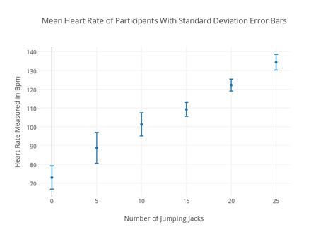
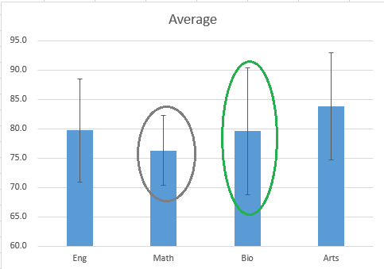

# IB The Nature of Science  
This content of this unit is for Biology 35 IB.  

---

# The Limitations of Science
Science is a tool to help us ~~understand nature~~, but it has it's ~~limitations~~.  
Science can...
* [only follow certain ~~rules~~.](#follow-certain-rules)
* [only solve ~~certain~~ types of ~~problems~~.](#solve-certain-problems)
* [only use ~~certain~~ types of ~~explanations~~.](#certain-types-of-explanations)
* [only ~~attempt~~ to explain nature; they are ~~not facts~~.](#attempts-not-facts)
* [be ~~misused~~.](#misuse)
* [be done ~~poorly~~.](#poorly-done)

## Follow Certain Rules
There are two rules regarding what cannot be used in science.
  1. Questions that require...
     * Opinion
     * Belief
     * Judgement
     * ...and anything else that [~~different people can give different answers to.~~](#solve-certain-problems)
  2. [~~Supernatural Forces~~](#certain-types-of-explanations) cannot be an explanation.

There are two things that must be done in science.
  1. It must be possible to ~~disprove the hypothesis~~.
  2. Explanations must be based on ~~careful observations~~ and ~~testing of hypotheses~~.

## Solve Certain Problems
Science assumes that the ~~laws of nature are same everywhere~~.  
This is not possible with questions that ~~different people~~, in different environments, with different beliefs ~~answer differently~~.  

Science was intended to only ~~explain how nature works based on observation~~.  
Beyond that—as in ~~opinion, belief, and judgement~~—cannot be answered with science.

**TL;DR:** Science can't answer questions that require opinion.

## Certain Types of Explanations
A scientist must ~~predict all possible results~~ of an experiement—regardless if it proves or disproves the hypothesis.  
If this is not possible, the explanation is ~~impossible to disprove~~, and cannot be used in science.  
In addition, explanations that give ~~inconsistent and unpredictable actions~~ cannot be used in science.  
A notable example of all of these are [~~supernatural forces~~](#vocabulary).

## Attempts, not facts
The purpose of science is to ~~understand nature~~, not to create facts.  
Any scientific explanation should ~~never be certain~~—they should be able to be ~~disproven/modified~~, and are encouraged to be.  

## Misuse
Belief systems that misuse science to 'prove' their beliefs are called [~~pseudoscience~~](#vocabulary).  
These groups of people...
  * ~~ignore certain rules~~ of science.
  * ~~try to prove~~ their explanations.
  * include ~~supernatural forces~~ in their explanations..
  * ~~ignore~~ research that ~~does not support~~ their explanations.

## Poorly Done
Science, like any job, can be done poorly. The following are guidelines for good science.

| Guideline | Description |
| --------- | ----------- |
| **Controlled** | ~~One variable~~ at a time is tested. |
| **Repeatable** | Different scientists should be able to ~~repeat the procedures~~, and get the ~~same results~~. |
| **Cause-effect** | Does ~~something cause something~~ else to happen?   Therefore, a ~~change in one~~ must result in a ~~matching change~~ in the other. |
| **Species-specific** | Experiements on one species may not produce the ~~same results with others.~~ |
| **References** | All ~~earlier studies~~ of the problem should be considered. |
| **Published** | When ~~published in journals~~, ~~other scientists~~ can study and repeat the procedure.   Reference to ~~unpublished studies~~ should be ~~questioned~~. |

## Vocabulary  

| Word | Definition |
| ---- | ---------- |
| **Observation** | ~~Information~~ collected directly from the ~~five senses~~.   *(seeing, hearing, smelling, tasting, or touching)* |
| **Fact** | An observation that appears the ~~same to all careful observers~~, therefore being ~~assumed~~ to exist. |
| **Hypothesis** | A ~~possible explanation~~ to a question about nature, based on ~~observation~~.   It must always be able to be ~~disproven~~.   In addition, it must always have an explanation as to ~~why~~. |
| **Theory** | A hypothesis which has been ~~tested many times~~, and has ~~survived~~. |
| **Supernatural Forces** | A power that can ~~do anything~~, and therefore cannot be ~~proven or disproven~~. |
| **Pseudoscience** | Any system of belief that ~~misuses science to 'prove' their beliefs.~~ |

## Summary
* Science must follow ~~certain rules~~.
* Science cannot solve ~~all problems~~.
* Science was never meant to answer questions about matters of ~~judgement, opinion, or belief~~.
* Explanations that are ~~impossible to prove~~ (i.e. supernatural) cannot be used.
* Science is meant to understand nature, not ~~produce facts~~. Scientific explanations are ~~attempts to describe nature, based on facts~~.
* Science can and has been misused (as pseudoscience) and be poorly done. (by anyone)

# The Ten Principles
The ten principles detail what scientists do and how they think.

1. ### The Principle of Objectivity
    Scientists ~~gather and examine facts~~; they base their ~~conclusions only on said facts~~.  
    > e.g. "The vet examined the cat thoroughly, and had a blood sample analyzed, before telling the cat's owner what was wrong."

2. ### The Principle of Tentativeness  
    Scientists regard their conclusions as ~~not final~~, and are ~~open to modify~~ them if new evidence arises.  
    > e.g. "I think I know what might be wrong, but we'll have to wait until we see the results of the new tests we've just had done."

3. ### The Principle of Consistency
    Scientists assume that the ~~behaviour of the world~~—described as ~~laws~~—has ~~always operated in the same way~~, and the observable world is a result of ~~continuous operation~~ of said laws.  
    > e.g. "The boy knew that eating tomatoes always made his skin break out in red spots. He once again ate the tomatoes in his salad, and the next day his face was covered with red spots."

4. ### The Principle of Causality
    Scientists believe that ~~every phenomenon results from discoverable causes~~.  
    >e.g. "The girl noticed that her little brother was crying. Something must have upset him."

5. ### The Principle of Parsimony
    Scientists attempt to reduce their view of the world into the ~~simplest possible terms~~. They prefer explanations, theories, and hypotheses that ~~account for as many phenomena as possible~~.  
    > e.g. "The car would not start, the lights would not turn on, the radio did not work, and the horn would not blow. The mechanic suspected that all these things might have been caused by a faulty battery."

6. ### The Principle of Materiality
    Scientists prefer ~~material/mechanical/tangible explanations~~ of phenomena over non-material/supernatural explanations.  
    > e.g. "The old woman recovered quickly from a heart attack. Her husband thought it was a miracle, but the doctor knew that she had been very fit, and had recieved very prompt attention at the hospital."

7. ### The Principle of Relativeness
    Scientists think of the world and phenomena in it as ~~sets of relationships~~ rather than independent absolutes.  
    > e.g. "The woman from the garden centre was explaining why the lawn had not grown well; the area was too shady for the kind of seed that had been used, and the soil was too acidic. Another kind of seed would have done better in that shady area and the acidity would not have been a problem if the grass had been healthier."

8. ### The Principle of Dynamism
    Scientists expect nature to be ~~dynamic~~—~~to show variation and change~~—rather than being static.  
    > e.g. "The man visited the neighbourhood he grew up in. The houses were the same ones, but there had been many changes, and the trees were much bigger than he had remembered."

9. ### The Principle of Continuous Discovery
    Scientists hope that ~~over time~~, the material world will be able to be ~~understood completely~~.  
    > e.g. "We know much more now about what causes cancer than we did 50 years ago. A great deal of research is still being done, and the researchers expect to find out more and more. Perhaps in another 50 years, cancer will not be the cause of so many deaths."

10. ### The Principle of Social Limitation
    Scientists may be ~~limitted~~ with the problems they wish to solve by social morals and ~~ethics~~, as well as having their ~~conclusions influenced~~ by said social morals and ethics.   
    > e.g. "The chemist employed at a major food processing company wanted to work on an idea to prevent fresh fruit from rotting. The company would not let him, as their business was mostly in bread and cereal, and they did not want to expand into fruits yet."

# Student Lab Report Format
The following details the major stages in developing a lab.  
They must be all followed, in order, but you can start anywhere.

## Steps  
[Lab Format Summary](#lab-format-summary)
1. [Problem/Purpose](#problem)
2. [Rational](#rational)
3. [Background Information](#background-information)
4. [Hypothesis](#hypothesis)
5. [Experimental Design](#experimental-design)
   * [Variables](#variables)
   * [Materials](#materials)
   * [Safety](#safety)
   * [Procedure](#procedure)
6. [Evidence](#evidence)
7. [Analysis](#analysis)
   * [Tables](#tables)
   * [Graphs](#graphs)
   * [Diagrams](#diagrams)
8. [Interpretation/Discussion](#interpretation/discussion)
9. [Evaluation](#evaluation)
10. [Synthesis](#synthesis)
11. [References](#references)

## Problem
For a ~~problem lab~~, state the ~~question to be answered~~ in the experiment.  
> e.g. What effect will the manipulated variable have on the responding variable?

For a ~~purpose lab~~, state ~~what will be observed~~.  
> e.g. An eyeball dissection lab could be called a purpose lab that seeks to investigate the structural composition of the eye related to its function.

To put it short, problem labs answer questions, purpose labs observe.

## Rational
State ~~why you are interested~~ in this problem; what ~~personal significance~~ does it have to you?

Discuss any ~~ethical concerns~~ of your study and how you have ~~addressed them~~.

Confirm that your experiment is ~~approved by your teacher~~, meeting or exceeding ethical standards.

## Background Information
Use any resources to ~~describe accepted information~~ about your problem.

Use background research to be the groundwork for formulating the ~~explanation of your hypothesis~~.  
~~Refer back~~ to your background research during the ~~interpretation of collected experimental data~~.  
~~Only~~ include background information that is ~~required~~ to do the above two things—~~create a strong hypothesis~~, and to be ~~referred back to when analyzing data~~.

All referenced material should be ~~directly cited~~ by ~~appending~~ the ~~name of the author~~ and the ~~date of publication~~ in ~~brackets~~.  
This is regardless if it is a ~~direct quote~~ (in quotations) or ~~paraphrased~~.  
> e.g. "Dinosaurs are actually still alive!" (Einstein, 2021)

All referenced material should be ~~listed in alphabetical order~~ at the end of the lab in the ~~reference section~~. (essentially, make a bibliography)

## Hypothesis
Using your background research and more, write a ~~direct qualitative and/or quantitative hypothesis~~.  

A hypothesis is a ~~possible answer~~ to the question based on ~~observation~~, with an ~~reason/explanation~~ for your answer.  
It must always be able to be ~~disproven~~. (no supernatural forces)

The hypothesis must be ~~specific to the lab~~ you are conducting and directly ~~related to the research question~~.

**Quantitative**  
Data that can be counted, measured, and ~~expressed using numbers~~.

**Qualitative**  
Data that is ~~descriptive of traits and characteristics~~, and is based on your ~~observations using your five senses~~.  

You may summarize the hypothesis in the following manner.
> "According to ~~(SOURCE FROM BACKGROUND INFO)~~, if ~~(MANIPULATION)~~ occurs, then ~~(RESPONSE)~~ will happen, because ~~(EXPLAIN WHY)~~."

## Experimental Design
~~Summarize in 1-2 sentences the plan~~ for your procedure.  
This plan should ~~answer the question~~, ~~control~~ variables, ~~collect relevant~~ data, and ~~avoid collecting irrelevant~~ data.

### Variables
List the following.

#### Control Group
Also known as just "control," this group is ~~the standard that you compare to~~.  
In other words, it is the group that has not been manipulated. The baseline, if you will.  
You must have at least ~~5 trials/cases/tests~~ of the control group. 

#### Experimental Group(s)
This group (or multiple, for multiple experiments) recieve(s) ~~one specific manipulation~~ to differentiate themselves from the ~~control group~~.  
You must have at least ~~5 trials/cases/tests~~ of each experimental group. 

#### Manipulated (Independent) Variable
The manipulated variable is the variable that you change.  
More specifically, this is the ~~one specific manipulation~~ made in the experimental group(s).  
You may only have ~~one manipulated variable per experimental group~~, or else you won't be able to discern which variable really caused an outcome.

#### Responding (Dependent or Measured) Variable
The responding variable is What you ~~measure/observe~~ that happens as a ~~result of the manipulation~~.  
More specifically, look for things that ~~changed in the experimental group~~, but ~~not in the control group~~. (obviously ignore the things that you changed yourself)

#### Controlled Variables
The controlled variables are anything that ~~must be kept the same~~ within ~~both the experimental and control groups~~.  
Otherwise they could ~~interfere the cause-and-effect relationship~~ you are investigating by causing more than one manipulation, which you should not do.  
Do not mix this up with the control group; that is more of a baseline you set up.  
You should state ~~3-5 controlled variables~~.

### Materials
Record in point form all ~~appropriate substances and equipment~~ that will be used during the experiment. Include ~~sizes and quantities~~ of materials.  
Include ~~diagrams of unusual apparatus/special arrangement~~ of equipment if that is necessary.

### Safety
State any ~~safety precautions~~ you must make. For instance, safety instructions, or special waste disposal.

### Procedure
Prepare a numbered list of ~~specific~~ instructions to be followed to perform your experiment.  
Only include steps that you ~~actually did~~ and materials that you ~~actually used~~.  
Any other scientist unaffiliated with you should be able to ~~interpret your instructions~~ and ~~perform an identical experiment~~; however, detailed instructions for common techniques are unneeded.

Choose appropriate ~~intervals~~ for the manipulated variables.
> i.e. How often will you measure the growth of the plants in an experiment?

Determine the sample size, ~~minimum 5 subjects~~.  
Determine an appropriate number of trials, ~~minimum 5 trials~~.

## Evidence
Record ~~all raw qualitative and quantitative~~ data necessary to answer the question posed in the problem.  
Record said data in a neat and concise form, such as a table, written observation, or drawing.  

## Analysis
~~Manipulate the raw data~~ with arithmetic (add, subtract, square, multiply, divide, average, etc.) to produce results that ~~help interpretation~~.  

The following are all valid methods of displaying data in a more interpretable form.  
Remember that these all require a ~~relevant and appropriate title~~.  

If a ~~quantitative prediction~~ was made, ~~calculate a percent error~~ (?) of that compared to the ~~actual evidence~~.

### Tables
There should be ~~no variation~~ in significant digits, uncertanty, and percision. (number of decimal places)  
In addition, include any ~~unexpected observations~~ that may have affected results.

Column headings should include ~~what it is~~, ~~units~~, and the ~~uncertainty of measurement~~.

#### Uncertainty
Uncertainty is half of the smallest increment of your measuring device. At the level we're at right now, you can basically assume uncertainty as "give or take."  
For example, lets say I measured the width of my nose with a ruler. There will always be a margin of error, and what that margin of error is is totally up to you. A ruler's smallest increment is 1 mm, or 0.1 cm, therefore out uncertainty is half of that.

| Width of Jad's Nose / cm &#177; 0.5 mm |
| :----------: |
| your data... |

!> This definition of uncertainty is subject to change. Please do your own research and educate me. :)

#### Mean and Standard Deviation
Include the ~~mean~~ and ~~standard deviation~~ of all your data points in the table.  
[Click here to see how to do that.](#mean-and-standard-deviation)

### Graphs
Graphs need an ~~appropriate scales~~, ~~labeled axis with units~~, and ~~accurately plotted data points~~ with ~~best-fit lines/curves~~.  
Use ~~error bars~~ on plot points to account for ~~uncertainties~~.  

#### Error Bars
Error bars are a ~~vertical line~~ you draw ~~through a mean plot~~ that represents the ~~standard deviation~~. The length of the line should be double your standard deviation, with the point centered in the middle. This means it shows that your value could ~~deviate positively and negatively your standard deviation~~.

### Diagrams
Raw drawings should be converted to ~~labeled, size accurate diagrams~~.  
When labelling the diagram, draw straight ~~lines to the right hand side~~ of a drawing.  
State the ~~microscope magnification~~ the drawing is based off of in the bottom right hand corner.  
When magnified drawings are presented in evidence or analysis, include a ~~sample calculation to show one's work~~. (?)

## Interpretation/Discussion
~~Interpret~~ the evidence and analyzed results with ~~the problem and your hypothesis in mind~~.  
~~Answer the question~~ posed in the problem with the evidence and analyzed results.

~~Discuss~~ the results of the experiment in light of the ~~background information~~.  
As in, how do the experimental results ~~compare~~ to your hypothesized results.  
If they are different, ~~explain why~~ they might be, and ~~provide reasoning behind each statement~~.

## Evaluation
Make some ~~conclusions~~ that can be drawn from this experiment. (You can start by summarizing the main things you discussed in the interpretation section.)

~~Evaluate the hypothesis.~~ (was it verified, falsified, or inconclusive?)

~~Evaluate the background research~~ you used to make the hypothesis.  If your hypothesis was falsified, it is most likely ~~experimental error~~ or an ~~error in your background research~~.

List the ~~weaknesses~~ of the experiment as well as ~~how significant~~ they were. _(e.g. precision and accuracy of the measurements was a weakness, because...)_

~~Evaluate the experimental design~~: The procedure, management of time, and any technological skills that were used.  
Attempt to explain the ~~limitations, weaknesses, and errors/possible sources of errors~~.  

For each of these, also discuss how the ~~experiment could have changed/improved~~ to produce better results.  
These proposed modifications should be ~~realistic and clearly specified~~. _(e.g. modifications to experimental techniques and/or the data range)_

Don't just say "human error."

## Synthesis
Using all the information you have collected—background information, information gained during the experiment, etc...  
~~Propose a new hypothesis~~ or ~~suggest possible studies~~ that one might attempt to further or more appropriately investigate the question.

## References
All referenced material should be listed at the end of the lab in this section.  
~~APA Format~~ should be used.

## Lab Format Summary

| Section                                                       | Summary |
| ------------------------------------------------------------- | ------- |
| [Problem/Purpose](#problem)                                   | Problem Lab: State the question you're answering. Purpose Lab: State what you are observing. |
| [Rational](#rational)                                         | State why do you care? State ethical concerns and how you've addressed them. |
| [Background Information](#background-information)          | Research accepted information about your problem. Used to create a hypothesis, and refer back to during interpretation. |
| [Hypothesis](#hypothesis)                                     | Write a qualitative and/or quantitative possible explanation to the problem. Must be able to be disproven. Must be specific to lab and related to question. | 
| [Experimental Design](#experimental-design)                | Write a 1-2 sentence summarized plan for your procedure.  |
| [Variables](#variables)                                       | List control group and experiment group(s). List manipulated, responding, and controlled variables. |
| [Materials](#materials)                                       | State all substances, equipment, sizes and quantities needed. |
| [Safety](#safety)                                             | State any safety precautions. |
| [Procedure](#procedure)                                       | List of specific instructions to repeat your experiment. State recording intervals, sample size, and number of trials. |
| [Evidence](#evidence)                                         | Record all raw qualitative and quantitative data. |
| [Analysis](#analysis)                                         | Manipulate the raw data for easier interpretation. |
| [Interpretation/ Discussion](#interpretation/discussion)   | Answer the question with evidence and analyzed results. Compare experiment results to hypothesized results, explain why there are differences. |
| [Evaluation](#evaluation)                                     | Make conclusions that can be drawn from this experiment. Evaluate the hypothesis. (true, false, or unsure) Evaluate the background information (errors in experiment or research?) Evaluate the experimental design. (limitations, weaknesses, or errors?) |
| [Synthesis](#synthesis)                                       | Propose a new hypothesis or suggest possible studies. |
| [References](#references)                                     | All referenced material in APA Format. |

# Mean and Standard Deviation

## Mean
<h1>
$\bar{x}=\frac{\sum{x}}{n}$
</h1>
i.e.
<h1>
$\bar{x}=\frac{x_1 + x_2 + x_3 + ...}{n}$
</h1>

The sum of all data points ($x_n$) divided by the amount of data points ($n$).

## Standard Deviation
<h1>
$\sqrt{\frac{\sum{(x_n - \bar{x})}}{n-1}}$
</h1>

Sidenote: This is the *sample* standard deviation formula.

### What?
The standard deviation describes the average distance away from the mean that your values are.  
Not a perfect definition, but it means that when you plot a data point, you plot the mean.  
Then draw an error bar that's vertical length extends &#177; the standard deviation.

### How?
To perform standard deviation on your data, follow these steps.  
1. Calculate the mean of all your data.  
   $\bar{x}=\frac{\sum{x}}{n}$ 

2. Calculate the variance.
   1. For every data point ($x$) subtract it with the mean ($\bar{x}$).  
      $x-\bar{x}$

   2. Square all of that.  
      $\left(x-\bar{x}\right)^2$

   3. Repeat that for every data point, then add all of these values together.  
      $\sum\left(x-\bar{x}\right)^2$

   4. Divide that sum by the number of data points ($n$) subtracting 1.  
   $\frac{\sum\left(x-\bar{x}\right)^2}{n-1}$

3. Square root the variance.  
   $\sqrt{\frac{\sum\left(x-\bar{x}\right)^2}{n-1}}$

### Example

This is the data we are going to use.

| &#xfeff;    | Width of Jad's Nose / cm &#177; 0.1 cm |
| :---------: | :-: |
|             | 8.0 |
|             | 4.2 |
|             | 6.5 |
|             | 3.9 |
|             | 0.9 |
|  $\bar{x}$  | ??? |
|     $s$     | ??? |

First, we need the mean. Add up all the values in the table and divide them by how many values there are. In our case, the sum is `23.5` and we have `5` values.

$\bar{x}=\frac{23.5}{5}$  
$\bar{x}=4.7$

---

Now for the actual challenge. Standard deviation.

$=(8.0-4.7)^2+(4.2-4.7)^2+(6.5-4.7)^2+(3.9-4.7)^2+(0.9-4.7)^2$  
$=(3.3)^2+(-0.5)^2+(1.8)^2+(-0.8)^2+(-3.8)^2$  
$=10.89+0.25+3.24+0.64+14.44$   
$=29.46$

That covers the numerator, now for the denominator of the variance. Since this is the sample formula, we use `n - 1`.

$=\frac{29.46}{5-1}$  
$=7.365$

This is the variance. Just square root this value to get the standard deviation.

$\sqrt{7.365}$  
$=2.713853349$

Now we can finish our table, to the same percision (number of decimal places) and significant digits.

| &#xfeff;    | Width of Jad's Nose / cm &#177; 0.1 cm |
| :---------: | :-: |
|             | 8.0 |
|             | 4.2 |
|             | 6.5 |
|             | 3.9 |
|             | 0.9 |
|  $\bar{x}$  | 4.7 |
|     $s$     | 2.7 |