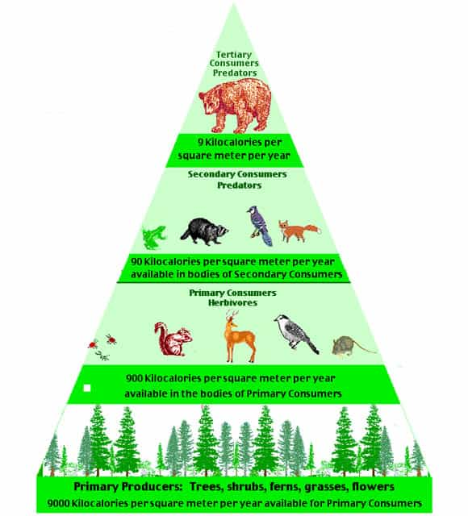
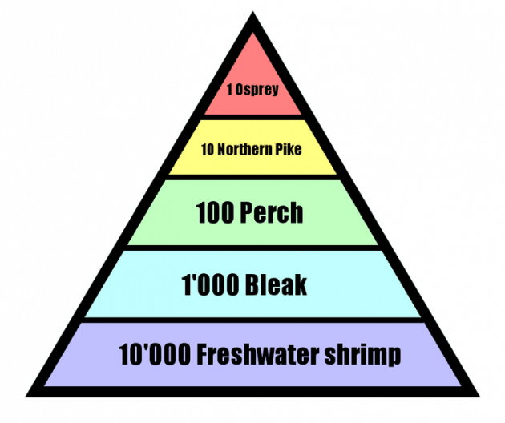
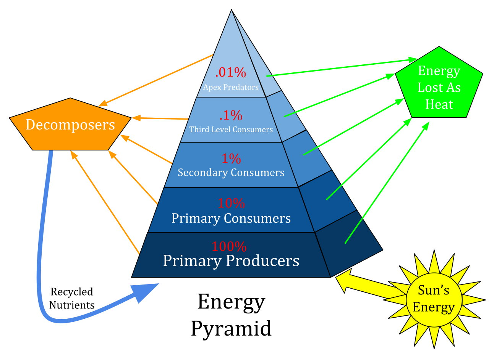
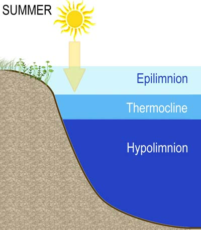
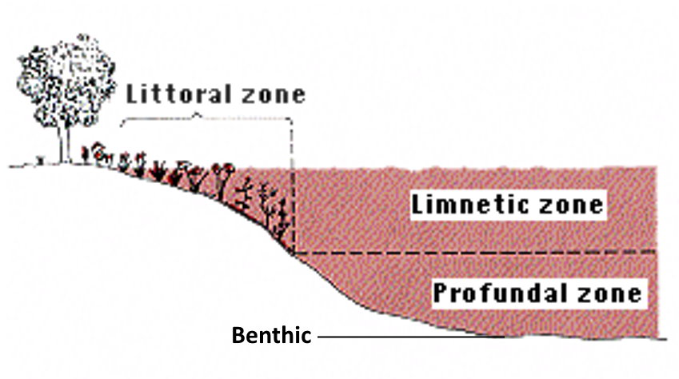
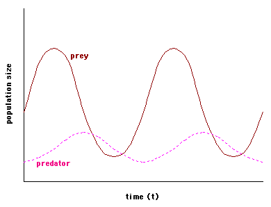

# Ecology

---

# The Biosphere as a Closed System
**Ecology** is the study of ~~inter-relationships~~ between ~~biotic and abiotic~~ parts of the biosphere.

An **open system** is any system that involves the exchange of both ~~energy and matter~~ with its surroundings.  
A **closed system** is any system that involves the exchange of energy, but ~~not matter~~ with its surroundings.

The **Gaia Hypothesis** by ~~James Loveluck~~ described Earth as a **dynamic equilibrium**.  
**Dynamic Equilibrium** is a system in which ~~changes are continually occurring~~, but whose components ~~adjust and adapt~~ without changing the entire system.  
This dynamic equilibrium is maintained with ~~feedback systems~~. (positive feedback = keep it up, negative feedback = change what you're doing)

The **Heat Budget** is the ~~total~~ amount of ~~energy~~ Earth ~~recieves and loses~~.  
The heat budget is kept in a steady state by the ~~interactions of the biosphere levels~~. (air, land, and water)  
The biosphere's source of energy is the ~~sun~~.

## Biosphere
The **biosphere** is the 15-40 km thick layer of our planet that can support life.  
This includes the ~~lithosphere, hydrosphere, and atmosphere~~.

### Hydrosphere
~~All water in all states~~ on Earth.  
Covers 70% of the Earth's surface.  
Absorbs 23% of all incoming solar energy, to drive the hydrologic cycle. (evaporation, condensation, precipitation, etc.)

### Lithosphere
The ~~land~~ on Earth.  
For instance, the soil that provides water and minerals to producers for photosynthesis.

### Atmosphere
The thin layer of ~~gases/small solid particles~~ that all life depends on.  
It is held to the Earth by ~~gravity~~, allows ~~solar energy to pass through~~, and ~~filters/shields~~ us from lethal ~~radiation~~.

#### Troposphere
The ~~lowest~~ level of the atmosphere.  
8 km high at the poles, and 15 km at the equator.  
~~Convection currents~~ and the ~~source of winds~~ are found here.

Ozone in this layer is bad, as it'll bounce things back in.

#### Stratosphere
The next level, ~~above the troposphere~~.  
50 km high.  
Has ~~stable weather~~.  
The ~~ozone layer~~ is located here, which ~~traps UV light~~ and prevents too much from getting to us.
The ozone layer is thinner at the poles than the equator.

#### Mesosphere
The limits of "true" atmosphere.  
Few gasses or water vapour.

#### Ionosphere
The upper atmosphere.
~~Absorbs X and Gamma rays, and reflects radiowaves~~.
The ~~Northern Lights/Aurora Borealis~~ is produced here.

#### Magnetosphere
Above the upper atmosphere.
Layer is created by the Earth's ~~magnetic field~~.  
~~Traps charged particles from the sun~~.

# Levels of Biological Organization

| Organization | Description |
| :----------: | :---------: |
| **Cell** | Smallest functional unit of life. |
| **Tissue** | Cells working together to perform a specific function. |
| **Organ** | Tissues working together. |
| **Organism** | Organs working together. |

The following biological organization levels are what we study in Ecology.

| Organization | Description |
| :----------: | :---------: |
| **Population** | ~~Group of organisms~~ of the ~~same species~~ that ~~occupy a space~~ at a ~~given time~~. |
| **Species** | All populations of a ~~certain organism~~. Only a species if they can ~~interbreed~~ and produce ~~fertile~~ offspring. (An interspecies child is not a species, like a mule, as they cannot interbreed.) |
| **Community** | All the different ~~living populations~~ in an ecosystem. (aka. the biota of an area) |
| **Ecosystem** | A ~~community~~ plus ~~physical, non-living factors~~, and the interactions between them. **Biotic Factors**: Fish, snails, plants, and their interrelationships. **Abiotic Factors**: Oxygen, carbon dioxide, light, water, gravel, and their interrelationships. |
| **Biomes** | ~~Characteristic~~ world ecosystems with ~~particular patterns~~ of abiotic and biotic factors. Their limiting factors are precipitation and temperature averages. |
| **Biosphere** | Earth's thin layer of ~~air, land, and water~~. It supports ~~life~~. Upper boundaries are most limited by ~~availability of oxygen~~. Lower boundaries are most limited by ~~availability of sunlight~~. |

# Matter cycles, energy flows.
Matter is ~~recycled~~; organisms take energy and materials from their environment, and release energy and materials back to the environment.  
Energy ~~cannot be recycled~~; it is constantly ~~replenished from the sun~~, and is mostly (~90%) wasted as heat and leaves.

# Equilibrium in the Biosphere
**Biodiversity** is the ~~number of different species~~ in an ecosystem.

## Food Relationships
Organisms are connected by ~~food chains (linear)~~ and ~~food webs (multiple food chains)~~.  
These are the sequences of ~~who eats who~~, and the ~~transfer of materials and energy~~ from ~~organism to organism~~.  

The extinction of one species could create a ~~domino effect~~.  
The more ~~complicated and interconnected~~ the food web, the ~~more stable~~ the ecosystem, as it has "backups" if a species were to go extinct.

**Trophic levels** are the position of different organisms in the food chain.

### Producers
Also known as ~~autotrophs~~. ("self-feeders")    
These are located in the ~~1st trophic level~~.

Most producers, sometimes named **photosynthesizers**, trap and convert ~~light energy~~ into ~~stored chemical energy~~ through ~~photosynthesis~~.  
Some producers, named **chemosynthesizers**, form carbohydrates (CH, organics) from the ~~energy released~~ from the ~~breakdown of inorganic substances~~ like sulfur.

### Consumers
Also known as ~~heterotrophs~~. ("other-feeders")

Consumers depend on other organisms for food. They do not make their own.  
There are multiple levels.

#### Primary Consumers
Primary Consumers are **herbivores**, animals that only eat plants.  
These are located in the ~~2nd trophic level~~ almost always, because they are the only consumers who will eat the producers.

#### Secondary Consumers
Secondary Consumers are **carnivores**, animals that only eat other animals.  
These are located in the ~~3rd trophic level~~, as they eat the 2nd trophic level, primary consumers.

#### Tertiary and so on...
Tertiary Consumers eat the secondary consumers.  
This trend continues until the ~~top of the food chain~~ is reached.
In addition, **omnivores** are animals that can eat both plants and other animals; they can ~~fit into any trophic levels that herbivores and carnivores can~~.

### Decomposers and Scavengers
At any point in the food chain/web, these two feed on **detritus**: dead organic matter.

Scavengers are ~~larger animals~~ (like vultures) that eat dead or dying organic matter. They ~~do not~~ directly ~~return nutrients to the soil~~.
This makes them located in the ~~2nd last trophic level~~.

Decomposers are also known as ~~detrivores~~, ~~saprophytes~~, or ~~saprovores~~. (saprovores specifically liquify and then absorb their food)  
Decomposers are ~~small organisms~~ (like bacteria, fungi, worms, etc.) that feed on dead organic matter and ~~return the nutrients to the soil~~.  
Decomposers ~~feed nutrients to the producers~~.
These are located in the ~~last trophic level~~.

### Summary of Food Relationships

| Trophic Level | Name | Purpose |
| :-----------: | :--: | :-----: |
| 1 | **Producers** *(Autotrophs)* | Produce their own food. |
| 2 | **Consumers** *(Heterotrophs)* | Eat producers or other consumers to survive. |
| 2 | **Herbivores** *(Primary Consumers)* | Animals that only eat plants. |
| 2+ | **Carnivores** *(Secondary and Higher Level Consumers)* | Animals that only eat other animals. |
| 2+ | **Omnivores** | Animals that eat both plants and animals. |
| 2nd Last | **Scavengers** | Animals that feed off dead or decaying organisms, but do not return minerals to the ecosystem directly. |
| Last | **Detrivores** *(Decomposers)* | Organisms that feed on **detritus**, (waste from plants and animals, including dead remains) and return the minerals to the ecosystem. |

## Unbalance
**Indicator species** are species ~~sensitive to small changes~~ in environment conditions.  
They can provide an ~~early warning to unbalance~~ in the ecosystem.

~~Frogs~~ are good indicator species, as they occupy ~~2 different ecosystems~~ and ~~2 different food chains~~ from tadpole to adult life.  
The disappearance of frogs has been linked to...
* ~~Loss of Habitat~~
* ~~Poor Air & Water Quality~~
* ~~Climate Change~~
* ~~Ultraviolet Radiation~~ (from ozone layer thinning)
Frogs ~~breathe through their thin skin~~, so that leaves them very vulnerable to poor air & water quality as well as UV radiation.

### Terms

| Term | Definition |
| :--: | :--------: |
| **Endangered** Species | ~~Close to extinction~~ in all parts of a ~~country/large location~~. |
| **Extirpated** Species | ~~No longer exist in an area~~. Can be found in others. |
| **Threatened** Species | ~~Likely to become endangered~~/close to extinction if ~~factors that make them vulnerable are not reversed~~. |
| **Special Concern** Species | At risk due to low/declining numbers at the ~~edges of its range~~ or in a ~~restricted area~~. |

## Ecosystem Terms
### Biomass
**Biomass** is the ~~total dry weight~~ of ~~all organisms~~ being measured ~~per unit area~~ ~~per unit time~~.  
It represents ~~energy stored in organic form~~, i.e. stored chemical energy. (e.g. glucose)

$\frac{\frac{g}{m^2}}{year}$

It should be mentioned that to measure biomass, you must dehydrate biological material completely, killing it in the process. :(

### Productivity
**Productivity** is the ~~total~~ amount of ~~energy~~ ~~converted into organic compounds~~ in a ~~given length of time~~. (gross income)

**Net Productivity** is the productivity ~~minus~~ all the ~~cost of metabolic activities~~ (energy used by every cell) of the producer. (net income)  
(Productivity is ~~not always dependent on biomass~~. For example, cutting the lawn increases productivity, because the grass wants to grow back faster, but decreases biomass)

Productivity is measured as a ~~rate of increase of energy (calories)~~ or as ~~biomass~~.

Productivity can target autotrophs (plants) and that is called ~~primary productivity~~.  
It can also target heterotrophs (animals) and that is called ~~secondary productivity~~, and so on...

### Monocultures
**Monocultures** are the growth of ~~one specific plant species~~ instead of many different species.  
This leaves that ecosystem very vulnerable if that species were to go away.

### Calories
There are two units named calories.

### Small Calorie (aka. Gram Calorie)
The amount of ~~heat energy needed~~ to ~~raise~~ the ~~temperature of one *gram* of water~~ by ~~one degree~~ Celsius or Kelvin.

Often denoted as $cal$.

### Large Calorie (aka. food calorie or kilocalorie)
The amount of ~~heat energy needed~~ to ~~raise~~ the ~~temperature of one *kilogram* of water~~ by ~~one degree~~ Celsius or Kelvin.

Often denoted as $Cal$ or $kcal$.  
$1 kcal = 1000 cal$

### Miscellaneous Terms
| Term | Definition |
| :--: | ---------- |
| **Habitat** | The ~~home~~ of an organism |
| **Niche** | An organism's ~~role~~ in the ecosystem *(e.g. place in food web, habitat, breeding area, times of activity)* |
| **Abiotic Factor** | ~~Non-living influence~~ on an ecosystem |
| **Biotic Factor** | ~~Living influence~~ on an ecosystem |
| **Limitting Factors** | Limitations on ~~growth~~, ~~abundance~~, or ~~distributions~~ of a population. *(e.g. space)* |
| **Carrying Capacity** | ~~Maximum number~~ of individuals of a species an ~~ecosystem can support~~. |

## Laws of Thermodynamics
There are two laws of thermodynamics, and they are key to understanding energy transfer.

### First Law
Energy ~~cannot~~ be ~~created or destroyed~~.  
Only ~~changed~~ from one ~~form~~ to another.

### Second Law
Every ~~energy transfer~~, energy is ~~lost~~.  
This "waste" energy is often ~~heat~~.

## Efficiency of Energy Transfer
**Ecological Efficiency** is the ~~net productivity~~ at one ~~trophic level~~ ~~divided~~ by the net productivity at the level ~~below~~.

### Rule of Ten
On every energy transfer, ~~10%~~ of the energy is actually ~~transferred~~.  
90% is the energy is lost as...
* ~~Heat~~ (2nd law of thermodynamics)
* Used in ~~metabolism~~ (Energy used by every cell)
* Other biological processess (~~movement~~, ~~digestion~~, etc...)
* ~~Waste~~

> For example, about 2% of the sun's energy is actually used for photosynthesis.  
Lets say plants contain 100% of available energy, the 2nd trophic level (primary consumer, herbivore) will recieve 10% of the plant's energy from eating it.  
At the 3rd trophic level (secondary consumer, carnivore) eating the primary consumer will recieve 1% of the plant's energy.  
And so on...

This means that if ~~humans eat at lower trophic levels, they would get more energy~~.  
Instead of eating a cow that ate some corn and getting 1% of the energy... eat the corn and get 10%!

### Biological Amplification
As you move through the food web, ~~toxins build up and multiply~~ ~~every transfer~~.  
Even a tiny concentration of toxins can severely effect the top of the food chain.

# Pyramids
The following are common diagrams used when describing energy loss at each stage and how fewer animals can be supported at higher trophic levels.

## Pyramid of Biomass 

Units for Land: $\frac{g}{m^2}$  
Units for Water: $\frac{mg}{m^3}$

This pyramid is based on the ~~dry mass of tissue of an organism~~ at ~~each trophic level~~.  
This pyramid only indicates organic material present at ~~one time~~, not total amounts produced, or the rate of production.

### Inverse?
The pyramid of biomass ~~can be inverted~~.  
This can only happen if ~~producers have very high reproduction rates~~, or  
if a ~~small biomass~~ of a producer can ~~supply enough food~~ for a ~~larger biomass~~ of a consumer.

> For example, pythoplankton may have less biomass than zooplankton as the zooplankton consumes pythoplankton at a very fast rate, preventing the chance that they can develop into a larger sized population.

> Another example, there aren't many trees in a forest, but they produce enough food for many consumers.

## Pyramid of Numbers

This pyramid is based on the ~~number of organisms~~ ~~at each trophic level~~.
This pyramid only indicates organic material present at ~~one time~~, not total amounts produced, or the rate of production.

### Inverse?
Yes.

## Pyramid of Energy

Units: $\frac{kcal}{m^2}$

This pyramid is based on ~~energy trapped in organic matter~~ at ~~each trophic level~~.

### Inverse?
~~No!~~ There must always be more energy at lower trophic levels to maintain life at the higher.

# Limnology
Limnology is the study of ponds and other similar aquatic systems.

## Levels

There are 3 levels of water.

| Level | Location | Temperature |
| :---: | :------: | :---------: |
| ~~**Epilimnion**~~ | Highest level | Warms up in the summer |
| ~~**Thermocline**~~ | Between epilimnion & hypolimnion | Temperature rapidly changes |
| ~~**Hypolimnion**~~ | Lowest level | Low temperature all year |

## Zones

There are 4 zones of water.

| Zone | Location | Enough light for photosynthesis? |
| :--: | :------: | :---------: |
| ~~**Littoral**~~ | From the shore to where plants stop growing on the sea floor | Enough |
| ~~**Limnetic**~~ | Anywhere that sunlight can still reach | Enough |
| ~~**Profundal**~~ | Beneath limnetic, sunlight can no longer reach | Not enough |
| ~~**Benthic**~~ | Sea floor | Not enough |

## Lake Types
| ~~Oligotrophic~~ | ~~Eutrophic~~ |
| ---------------- | ------------- |
| - deep, cold     | - shallow, warm |
| - low nutrient levels | - high nutrient levels |
| - limited numbers of few organisms | - many photosynthetic organisms |
| - clear water | - murky water (from photosynthetic organisms) |

Over time, ~~oligotrophic~~ lakes ~~becomes eutrophic~~.

# Biogeochemical Cycles
This is **Chapter 3**.

Biogeochemical Cycles involve two main processess
* ~~**Digestion**~~: Breaking down to ~~incorporate~~ as a ~~part of a body~~.
* ~~**Decay**~~: Of dead bodies/feces to become ~~part of the living world~~.

<h1>
CHNOPS
</h1>

These following elements, ~~carbon, hydrogen, nitrogen, oxygen, phopsphorous, and sulphur~~, are responsible for 95% of all mass of all biota.  
They are all reused in cycles.

## Oxygen Cycle
~~21%~~ of the atmosphere is oxygen.  
~~Produced by photosynthesis~~, ~~used in cellular respiration~~.

## Carbon Cycle
~~0.04%~~ of the atmosphere is ~~carbon dioxide~~.  
~~Produced by cellular respiration~~, ~~used in photosynthesis~~.

Dead matter that ~~does not get decomposed~~ gets buried and becomes ~~fossil fuels~~.  
Carbon dioxide is ~~released~~ when fossil fuels are ~~burnt~~.

## Carbon-Oxygen Cycle
Carbon and oxygen are found in all organic compounds. (e.g. ~~carbs~~, ~~fats~~, ~~proteins~~, ~~IB nucleic acids~~)  
~~Combustion~~ and ~~decaying organic matter~~ release carbon dioxide.

### Photosynthesis
Done by autotrophs/producers, photosynthesis is the process of ~~creating food~~.

$6\textrm{CO}_2 + 6\textrm{H}_2\textrm{O} -\!\!\!(\textrm{chlorophyll, sunlight, enzymes})\!\!\!\rightarrow \textrm{C}_6\textrm{H}_{12}\textrm{O}_6 + 6\textrm{O}_2$

The ~~**chlorophyll**~~ takes ~~Carbon Dioxide~~ & ~~Oxygen~~ **with ~~sunlight~~ and enzymes** produces ~~Glucose~~ & ~~Oxygen~~

### Cellular Respiration
Done by all biota, cellular respiration is the process of ~~using food~~.

$\textrm{C}_6\textrm{H}_{12}\textrm{O}_6 + 6\textrm{O}_2 -\!\!\!(\textrm{mitochondria})\!\!\!\rightarrow 6\textrm{CO}_2 + 6\textrm{H}_2\textrm{O} + \textrm{ATP} + \textrm{Heat}$

The ~~**mitochondria**~~ takes ~~Glucose~~ & ~~Oxygen~~ and produces ~~Carbon Dioxide~~, ~~Oxygen~~, ~~ATP~~, & ~~Heat~~.

## Climate Effects
The **greenhouse effect** involves gases, **greenhouse gases**, in the atmosphere ~~trapping infrared radiation~~ that is trying to escape into space and warming the planet up.  

### Greenhouse Gases
The main greenhouse gases are...
* **carbon dioxide**  
  $\textrm{CO}_{2 (g)}$
* **methane**  
  $\textrm{CH}_{4 (g)}$
* **water vapour**  
  $\textrm{H}_2\textrm{O}_{(g)}$
* **nitrous oxides**  
  $\textrm{NO}_{x (g)}$
* **ozone**  
  $\textrm{O}_{3 (g)}$  
  When in lower altitudes, ozone absorbs heat
* **CFC's**  
  Aka. Chloroflurocarbons are propellents that were found to ~~thin the ozone layer~~. (The chlorine made ozone into oxygen)  
  A thinner ozone layer causes cancer, cataracts, reduced photosynthesis, and genetic damage from ~~increased UV light exposure~~.

### Other
The 1992 Earth Summit was a treaty signed by many industrialized countries to stabilize carbon dioxide emissions by the end of the century.

Atomic warfare and volcanic ash create an ~~albedo effect~~, meaning high reflectivity of the Earth's surface, which may ~~cool the planet down~~.

## Nitrogen Cycle
IB *Although still in the Alberta curriculum, IB favours this cycle.*

~~78%~~ of the atmosphere is nitrogen gas.  
Nitrogen is used to make ~~DNA~~ and ~~amino acids~~. (and ~~proteins~~ are made from amino acids)  

### Nitrogen Fixation
Nitrogen fixing is the process of ~~converting nitrogen gas into ammonium ions~~.  
~~Nitrogen gas itself~~ ~~cannot be used~~, and must be converted into a usable form.

### Physical
~~10%~~ of nitrogen is fixed this way.

Triggered by ~~lightning~~ and/or ~~photochemical smog~~.  
Causes nitrogen gas to react with oxygen to produce nitrates.

$\textrm{N}_{2 (g)} + \textrm{O}_2 -\!\!\!(\textrm{lightning/photochemical smog})\!\!\!\rightarrow \textrm{NO}_3$

### Biological
~~90%~~ of nitrogen is fixed this way.

#### Fixing
* In aquatic situations, bacteria in blue-green algae like ~~cyanobacteria~~ convert ~~nitrogen gas~~ into ~~ammonium ions~~.
* In land situations, bacteria such as ~~rhizobium~~ live in ~~legume~~ roots and ~~form nodules~~ where they convert ~~nitrogen gas~~ into ~~ammonium ions~~.
  * **Legume** are plants that are members of the pea family. (peas, beans, peanuts, alfalfa, clover, potatoes, etc.)

$\textrm{N}_{2 (g)} -\!\!\!(\textrm{rhizobium legume nodules OR cyanobacterium})\!\!\!\rightarrow \textrm{NH}_4^+$

#### Nitrification
Then, ~~**nitrifying bacteria**~~ convert ammonium ions into ~~nitrites~~ then ~~nitrates~~. Nitrates can be used.

$\textrm{NH}_4^+ -\!\!\!(\textrm{nitrifying bacteria})\!\!\!\rightarrow \textrm{NO}_2 -\!\!\!(\textrm{nitrifying bacteria})\!\!\!\rightarrow \textrm{NO}_3$

#### Assimilation
Assimilation is to make a part of yourself, to consume. Therefore...  
Plants ~~consume nitrates~~ to ~~produce amino acids and nucleotides~~, which they use to make ~~proteins and nucleic acids~~.  
Proteins are a ~~chain of amino acids~~ bonded together.

$\textrm{NO}_3 -\!\!\!(\textrm{plants use})\!\!\!\rightarrow \textrm{amino acids + nucleotides} -\!\!\!(\textrm{plants make})\!\!\!\rightarrow \textrm{proteins + nucleic acids}$ 

#### Decomposition
Decomposer bacteria break down dead plant and animal proteins ~~into amino acids~~ OR into urine then ~~into urea~~.

$\textrm{dead bodies} -\!\!\!(\textrm{decomposer bacteria})\!\!\!\rightarrow \textrm{proteins}$  
$\textrm{proteins} -\!\!\!(\textrm{decomposer bacteria})\!\!\!\rightarrow \textrm{amino acids}$  
$\textrm{proteins} -\!\!\!(\textrm{decomposer bacteria})\!\!\!\rightarrow \textrm{urine} -\!\!\!(\textrm{decomposer bacteria})\!\!\!\rightarrow \textrm{urea}$

#### Ammonification
Then, the amino acids or urea are converted into ammonium ions by ~~ammonifying bacteria~~.

$\textrm{amino acids OR urea} -\!\!\!(\textrm{ammonifying bacteria})\!\!\!\rightarrow \textrm{NH}_4^+$

#### Denitification
Denitrifying bacteria remove nitrogen from ecosystems. These bacteria gain energy from converting nitrates, nitrites, or ammonium ions ~~back into unusable nitrogen gas~~.  
Denitrifying bacteria are ~~**anaerobic**~~, meaning they ~~dislike oxygen~~. People often ~~aerate~~ their soil, by punching holes into it, to decrease denitrification.

$\textrm{NO}_3 \rightarrow \textrm{NO}_2 \rightarrow \textrm{NH}_4^+ \rightarrow \textrm{N}_{2 (g)}$

### Human Damage
Humans add nitrates to ecosystems as ~~fertilizer~~.  
Too much fertilizer can cause ~~**eutriphication**~~ in lakes, when algae grows too quickly, dies, and the ~~decomposing algae uses all the oxygen~~ in the water and kills all life.

## Hydrologic Cycle
This cycle is regarding the movement of water through the environment, atmosphere, and Earth.

This cycle is ~~mainly abiotic~~, biota have little effect.

The volume of water in the biosphere is ~~fairly constant~~.

### Stages
| Term | Description |
| :--: | ----------- |
| **Precipitation** | water moving from ~~atmosphere to Earth~~. (rain, snow, etc.) |
| **Evaporation** | water moving from ~~Earth to atmosphere~~. (to form clouds in condensation which eventually precipitates) |
| **Absorption** | water moving from ~~environment into living organisms~~. (drinking/absorbing) |
| **Transpiration** | water ~~loss from plants~~ (water evaporates from stoma) |
| **Perspiration** | water ~~loss from animals~~ (sweat) |
| **Exhalation** | water ~~loss during respiration~~ (exhaling or cellular respiration) |
| **Percolation** | movement of ~~water down soil~~ (water table forms above bedrock/clay) |
| **Leaching** | ~~seeping~~ water ~~carrying dissolved organic matter and minerals~~ to ~~lower layers of soil~~ |

### Acid Rain
Rain is normally ~~slightly acidic at 5.5 - 5.9 pH~~.

Acid rain contains ~~sulfur dioxide $\textrm{SO}_2$~~ and ~~nitrogen oxides $\textrm{NO}_x$~~, which form ~~sulfuric and nitric acids~~.

Main source of sulfur dioxides is ~~burning fossil fuels~~ and ~~extracting hydrogen sulfide from "sour gas"~~. *(e.g. coal burning plants, metal smelters, oil refineries)*  
Main source of nitrous oxides is ~~internal combustion engines~~, as well as processing ~~nitrogen fertilizers~~ and ~~fossil fuel burning~~.

~~Alkaline soils~~ minimize the impact of acid rain by ~~neutralizing acids before runoff~~.

Acid rain ~~leaches out heavy metals~~ from the soil and into lakes and rivers. Not good!

## Phosphorous Cycle
Phosphorous is used in ~~cell membranes~~, ~~DNA~~ (~~nucleic acids~~), ~~ATP~~, and ~~bones~~.

Plants can only absorb phosphorous in ~~phosphate~~ form. ($\textrm{PO}_4$)  
Phosphate is found in ~~rock~~ and ~~guano~~, and ~~leeches out via precipitation~~.

It is found in ~~fertilizers~~. Harvesting crops ~~removes nitrogen and phosphorous~~ from the soil, interrupting natural cycles.  
Fertilizing soil can fix this, but can also make soil ~~10x more acidic~~.  
Eutriphication can occur like mentioned earlier in human damage.

## Sulfur Cycle

Sulfur is used in ~~production of proteins~~.

Plants can only absorb sulfur in ~~sulfate~~ form. ($\textrm{SO}_4$)  
Sulfur is found in ~~rocks and sulfur deposits~~.  
Like mentioned earlier, sulfur can contribute to acid rain.

# Characteristics of Ecosystems
This is **Chapter 4**.

## Terms

| Term | Definition |
| :--: | ---------- |
| **Ecotones** | ~~Transition~~ zones ~~between ecosystems~~. Often have greater biodiversity than the ecosystems it borders. |
| **Ecoclines** | ~~Transition~~ zones ~~between biomes~~. |
| **Artificial Ecosystems** | Ecosystems planned and maintained by humans. (e.g. parks, farms, etc.) |
| **Natural Ecosystems** | Ecosystems that are naturally occuring. (e.g. lakes, forests, deserts, etc.) |

## Niche
**Ecological Niche**  
An organism's ~~role in an ecosystem~~; this includes things such as...
* Placement in ~~food web~~
* ~~Habitat~~
* ~~Breeding area~~
* ~~Time of activity~~

**Fundamental Niche**  
All ways an individual can ~~potentially~~ ~~interact with its surroundings~~.

**Realized Niche**  
An organisms ~~actual interactions~~ with its surroundings.

## Competition

### Gause's Law or The Principle of Competitive Exclusion
Two organisms ~~cannot occupy the same niche~~ (use the ~~same limited resources~~) for long without one species being ~~displaced or repressed~~.

### Types of Competition

| Type | Definition |
| :--: | ---------- |
| **Competition** | Any ~~struggle~~ that occurs between ~~two individuals~~ for the ~~same resource~~. |
| **Exploitative Competition** | Use of a ~~limited resource~~ ~~between~~ two or more organisms. |
| **Interference Competition** | One organism ~~blocking access to a resource~~ from another organism. |
| **Destructive Competition** | Organisms ~~fighting~~. Can be reduced by **territorial organization**. |
| **Territorial Organization** | Different organisms ~~organized into specific areas~~ as to not compete with each other. *(e.g. mice eat berries on the ground, while birds eat berries from the tree)* |
| **Interspecific Competition** | Competition ~~between different species~~, often for ~~one thing~~. |
| **Intraspecific Competition** | Competition ~~within the same species~~. Fiercer, as the same species have the ~~same niche~~, so they ~~compete for everything~~ |

### Reducing Competition
Competition can be reduced by factors and symbiotic relationships such as...

| Factor | Definition |
| :----: | ---------- |
| **Predation** | The ~~preying of an animal~~ on others. |
| **Parasitism** | One individual ~~benefits~~, the other is ~~harmed~~. | 
| **Commensalism** | One individual ~~benefits~~, the other is ~~unaffected~~. |
| **Mutualism** | ~~Both individuals benefit~~. |
| **Periodicity** | Alternating ~~periods of activity~~ to avoid competition. *(e.g. hawk is diurnal, active during day, owl is nocturnal, active during night)* |

**Lotka-Volterra Theory**  
Predator and prey numbers are ~~correlated~~, with some lag, in predictable ~~**cyclic ossilations**~~.  
In other words, as predator numbers increase, prey numbers decrease, which cause predator numbers to decrease, and prey numbers to increase. And so on...  

**Seasonal Community Changes**  
Seasonal temperature changes force animals to adjust or die.
* **Hibernation**: ~~Sleeping through cold weather~~. Rate of ~~metabolism drops~~, so low energy requirements.
* **Estivation**: ~~Summer hibernation~~. Sleep to beat the heat.
* **Migration**: ~~Moving~~ to more ~~favorable conditions~~, such as warmer regions or better food supply.

**Lunar Rhythms**  
Organism rhythms being ~~affected by the moon~~, which causes ~~tides~~.  
Organisms on coasts have to ~~adjust to wide variation~~ in environmental conditions.

**Annual Rhythms**  
~~Reproductive cycles~~ of plants and animals in ~~yearly rhythm~~ in response to ~~seasonal changes~~.  
*(e.g. trees losing their leaves in the fall)*

# Biomes
A biome is a large geopgraphical region with a ~~characteristic climate~~, dominated by ~~specific types of plants and animals~~.  
Characteristics include...
* ~~**Physiographic**~~ (flat, bumpy, etc.)
* ~~**Climatic**~~ (precipitation and temperature)
* ~~**Edaphic**~~ (soil characteristics: dark/light? nutrient rich?)
* ~~**Biotic Factors**~~

~~Precipitation~~ is the ~~limiting factor~~ that detminers if a biome is a ~~forest~~, ~~grassland~~, or ~~desert~~.  
~~Temperature~~ is the ~~limiting factor~~ that determines the ~~type of biome~~. (in order of coolest to warmest, ~~boreal~~, ~~temperate~~, or ~~tropical~~)

These two limiting factors, as well as ~~light intensity~~ and ~~length of growing season~~, determine the ~~type of plant~~ that can grow in a biome, and ~~in turn the type of other organisms~~ that can live there.

## Forests
.

### Boreal Coniferous Forest (Taiga)
.

### Temperate Deciduous Forest
.

### Tropical Rain Forests
.

## Grasslands
.

## Deserts
.

### Tundra (Cold Desert)
.

### Hot Deserts
.

## Mountain Biomes
.
