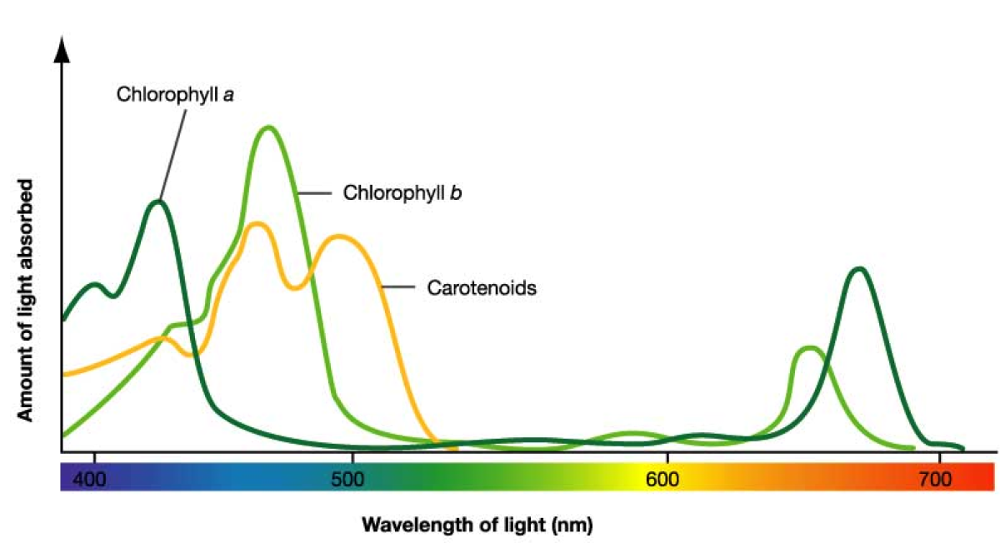
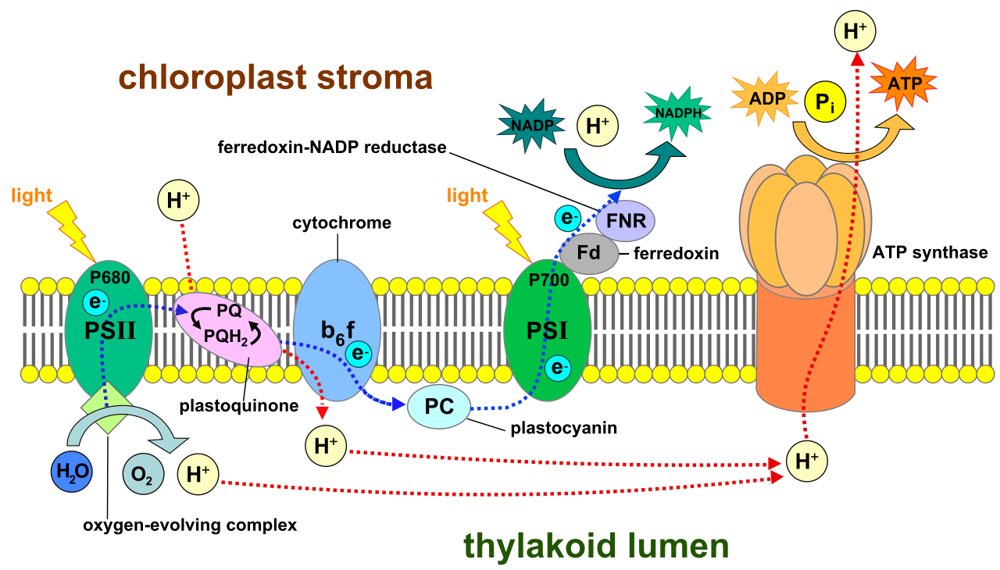
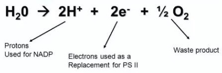
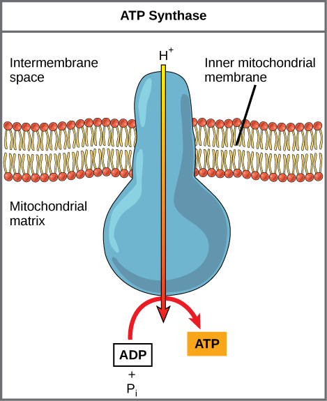
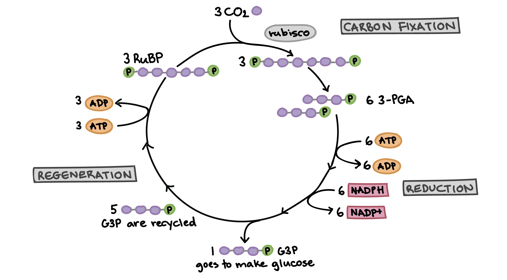

# Photosynthesis & Respiration

!> These notes are unfinished and are subject to change.

---

# Photosynthesis
~~80%~~ of all $\textrm{O}_2$ is made by ~~photosynthesis in the oceans~~.

## Reaction
### Net Reaction
$6\textrm{CO}_2 + 6\textrm{H}_2\textrm{O} -\!\!(\textrm{chlorophyll, sunlight, enzymes})\!\!\rightarrow \textrm{C}_6\textrm{H}_{12}\textrm{O}_6 + 6\textrm{O}_2$

### Actual Reaction
The net reaction doesn't include the water taken in and created on both sides. The water on the product end is ~~new water~~, not just recycled.

$6\textrm{CO}_2 + 12\textrm{H}_2\textrm{O} -\!\!(\textrm{chlorophyll, sunlight, enzymes})\!\!\rightarrow \textrm{C}_6\textrm{H}_{12}\textrm{O}_6 + 6\textrm{O}_2 + 6\textrm{H}_2\textrm{O}$

# Leaf

Photosynthesis is performed by ~~**chloroplast**~~ organelle.  
Chloroplasts are found in the ~~**palisade** (packed) and **spongy** (spaced)~~ layer of the leaf, which are collectively the ~~**mesophyll** layer~~.

Vascular tissue in the ~~**vein**~~ supplies things; xylem supplies water and minerals, phloem supplies glucose.

The ~~**upper and lower epidermis**~~ protect the leaf, which are coated in ~~**cuticle/cutin**~~ which prevent water loss.

The ~~**stomata**~~ permit gas exchange, and the ~~**guard cells**~~ open and close the stomata. 

# Chloroplast

Within the chloroplast is the ~~**matrix**~~, which is surrounded by the ~~**inner membrane**~~.  
The ~~**outer membrane**~~ is what you think it is, and between the outer membrane and the inner membrane is the ~~**intermembrane space**~~.

Within the matrix are ~~**thylakoids**~~, sites of light-dependent reactions.  
Within each thylakoid is a space called the ~~**lumen**~~.  
30-50 thylakoids are stacked to form ~~**grana**~~, with about 60 in the matrix.  
Each grana is interconnected by flattened thylakoids called ~~**lamellae**~~.  
All of these parts are suspended in an aqueous solution called ~~**stroma**~~, which contains ~~enzymes~~ necessary for photosynthesis.

## Photosystems
There are two ~~**photosystems**~~ in the thylakoid membrane, ~~photosystem I and photosystem II~~.  

### Photosystem I
Also known as ~~**P680**~~, as it is driven by wavelengths ~~shorter than 680 nm~~.

### Photosystem II
Also known as ~~**P700**~~, as it is driven by wavelengths ~~longer than 680 nm~~.

## Pigments
Photosystems contain ~~**pigments**~~, molecules that ~~absorb light~~.  
Colours that pigments ~~don't absorb~~ (therefore, reflected) are what ~~colour they appear as~~.

~~These are the main ones...~~
  * Chlorophyll A (absorbs all colours but green)
  * Chlorophyll B (absorbs all colours but green)
  * Carotenoids (absorbs all colours but yellow and orange)
    * In the fall, ~~chlorophylls decompose, but carotenoids don't~~. This is why leaves turn orange/yellow.

### Accessories
Chlorophyll A is the ~~only~~ pigment that can ~~transfer energy to carbon fixation~~, covered later.  
Therefore, other pigments are ~~**accessory pigments**~~, which give their energy to chlorophyll A.

### Spectrums
#### Absorption
The wavelengths of light that each pigment absorbs can be measured with a ~~**spectrophotometer**~~, which forms an ~~**absorption spectrum**~~.  
$x$ represents visible light, ~~peaks represent absorbed~~ light, and ~~valleys represent reflected~~/passed through light.

#### IB Action
Every ~~volume of oxygen produced~~ in the photosynthesis reaction, ~~under different wavelengths~~, is what the ~~**action spectrum**~~ represents.  
It is very similar to absorption spectrums, except instead of light absorbed, it is oxygen produced.  
They look ~~very similar to absorption spectrums~~.

### Chromatography
A process that can be used to ~~seperate plant pigments~~ on ~~chromatography paper~~.

### Normalized Differential Vegetation Index (NDVI)
Unhealthy plants ~~don't reflect as much green and infared light~~ as healthy plants.  
This can be identified with satellites using NDVI.

### Compact Airborne Spectrographic Imagers (CASI)
Similar to NDVI, but instead ~~deeply pink/red regions are healthy~~ while ~~duller/darker areas have thin/missing vegetation~~>

## History

| When | Who | What |
| :--: | :-: | ---- |
| 1700's | ~~Van Helmont~~ | Only water causes plant's mass to increase. (only half right) |
| 1771 | ~~Priestley~~ | Plant growth replenishes $\textrm{O}_2$ |
| Late 1800's | ~~Ingen-Housz~~ | Plants produce $\textrm{O}_2$ when in light. They use $\textrm{O}_2$ when in dark. |
| Late 1800's | Senebier | Plants take in $\textrm{CO}_2$ |
| Late 1800's | Engelmann | Action spectrum reveals red and blue violet light is best for photosynthesis. |
| Late 1800's | Blackman | Defined light and dark reactions as two distinct phases of photosynthesis. |
| 1930's | Van Niel | The source of oxygen in photosynthesis is from $\textrm{H}_2\textrm{O}$, not $\textrm{CO}_2$ |
| 1930's | Arnon | Without $\textrm{NADP}^+$ and $\textrm{CO}_2$, cyclic photophosphorylation produces ATP using light. |
| 1930's | ~~Hill~~ | Renamed Blackman's definitions to light dependent and independent, and specified that they are seperate. |
| 1940's | ~~**Calvin**~~ | Defined the Calvin Cycle using paper chromatography and radioactive carbon isotope tracers. |
| 1960's | ~~**Mitchell**~~ | Defined the chemiosmotic theory to explain ATP production. |
 
## Reaction Terms

| Term | Meaning |
| :--: | ------- |
| **Rx** | Reaction |
| **Reduction Rx** | A reaction where a molecule or atom ~~gains electrons/hydrogens.~~ |
| **Oxidation Rx** | A reaction where a molecule or atom ~~loses electrons/hydrogens.~~ |
| **Redox Rx** | A reaction involving ~~red~~uction and ~~ox~~idation. It is the ~~transfer of electrons~~ from ~~one chemical species (atom/molecule/ion) to another~~. |
| **Endergonic Rx** | A reaction that ~~absorbs energy~~. |
| **Exogonic Rx** | A reaction that ~~releases energy~~. |

## Key Molecules
### $\textrm{NAD}^+$ & $\textrm{NADP}^+$
This molecule is an ~~electron carrier molecule~~.  
It can carry ~~one proton and two electrons~~.

$\textrm{NAD}^+$ & $\textrm{NADP}^+$ do the same thing, but $\textrm{NADP}^+$ is ~~only found in photosynthesis~~.

### $\textrm{NADH+H}^+$ & $\textrm{NADPH+H}^+$
This is the ~~reduced form~~ of the aforementioned molecule.  
Some people may call it $\textrm{NADH}$, but technically there is an extra hydrogen ion (aka. proton) attached unintentionally, and isn't used.

$\textrm{NADP}^+ + \textrm{H}^+ + 2\textrm{e}^- \rightarrow \textrm{NADPH} + \textrm{H}^+$

### $\textrm{ATP}$
This molecule is an ~~energy currency molecule~~, and is called adenosine triphosphate.  
ATP releases energy by ~~breaking~~ one of its ~~phosphate bonds~~.

### $\textrm{ADP} + \textrm{P}_i$
This is the ~~reduced form~~ of the aforementioned molecule.  
When ATP breaks one of its phosphate bonds, it comes adenosine diphosphate.  
$\textrm{P}_i$ is called ~~inorganic phosphate~~, and when ~~added to ADP, it forms ATP~~.

$\textrm{ADP} + \textrm{P}_i \rightarrow \textrm{ATP}$

## Light-Dependent Reactions

### Non-cyclic Photophosphorylation
More common.
Occurs within the ~~thylakoid membrane~~.  

* ~~Starting with photosystem **II**~~, protons ($\textrm{H}^+$) from sunlight energy reach the photosystem.
* ~~Two electrons~~ from photolysis (covered later) is excited by protons, and it ~~gains energy~~.
  * This causes it to ~~raise up to a higher level electron acceptor~~.
* The electrons are then passed ~~down an electron transport system~~, through ~~redox reactions~~, releasing the excitement energy.
  * This energy is used to ~~pump in protons from the stroma into the thylakoid lumen~~.
* The electrons reaches ~~photosystem I~~, which recieves more protons from sunlight energy.
* The electrons are once again excited, and gains energy.
  * This causes it to once again raise up to a another higher level electron acceptor.
* The electrons are once again passed down another electron transport system, releasing the excitement energy.
  * This energy is now used to ~~combine $\textrm{NADP}^+$, a proton, and the two electrons~~ to form $\textrm{NADPH}+\textrm{H}^+$

#### Photolysis
* The cycle is ready to start again, but photosystem II is now missing two electrons.
  * Water is split in a process called ~~**photolysis**~~.
  * ~~Two electrons from each hydrogen~~ is given to photosystem II, and the ~~cycle may begin again~~.
  * The oxygen from water combines with another oxygen later to form ~~$\textrm{O}_2$ gas~~, and escapes as waste.
    * Photolysis gets one oxygen, so photolysis must run twice before an oxygen gas can be formed.
  * The hydrogens, now photons, enter the ~~thylakoid lumen~~.

#### Chemiosmosis
The electrons energy was used to pump in protons from the stroma into the thylakoid lumen. The purpose of this was to perform ~~**Chemiosmosis**~~.

* The ~~concentration~~ of protons within the ~~thylakoid lumen~~ is now ~~significantly higher than the stroma~~.
  * This causes the protons in the lumen to passively ~~try to get into the stroma~~, leaving the thylakoid.
* The protons flow out of ~~protein channel $\textrm{CF}_0\textrm{CF}_1$~~
  * $\textrm{CF}_0$ complex is a channel that allows protons from the lumen to cross the membrane and into the $\textrm{CF}_1$\
  * $\textrm{CF}_1$ complex is a bulbous head containing ~~ATP synthetase~~, which uses the ~~kinetic energy of protons~~ travelling to perform the ~~phosphorylation of ADP~~.
* ~~**Phosphorylation**~~ is the process of adding a phosphate to something.
* $\textrm{ADP}$ and $\textrm{P}_i$ in the stroma go to the $\textrm{CF}_1$ complex and get combined to form ~~ATP~~.

### Summary (In/Out)
| In | Out |
| :-: | :-: |
| $\textrm{H}_2\textrm{O}$ light $\textrm{ADP} + \textrm{P}_i$ $\textrm{NADP}$ | $\textrm{O}_2$ (waste) $\textrm{ATP}$ $\textrm{NADPH}+\textrm{H}^+$ |

### ib Cyclic Photophosphorylation
~~Only~~ involves photosystem I, and only performs chemiosmosis.
Occurs in the ~~abscence of $\textrm{NADP}^+$ and $\textrm{CO}_2$~~, and is triggered by ~~light~~.

## Light-Independent Reactions
* Also called carbon-fixation, dark reactions, Calvin cycle.
* Occurs within the ~~stroma~~.
* Light energy ~~is not needed~~. (energy comes from $\textrm{ATP}$ and $\textrm{NADPH}+\textrm{H}^+$ from light dependent Rx)
* The Calvin cycle must be ~~**run 6 times**~~ to produce ~~one glucose~~.

### Carboxylation
* ~~RuBP~~ is a ~~$\textrm{CO}_2$ acceptor~~.
  * Requires enzyme ~~**Rubisco**~~, the worlds ~~most important enzyme~~, for being the ~~link between the living and nonliving world~~.
* Three RuBP and three $\textrm{CO}_2$ form an ~~three molecules of an unstable 6 carbon sugar~~.
* The three unstable 6 carbon sugars divides into ~~six 3 carbon substances~~ called ~~**3PG**~~ (also called ~~**PGA**~~)

### Phopshorylation
* Six $\textrm{ATP} donates ~~six phosphates~~ to make the six 3PG's into a ~~more reactive form~~ called ~~**DPG**~~
  * Anything with ~~two inorganic phosphates~~ is ~~very unstable~~ and really want to get ~~rid of a phosphate~~.
* $\textrm{ADP} returns to the light-dependent reactions to get a new phosphate.

### Reduction
* Six $\textrm{NADPH}+\textrm{H}^+$ gives six hydrogens to the six DPG's, ~~replacing the phosphate~~ and forming the ~~final product **G3P**~~ (also called ~~**PGAL**~~).
* $\textrm{NADP}^+$ and $\textrm{P}_i$ return to the light-dependent reactions.

### G3P Uses
~~Six G3P~~ is the final product of the Calvin cycle being ~~run three times~~, but there are three things that can be done with it. It can be...
* Burnt and used as ~~fuel~~ (sent to mitochondria)
* Converted into ~~glucose~~ (two G3P's linked form glucose)
* Enter the ~~regeneration pathway~~ (reuse)
  * ~~5/6 of the G3P~~ produced are reused
  * G3P is converted into ~~RuP~~
  * Three ATP donate a total of three phosphates, making RuP into ~~RuBP~~
  * This is called the ~~Regeneration pathway~~

!> UNFINISHED

### Summary (In/Out)
| In | Out |
| :-: | :-: |
| $\textrm{ATP}$ $\textrm{NADPH}+\textrm{H}^+$ 3$\textrm{CO}_2$ | $\textrm{ADP} + \textrm{P}_i$ $\textrm{NADP}^+$ Two $\textrm{C}_3\textrm{H}_6\textrm{O}_3$ |
