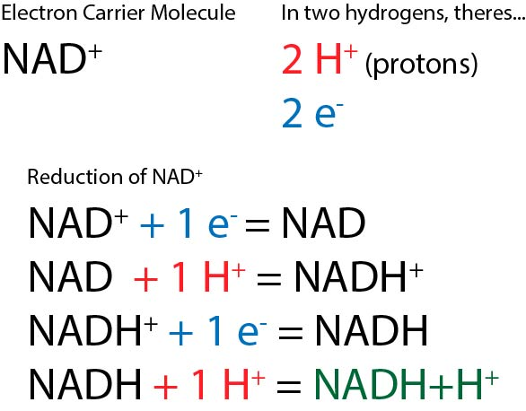
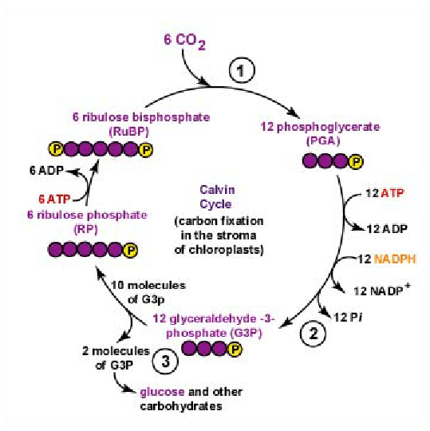
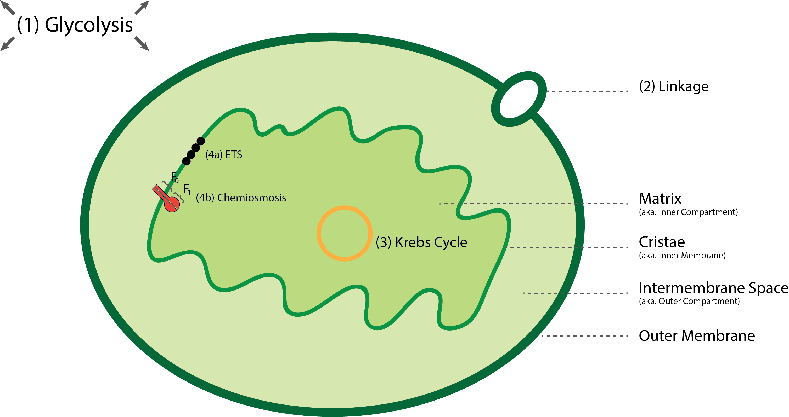
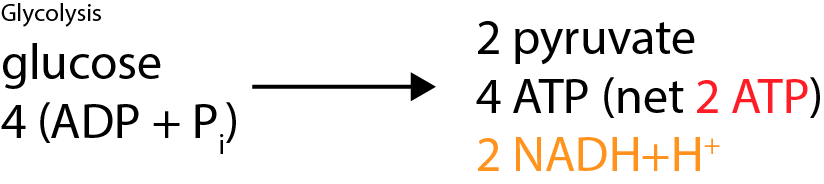
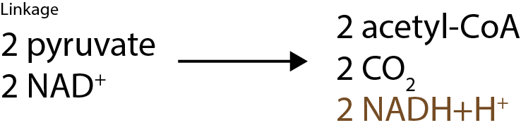
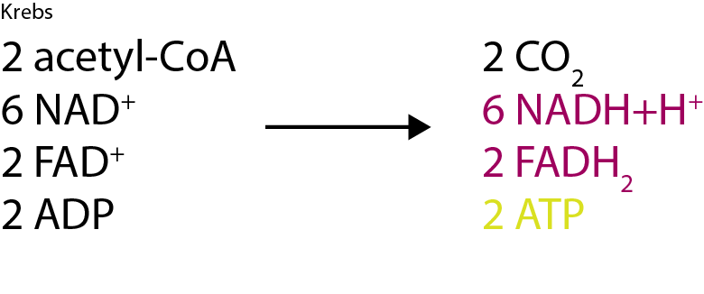
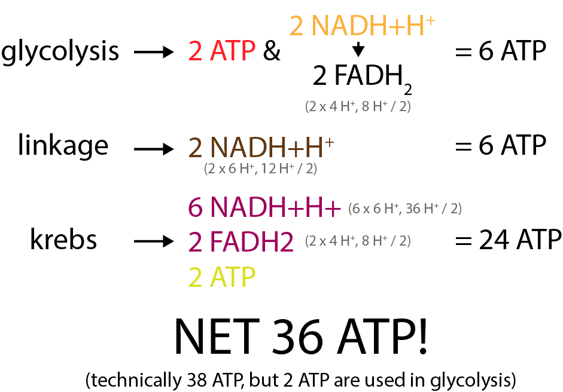

# Photosynthesis & Respiration

!> These notes are unfinished and are subject to change.

---

# Photosynthesis
~~80%~~ of all $\textrm{O}_2$ is made by ~~photosynthesis in the oceans~~.

## Reaction
### Net Reaction
> $6\textrm{CO}_2 + 6\textrm{H}_2\textrm{O} -\!\!-(\textrm{chlorophyll, sunlight, enzymes})\!\!\longrightarrow \textrm{C}_6\textrm{H}_{12}\textrm{O}_6 + 6\textrm{O}_2$

### Actual Reaction
The net reaction doesn't include the water taken in and created on both sides. The water on the product end is ~~new water~~, not just recycled.

> $6\textrm{CO}_2 + 12\textrm{H}_2\textrm{O} -\!\!-(\textrm{chlorophyll, sunlight, enzymes})\!\!\longrightarrow \textrm{C}_6\textrm{H}_{12}\textrm{O}_6 + 6\textrm{O}_2 + 6\textrm{H}_2\textrm{O}$

# Leaf

Photosynthesis is performed by ~~**chloroplast**~~ organelle.  
Chloroplasts are found in the ~~**palisade** (packed) and **spongy** (spaced)~~ layer of the leaf, which are collectively the ~~**mesophyll** layer~~.

Vascular tissue in the ~~**vein**~~ supplies things; xylem supplies water and minerals, phloem supplies glucose.

The ~~**upper and lower epidermis**~~ protect the leaf, which are coated in ~~**cuticle/cutin**~~ which prevent water loss.

The ~~**stomata**~~ permit gas exchange, and the ~~**guard cells**~~ open and close the stomata. 

# Chloroplast

Within the chloroplast is the ~~**matrix**~~, which is surrounded by the ~~**inner membrane**~~.  
The ~~**outer membrane**~~ is what you think it is, and between the outer membrane and the inner membrane is the ~~**intermembrane space**~~.

Within the matrix are ~~**thylakoids**~~, sites of light-dependent reactions.  
Within each thylakoid is a space called the ~~**lumen**~~.  
30-50 thylakoids are stacked to form ~~**grana**~~, with about 60 in the matrix.  
Each grana is interconnected by flattened thylakoids called ~~**lamellae**~~.  
All of these parts are suspended in an aqueous solution called ~~**stroma**~~, which contains ~~enzymes~~ necessary for photosynthesis.

## Photosystems
There are two ~~**photosystems**~~ in the thylakoid membrane, ~~photosystem I and photosystem II~~.  

### Photosystem I
Also known as ~~**P680**~~, as it is driven by wavelengths ~~shorter than 680 nm~~.

### Photosystem II
Also known as ~~**P700**~~, as it is driven by wavelengths ~~longer than 680 nm~~.

## Pigments
Photosystems contain ~~**pigments**~~, molecules that ~~absorb light~~.  
Colours that pigments ~~don't absorb~~ (therefore, reflected) are what ~~colour they appear as~~.

~~These are the main ones...~~
  * Chlorophyll A (absorbs all colours but green)
  * Chlorophyll B (absorbs all colours but green)
  * Carotenoids (absorbs all colours but yellow and orange)
    * In the fall, ~~chlorophylls decompose, but carotenoids don't~~. This is why leaves turn orange/yellow.

### Accessories
Chlorophyll A is the ~~only~~ pigment that can ~~transfer energy to carbon fixation~~, covered later.  
Therefore, other pigments are ~~**accessory pigments**~~, which give their energy to chlorophyll A.

### Spectrums
#### Absorption
The wavelengths of light that each pigment absorbs can be measured with a ~~**spectrophotometer**~~, which forms an ~~**absorption spectrum**~~.  
$x$ represents visible light, ~~peaks represent absorbed~~ light, and ~~valleys represent reflected~~/passed through light.

#### IB Action
Every ~~volume of oxygen produced~~ in the photosynthesis reaction, ~~under different wavelengths~~, is what the ~~**action spectrum**~~ represents.  
It is very similar to absorption spectrums, except instead of light absorbed, it is oxygen produced.  
They look ~~very similar to absorption spectrums~~.

### Chromatography
A process that can be used to ~~seperate plant pigments~~ on ~~chromatography paper~~.

### Normalized Differential Vegetation Index (NDVI)
Unhealthy plants ~~don't reflect as much green and infared light~~ as healthy plants.  
This can be identified with satellites using NDVI.

### Compact Airborne Spectrographic Imagers (CASI)
Similar to NDVI, but instead ~~deeply pink/red regions are healthy~~ while ~~duller/darker areas have thin/missing vegetation~~>

## History

| When | Who | What |
| :--: | :-: | ---- |
| 1700's | ~~Van Helmont~~ | Only water causes plant's mass to increase. (only half right) |
| 1771 | ~~Priestley~~ | Plant growth replenishes $\textrm{O}_2$ |
| Late 1800's | ~~Ingen-Housz~~ | Plants produce $\textrm{O}_2$ when in light. They use $\textrm{O}_2$ when in dark. |
| Late 1800's | Senebier | Plants take in $\textrm{CO}_2$ |
| Late 1800's | Engelmann | Action spectrum reveals red and blue violet light is best for photosynthesis. |
| Late 1800's | Blackman | Defined light and dark reactions as two distinct phases of photosynthesis. |
| 1930's | Van Niel | The source of oxygen in photosynthesis is from $\textrm{H}_2\textrm{O}$, not $\textrm{CO}_2$ |
| 1930's | Arnon | Without $\textrm{NADP}^+$ and $\textrm{CO}_2$, cyclic photophosphorylation produces ATP using light. |
| 1930's | ~~Hill~~ | Renamed Blackman's definitions to light dependent and independent, and specified that they are seperate. |
| 1940's | ~~**Calvin**~~ | Defined the Calvin Cycle using paper chromatography and radioactive carbon isotope tracers. |
| 1960's | ~~**Mitchell**~~ | Defined the chemiosmotic theory to explain ATP production. |
 
## Reaction Terms

| Term | Meaning |
| :--: | ------- |
| **Rx** | Reaction |
| **Reduction Rx** | A reaction where a molecule or atom ~~gains electrons/hydrogens.~~ |
| **Oxidation Rx** | A reaction where a molecule or atom ~~loses electrons/hydrogens.~~ |
| **Redox Rx** | A reaction involving ~~red~~uction and ~~ox~~idation. It is the ~~transfer of electrons~~ from ~~one chemical species (atom/molecule/ion) to another~~. |
| **Endergonic Rx** | A reaction that ~~absorbs energy~~. |
| **Exergonic Rx** | A reaction that ~~releases energy~~. |

## Intermediate Molecules
Also known as ~~electron carrier molecules~~.  
~~The textbook and internet may define these molecules differently, but THIS is the correct definition.~~

They can carry ~~**two hydrogens** (as two protons and two electrons)~~.

There are three, they all ~~behave the same~~.  
In their oxidized form, i.e. without two hydrogens, they are...
* **NAD+**
* **NADP+** (exclusive to photosynthesis)
* **FAD+** (exclusive to respiration)

In their reduced form, i.e. with two hydrogens, they are...
* **NADH+H+**
* **NADPH+H+**
* **FADH2**

This is the extent that you need to know.  
> However, you might have noticed that FADH2 makes sense, it has two hydrogens, while the others have a hydrogen and a proton. Refer to this diagram to see why.  
  

## Energy Molecules
Also known as ~~energy currency molecules~~.

This molecule bonded to ~~three inorganic phosphates~~, and when it ~~breaks~~ one of the bonds, it ~~releases energy~~.

In its oxidized form, it is **ADP**. (andenosine ~~di~~phosphate)  
In its reduced form it is **ATP**. (andenosine ~~tri~~phosphate)

## Light-Dependent Reactions

### Non-cyclic Photophosphorylation
More common.
Occurs within the ~~thylakoid membrane~~.  

* ~~Starting with photosystem **II**~~, protons ($\textrm{H}^+$) from sunlight energy reach the photosystem.
* ~~Two electrons~~ from photolysis (covered later) is excited by protons, and it ~~gains energy~~.
  * This causes it to ~~raise up to a higher level electron acceptor~~.
* The electrons are then passed ~~down an electron transport system~~, through ~~redox reactions~~, releasing the excitement energy.
  * This energy is used to ~~pump in protons from the stroma into the thylakoid lumen~~.
* The electrons reaches ~~photosystem I~~, which recieves more protons from sunlight energy.
* The electrons are once again excited, and gains energy.
  * This causes it to once again raise up to a another higher level electron acceptor.
* The electrons are once again passed down another electron transport system, releasing the excitement energy.
  * This energy is now used to ~~combine $\textrm{NADP}^+$, two protons, and the two electrons~~ to form $\textrm{NADPH}+\textrm{H}^+$

#### Photolysis
* The cycle is ready to start again, but photosystem II is now missing two electrons.
  * Water is split in a process called ~~**photolysis**~~.
  * ~~Two electrons from each hydrogen~~ is given to photosystem II, and the ~~cycle may begin again~~.
  * The oxygen from water combines with another oxygen later to form ~~$\textrm{O}_2$ gas~~, and escapes as waste.
    * Photolysis gets one oxygen, so photolysis must run twice before an oxygen gas can be formed.
  * The hydrogens, now protons, enter the ~~thylakoid lumen~~.

#### Chemiosmosis
The electrons energy was used to pump in protons from the stroma into the thylakoid lumen. The purpose of this was to perform ~~**Chemiosmosis**~~.

* The ~~concentration~~ of protons within the ~~thylakoid lumen~~ is now ~~significantly higher than the stroma~~.
  * This causes the protons in the lumen to passively ~~try to get into the stroma~~, leaving the thylakoid.
* The protons flow out of ~~protein channel $\textrm{CF}_0\textrm{CF}_1$~~
  * $\textrm{CF}_0$ complex is a channel that allows protons from the lumen to cross the membrane and into the $\textrm{CF}_1$\
  * $\textrm{CF}_1$ complex is a bulbous head containing ~~ATP synthetase~~, which uses the ~~kinetic energy of protons~~ travelling to perform the ~~phosphorylation of ADP~~.
* ~~**Phosphorylation**~~ is the process of adding a phosphate to something.
* $\textrm{ADP}$ and $\textrm{P}_i$ in the stroma go to the $\textrm{CF}_1$ complex and get combined to form ~~ATP~~.

### Summary (In/Out)
| In | Out |
| :-: | :-: |
| $\textrm{H}_2\textrm{O}$ light $\textrm{ADP} + \textrm{P}_i$ $\textrm{NADP}$ | $\textrm{O}_2$ (waste) $\textrm{ATP}$ $\textrm{NADPH}+\textrm{H}^+$ |

### ib Cyclic Photophosphorylation
~~Only~~ involves photosystem I, and only performs chemiosmosis.
Occurs in the ~~abscence of $\textrm{NADP}^+$ and $\textrm{CO}_2$~~, and is triggered by ~~light~~.

## Light-Independent Reactions
* Also called carbon-fixation, dark reactions, Calvin cycle.
* Occurs within the ~~stroma~~.
* Light energy ~~is not needed~~. (energy comes from $\textrm{ATP}$ and $\textrm{NADPH}+\textrm{H}^+$ from light dependent Rx)
* [**Very helpful YouTube video on the Calvin cycle**](https://www.youtube.com/watch?v=0UzMaoaXKaM)

### 1. Carboxylation
* ~~`RuBP`~~ is a 5 carbon long ~~$\textrm{CO}_2$ acceptor~~.
  * Requires enzyme ~~**Rubisco**~~, the worlds ~~most important enzyme~~, for being the ~~link between the living and nonliving world~~.
* `RuBP` and the carbon from $\textrm{CO}_2$ form a molecule of an ~~unstable 6 carbon sugar~~.

> $\textrm{CO}_2 + \textrm{RuBP} \longrightarrow 6\textrm{C}$

* The unstable 6 carbon sugar divide into ~~two 3 carbon substances~~ called ~~**`3PG`**~~ (also called ~~**`PGA`**~~)

> $6\textrm{C} \longrightarrow \textrm{3PG} + \textrm{3PG}$

### 2. Phopshorylation
* Two $\textrm{ATP}$ donate ~~phosphates~~ to each `3PG` to make them into a ~~more reactive form~~ called ~~**`DPG`**~~
  * Anything with ~~two inorganic phosphates~~ is ~~very unstable~~ and really want to get ~~rid of a phosphate~~.

> $\textrm{G3P} + \textrm{G3P} -\!\!-(2\times\textrm{ATP})\!\!\longrightarrow \textrm{DPG} + \textrm{DPG}$

* The $\textrm{ADP}$s returns to the light-dependent reactions to get a new phosphate.

> $+ 2\times\textrm{ADP} + 2\times\textrm{P}_i$

### 3. Reduction
* $\textrm{NADPH}+\textrm{H}^+$ give a hydrogen to the each `DPG`'s, ~~replacing the phosphate~~ and forming the ~~final product **`G3P`**~~ (also called ~~**`PGAL`**~~).

> $\textrm{DPG} + \textrm{DPG} -\!\!-(2\times\textrm{NADPH} + \textrm{H}^+)\!\!\longrightarrow \textrm{G3P} + \textrm{G3P}$

* $\textrm{NADP}^+$ and $\textrm{P}_i$ return to the light-dependent reactions.

> $+ 2\times\textrm{NADP} + 2\times\textrm{P}_i$

### G3P Uses
~~2 `G3P`~~ is the final product of the Calvin cycle being run.  
There are three things that can be done with it.

#### Fuel
A `G3P` can be burnt and used as ~~fuel~~ (sent to mitochondria)

> $\textrm{G3P} \longrightarrow \textrm{mitochondria...}$

#### Glucose
2 `G3P`'s linked together form glucose.  
Other carbohydrates can also be formed.

> $\textrm{G3P} + \textrm{G3P} \longrightarrow \textrm{C}_6\textrm{H}_{12}\textrm{O}_6$

#### Regeneration Pathway
There are ~~**six Calvin cycles run at once.**~~  
~~**5/6** of those cycles~~ reuse the `G3P`

* 12 `G3P` are made after 6 cycles
* 2 `G3P` are used in glucose or burnt, the other 10 `G3P` are used in the regeneration pathway
* 10 `G3P` are converted back into 10 ~~`RuP`~~

> $10\times\textrm{G3P} \longrightarrow 10\times\textrm{RuP}$

* There are now 10 `G3P`'s, or 30 carbons available.
* 30 carbons is exactly enough to form ~~6 five carbon chains~~ through a ~~complicated mixing~~ of the carbons.
* ATP donate a ~~phosphate to each~~ of the 6 five carbon chains to finally ~~make them `RuBP`~~
* The ~~six new `RuBP`'s~~ are distributed to the six Calvin cycles.
* The Calvin cycle may now restart.

### Summary (In/Out)
The total number of ATP used includes both the main cycle and the regeneration cycle.

#### To Get One Glucose
This is the Calvin cycle ran 6 times, which is what the above diagram shows.  
While you only need 2 `G3P` to form glucose, remember that glucose is only formed after the `RuBP`'s are restocked.

| In | Out |
| -- | -- |
| $6\times\textrm{CO}_2$   $18\times\textrm{ATP}$   $12\times\textrm{NADPH}+\textrm{H}^+$ | Two `G3P`   $18\times(\textrm{ADP} + \textrm{P}_i)$   $12\times\textrm{NADP}^+$ |

12 ATP in main cycle, 6 ATP in regeneration cycle.

# Cellular Respiration

## Mitochondria
Cellular Respiration occurs in an organelle called the ~~**mitochondria**~~, which is found in ~~both plant and animal cells~~.  

## Storage
### Plants
* Plants build up glucose and store it as ~~**starch**~~.
* Excess starch can be converted into ~~lipids called **oils**~~ for ~~even more permanent storage~~
  * Oils are in ~~liquid form~~.

### Animals
* Animals store excess glucose as ~~animal starch called **glycogen**~~.
  * This is stored in ~~lean muscle mass~~ and the ~~liver~~.
* Excess glycogen is converted into ~~lipids called **fats**~~ for ~~even more permanent storage~~.
  * Fats are in ~~solid form~~.

### Using Stored Energy
* Glucose, starch, glycogen, oils, and fats are all ~~organic molecules~~ that contain ~~stored potential chemical energy~~.
* However, they are ~~too large for direct use from cells~~.
* Plants and animals must use cellular respiration to convert the stored energy into usable form ~~ATP~~.

#### Output
~~**Catabolism**~~ means to break down, so ~~glucose catabolism~~ means the ~~breaking down/release of stored energy~~, i.e. respiration.  
**Anabolism** means to build up.

Remember these values. They are negative as they represent a ~~decrease in the **free energy ($\Delta G$)** used~~. A bit of an odd way of putting it, but it be like dat !

| Storage Form | Change To Total Used Energy |
| :----------: | :-----------: |
| ATP | $-7.30 \frac{kcal}{mol}$ |
| Glucose | $-686 \frac{kcal}{mol}$ |

## Formula
The ~~mitochondria~~ is an organelle which perform the following reaction

> $\textrm{glucose} + \textrm{oxygen} \longrightarrow \textrm{carbon dioxide} + \textrm{water} + \textrm{energy}$

> $\textrm{C}_6\textrm{H}_{12}\textrm{O}_6 + 6\textrm{O}_2 \longrightarrow 6\textrm{CO}_2 + 6\textrm{H}_2\textrm{O} + \textrm{ATP} + \textrm{Heat}$

This reaction is an ~~oxidation reaction~~, as a hydrogen is removed from the ~~carbon based molecule~~.  
It is also ~~exergonic~~.

## ATP Uses
* **Active Transport**  
  Moving things in/out cells ~~against the concentration gradient~~.
* **Motion**  
  Muscle ~~contraction~~, ~~endocytosis~~, ~~exocytosis~~, etc...   
* **Building Molecules**  
  Linking amino acids to ~~form proteins~~, ~~making DNA~~, etc...
* **Toggling Reactions**  
  By modifying ~~enzyme shapes~~.
* **Bioluminescence**  
  $\textrm{luciferin} + \textrm{O}_2 + \textrm{ATP} \longrightarrow \textrm{light}$

# Respiration
## Glycolysis
~~**Glycolysis**~~ takes a glucose, 2 ATP, 2 NAD, and 4 ADP + Pi.  
This outputs two 3 carbon compounds called pyruvate, 4 ATP (net 2, 2 were used), and 2 NADH+H+.

It occurs outside the mitchondria, in the ~~cytoplasm~~.

The small amount of ATP produced is done via ~~**substrate-level phosphorylation**~~ (~~**SLP**~~)  
Substrate-level phosphorylation is the ~~direct transfer of a phosphate~~ to ADP to form ATP, rather than through chemiosmosis.

The $\textrm{NADH}+\textrm{H}^+$ produced will go to the ETS for Chemiosmosis.

### Equation
$\textrm{C}_6\textrm{H}_{12}\textrm{O}_6 + 4(\textrm{ADP} + \textrm{P}_i) -\!\!-(2\textrm{ATP} + 2\textrm{NAD}^+)\!\!\longrightarrow 2\times\textrm{pyruvate} + 4\textrm{ATP} + 2\textrm{NADH}+\textrm{H}^+$

### Key Enzymes
Glycolysis is a complex series of reactions, but all you need to know is specific enzymes that are involved.

#### Kinases
Kinases are enzymes assosiated with ~~phosphorylations~~, or making/using $\textrm{ATP}$.

#### Dehydrogenases
Dehydrogenases are assosiated with the ~~oxidation of hydrogen from a substance~~ and given to ~~$\textrm{NADH}+\textrm{H}^+$~~, hence the name "dehydrogen."

#### ib Phosphofructokinases
Phosphofructokinase is an allosteric enzyme, which means its ~~shape is different when toggled on or off~~.

Phosphofructokinase, and therfore glycolysis is stimulated/activated/turned ~~on~~ when...
* High amounts of $\textrm{ADP}$, meaning ~~all $\textrm{ATP}$ were used~~.
* When in hard working muscles, theres a ~~higher $\textrm{ATP}$ demand~~, so it works 100x more.

Phosphofructokinase, and therefore glycolysis is inhibited/deactivated/turned ~~off~~ when...
* High amounts of $\textrm{ATP}$, ~~no need~~ to make more.
* Presence of citric acid, it ~~makes $\textrm{ATP}$ itself~~.

## Respiration Types Overview
All types of cellular respiration ~~start with glycolysis~~.
* ~~**Aerobic Respiration**~~
* ~~**Anaerobic Respiration**~~ (Alberta curriculum groups this with fermentation)
* ~~**Fermentation**~~

### Aerobic Respiration
* The products of glycolysis are oxidized/used, and the $\textrm{e}^-$ and $\textrm{H}^+$ are sent through ~~electron transport systems~~. (ETS)
  * The kinetic energy of the electron movement ~~release free energy ($\Delta G$)~~ which is used to ~~pump protons~~ and power ~~chemiosmosis~~.
* At the end of the ETS, the $\textrm{e}^-$ and $\textrm{H}^+$ combine with an $\textrm{O}_2$ to form $\textrm{H}_2\textrm{O}$
  * ~~Oxygen is the **final electron accepter**~~

### Anaerobic Respiration
* Exactly the same as aerobic respiration, except...
* Instead of $\textrm{O}_2$ being the final electron acceptor, ~~inorganic ions are~~
  * Such as sulfate, nitrate, or $\textrm{CO}_2$
  * These form hydrogen sulfide, nitrite, nitrous oxides, and methane

### Fermentation
* The products of glycolysis are converted into ~~energy-rich organic wastes~~.
* ~~Inefficient substrate-level phosphorylation~~ is used to make ATP, rather than ETS or chemiosmosis.
* Small organisms that live on less energy do this, such as bacteria, yeast.
* In humans, when theres a ~~lack of oyxgen~~, ~~fermentation occurs~~, building up ~~**lactic acid**~~ and ~~cramping~~ your muscles.

# Aerobic Respiration
Aerobic Respiration goes through the following 4 steps.

## Glycolysis
The actual chemistry of glycolysis is complicated and you don't need to know it completely.  
Just know the inputs, outputs, and important enzymes of glycolysis.

## Linkage Reaction
Also called ~~**pyruvate oxidation**~~ or ~~oxidative decarboxylation~~.  

It occurs in the across the ~~outer membrane~~, linking the products from glycolysis from the cytoplasm right into the matrix.

* Pyruvate can enter the mitchondria
* The 3 carbon pyruvate is converted into the ~~2 carbon **acetyl-CoA**~~
  * A carbon in the pyruvate, which was also binded with two oxygen, is ~~decarboxylated~~.
    * This means ~~$\textrm{CO}_2$ is removed~~ from pyruvate.
    * ~~**Coenzyme A** (**CoA**)~~ ~~takes the place~~ of the ~~removed carbon dioxide~~ to form acetyl-CoA.
    * The removal of the carbon dioxide is why acetyl-CoA is 2 carbons long, rather than 3 like pyruvate.
* In addition, an ~~$\textrm{NAD}^+$~~ comes along and gets ~~reduced~~ into ~~$\textrm{NADH}+\textrm{H}^+$~~.
* This is done by the enzyme ~~pyruvate dehydrogenase~~.
* This process is done ~~twice~~ -- for each pyruvate.

### Summary (In/Out)
This is ~~run twice~~ for both pyruvates.

| In | Out |
| :-: | :-: |
| $\textrm{pyruvate (3C)}$   $\textrm{NAD}^+$ | $\textrm{acetyl-CoA (2C)}$   $\textrm{CO}_2$   $\textrm{NADH}+\textrm{H}^+$ |

## Krebs Cycle
Also called ~~**The Citric Acid Cycle**~~ (~~**TCA**~~)

It occurs within the ~~matrix of the mitochondria~~.

It is run ~~twice for each acetyl-CoA~~.

The purpose of the Krebs cycle is to extract the energy from acetyl-CoA and give it to electron carrier molecules to give to the electron transport chain.

* The $\textrm{NADH}+\textrm{H}^+$ from glycolysis ~~cannot enter the mitochondria~~ directly.
  * However, the $2\textrm{e}^-$ and $2\textrm{H}^+$ can ~~enter as $\textrm{FADH}_2$~~.
* ~~Acetyl-CoA is oxidized~~ and therefore reduces $\textrm{NAD}^+$ and $\textrm{FAD}^+$ into ~~$\textrm{NADH}+\textrm{H}^+$ and $\textrm{FADH}_2$~~
  * These two electron carrier molecules send their $\textrm{e}^-$ and $\textrm{H}^+$ to the ETS for the next step.

### Summary (In/Out)
| In | Out |
| :-: | :-: |
| $\textrm{acetyl-CoA}$   $3\times\textrm{NAD}^+$   $\textrm{FAD}^+$   $\textrm{GDP/ADP}$ (via SLP) | $2\times\textrm{CO}_2$ (exhaled)   $3\times\textrm{NADH}+\textrm{H}^+$   $\textrm{FADH}_2$   $\textrm{GTP/ATP}$ |

($\textrm{GDP/GTP}$ is nearly identical to $\textrm{ADP/ATP}$, whichever is made depends on the organism)

## Electron Transport System (ETS)
Multiple ETS's are located within the ~~cristae~~ of the mitochondria (membrane of matrix).

All of the $\textrm{NADH}+\textrm{H}^+$ and $\textrm{FADH}_2$ made in the previous steps donates their protons and electrons here.  

* The electrons pass through a series of ~~redox reactions~~, which releases free energy.
* After the ETS, the two electrons, two protons, and an oxygen (in aerobic) come along to form the ~~waste, $\textrm{H}_2\textrm{O}$~~.
  * This makes oxygen the ~~final electron acceptor~~ (in aerobic respiration)

### Pumping
Each intermediate molecule donates electrons and protons to ETS, and they cause the following protons to be pumped.

| Intermediate Molecule | Pumped |
| :-------------------: | :----: |
| $\textrm{NADH}+\textrm{H}^+$ | $6\times\textrm{H}^+$ |
| $\textrm{FADH}_2$ | $4\times\textrm{H}^+$ |

## Chemiosmosis
* The free energy from the ETS is used to ~~pump protons (FROM the intermediate molecules)~~ from the matrix ~~into the outer compartment~~.
* The proton concentration in the ~~outer compartment is higher~~ than the matrix
  * Protons in the outer compartment reenter the matrix through the $\textrm{F}_0\textrm{F}_1$ complex
    * This complex is just like the $\textrm{CF}_0\textrm{CF}_1$ complex in chloroplasts, except that the $\textrm{F}_1$ (bulbous head) points into the matrix.
  * The kinetic energy of the protons moving is used to ~~create ATP~~.
    * ~~**Every 2 $\textrm{H}^+$'s** that pass through the complex **produces 1 $\textrm{ATP}$**~~
  * The protons, now back in the matrix, bind with two electrons and an oxygen to form ~~waste $\textrm{H}_2\textrm{O}$~~.

By this logic, since $\textrm{NADH}+\textrm{H}^+$ pumps 6 protons, it ~~creates 3 ATP~~.  
$\textrm{FADH}_2$ pumps 4 protons, so it ~~creates 2 ATP~~.

## Other Uses of H+ Gradient
!> TODO

## Totals

# Anaerobic Cellular Respiration
~~All organisms must **recycle $\textrm{NAD}^+$ back to glycolysis**~~, or else they'll die.

Some organisms are...
* ~~**facultative anaerobes**~~: prefers oxygen, but can respire without it
* ~~**facultative aerobes**~~: prefers no oxygen, but can respire with it

Without oxygen, the ETS cannot run.  
This means the $\textrm{NADH}+\textrm{H}^+$ has no where to give its products and be oxidized.  
Glycolysis requires that it be oxidized, so glycolysis ceases and the organism dies.

However! If $\textrm{NADH}+\textrm{H}^+$ is oxidized some other way, it can be recycled to glycolysis and life can continue.  
The other ways are ~~alcoholic fermentation~~, and ~~lactic acid fermentation~~.

## Alcoholic Fermentation
This fermentation is done to produce the world's different alcohols.

* The products of glycolysis are pyruvate and $\textrm{NADH}+\textrm{H}^+$.
* $\textrm{NADH}+\textrm{H}^+$ is reduced and its energy is used to decarboxylate pyruvate.
* This releases a $\textrm{CO}_2$ and pyruvate becomes the ~~2 carbon compound ethyl alcohol~~. (IUPAC: ethanol)

### Summary (In/Out)
| In | Out |
| :-: | :-: |
| $\textrm{pyruvate}$   $\textrm{NADH}+\textrm{H}^+$ | $\textrm{ethanol}$   $\textrm{CO}_2$   $\textrm{NAD}^+$ |

## Lactic Acid Fermentation
This fermentation is done by animals.

* $\textrm{NADH}+\textrm{H}^+$ is reduced and its energy is used to convert pyruvate into ~~lactic acid~~.

### Summary (In/Out)
| In | Out |
| :-: | :-: |
| $\textrm{pyruvate}$   $\textrm{NADH}+\textrm{H}^+$ | $\textrm{lactic acid}$   $\textrm{NAD}^+$ |

!> TODO

