# IB Biochemistry

---

# Review and More

## CHNOPS
99% of all living matter.  

### Carbon, Hydrogen, Oxygen
* Backbone for many hydrocarbon compounds.
* Form fatty acids.

### Nitrogen
* Very stable and tough to break apart in gas form
* Nitrogen fixation to take in

### Phosphorus
* Always combines with oxygen to form phosphates
* Phosphate groups form when phosphates bind to large organics
* Organic phosphate in hydrocarbons, inorganic phosphate elsewhere
* Found in phospholipids

### Sulfur
* Used in disulfide linkages

### Water
* Most chemical reactions occur in water
* Most living things are 50% - 90% water
* Salts dissociate into ions when dissolved in water, as water forms hydration shells -- water layers loosely bind to ions

| Term | Description |
| :--: | :---------: |
| Hydrophillic | likes water (can form hydrogen bonds, eg. ions) |
| Hydrophobic | dislikes water (can't form hydrogen bonds, eg. non-polar molecules, like fats |
| Detergents | have both a polar and non-polar end |
| Adhesion | attraction between 2 different substances |
| Cohesion | attraction between 2 similar substances |
| Capillary Action | adhesion of water to glass, cohesion of water to water |
| Imbibition | movement of water into porous substances |

The molar ~~concentration of protons in pure water~~ = $1 \times 10^{-7}$ = ~~pH 7~~  
Acids have a ~~higher~~ proton concentration ~~than water~~, bases have ~~lower~~.

Hydrogen bonds are not strong, just ~~very plentiful~~.  
Remember that hydrogen bonds are N-H, O-H, and F-H.

### Miscellaneous

| Molecule | Significance |
| :------: | :----------: |
| Iodine ($\textrm{I}_2$) | thyroxine: makes metabolism faster |
| Iron ($\textrm{Fe}$) | in hemoglobin, red blood cells, carries oxygen |
| Calcium ($\textrm{Ca}^{2+}$) | used in bones, teeth, blood clots, neuron transmissions |
| Magnesium ($\textrm{Mg}^{2+}$) Zinc ($\textrm{Zn}^{2+}$) | aid enzyme function, catalyze self |
| Sodium ($\textrm{Na}^+$) Potassium ($\textrm{K}^+$) | Sodium and potassium pump, resets nerves |

## Functional Groups
| Group | Formula |
| :--: | :-----: |
| Hydroxyl | $\textrm{R}-\textrm{OH}$ |
| Amino | $\textrm{R}-\textrm{N}_2$ |
| Carboxyl | $\textrm{R}-\textrm{COOH}$ |
| Methyl | $\textrm{R}-\textrm{CH}_4$ |
| Aldehyde | $\textrm{R}-\textrm{COH}$ |
| Ketone | $\textrm{R}-\textrm{CO}-\textrm{R}$ |
| Sulfhydryl | $\textrm{R}-\textrm{SH}$ |
| Phosphate | $\textrm{R}-\textrm{H}_2\textrm{PO}_4$ |

# Biochemistry
**Macromolecules**: ~~Large polymers~~  
**Polymers**: ~~Large molecules~~ composed of similar or identical ~~subunits~~ called ~~**monomers**~~.

~~Protoplasm~~ describes anything ~~within a cell membrane~~.  
Protoplasm are composed of ~~carbohydrates, proteins, and lipids...~~  
IB as well as minerals, vitamins, water, and nucleic acids.

# Condensation
Two monomers combine via the ~~IB **enzymatic dehydration synthesis**~~ to form ~~dehydration linkages~~.  

This is when a ~~hydroxyl from one molecule~~ and a ~~hydrogen from another~~ are ~~removed to form water~~, leaving only the ~~oxygen binding the two molecules~~ together. This is a ~~covalent bond~~.  
This process ~~requires energy~~, i.e. ATP, and is therefore an ~~**anabolic** reaction~~.

* -OH   HO-
* -O~~H  HO~~-
* -O- + H2O

## Synonyms for Dehydration Linkage
* For amino acids: Dipeptide Bond/Linkage
* For carbs: Glycosidic Bond/Linkage
* For lipids: Ester Bond/Linkage

## `CHEM` Naming
This is called condensation in Chemistry.  
DO NOT say enzymatic dehydration synthesis in Chemistry.

# Hydrolysis
The opposite of condensation, i.e. breaking bonds by inserting water, is called ~~**hydrolysis**~~ or ~~hydrolytic cleavage~~.
This process ~~releases energy~~, and is therefore an ~~**catabolic** reaction~~. It is used during digestion.

* -O- + H2O
* -O~~H  HO~~-
* -OH   HO-

# Carbohydrates
<h1>
$\textrm{C}_n\textrm{H}_{2n}\textrm{O}_n$
</h1>

A compound with every carbon having an $\textrm{H}_2\textrm{O}$ molecule.  
Produced by photosynthesis, major source of energy, and precursor to other substances such as lipids and proteins.

## Monosaccharides
Simplest, single sugar, ~~monomers/subunits for carbs~~.

Usually ~~5-6 carbons~~, can be less.
* ~~**pentoses** = 5 carbon monosaccharide~~
* ~~**hexoses** = 6 carbon monosaccharide~~

* `CHEM` ~~ketose~~ = monosaccharide with carbonyl on second carbon. e.g. fructose
* `CHEM` ~~aldose~~ = monosaccharide with carbonyl on terminal carbon. e.g. glucose, deoxyribose

Most common hexoses are ~~fructose, glucose, and galactose~~.  
They are all isomers, formula being $\textrm{C}_6\textrm{H}_{12}\textrm{O}_6$, with different structural arrangements.

Most of the carbons in a monosaccharide have a ~~hydroxyl group and a hydrogen side group~~.

Glucose and fructose occur in both ~~straight chain~~ and ~~cyclic/ring form~~.  
Straight chain form is unstable, due to carbonyls and hydroxyls in the same molecule, so they will often become cyclic forms.

## Disaccharides
### Common Disaccharides
| Product | Recipe | Enzyme | Linkage |
| :-----: | :----: | :----: | :-----: |
| **Sucrose** | glucose + fructose | sucrase | 1-2 alpha glycosidic linkage |
| **Maltose** | glucose + glucose | maltase | 1-4 alpha glycosidic linkage |
| **Lactose** | glucose + galactose | lactase | 1-4 beta glycosidic linkage |

### Linkages
#### Sucrose
Sucrose has a ~~1-2 alpha glycosidic linkage~~ occur.  
This means the #1 C of glucose and the #2 C of fructose are condensated and bind.

#### Maltose
Maltose has a ~~1-4 alpha glycosidic linkage~~ occur.  
The #1 C of glucose and #4 C of another glucose are involved.

#### Lactose
Lactose has a ~~1-4 beta glycosidic linkage occur~~.  
The beta means the one of the sugars must be ~~flipped upsidedown~~ in order to have the hydroxyl groups interact.

### General Formula
$\textrm{C}_6\textrm{H}_{12}\textrm{O}_6 + \textrm{C}_6\textrm{H}_{12}\textrm{O}_6 - \textrm{H}_2\textrm{O} \longrightarrow \textrm{C}_{12}\textrm{H}_{22}\textrm{O}_{11}$

## Polysaccharides
Many units of monosaccharides. Not readily soluble in water. Only occur in ring form.

There are two types.

### Storage Carbohydrates (Starch)
#### Amylose
* Produced by plants
* 1-4 alpha glycosidic linkages
* No branches
* Primary structure, but forms secondary structure in water via hydrogen bonding

#### Amylopectin
* Produced by plants
* 1-4 alpha glycosidic linkages
* Branches formed by 1-6 alpha glycosidic linkages every 30 glucoses.
  * Said branch is also 30 glucoses long.
* Primary structure, unknown secondary structure

#### Glycogen
* Produced by animals
* 1-4 alpha glycosidic linkages
* Branches formed by 1-6 alpha glycosidic linkages every 10 glucoses.
* Storage form of sugar in liver and muscle. Can turn into fats.

### Structural Carbohydrates
#### Cellulose
* Produced by plants, used in plant cell walls, strong and flexible
* 1-4 beta glycosidic linkages
  * Unlike alpha glucose, which has hydroxyl groups on both sides on the same level, a beta glucose has the hydroxyl in different levels.  
  
  * This means in order to perform enzymatic dehydration synthesis, every second glucose must be flipped upside down.  
  

* No branches
* Primary structure only
* Humans lack ~~cellulase~~, the enzyme that digests cellulose
  * Cows have this enzyme, so they can eat grass
* Each cellulose attracts 60-70 others
  * They form hydrogen bonds with each other
  * This causes the formation of ~~microfibrils~~, and in larger strands, ~~fibrils~~, which help form plant cell walls

* Is a ~~**dietary fiber**~~
  * Not digested
  * Microflora in the gut may digest
  * Clears out intestines

#### IB Chitin
* Main part of ~~insect exoskeletons~~ and ~~fungus cell walls~~.
* Flexible and leathery
* When impregnated with calcium, becomes hard (its why bugs crunch)
* Instead of glucose, monomer is ~~N-acetylglucosamine~~
* Similar structure to cellulose, but contains an ~~amine group~~ on the 2nd carbon, with an ~~acetyl group~~ bonded to the nitrogen in the amine

(This is the acetyl group, if you didn't know)  

#### Hemicellulose
* Unrelated to cellulose
* Contains polymers of less common 5 C sugars
* ~~Cellulose fibrils~~ are embedded in ~~hemicellulose's gluey matrix~~
* You don't need to know the structure

#### Pectin
* ~~Cellulose fibrils~~ are also embedded in ~~pectin's gluey matrix~~

#### Proteoglycans
* Contain acid mucopolysaccharides complexed with protein, whatever that means
* Form eye jelly, and occur in cartilage, tendons, skin, and joint fluids
* Heparin, which inhibits blood clotting, belongs to this group

## Test
### Benedict's Reagent
The ~~**Benedict's Test**~~ is used to test for carbohydrates.

| Reducing Sugar % | Colour of Solution |
| :-: | :-: |
| Negative (No carbs) | Blue-ish |
| 0.5% - 1.0% | Green |
| 1.0% - 1.5% | Yellow |
| 1.5% - 2.0% | Orange |
| 2.0%+ | Red |

### Iodine Test
The ~~**Iodine Test**~~ is used to test for starch.

| Test | Colour |
| :--: | :----: |
| Negative | Orange |
| Positive | Blue-black |

# Lipids
* Generally nonpolar -- insoluable in water, i.e. ~~**hydrophobic**~~.
* Greasy, oily, soluble in fat.
* Dissolve in organic solvents
* Once glycogen stores in the body are filled, ~~excess carbs~~ are stored as ~~fat~~.
* Important for cell membranes, insulation against physical damage and temperature, carriers for vitamin A, D, E, and K, raw materials for hormone synthesis, etc...
* `CHEM` Require a greater degree of oxidation compared to carbs, since carbs already have one oxygen for every carbon.

* A ~~**glycerol**~~ is an alcohol with ~~3 hydroxyl side groups~~.
* A ~~**fatty acids**~~ is a carbon chain, usually with an ~~even number of carbons~~, and a ~~carboxyl group at the end~~.

## Triglycerides
* All fats and oils are ~~**triglycerides**~~.
* This means they are comprised of ~~1 glycerol~~ connected to ~~3 fatty acids~~ via enzymatic dehydration synthesis.
  * Since enzymatic dehydration synthesis bonds each fatty acid to the glycerol, ~~three H2O~~ must be removed from the glycerol's hydroxyl group and the fatty acid's hydroxyl in its carboxyl group.
* The bond formed is called an ~~**ester linkage**~~ (fundementally no different from a glycosidic linkage)

* Most fatty acids are insoluable in water, but ~~alkaline (basic) solutions~~ cause the ~~carboxyl group~~ to become ~~ionized~~, polar, and thus ~~soluable~~.
* ~~Calcium~~ salts of fatty acids are not water soluable, and also cause ~~bath tub rings~~.

## `CHEM` Soaps
* Triglycerides are broken down by ~~strong bases like NaOH and KOH~~.
* This forms a ~~sodium/potassium salt of a fatty acid~~, aka. a soap.
* This process is called ~~**saponification**~~.

## Animal Fats
* Triglycerides from ~~animals~~ are called ~~fats~~.
  * Butter, lard, tallow.
* ~~Solid~~ at room temperature.
* ~~Saturated~~.
  * ~~All possible hydrogen positions are filled~~.
  * To do this, they only contain ~~single **C-C** bonds~~.

## Plant Fats
* Triglycerides from ~~plants~~ are called ~~oils~~.
* ~~Unsaturated~~.
  * All possible hydrogen positions are ~~not filled~~.
  * This is because they contain ~~one or more **C-C** double bonds~~.
    * This double bonds creates a ~~kink~~ in the structure of the lipid, meaning they ~~can't pack as closely together~~, and therefore are often ~~liquid~~.
  * ~~**Monounsaturated**~~ has one C-C double bond, and ~~**polyunsaturated**~~ has many.

## `CHEM` Essential Fatty Acids
* Body cannot synthesize these fatty acids themselves.
* These are ~~linoleic (omega-6 fatty acid) and linolenic (omega-3 fatty acid)~~.
  * The "omega-n" means that a C=C double bond is on the nth carbon.

* These are ~~cis isomers~~.
  * The C=C double bonds have the same molecule on each side.

## Hydrogenated Fats and Oils
* Unsaturated oils can be ~~hydrogenated~~ to form solid, saturated fats.
* `CHEM` Done with a reaction with hydrogen gas in the presence of nickle/platinum as a catalyst.
* e.g. Margarine

### Trans Fatty Acids
* Partially hydrogenated some polyunsaturated fatty acids may form trans isomers.
  * The C=C double bonds do not have the same molecule on each side.

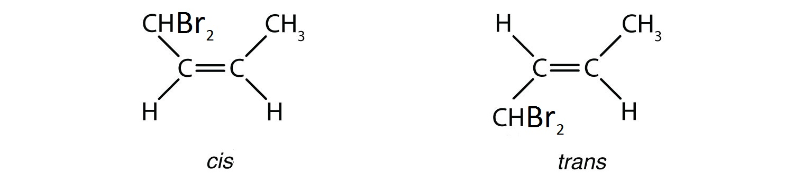

* These increase LDL cholesterol and are carcinogens.

## Phospholipids
* Similar to a triglyceride (1 glycerol, 3 fatty acids) except one of the fatty acids is replaced with a ~~phosphate group~~.  
  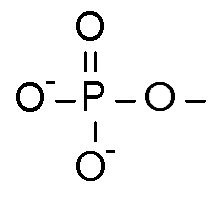

* One of the two fatty acids is often ~~unsaturated~~, creating a bend in the chain.
* Phospholipids are ~~**amphipathic**~~, meaning there is the presence of both ~~hydrophillic (phosphate)~~ and ~~hydrophobic (fatty acids)~~ groups.
  * This gives it ~~**detergent** properties~~.
* The shape is due to the hydrophillic group trying to get as ~~far away as possible~~ from the hydrophobic groups.

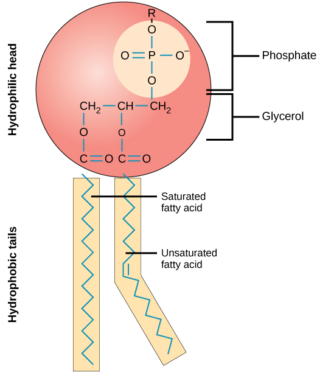

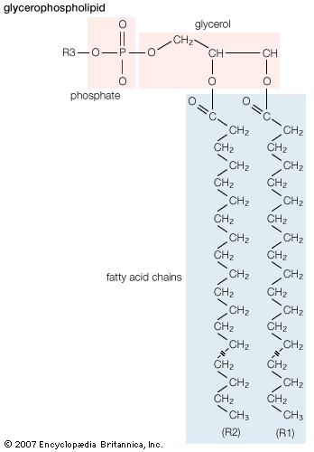

* On their own, they form ~~Micelles~~, due to the van der Waals forces between the hydrophobic groups, and the avoidance of hydrophillic and hydrophobic groups.  
  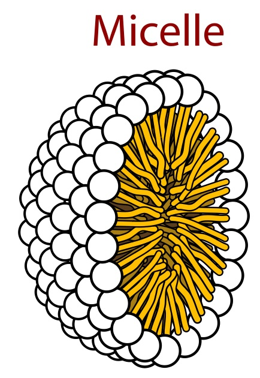

* They can act as wetting agents -- substances that reduce the surface tension of water.

## Waxes
* Similar to triglycerides, but instead of glycerol, it is a ~~long-chain alcohol~~ with a ~~single hydroxyl group~~.
* Hydrophobic, water-repelling properties
* Great for water conservation (e.g. cuticles of plants are waxy)
* Harder and more hydrophobic than fats.

## Steroids
* Structure is ~~4 hexagons and 1 pentagon~~.  
  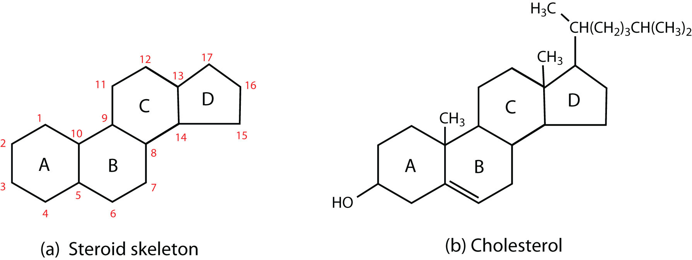

* Differences in steroids are based on their ~~side chains~~.
* Steroids with a hydroxyl group are called ~~sterols~~.
* ~~**Lanolin**/Lanosterol~~ is a greasy substance in our own ~~skin and hair~~, making them ~~flexible~~.

### Lipoproteins
* There are two kinds of ~~**cholesterol**~~
  * ~~**Low Density Lipoprotein**~~, aka. LDL or bad cholesterol, is very ~~light and sticky~~, allowing it to often ~~clog arteries~~.
  * ~~**High Density Lipoprotein**~~, aka. HDL or good cholesterol, used in many things.
    * Major part of cell membranes
    * Helps form bile acids for digestion
    * ~~Converts into Vitamin D when exposed to UV Light~~.
    * Fats need to be ~~**emulsified** -- mechanically digested, broken up~~ before they will mix with water. Bile salts help to this.

### Anabolic Steroids
* Similar to testosterone, they promote ~~increased muscle mass and growth~~.
* Large doses can cause...
  * Impotence
  * Baldness
  * Urination problems
  * Smaller testicles
  * Facial hair in women
  * Violent temper
  * Liver tumours
  * High blood pressure
  * Heart attacks

## Test
### Translucence Test
Place the substance on brown tissue paper.

| Test | Description |
| :--: | :---------: |
| Negative (no lipids) | Paper remains opaque. |
| Positive (lipids) | Paper becomes translucent. |

### Sudan IV Test
Sudan IV's solution within a lipid turns red.

### `CHEM` Iodine Number

* Iodine can determine the number of C=C double bonds.
* One mole of I2 can break one mole of C=C double bond, making them single bonds.
* Iodine is a purple-brown colour, but said colour disappears in unsaturated fat.

#### Iodine Index
* The number of grams of iodine that reacts with 100 g of unsaturated fat.

#### Example
0.010 mol of linoleic acid reacts with 5.1 g of iodine. Determine the number of double bonds present.

* Molar mass of I2 = $253.80894\textrm{ g}\cdot\textrm{mol}^-1$

$5.1\textrm{ g} \times \dfrac{1\textrm{ mol}}{253.80894\textrm{ g}} = 0.020\textrm{ mol}$

* Therefore, 0.010 mol of linoleic acid reacts with 0.020 mol of I2
* The ratio is 1:2, so linoleic acid has 2 double bonds.

# Proteins
* Proteins are macromolecules comprised of one more more polypeptide bonds. They are ~~polymers of amino acids~~.
* They are made up of $\textrm{C}$, $\textrm{H}$, $\textrm{O}$, $\textrm{N}$, and uniquely, ~~$\textrm{S}$~~.

## Amino Acids
### Structure
* Amino acids ~~differ~~ from each other by their ~~radical group~~. (R Group)
* There are ~~20 different primary amino acids~~. (and 2 secondary, i.e. derivatives)

* Central/alpha carbon bonded to...
  * A hydrogen
  * An amino group ($\textrm{NH}_2$), on the left, aka. ~~**N Terminus**~~
  * A carboxyl group ($\textrm{COOH}$), on the right, aka. ~~**C Terminus**~~
  * A radical group (20-22 different kinds)

#### `CHEM` Location Characterization
The location of the animo group in an amino acid relative to the alpha carbon can be specified in the name.

* $\alpha$: Amino group on alpha carbon.
* $\beta$: Amino group 1 carbon after alpha carbon.
* $\gamma$: Amino group 2 carbons after alpha carbon.

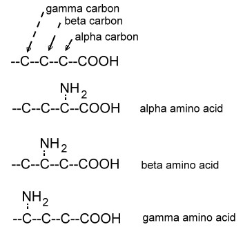

All amino acids ~~in proteins~~ are ~~alpha amino acids~~.

### Polypeptides
* They are formed when the ~~hydroxyl in the carboxyl group~~ of one amino acid is linked via enzymatic dehydration synthesis to the ~~hydrogen in the amino group~~ of another amino acid.
* This is referred to as a ~~**peptide bond**~~.
* Two monomers together form a ~~**dipeptide**~~, and many form a ~~**polypeptide**~~.

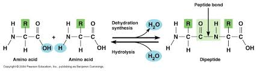

### `CHEM` Optical Isomers
All amino acids--except for glycine--have a ~~chiral carbon atom~~.  
A ~~**chiral carbon atom**~~ is a carbon bonded to four other things.

This property allows them to have ~~**optical isomers**~~, which are ~~**mirrored or rotated**~~ amino acids.

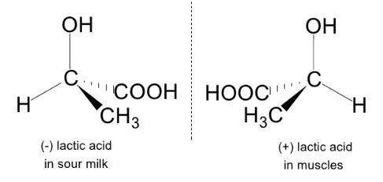

### `CHEM` Amino Acid pH
Amino acids can be characterized as either acidic, basic, or neutral.  
This all depends on the ~~number of amino groups versus carboxyl groups~~.

* ~~Carboxyl Group = Acidic~~
* ~~Amino Group = Basic~~

If there are equal amounts, the amino acid is neutral. Otherwise, whichever there is more of.  

#### Example
> Glutamic acid has two carboxyl groups but only one amino group. Therefore, it is an acidic amino acid.

### Zwitterion
* Amino acids are ~~**amphoteric**~~, meaning they can behave as ~~both an acid or base~~.
  * This is because they have both a ~~proton doner~~ and ~~proton acceptor~~ group.
  * The carboxyl group ~~gives off a proton~~ to have a ~~negative charge~~, and this gives it ~~acidic properties~~.
  * The amino group ~~takes in a proton~~ to have a ~~positive charge~~, and this gives it ~~basic properties~~.
* In low pH, amino acids behave like cations.
* In high pH, amino acids behave like anions.
* In neutral pH solutions, amino acids yield ~~**zwitterions**~~.
  * This is when the carboxyl group gives a proton to the amino group.

#### `CHEM` Isoelectric Point
* Radical groups can be neutral, acidic, or basic.
* The isoelectric point (Pi) is the pH at which the charges of an entire amino acid are ~~net zero. (balanced)~~

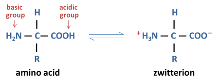

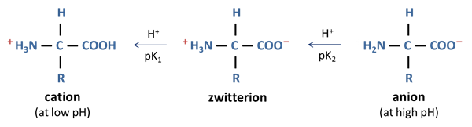

### Radical Group
* There are 20 different radical groups for the 20 different amino acids.
  * **8** of them are ~~nonpolar, uncharged~~ amino acids.
    * Mainly hydrocarbons.
    * Don't tend to form ~~hydrogen bonds or ionize~~.
    * ~~Hydrophobic~~, so they ~~cluster in water conditions~~.
  * **7** of them are ~~polar, uncharged~~ amino acids.
    * Form ~~hydrogen bonds with water~~, so they are ~~hydrophillic~~.
    * ~~Do not ionize~~.
    * ~~Cysteine~~ contains a ~~**sulfhydryl (-SH) group**~~, which can react with another cysteine's sulfhydryl group to form a ~~**disulfide linkage**~~.  
      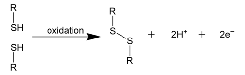
  * **5** of them ~~ionize in water~~, and therefore have a ~~positive or negative charge~~.

### `CHEM` Essential Amino Acids
20 amino acids make up a protein, and 10 of them can be synthesized by the human body.  
The other 10 must be ~~acquired from food~~. These are essential amino acids.

#### Complete Protein
* Contain all 10 essential amino acids
* From animal sources and beans

#### Incomplete Protein
* Lack 1+ essential amino acids
* From most vegetables

## Protein Organization

### Primary Structure
Involves peptide bonds.

Polypeptide has amino acids arranged in a ~~linear, straight chain~~.

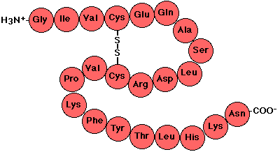

### Secondary Structure
Involves peptide bonds and hydrogen bonds.

#### Right-handed Alpha Helix Structure
Weak ~~**hydrogen bonds**~~ form ~~within itself~~.  
The ~~double bonded oxygen~~ in the carboxyl group of one amino acid ~~bonds~~ to the ~~hydrogen~~ in the amino group of another amino acid.

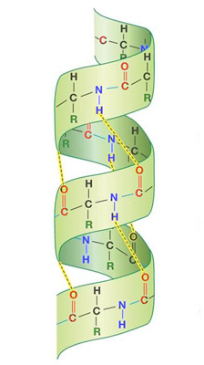

#### Beta Pleated Sheet
Weak ~~**hydrogen bonds**~~ form ~~within itself, but between adjacent strands~~.  
The polypeptide forms a zigzag structure.

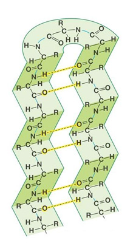

### Tertiary Structure
Involves peptide bonds, hydrogen bonds, and interactions between radical groups.

This structure creates a ~~globular shape~~ as the protein folds seemingly randomly.  
There are 4 forces that cause folding.
* ~~**Hydrogen Bonds**~~ between -OH and N- groups.
* ~~**Ionic Bonds**~~ between radical groups of opposing net charges. (e.g. between -NH2 and -COOH groups)
* ~~**Hydrophobic Interactions**~~ between nonpolar amino acids ~~bundling up into close and tight clusters~~ when exposed to water conditions.
* ~~**Covalent Bonds**~~ between two Cysteine amino acids to form ~~disulfide bridges~~.

### Quaternary Structure
Involves peptide bonds, hydrogen bonds, and interactions between radica groups... many times between different polypeptide chains.

This structure involves ~~interactions between different polypeptide chains~~.

> IB Example...  
  Hemoglobin  
  Contains 4 polypeptides: two alpha chains, and two beta chains.  

Proteins form ~~very specific shapes~~, and this shape is key to their ~~function~~.

~~**Denaturation**~~ is when bonds are ~~temporarily disrupted~~, ~~changing their shape~~ and therefore their ~~function~~.  
~~**Coagulation**~~ is when bonds are ~~permanently disrupted~~.

The following can denature and coagulate a protein.
* Heat
* UV Radiation
* Strong pH (high and low)

The following only denature a protein.
* Cold
* Urea

### Sickle Cell Anemia
A small change can make a massive change in a protein's structure and function.  
In sickle cell anemia, a hemoglobin's glutamic acid is replaced by a valine.

## Protein Types

### Simple Proteins
~~Only amino acids~~ and 1+ polypeptide bonds.

### Conjugated Proteins
* Have a ~~prosthetic group~~ -- a ~~covalently bonded~~ additional part
* Usually bonded to ~~amino acid side groups~~ or some other part of the polypeptide
* e.g.
  * glycoproteins (prosthesis = a carbohydrate)
  * chromoproteins (prosthesis = a pigment)
    * Hemoglobin is a chromoprotein, each subunit contains a heme group, which can hold an iron atom
  * lipoproteins (proosthesis = something fat soluable)

### Binding Proteins
* Any kind of protein -- doesn't have to be an enzyme or structural -- that have special shapes to bind to other things.
* e.g.
  * hemoglobin binds to oxygen and carbon dioxide
  * antibodies
  * cell to cell recognition

### Structural Proteins
* Maintains physical form of organisms
* Can be intracellular, e.g.
  * Keratin: Forms hair, outer layer of skin, claws, nails, horns, antlers, scales
* Can be extracellular
  * Collagen: In tendons, ligaments, and muscle coverings
  * Elastin: Gives elasticity to connective tissue

## `CHEM` Amino Acid Identification Experiments
[Click here.](/chem/35ib/unit1)

## Test
The ~~**Biuret reagent**~~ is used to test for proteins.  

| Test | Colour |
| :--: | :----: |
| Negative | Light Blue |
| Positive | Purple |

# IB Nucleic Acids
!> TODO Never LOL I ain't paid enough for this!

# Enzymes
## Laws of Thermodynamics
### 1st
Energy can only be ~~transferred~~, not created or destroyed.

### 2nd
~~Entropy~~ is randomness, disorder, lack of organization.

Energy transfer leads to entropy, as in conversion of some energy into ~~unusable forms~~ such as heat. Rule of ten.

Life requires a constant input of energy to maintain ~~enthalpy~~ -- order.

### Gibbs Free Energy ($\Delta G$)
When bonds are broken in chemical reactions.

IB Glucose releases ~~$-686 \textrm{Kcal/mol}$~~ of free energy.
IB ATP releases ~~$-7.3 \textrm{Kcal/mol}$~~ of free energy.

Free energy is negative as it represents the amout of free energy that the ~~reactants have lost~~.

## Exergonic
Energy out reactions, aka exothermic.  
When the ~~products have less~~ free energy than the reactants, Gibbs free energy is ~~negative~~.  
Exergonic reactions are often ~~coupled~~ with endergonic reactions to ~~drive them~~.

## Endergonic
Energy in reactions, aka endothermic.  
When the ~~products have more~~ free energy than the reactants, Gibbs free energy is ~~positive~~.  
This is only possible by getting ~~energy from sources beside the reactants~~. (e.g. sunlight energy in photosynthesis)

## Chemical Reactions
### Reverse Reactions
* Some reactions can alternate back and forth between reactants and products.  
* Molecules oscillate in place, they have ~~kinetic energy~~.
  * Product molecules can end up colliding, transfering their ~~kinetic energy into forming new bonds~~, and reforming as the reactants.

### Direction
* Reactions usually occur in the normal direction, left to right.
  * As long as the ~~reactants $\Delta G$ exceeds the products~~.
* Near the end of reactions, $\Delta G$ of reactants = $\Delta G$ of products.
  * Therefore there is no net direction.
  * Therefore the ~~concentration of reactants and products~~ remains ~~constant~~.
  * This is equilibrium.

* In strong exergonic reactions: ~~Most~~ of the reactants ~~form products before equilibrium~~.
* In weak exergonic reactions: More of the reactants are ~~left at equilibrium~~>
* In strong endergonic reactions: There is a rich energy source, like sunlight, so ~~most~~ of the reactants ~~form products before equilibrium~~.
* In weak endergonic reactions: There is little energy to drive the reaction. ~~Equilibrium is reached~~ with ~~little product formed~~.

* [Good video](https://youtu.be/CGJjjm7-DJ4?t=124)

## Energy of Activation
* The ~~energy~~ input needed to ~~initiate~~ a chemical reaction.
* You need enough ~~energy to break the bonds~~ of the reactants to form products.
* The energy spark to disrupt the ~~first molecules, which release enough energy~~ to start the cascade of reactions.

## Catalysts
Substances that greater ~~reduce the energy of activation~~.

## Enzymes
~~**Enzymes**~~ are biological catalysts, and they are all proteins.  
~~**Substrates**~~ are the substance that an enzyme acts on.

### Characteristics
* All are proteins (large, globular, tertiary or quaternary structures)
* Reacts with a specific substrate
* Do not require high heat (w/o an enzyme would)
* Help reactants reach equillibrium faster (but can't change it)
* Do not change free energy of reaction
* Reusable -- they are unchanged by reactions.

### Cofactors
* e.g. vitamins, minerals
* Some enzymes require cofactors to properly function.
* May be bonded to enzyme permanently in the allosteric site, or loosely bound to substrate.
* Help ~~ensure proper enzyme shape~~.
* Organic cofactors, e.g. vitamins, are called ~~coenzymes~~.
  * Excess coenzymes may be harmful. (e.g. vitamin D)

### Enzyme Function
* Shape is key to enzyme function
* ~~**Active Site**~~: The area that is ~~specific for the substrate~~, and is where it goes to go through the reaction.
* ~~**Enzyme-Substrate Complex**~~: The complex formed when the ~~enzyme and substrate join briefly~~.
  * This is done via ~~**induced-fit**~~: the substrate enters the active site, and the enzyme ~~slightly changes~~ its shape to create a ~~closer bond~~.
    * `CHEM` Amino acid R-Groups in the enzyme are brought closer to the substrate, which lowers activation energy by...
      * Physically stressing substrate to break bonds.
      * Sometimes changes pH.
      * Can even temporarily covalently bond to substrate.
  * The reaction is performed, products are produced, and the enzyme releases them.

### Factors Influencing Rate of Enzyme Action
#### Substrate Concentration
* As substrate concentration increases, chances of colliding with an enzyme increases, therefore ~~rate of reaction increases~~ until ~~enzyme saturation~~.
* ~~**Enzyme Saturation**~~ is when ~~all active sites are being used~~.
  * Reaction rate is then determined by the rate of each individual reaction.
  * Additional substrate without accompanying enzymes does not affect the reaction rate at enzyme saturation.

#### pH
* Each enzyme has an ideal pH, ~~usually near neutral~~.
* Deviations from this pH ~~gradually reduce reaction rate~~.
* Specific pH may encourage ionization of amino acid groups to cause better enzyme-substrate complexing.
* Extreme pH's may ~~denature the enzyme~~.

#### Temperature
* ~~Every $+10^\circ\textrm{C}$ doubles reaction rates~~ in anything. (not exclusive to enzymes)
* Reaction rate ~~gradually increases~~ as the temperature ~~approaches the enzyme's ideal~~, but ~~quickly drops off~~ above the ideal.
  * This is because extreme temperatures can ~~denature the enzyme~~.

### `CHEM` Graphing
In enzyme graphs...
* x: Concentration of substrate
* y: Rate of enzymatic reaction

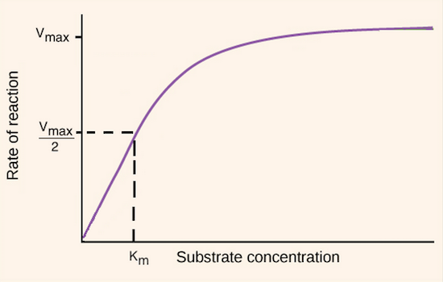

#### Maximum Velocity
Maximum velocity, denoted as ~~**Vmax**~~, is the ~~max rate of enzymatic reactions~~. This is also known as enzyme saturation.  
It varies from one enzyme to another, such as based on temperature and pH.

#### Michaelis Constant
Michaelis' constant, denoted as ~~**Km**~~, is the ~~concentration when the rate is half of Vmax~~.  
In other words, x when y is half of Vmax.

#### Meaning
* **Affinity**: the tendency of a substance to react with another to form a chemical compound.
* Enzymes with a ~~low Km~~...
  * Have ~~high affinity~~ to substance
  * Less unused enzymes. Good!
* Enzymes with a ~~high Km~~...
  * Have ~~low affinity~~ to substance
  * More unused enzymes. Bad!

### Enzyme Inhibiting Mechanisms
#### Competitive Inhibition
* Substrate ~~look-a-likes block active sites~~.
* Prevent substrate binding.
* `CHEM` ~~**Same Vmax, lower Km**~~

#### Noncompetitive Inhibition
* Substance binds to enzyme in ~~allosteric region~~.
* This ~~changes the enzyme's shape~~.
  * New shape doesn't fit substrate, can't function.
* `CHEM` ~~**Lower Vmax, same Km**~~

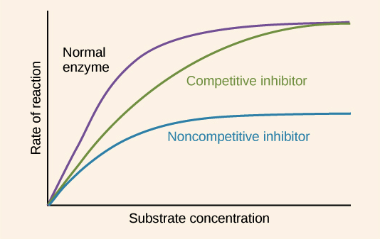

### Metabolic Pathways
* Sequences of chemical reactions.
  * e.g. Product of 1st reaction is reactant of 2nd reaction, and so on.
* Enzymes regulate each step.

* ~~**Allosteric Enzymes**~~ are often first in metabolic pathways
  * Have an allosteric space that can switch the enzyme between active and inactive.

#### Activating Modulators
* Bind to allosteric sites to make ~~active site more receptive~~.
* Sometimes they are even a ~~substrate~~.
* Also called inducers.

* ~~**Precursor Activity**~~ is when the ~~last enzyme~~ in a metabolic pathway is ~~only activated~~ when there is an ~~accumulation of the initial substrate~~.

#### Inhibitory Modulators
* Bind to allosteric sites to make ~~active site less receptive~~.
* Sometimes they are even a ~~product~~.
* Also called inhibitors.

* ~~**Negative Feedback Inhibition**~~ is when the end product of a metabolic pathway, when in ~~excess, fills the allosteric site of the first enzyme~~.
  * This acts as an inhibitor to the entire pathway.

# `CHEM` Vitamins
[Click here.](/chem/35ib/unit1)

# `CHEM` Environental Biochemistry
[Click here.](/chem/35ib/unit1)
