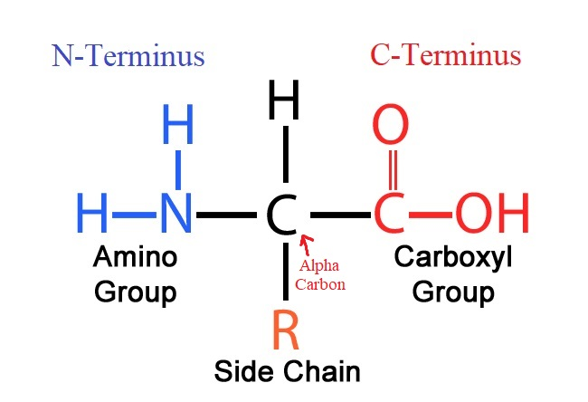

# IB Biochemistry

!> These notes are not finished and are subject to change.

---

# Review and More

## CHNOPS
99% of all living matter.  

### Carbon, Hydrogen, Oxygen
* Backbone for many hydrocarbon compounds.
* Form fatty acids.

### Nitrogen
* Very stable and tough to break apart in gas form
* Nitrogen fixation to take in

### Phosphorus
* Always combines with oxygen to form phosphates
* Phosphate groups form when phosphates bind to large organics
* Organic phosphate in hydrocarbons, inorganic phosphate elsewhere
* Found in phospholipids

### Sulfur
* Used in disulfide linkages

### Water
* Most chemical reactions occur in water
* Most living things are 50% - 90% water
* Salts dissociate into ions when dissolved in water, as water forms hydration shells -- water layers loosely bind to ions

| Term | Description |
| :--: | :---------: |
| Hydrophillic | likes water (can form hydrogen bonds, eg. ions) |
| Hydrophobic | dislikes water (can't form hydrogen bonds, eg. non-polar molecules, like fats |
| Detergents | have both a polar and non-polar end |
| Adhesion | attraction between 2 different substances |
| Cohesion | attraction between 2 similar substances |
| Capillary Action | adhesion of water to glass, cohesion of water to water |
| Imbibition | movement of water into porous substances |

The molar ~~concentration of protons in pure water~~ = $1 \times 10^{-7}$ = ~~pH 7~~  
Acids have a ~~higher~~ proton concentration ~~than water~~, bases have ~~lower~~.

Hydrogen bonds are not strong, just ~~very plentiful~~.

### Miscellaneous

| Molecule | Significance |
| :------: | :----------: |
| Iodine ($\textrm{I}_2$) | thyroxine: makes metabolism faster |
| Iron ($\textrm{Fe}$) | in hemoglobin, red blood cells, carries oxygen |
| Calcium ($\textrm{Ca}^{2+}$) | used in bones, teeth, blood clots, neuron transmissions |
| Magnesium ($\textrm{Mg}^{2+}$) Zinc ($\textrm{Zn}^{2+}$) | aid enzyme function, catalyze self |
| Sodium ($\textrm{Na}^+$) Potassium ($\textrm{K}^+$ | Sodium and potassium pump, resets nerves |

## Functional Groups
| Group | Formula |
| :--: | :-----: |
| Hydroxyl | $\textrm{R}-\textrm{OH}$ |
| Amino | $\textrm{R}-\textrm{N}_2$ |
| Carboxyl | $\textrm{R}-\textrm{COOH}$ |
| Methyl | $\textrm{R}-\textrm{CH}_4$ |
| Aldehyde | $\textrm{R}-\textrm{COH}$ |
| Ketone | $\textrm{R}-\textrm{CO}-\textrm{R}$ |
| Sulfhydryl | $\textrm{R}-\textrm{SH}$ |
| Phosphate | $\textrm{R}-\textrm{H}_2\textrm{PO}_4$ |

# Biochemistry
**Macromolecules**: ~~Large polymers~~  
**Polymers**: ~~Large molecules~~ composed of similar or identical ~~subunits~~ called ~~**monomers**~~.

~~Protoplasm~~ describes anything ~~within a cell membrane~~.  
Protoplasm are composed of ~~carbohydrates, proteins, and lipids...~~  
IB as well as minerals, vitamins, water, and nucleic acids.

# Carbohydrates
<h1>
$\textrm{C}_n\textrm{H}_{2n}\textrm{O}_n$
</h1>

A compound with every carbon having an $\textrm{H}_2\textrm{O}$ molecule.  
Produced by photosynthesis, major source of energy, and precursor to other substances such as lipids and proteins.

## Monosaccharides
Simplest, single sugar, ~~monomers/subunits for carbs~~.

Usually ~~5-6 carbons~~, can be less.
* ~~**pentoses** = 5 carbon monosaccharide~~
* ~~**hexoses** = 6 carbon monosaccharide~~

Most common hexoses are ~~fructose, glucose, and galactose~~.  
They are all isomers, formula being $\textrm{C}_6\textrm{H}_{12}\textrm{O}_6$, with different structural arrangements.

Most of the carbons in a monosaccharide have a ~~hydroxyl group and a hydrogen side group~~.

Glucose and fructose occur in both ~~straight chain~~ and ~~ring form~~.

Glucose contains an ~~aldehyde group~~ -- carbonyl on a ~~terminal~~ carbon.  
Fructose contains a ~~ketone group~~ -- carbonyl ~~within~~ the chain.

## Disaccharides
### Enzymatic Dehydration Synthesis
Two monosaccharides combine via ~~IB **enzymatic dehydration synthesis**~~, also called ~~condensation reactions~~, to form ~~dehydration linkages~~.

This is when a ~~hydroxyl from one molecule~~ and a ~~hydrogen from another~~ are ~~removed to form water~~, leaving only the ~~oxygen binding the two molecules~~ together.  
This process ~~requires energy~~, i.e. ATP.

* -OH   HO-
* -O~~H  HO~~-
* -O- & H2O

The opposite of this, i.e. breaking bonds by inserting water, is called ~~**hydrolysis**~~ or ~~hydrolytic cleavage~~. It is used during digestion.

In the context of carbohydrates, this is called a ~~**glycosidic linkage**~~. It is a ~~covalent bond~~.

### Common Disaccharides
| Product | Recipe | Enzyme | Linkage |
| :-----: | :----: | :----: | :-----: |
| **Sucrose** | glucose + fructose | sucrase | 1-2 alpha glycosidic linkage |
| **Maltose** | glucose + glucose | maltase | 1-4 alpha glycosidic linkage |
| **Lactose** | glucose + galactose | lactase | 1-4 beta glycosidic linkage |

### Linkages
#### Sucrose
Sucrose has a ~~1-2 alpha glycosidic linkage~~ occur.  
This means the #1 C of glucose and the #2 C of fructose are condensated and bind.

#### Maltose
Maltose has a ~~1-4 alpha glycosidic linkage~~ occur.  
The #1 C of glucose and #4 C of another glucose are involved.

#### Lactose
Lactose has a ~~1-4 beta glycosidic linkage occur~~.  
The beta means the one of the sugars must be ~~flipped upsidedown~~ in order to have the hydroxyl groups interact.

### General Formula
$\textrm{C}_6\textrm{H}_{12}\textrm{O}_6 + \textrm{C}_6\textrm{H}_{12}\textrm{O}_6 - \textrm{H}_2\textrm{O} \longrightarrow \textrm{C}_{12}\textrm{H}_{22}\textrm{O}_{11}$

## Polysaccharides
Many units of monosaccharides. Not readily soluble in water. Only occur in ring form.

There are two types.

### Storage Carbohydrates (Starch)
#### Amylose
* Produced by plants
* 1-4 alpha glycosidic linkages
* No branches
* Primary structure, but forms secondary structure in water via hydrogen bonding

#### Amylopectin
* Produced by plants
* 1-4 alpha glycosidic linkages
* Branches formed by 1-6 alpha glycosidic linkages every 30 glucoses.
  * Said branch is also 30 glucoses long.
* Primary structure, unknown secondary structure

#### Glycogen
* Produced by animals
* 1-4 alpha glycosidic linkages
* Branches formed by 1-6 alpha glycosidic linkages every 10 glucoses.
* Storage form of sugar in liver and muscle. Can turn into fats.

### Structural Carbohydrates
#### Cellulose
* Produced by plants, used in plant cell walls, strong and flexible
* 1-4 beta glycosidic linkages
  * Unlike alpha glucose, which has hydroxyl groups on both sides on the same level, a beta glucose has the hydroxyl in different levels.  
  
  * This means in order to perform enzymatic dehydration synthesis, every second glucose must be flipped upside down.  
  

* No branches
* Primary structure only
* Humans lack ~~cellulase~~, the enzyme that digests cellulose
  * Cows have this enzyme, so they can eat grass
* Each cellulose attracts 60-70 others
  * They form hydrogen bonds with each other
  * This causes the formation of ~~microfibrils~~, and in larger strands, ~~fibrils~~, which help form plant cell walls

#### IB Chitin
* Main part of ~~insect exoskeletons~~ and ~~fungus cell walls~~.
* Flexible and leathery
* When impregnated with calcium, becomes hard (its why bugs crunch)
* Instead of glucose, monomer is ~~N-acetylglucosamine~~
* Similar structure to cellulose, but contains an ~~amine group~~ on the 2nd carbon, with an ~~acetyl group~~ bonded to the nitrogen in the amine

(This is the acetyl group, if you didn't know)  

#### Hemicellulose
* Unrelated to cellulose
* Contains polymers of less common 5 C sugars
* ~~Cellulose fibrils~~ are embedded in ~~hemicellulose's gluey matrix~~
* You don't need to know the structure

#### Pectin
* ~~Cellulose fibrils~~ are also embedded in ~~pectin's gluey matrix~~

#### Proteoglycans
* Contain acid mucopolysaccharides complexed with protein, whatever that means
* Form eye jelly, and occur in cartilage, tendons, skin, and joint fluids
* Heparin, which inhibits blood clotting, belongs to this group

## Test
The ~~**Benedict's Test**~~ is used to test for carbohydrates.

| Reducing Sugar % | Colour of Solution |
| :-: | :-: |
| Negative (No carbs) | Blue-ish |
| 0.5% - 1.0% | Green |
| 1.0% - 1.5% | Yellow |
| 1.5% - 2.0% | Orange |
| 2.0%+ | Red |

# Lipids
* Generally nonpolar -- insoluable in water, i.e. ~~**hydrophobic**~~.
* Greasy, oily, soluble in fat.
* Dissolve in organic solvents
* Once glycogen stores in the body are filled, ~~excess carbs~~ are stored as ~~fat~~.
* Important for cell membranes, insulation against physical damage and temperature, carriers for vitamin A, D, E, and K, raw materials for hormone synthesis, etc...

* A ~~**glycerol**~~ is an alcohol with ~~3 hydroxyl side groups~~.
* A ~~**fatty acids**~~ is a carbon chain, usually with an ~~even number of carbons~~, and a ~~carboxyl group at the end~~.

## Triglycerides
* All fats and oils are ~~**triglycerides**~~.
* This means they are comprised of ~~1 glycerol~~ connected to ~~3 fatty acids~~ via enzymatic dehydration synthesis.
  * Since enzymatic dehydration synthesis bonds each fatty acid to the glycerol, ~~three H2O~~ must be removed from the glycerol's hydroxyl group and the fatty acid's hydroxyl in its carboxyl group.
* The bond formed is called an ~~**ester linkage**~~ (fundementally no different from a glycosidic linkage)

* Most fatty acids are insoluable in water, but ~~alkaline (basic) solutions~~ cause the ~~carboxyl group~~ to become ~~ionized~~, polar, and thus ~~soluable~~.
* ~~Sodium and potassium~~ salts of fatty acids are called ~~"soaps,"~~ and are water soluable.
* ~~Calcium~~ salts of fatty acids are not water soluable, and also cause ~~bath tub rings~~.

## Animal Fats
* Triglycerides from ~~animals~~ are called ~~fats~~.
  * Butter, lard, tallow.
* ~~Solid~~ at room temperature.
* ~~Saturated~~.
  * ~~All possible hydrogen positions are filled~~.
  * To do this, they only contain ~~single **C-C** bonds~~.

## Plant Fats
* Triglycerides from ~~plants~~ are called ~~oils~~.
* ~~Unsaturated~~.
  * All possible hydrogen positions are ~~not filled~~.
  * This is because they contain ~~one or more **C-C** double bonds~~.
    * This double bonds creates a ~~kink~~ in the structure of the lipid, meaning they ~~can't pack as closely together~~, and therefore are often ~~liquid~~.
  * ~~**Monounsaturated**~~ has one C-C double bond, and ~~**polyunsaturated**~~ has many.

## Phospholipids
* Similar to a triglyceride (1 glycerol, 3 fatty acids) except one of the fatty acids is replaced with a ~~phosphate group~~.  
  

* One of the two fatty acids is often ~~unsaturated~~, creating a bend in the chain.
* Phospholipids are ~~**amphipathic**~~, meaning there is the presence of both ~~hydrophillic (phosphate)~~ and ~~hydrophobic (fatty acids)~~ groups.
  * This gives it ~~**detergent** properties~~.
* The shape is due to the hydrophillic group trying to get as ~~far away as possible~~ from the hydrophobic groups.

* On their own, they form ~~Micelles~~, due to the van der Waals forces between the hydrophobic groups, and the avoidance of hydrophillic and hydrophobic groups.  
  

* They can act as wetting agents -- substances that reduce the surface tension of water.

## Waxes
* Similar to triglycerides, but instead of glycerol, it is a ~~long-chain alcohol~~ with a ~~single hydroxyl group~~.
* Hydrophobic, water-repelling properties
* Great for water conservation (e.g. cuticles of plants are waxy)
* Harder and more hydrophobic than fats.

## Steroids
* Structure is ~~4 hexagons and 1 pentagon~~.  
  

* Differences in steroids are based on their ~~side chains~~.
* Steroids with a hydroxyl group are called ~~sterols~~.
* ~~**Lanolin**/Lanosterol~~ is a greasy substance in our own ~~skin and hair~~, making them ~~flexible~~.
* There are two kinds of ~~**cholesterol**~~
  * ~~**Low Density Lipoprotein**~~, aka. LDL or bad cholesterol, is very ~~light and sticky~~, allowing it to often ~~clog arteries~~.
  * ~~**High Density Lipoprotein**~~, aka. HDL or good cholesterol, used in many things.
    * Major part of cell membranes
    * Helps form bile acids for digestion
    * ~~Converts into Vitamin D when exposed to UV Light~~.
    * Fats need to be ~~**emulsified** -- mechanically digested, broken up~~ before they will mix with water. Bile salts help to this.

## Test
### Translucence Test
Place the substance on brown tissue paper.

| Test | Description |
| :--: | :---------: |
| Negative (no lipids) | Paper remains opaque. |
| Positive (lipids) | Paper becomes translucent. |

### Sudan IV Test
Sudan IV's solution within a lipid turns red.

# Proteins
* Proteins are macromolecules comprised of one more more polypeptide bonds. They are ~~polymers of amino acids~~.
* They are made up of $\textrm{C}$, $\textrm{H}$, $\textrm{O}$, $\textrm{N}$, and uniquely, ~~$\textrm{S}$~~.

## Amino Acids
* Amino acids ~~differ~~ from each other by their ~~radical group~~. (R Group)
* There are ~~20 different primary amino acids~~. (and 2 secondary, i.e. derivatives)

* Central/alpha carbon bonded to...
  * A hydrogen
  * An amino group ($\textrm{NH}_2$), on the left, aka. ~~**N Terminus**~~
  * A carboxyl group ($\textrm{COOH}$), on the right, aka. ~~**C Terminus**~~
  * A radical group (20-22 different kinds)

### Polypeptides
* They are formed when the ~~hydroxyl in the carboxyl group~~ of one amino acid is linked via enzymatic dehydration synthesis to the ~~hydrogen in the amino group~~ of another amino acid.
* This is referred to as a ~~**peptide bond**~~.

### Zwitterion
* Amino acids readily ionize ~~within cells~~, ~~in water~~, and ~~extra cellular fluid~~ -- fluid not found in cells.
  * The carboxyl group ~~gives off a proton~~ to have a ~~negative charge~~, and this gives it ~~acidic properties~~.
  * The amino group ~~takes in a proton~~ to have a ~~positive charge~~, and this gives it ~~basic properties~~.
* In this state, the amino acid has both a positive and negative charge, and this is called a ~~**Zwitterion**~~.
  * In neutral pH solutions, amino acids yield zwitterions.
  * In low pH, they behave like cations.
  * In high pH, they behave like anions.

### Radical Group
* There are 20 different radical groups for the 20 different amino acids.
  * **8** of them are ~~nonpolar, uncharged~~ amino acids.
    * Mainly hydrocarbons.
    * Don't tend to form ~~hydrogen bonds or ionize~~.
    * ~~Hydrophobic~~, so they ~~cluster in water conditions~~.
  * **7** of them are ~~polar, uncharged~~ amino acids.
    * Form ~~hydrogen bonds with water~~, so they are ~~hydrophillic~~.
    * ~~Do not ionize~~.
    * ~~Cysteine~~ contains a ~~**sulfhydryl (-SH) group**~~, which can react with another cysteine's sulfhydryl group to form a ~~**disulfide linkage**~~.  
      
  * **5** of them ~~ionize in water~~, and therefore have a ~~positive or negative charge~~.

## Protein Organization

### Primary Structure
Involves peptide bonds.

Polypeptide has amino acids arranged in a ~~linear, straight chain~~.

### Secondary Structure
Involves peptide bonds and hydrogen bonds.

#### Right-handed Alpha Helix Structure
Weak ~~hydrogen bonds~~ form ~~within itself~~.  
The ~~double bonded oxygen~~ in the carboxyl group of one amino acid ~~bonds~~ to the ~~hydrogen~~ in the amino group of another amino acid.

#### Beta Pleated Sheet
Weak ~~hydrogen bonds~~ form ~~within itself, but between adjacent strands~~.  
The polypeptide forms a zigzag structure.

### Tertiary Structure
Involves peptide bonds, hydrogen bonds, and interactions between radical groups.

This structure creates a ~~globular shape~~ as the protein folds seemingly randomly.  
There are 4 forces that cause folding.
* ~~**Hydrogen Bonds**~~ between -OH and N- groups.
* ~~**Ionic Attractions**~~ between radical groups of opposing net charges.
* ~~**Hydrophobic Interactions**~~ between nonpolar amino acids ~~bundling up into close and tight clusters~~ when exposed to water conditions.
* ~~**Covalent Bonds**~~ between two Cysteine amino acids to form ~~disulfide bridges~~.

### Quaternary Structure
Involves peptide bonds, hydrogen bonds, and interactions between radica groups... many times between different polypeptide chains.

This structure involves ~~interactions between different polypeptide chains~~.

> IB Example...  
  Hemoglobin  
  Contains 4 polypeptides: two alpha chains, and two beta chains.  
  As well as 4 heme groups.

Proteins form ~~very specific shapes~~, and this shape is key to their ~~function~~.

~~**Denaturation**~~ is when bonds are ~~temporarily disrupted~~, ~~changing their shape~~ and therefore their ~~function~~.  
~~**Coagulation**~~ is when bonds are ~~permanently disrupted~~.

Heat, cold, strong acids, strong bases, urea, and other chemicals can cause denaturation or even coagulation.  
Cold and urea only cause denaturation.

## Protein Types

### Simple Proteins
.

### Conjugated Proteins
.

### Binding Proteins
.

### Structural Proteins
.

# IB Nucleic Acids
!> TODO Never
