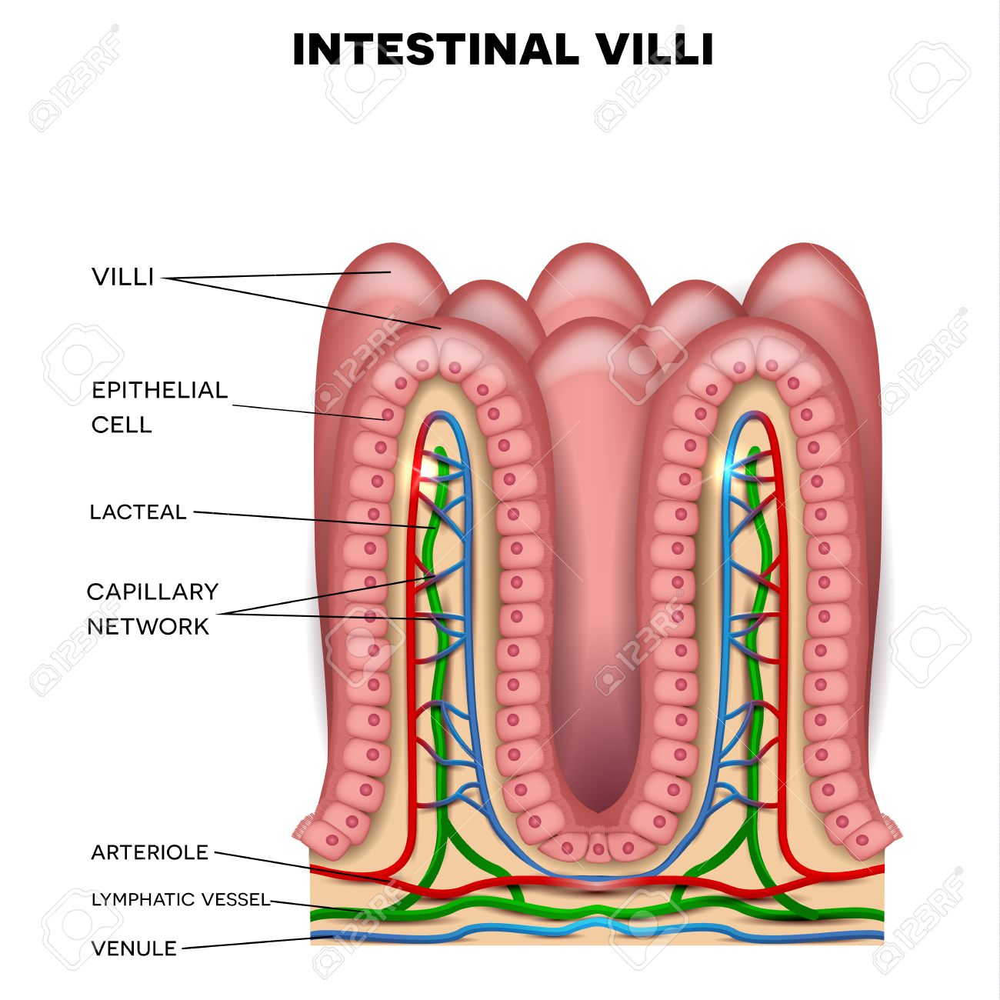
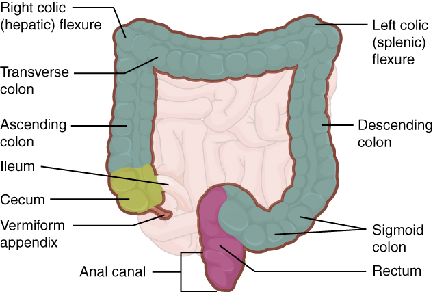

# Digestion

!> These notes are unfinished and subject to change.

---

# Terms
| Term | Definition |
| :--: | :--------: |
| Digestion | ~~mechanical and chemical breakdown~~ of food into smaller molecular components |
| Nutrition | process of obtaining and uses food for bodily processes |
| Absorption | movement of ~~monomer~~ components through the ~~gut wall into the bloodstream~~ |
| Sac-like Digestive System | Incomplete digestive system, ~~same opening for entrance & exit~~. e.g. sponges |
| Gastrovascular Cavity | A sac-like gut lined with enzyme secreting, phagocytic, and ciliated cells. Digestion starts extracellulary, then phagocytosis completes digestion intracellularly. e.g. cnidarians |
| Intracellular Digestion | Digestion inside the cell (endocytosis, phagocytosis) |
| Extracellular Digestion | Digestion outside the cell (most organisms, us) |
| Exocrine | Secretion outside the bloodstream |
| Endocrine | Secretion inside the bloodstream |

## Random Information Because Fischer
* Invertebrates are organisms with no backbone
* Deamination: removing amino group from protein
* Urea formation: detoxifies amino acids
* Sharks don't chew, they trash and tear, jaws move in one plane
* Fish and amphibians don't chew, they absorb
* Reptiles have Jacobson's organ on the roof of their mouth, detects odors
* Birds have bills of keratin, rather than teeth
* Mammals start with milk teeth, replaced by permanent teeth
  * Incisors (front teeth gnaw and cut)
  * Canines (fangs that capture and kill)
  * Premolars/molars (grinding, large/flat in herbivores)

* In mammals, the ~~length of the intestine~~ is related to the diet. ~~Meat is easy to digest~~, so carnivores have shorter intestines than herbivores.
* ~~Protozoans~~ break down ~~cellulose~~.

# Human Digestion
* Diffusion is inefficient for complex multicellular organisms
* ~~Gastrointestinal Tract~~ (G.I.) gets nutrients in the body.
  * In order to get to cells, food must be first digested, absorbed, and transported.

* The structures necessary for digestion include mouth, esophagus, stomach, small intestine, large intestine, and anus.
* ~~Accessory Structures~~ aid in digestion, but food never enters them. These include salivary glands, liver, gall bladder, and pancreas.

## Anatomy
### Ingestion
Taking in nutrients.

* Mouth
  * `ACCESSORY` Salivary Glands
* Pharynx
* Esophagus
* Cardiac Sphincter (aka. LES, lower esophageal sphincter)

### Digestion
Breaking down complex organics into monomers.

* Stomach
  * `ACCESSORY` Gastric Glands -> Chief Cells + Parietal Cells
* Pyloric Sphincter
  * `ACCESSORY` Liver -> Gallblader -> Bile

### Absorption
Transporting nutrients into the blood or lymph--similar to blood--for delivery to somatic cells--non-reproductive cells.

* Small Intestine
  * Deodenum
  * Jejunum
  * Ilium
* Ileocecal Valve/Sphincter
* Large Intestine (Colon)
  * Cecum
  * Ascending
  * Transverse
  * Descending
  * Sigmoid Colon

### Egestion
Removal of undigested material from body. Includes excretion, removal of used material, like heat.

* Rectum
* Anal Sphincter

# Helpful Patterns 

| Pattern | Meaning |
| :------ | :------ |
| Hepatic | Liver |
| `-one` | Hormone |
| `-ase` | Enzyme |
| `-gen` | Inactive Enzyme |

# Gastrointestinal Tract

## Mouth
### pH
~$7$

### Mechanical Digestion
Teeth chewing (mastrication) food into smaller pieces.

### Chemical Digestion
~~Salivary glands~~ release saliva.  
Saliva...
* moisten and lubricate food
* break down ~~starch into maltose~~, as it contains *enzyme* ~~salivary amylase~~

### Tongue
* moves food into position
* rolls food into a ball
  * this ball is called ~~**bolus**~~
* pushes food to the ~~pharynx~~
  * the pharynx is where the nose and mouth come together at the back of the throat

### Swallowing
* ~~Soft palate~~ rises up, closing nasopharynx.
* ~~Epiglottis~~ lowers, closing off trachea.
  * If the epiglottis doesn't properly close, and bolus gets inside the trachea, you begin to ~~choke~~.
* Bolus travels down ~~esophagus~~ via ~~**peristalsis**~~
  * Peristalsis is a wave-like movement of muscle to move food through the G.I. tract. It is not influenced by gravity.

## Esophagus
* Upper part contains skeletal (voluntary muscle)
* Rest contain smooth (involuntary) muscle
* Swallowing starts as a conscious act, but soon becomes automatic

### Lower Esophagus Tissue Organization

Similar to rest of the G.I. tract. From inside to outside.
1. **Mucosa**  
   Epithelial/exposed internally cells, secretes mnucus
2. **Submucosa**  
   Connective tissue. Blood and lymphatic vessels, nerves, and glands.
3. **Muscularis**  
   Smooth muscle, inner circular layer (causes wringing motion) and longitudinal layer (causes shortening motion)
4. **Serosa**  
   Fibrous outer coat

### Cardiac Sphincter
* Also called lower esophageal sphincer, LES.
* Ring of muscle that controls entry into the stomach.

## Stomach
* Temporary storage area
* Initiates protein digestion
* ~~Heart burn~~ occurs when stomach fluids reflux back into the esophagus

### Mechanical Digestion
* have folds called ~~rugae~~, increase surface area, help grind
* wringing of circular layer
* shortening of longitudinal layer
* additionally, twising of diagonal muscle layer

### Chemical Digestion
#### Hormones
* The Vagus nerve or ~~bolus hitting the stomach~~ releases the ~~**gastrin**~~ hormone.
  * Stimulates the release of ~~gastric juices~~ from gastric glands
  * Lining/mucosa of stomach has gastric glands, which release ~~chief cells and parietal cells~~.
    * **Parietal Cells**: Contains $\textrm{HCl}$, creates an ~~acidic pH~~ (1-3)
    * **Chief Cells**: Contains ~~pepsinogen~~, which is activated into ~~active pepsin~~ in the aforementioned pH.
    * Therefore, main function of hydrochloric acid ($\textrm{HCl}$) is not digestion, but activating pepsin. (also destroys invading microbes)

#### Enzymes
* ~~**Pepsin**~~ is a protease, so it breaks up ~~proteins into peptides~~.
  * A peptide is 2+ amino acids.

Other glands also excrete enzymes.

* ~~**Rennin**~~ breaks casein, a protein found in milk, into ~~insoluble curds~~.
  * More functional in alkaline/neutral environments, like ~~infants~~.

* ~~**Gastric Lipase**~~ splits ~~triglycerides into fatty acids and glycerol~~.

### Uclers
* The stomach lining is coated to protect itself with things like...
  * mucin, an insoluble mucoprotein
  * ~~mucus~~
  * the fact that enzymes are ~~secreted in inactive form~~
* If the ~~stomach lining is broken~~ and the ~~stomach gets digested~~, an ~~**ucler**~~ is formed, and can bleed.

### Pyloric Sphincter
* Ring of muscle that controls entry from the stomach into the small intestine.
* After food has been in the stomach for a while, and now well mixed and broken down, bolus becomes ~~**chyme**~~, and passes through this sphincter.

## Small Intestine
* Comprised of three regions...
  * ~~Duodenum~~
  * ~~Jujunum~~
  * ~~Ileum~~
* ~~Most digestion and all absorption~~ happens here.

### Villus

* Lined with ~~intestinal **villi**~~
  * Greatly increase surface area.
  * Comprised of mucosa, ~~capillary bed~~ and ~~lacteal~~.
    * Both take in nutrients into the ~~circulatory and lymphatic system~~ respectively.
    * (Lymphatic system carries a clear liquid called lymph around the body)
  * Move vigorously to mix food and enzymes and aid absorption
  * In a continuous state of replacement

### Digestion
#### Carbohydrates
* Carbohydrates are broken down into ~~monosaccharides~~
  * using enzymes from the mouth, pancreas, and intestinal lining
* Absorbed via ~~active transport~~ into the capillaries of the villi
* Bloodstream to ~~liver for storage~~

#### Triglycerides (Lipids)
* Triglycerides are broken down into ~~fatty acids~~, ~~glycerol~~, and some ~~monoglycerides~~.
  * using gastric lipase, bile, and pancreatic lipase
* Carried in droplets formed by bile called ~~micelles~~
* Absorbed across lipid soluble core of plasma membrane of intestinal epithelial cells via ~~endocytosis~~
* Once inside, ~~reassembled into triglycerides~~
* Gather into ~~chylomicrons~~ (along with cholesterol)
  * minute bodies enclosed in a thin protein envelope
* This enters the ~~lacteals~~, and are transported via ~~lymph vessels~~ to the circulatory system.

#### Proteins
* Proteins are broken down into ~~single amino acids~~.
  * using enzymes from stomach, pancreas, and intestinal lining
* Absorbed via ~~active transport~~ into the capillaries of the villi
* Excess to ~~liver~~

#### Nucleic Acids
* ~~Exonucleases~~ cleave off end nucleotides
* ~~Endonucleases~~ cleave bonds within the molecule
* ~~Nuclease~~ digests into sugar, phosphates, and bases
* Absorbed via ~~active transport~~ into the capillaries of the villi

## Hormones
### Enterogastron
* Triggered by ~~fats or acids in small intestine~~
* ~~Inhibits gastric juice release~~ in stomach
* ~~Slows~~ down stomach ~~contractions~~
* ~~Turns off stomach if bolus in intestine already~~.

### Secretin
* Triggered by ~~peptides, fats, or $\textrm{HCl}$ in small intestine~~.
* Stimulates release of ~~sodium bicarbonate~~
  * Basic, neutralizes acid environment of pancreas and small intestine
  * Very important to prevent ~~enzyme denaturing~~
  * Pancreatic and small intestine enzymes need a ~~pH of 7-8~~

### Cholecystrokinin-pancreozymin
* Abbreviated to CCK
* Triggered by ~~food/chyme in small intestine~~.
* Stimulates ~~release of pancreatic enzymes~~ and ~~contraction of the gall bladder~~.

## Additional Info about Duodenum
* ~~Chyme~~ arrives here from the stomach
* ~~Enzymes~~ from the ~~pancreas~~ ~~empty here~~
* ~~Bile~~ from the ~~gallbladder and liver~~ ~~empty here~~, to emulsify fats
  * Bile and pancreatic ~~ducts fuse~~ to form a ~~common opening into the duodenum~~

## Intestinal Enzymes In Lining

| Enzyme | Function |
| :----- | :------- |
| **Aminopeptidase** | Cleave at N-terminal bonds, breaks proteins into ~~polymers and dinomers~~ |
| **Dipeptidase** | Breaks proteins into ~~monomers~~ |
| **Nuclease** | Breaks nucleotides into sugar, base, and phosphate |
| **Maltase** | Breaks maltose into two glucose |
| **Sucrase** | Breaks sucrose into glucose and fructose |
| **Lactase** | Breaks lactose into glucose and galactose |

## Accessory Organs

### Liver
* Main function is to produce ~~**bile**~~
  * Slightly alkaline
  * ~~**Emulsifies**~~ fat
    * ~~Mechanical digestion~~
    * Physically breaks up into small droplets
* Bile enters small intestine (duodenum) via ~~common bile duct~~ 
* Bile consists of...
  * Cholesterol
  * Bile salts (a steroid, aids in lipid absorption)
  * Bile pigments (products of hemoglobin destruction, ~~colours our feces~~)
  * Water
  * Modifies amino acids
* Bile passes through cystic duct into the gallbladder

#### Gallblader
* ~~**Gallblader**~~ is a green sac that ~~stores and concentrates bile~~ for release into the duodenum
* Bile release is triggered by ~~cholecystokinin-pancreozymin~~ hormone, which ~~contracts the gallbladder~~
* Gallstones...
  * hard masses of mainly cholesterol
  * can form if gallbladder is inflamed or cholesterol levels are high
  * can obstruct gall blader entrance (cystic duct) or bile duct

#### Hepatic/Liver Portal System
* ~~Hepatic vein~~ carries nutrients from ~~intestinal cappillaries into liver capillaries~~
* The liver...
  * removes toxic substances (convert into ~~less toxic~~ ones)
  * ~~store~~ nutrients in ~~excess~~ (glucose -> glycogen)
  * ~~release~~ nutrients from storage if in ~~short supply~~

#### Conditions
* Hepatitis: Inflammation of the liver
* Cirrhosis: Chronic inflammation of the liver
  * due to growth of non-functioning fibrous tissue
  * caused by liver disease or alcoholism

#### Miscellaneous Functionality
* ~~Deamination~~ of amino acids
  * N-terminus is removed and converted into ~~urea~~
  * Remaining molecule is safe, just a carb
  * Urea is urinated out, excess amino acids removed
* ~~Destruction of dead red blood cells~~
* Formation of plasma proteins
* Storage and distribution of Vitamins A, B12, and D
* Conversion of...
  * Carbs -> Fats
  * Fructose and Galactose -> Glucose
  * Excess glucose -> Glycogen
  * Glycogen -> Glucose when needed
* Regulation of blood glucose levels
* Formation of cholesterol
* Detoxification of alcohol

### Pancreas
* Produces ~~pancreatic juices/inactive enzymes~~
  * Releases into duodenum via common bile duct
  * *Exocrine*
* Produces ~~bicarbonate ions~~ ($\textrm{HCO}_3^-$) to ~~neutralize stomach acid~~
  * *Exocrine*
* Produces ~~insulin~~
  * ~~Islet of Langerhans cells~~ in the pancreas produce ~~hormone insulin~~
  * Insulin ~~promotes absorption and use of glucose by cells~~
  * Reduces blood glucose levels
  * *Endocrine*

#### Pancreatic Enzymes

| Enzyme | Function | Inactive Form | Activator |
| :----- | :------- | :------------ | :-------- |
| **Trypsin** | Breaks peptides into shorter peptides | **Typsinogen** | Enterokinase in small intestine |
| **Chymotrypsin** | Breaks peptides into shorter peptides | **Chymotrypsinogen** | Trypsin |
| **Carboxypeptidase** | Cleave at C-terminal bonds, breaks proteins into ~~polymers and dinomers~~ | **Procarboxypeptidase** | Chymotrypsin |
| **Ribonuclease** | Breaks RNA into nucleotides |
| **Deoxyribonuclease** | Breaks DNA into deoxynucleotides |
| **Alpha-glucosidase** | Breaks 1-6 linkages of amylopectin into starch fragments |
| **Pancreatic amylase** | Breaks starch into maltose |
| **Pancreatic lipase** | Breaks triglycerides into fatty acids, glycerol, and monoglycerides |

## Large Intestine

* aka. colon, bowel

### Ileocecal Valve
* Sphincter entrance into large intestine from small intestine's ileum
* Below this valve, blind pouch called ~~cecum~~
* Below cecum, ~~finger-like projection~~ calledd the ~~**appendix**~~
  * Heribvores store bacteria that break down cellulose in the appendix
  * ~~Vestigial~~ in humans, i.e. unused

### Main Functions
* Absorb water and minerals
  * Not enough water absorbed = diarrhea
  * Too much water absorbed = constipation
* Contain Escherichia coli (E. coli) and other methane producing bacteria
  * Helps prepare and feed on wastes
  * Produces Vitamin K, folic acid, and biotin
* Storage and elimination of feces (egestion)
  * Some excretion of water and heat

## Rectum
* holds waste until full, then empties
* rectal valves support weight of feces

## Anal
* Anal canal leads to anus
* Solid wastes exit through ~~anal sphincter~~
* Voluntary control

## Nervous Control
### Sympathetic Nerves
* Fight or Flight response
* Inhibits digestion
* Slows down secretion
* Slows down peristalsis

### Parasympathetic Nerves
* Relax response
* aka. Vagus nerve
* Stimulates secretion and peristalsis

# Trace The Path
This is almost guaranteed to be a question on any exam.

## What You Need To Know
* Structures of the G.I. Tract
* Digestion Type (mechanical or chemical)
* Hormones
  * Which
  * Where
  * Purpose
* Enzymes
  * Which
  * Where
  * Purpose
* What happens if something stops functioning (when did we learn this?)
* pH

## The Path

| Structure | Digestion Type | Enzymes | Hormones |
| :-------: | :------------: | :-----: | :------: |
| Mouth | <u>**Mechanical**</u> Teeth <u>**Chemical**</u> Salivary Amylase | Salivary amylase, made in salivary glands. Breaks down starch into maltose. |
| Pharynx | <u>**Chemical**</u> Continues... | Coninues... |
| Esophagus | <u>**Chemical**</u> Continues... (Peristalsis begins, but doesn't digest anything) | Continues... |
| Cardiac Sphincter | <u>**Chemical**</u> Continues... | Continues... |
| Stomach | <u>**Mechanical**</u> Grinding w/ Rugae <u>**Chemical**</u> Pepsin, Gastric Amylase, Rennin | Pepsin Gastric Lipase Rennin | Gastrin |
| Pyloric Sphincter | <u>**Chemical**</u> Continues... | Continues... |
| Small Intestine | <u>**Mechanical**</u> Bile from the liver emulsifies fat <u>**Chemical**</u> All intestinal and pancreatic enzymes | <u>**In intestinal lining**</u> maltase, sucrase, lactase, aminopeptidase, dipeptidase, nuclease <u>**Released by pancreas**</u> Pancreatic amylase, pancreatic lipase, trypsin, chymotrypsin, carboxypeptidase, ribonuclease, deoxyribonuclease, alpha-glucosidase | enterogastrone, secretin, cholecystokinin-pancreozymin (CCK) |
| Ileocecal Valve | Beyond this point, no digestion. Just absorption of water and minerals. |
| Large Intestine |
| Rectum | Storage of undigested material. |
| Anal Sphincter | Release of undigested material. |
