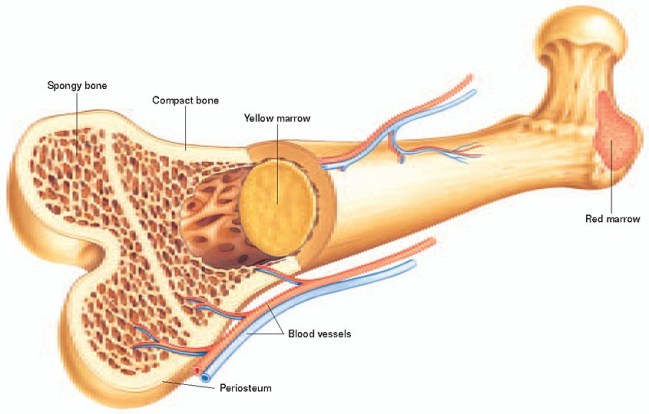
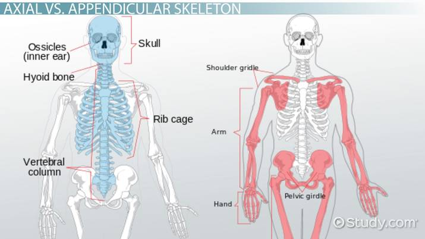
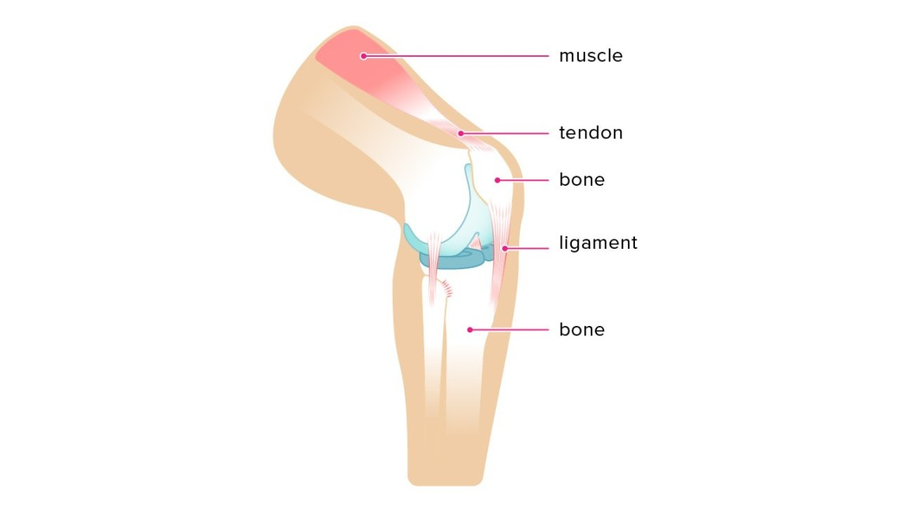
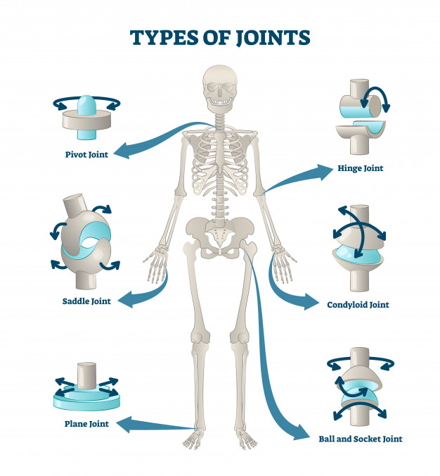
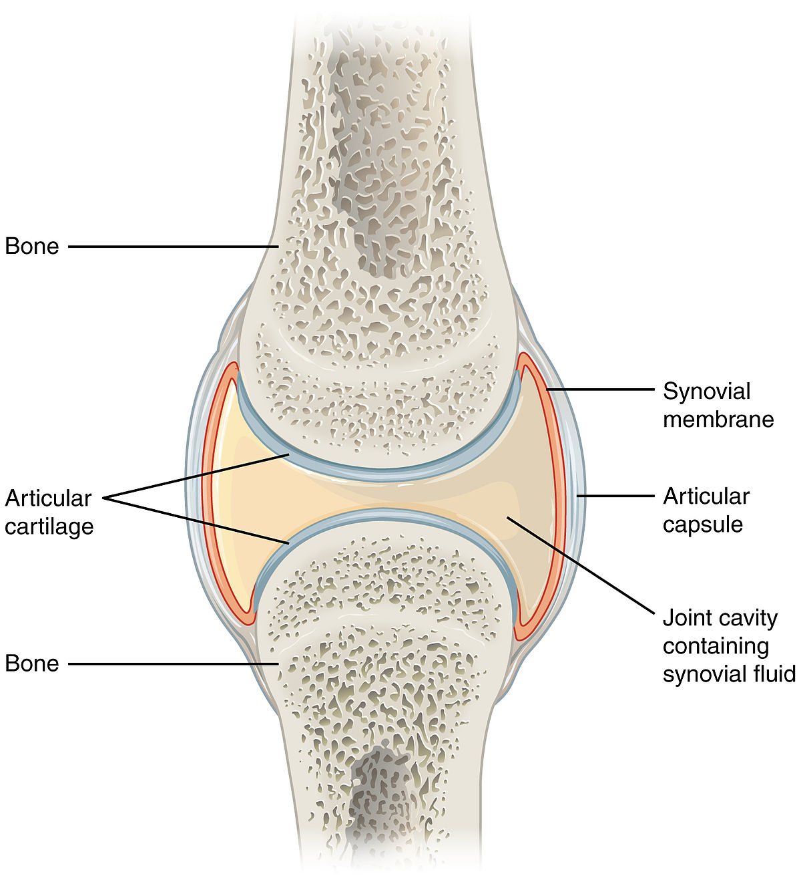
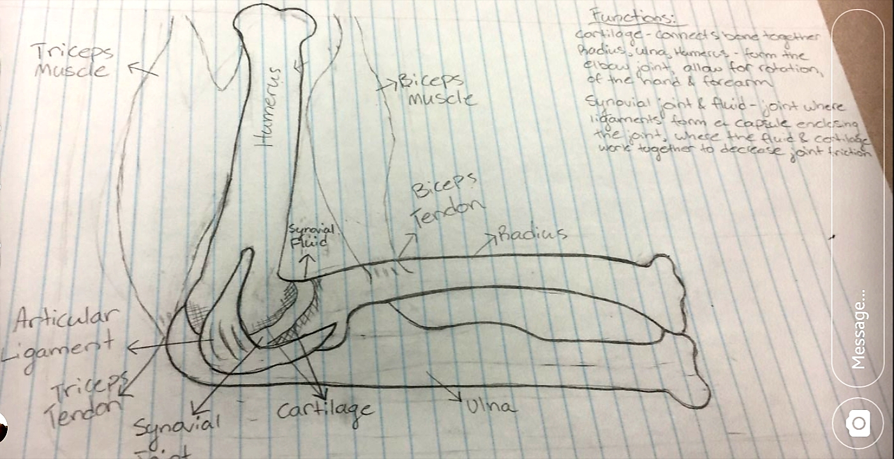

# Skeleton

---

# Suffix

The suffix ~~`-cyte`~~ means ~~cells~~.  
For instance, osterocytes are bone cells.

# Skeletons

**Hydrostatic Skeleton**  
Soft-bodied animals use ~~pressure in fluid~~ filled spaces as ~~support and movement~~.

IB Animal examples on page 1 of the notes. (Fischer Moment)

**Exoskeletons**  
Skeleton lies ~~outside soft tissue~~ for support and structure.  
Formed from ectoderm via epidermal cell secretions, like chitin.  
*e.g. arthropods (protostomes)*

**Endoskeletons**  
Skeleton lies ~~inside soft tissue~~ for support and structure.  
Formed from mesoderm via cartilage and bone cells.  
*e.g. echinoderms, deuterostomes (humans)*

# Tissue

~~Similarly specialized cells~~.

Four types form organs and organ systems...
* Epithelium (cover internal and external ~~surfaces~~)
* Connective Tissue (form endoskeleton)
* Muscle (for contraction)
* Nerve (carry signals)

## Epithelial Tissue

In ~~contact with fluids or air~~.

Arise from a ~~basement layer~~ beneath them.

### IB Types

* Simple Epithelium: Arranged in a single layer
* Stratified Epithelium: Arranged in many layers

* Squamous Epithelium: Flattened cells at surface
* Cuboidal Epithelium: Cube-like cells at surface
* Columnar Epithelium: Elongated cells at surface

## Connective Tissue
*e.g. bone, caritlage, ligaments, tendons, adipose, blood*

Holds ~~body together~~.

Secretes ~~connective tissue matrix noncellular material~~. 
*e.g.*
* *~~fibroblast cells~~ secrete ~~collagen~~: tough, lengthy ~~fibre of protein~~; ~~glue~~ that helps form cornea, tendons, ligaments, spinal disks, and nonmineral component of bone*
* *~~elastin~~ fibres have ~~memory~~. arteries need this to maintain blood pressure*

**Cartilage**  
Clear, glassy material composed of ~~chondrocytes~~ (cartilage cells) embedded in a ~~gel-like protein matrix~~ with a lot of ~~collagen fibres~~.  
~~Precursor to bone~~.  
~~Avascular~~. (lacks blood vessels)

**Bone**
~~Support and protection~~.  
Site of ~~muscle attachment~~.  
Marrow produces ~~red blood cells~~.  
~~Calcium storage~~.  
~~Vascular~~. (has blood vessels)

# Bone Structure

| Structure | Function |
| :-------- | :------- |
| **Periosteum** | Thin ~~membrane~~ of connective tissue |
| **Spongy Bone** | ~~Porous~~, sponge-like, very strong web-like structure filled with soft tissue. At the ~~end of long bones~~. Some contain red marrow, which produce red blood cells. |
| **Compact Bone** | Thick and dense. ~~Shaft~~ of the bone. Contains dense fatty yellow marrow. (red in kids, yellow in adults) Contains ~~active~~ bond cells, nerve cells, and blood vessels. Composed of ~~calcium phosphate~~ in a ~~collagen matrix~~. Repeated ~~Haversian canals~~ with blood vessels and nerves wit hsurrounding rings or lamellae of calcified bone. |

**Osteoblasts**  
Cells that lay down the ~~boney matrix~~.  
~~Divide to form osteocytes~~.

**Osteocytes**  
~~Bone cells~~.  
Found in tiny lacunae (cavities), connected to each other via tiny canals called canaliculi.

**Osteoclasts**  
Produced by ~~white blood cells~~.  
~~Destroy and reabsorb bone~~.

# Skeleton

**Axial Skeleton**  
Head, spine, rib cage, and sternum.

**Appendeicular Skeleton**  
Everything else not in axial skeleton. (Limbs, pelvic and pectoral girdles)

**Ligaments**  
Short bands of white fibres of collagen.  
Not very elastic, poor vascularity.  
Attaches bones together. (~~bone -> bone~~)

**Tendons**  
Short bands of white fibres of collagen.  
Attaches muscles to bond. (~~muscle -> bone~~)

## Joints

Site where ~~bones meet~~.

**Gliding Joint**  
Moves back and forth.  
*e.g. wrist*

**Pivotal Joint**  
Rotation in one plane.  
*e.g. head and neck*

**Ball-and-Socket Joint**  
Free rotation.  
*e.g. shoulder*

**Hinge Joint**  
Door hinge-like extension and flexion in one place.  
*e.g. knee*

**Synovial Joint**  

Ligaments form a ~~capsule~~ enclosing the joint.  
Fluid and smooth cartilage decrease joint ~~friction~~.

# Elbow Diagram
Memorize and be prepared to redraw this diagram and state the functions.  
(Thanks for this image, William Bandas)

