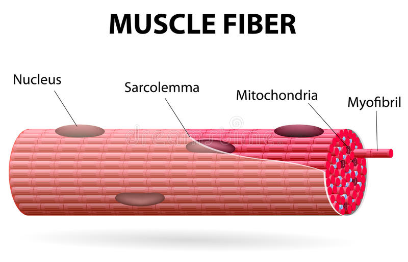
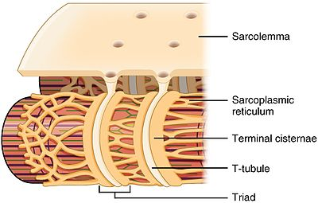
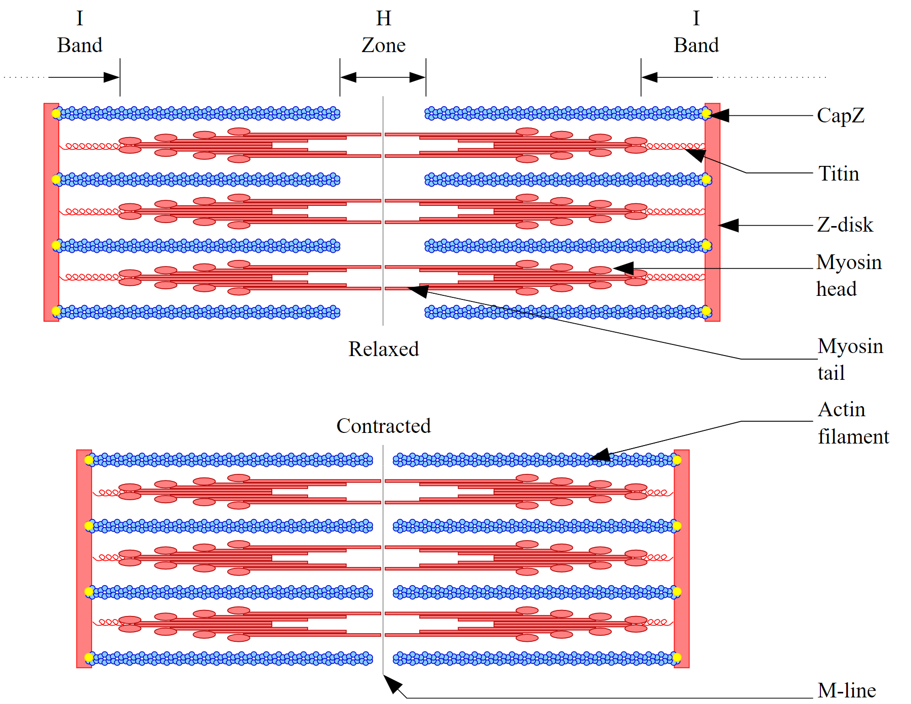

# Muscles

---

# Types of Muscle

## Skeletal Muscle
* ~~Voluntary~~ (concious control)
* ~~Striated~~ (striped, long, unbranching, cylindrical cells)
* ~~Multinucleate~~ cells (many nuclei and mitochondria per cell, an extensive endoplasmic reticulum)
* Can be ~~exhausted/tired~~
* 25%-40% of body weight
* Fibres bound in bundles called fascicles
  * Fascicles bind together to form muscles
  * Enclosed in fascia connective tissue, integrates with bone peristeum
* ~~Attached to bones by **tendons**~~. Movement occurs when contracting/extending.
* Work in ~~**antagonistic pairs**~~.
  * ~~**Agonists**~~ pull bones ~~towards the body~~
  * ~~**Antagonists**~~ pull bones ~~away from the body~~

**Flexor**  
Muscle that ~~contract to bend~~ a joint.  
*e.g. biceps*

**Extensor**  
Muscle that ~~contract to extend/straighten~~ a joint.  
*e.g. triceps*

**Origin**  
Place where muscle attaches to ~~stationary bone~~.

**Insertion**  
Place where muscle attaches to ~~moving bone~~.

## Cardiac Muscle
* ~~Involuntary~~ (controlled by autonomic nervous system)
* ~~Finely striated~~ 
* ~~One nucleus~~
* Only in the ~~heart~~
* Short, branching, interlocking (for communication) fibres
* ~~More mitochondria~~ than skeletal

## Smooth Muscle
* ~~Involuntary~~ (controlled by autonomic nervous system, specifically parasympathetic)
* ~~Nonstriated~~
* ~~One nucleus~~
* Found in ~~interior/visceral areas~~
  * *e.g. digestive tract, base of each hair, bladder, uterus, etc...*
* ~~Not attached~~ to the skeleton
* Capable of ~~slow, sustained contractions~~ (20 seconds)

# Muscle Contraction

**Muscle Unit**  
Each nerve cell that carries impulses to muscle fibres

* At rest, skeletal muscle fibre is positively charged on the exterior than the interior
  * This is maintained by active transport of sodium and potassium ions

There are two types of contraction.
* **Isotonic**  
  Whole muscle is shortened, antagonistic pairs, ~~movement is made~~
* **Isometric**  
  Muscles exert tension or pull, but no physical change, ~~no movement~~. (~~flexing~~)

**Muscle Atrophy**  
Gradual weakening of muscle.

## Energy
Muscles require ~~ATP~~ to maintain a contraction.  
This can be retreived from glycogen like anything else, but muscles will most likely use ~~creatine phosphate~~.
~~Creatine phosphate~~ is a more immediate and quick energy source.  

(If a test question asks what energy muscles use, while glycogen is technically correct, the answer is creatine phosphate)

## Full Contraction

**Action Potential** (AP)  
Amount of ~~impulse needed~~ to perform a muscle contraction.

**Tetanus**  
~~Full muscle contraction~~.

* Muscle contraction is an ~~all or nothing~~ event.
  * You can't just have flex a muscle.

* If a 2nd AP is recieved before the muscle fully relaxes from the first AP, the 2 AP's will be ~~combine~~ to produce a stronger contraction.

* A ~~strong stimulus~~ can ~~activate more~~ muscle fibres to contract

# Joint Movements by Muscles

**Flexion**  
Bending of a joint.  
Moves bones ~~towards each other~~.

**Extension**  
Extending of a joint.  
Moves bones ~~away from each other~~.

**Abduction**  
Movements ~~away~~ from the body ~~midline~~.  
*e.g. T-pose*

**Adduction**  
Movements ~~towards~~ the body ~~midline~~.  
*e.g. arms back to sides*

**Rotation**  
Turning action.

# Anatomy of Muscle Fibre

**Neuromuscular Junction**  
Nerve-muscle interface.  
Motor impulses are recieved by ~~sarcolemma~~ and ~~stimulate contraction~~.

**Fibres**  
~~Long slender cells~~ that muscles are composed of.  
Each one has ~~several nuclei~~.  
Wrapped in ~~sarcolemma~~.

**Sarcolemma**  
Plasma ~~membrane~~ of muscle fibre.  
Has ~~nuclei~~, ~~mitochondria~~, and ~~glycogen granules~~.  
Has ~~sarcoplasmic reticulum~~.  
Has larger transerves tubules (~~T-Tubules~~)

**Sarcoplasmic Reticulum**  
Similar to endoplasmic reticulum.
Stores and distributes ~~calcium ions~~.

**T-Tubules**  
Extension of sarcolemma membrane.  
Divides sarcoplasmic reticulums.  
Sends ~~impulses to sarcoplasmic reticulum~~ to ~~release calcium~~.

**Myofibrils**  
Contractile units of muscle fibre.  
Form ~~striped pattern~~ of striated muscle.  
Contain ~~sarcomere units~~.

**Sarcomere**
A contractile unit found between ~~Z disks~~, lines that ~~seperate each sarcomere~~ contractile unit.  
Contains ~~myofilaments actin and myosin~~.

**Actin**  
~~Thin myofilaments~~ responsible to contraction.  
These are the only myofilaments that ~~move during contraction~~.  
Made up of ~~actin, troponin, and tropomysin~~.

**Myosin**  
~~Thick myofilaments~~ responsible to contraction.  
Many ~~spirally wound rod like proteins~~.  
Each rod contains ~~ATPases at the end~~, allowing the use of ATP for formation and movement of myosin.

# Sliding Filament Theory

**I Band**  
Region with ~~actin only~~.  
~~No overlap with myosin~~.

**A Band**
Region with ~~actin and myosin overlap~~.  
Is the ~~length~~ of the ~~myosin filament~~.  
Contains ~~H zone~~ within.

**H Zone**  
Region with ~~myosin only~~ in the center.  
When muscle ~~contracts~~, ~~H zone shrinks~~ to neglible length.

## Sliding Filament Theory
The following is the sequence of events that occurs to stimulate a muscle contraction.

* A neuron releases a neurotransmittor in the neuromuscular junction
* Binds to a receptor
* Goes to sarcolemma
* Goes to sarcoplasm
* Goes to t-tubule
* Goes to sarcoplasmic reticulum, which holds calcium ions, and releases them
* Released calcium floods sarcomere, and enters sarcomeres
* Calcium ions ~~bind to troponin~~
  * Binding to troponin causes tropomyosin to change its shape
  * New shape ~~no longer blocks action-myosin binding sites~~
* Myosin heads bind to actin.
* ATP comes by and releases energy, causeing myosin heads to change shape.
* Shape changes causes myosin to drag along actin.
* Z disks ~~move together~~, ~~sarcomere shortens~~, ~~actin slides inward~~ past myosin.
* ATP provides energy to ~~restore myosin heads~~ so they can deattach/reattach and continue pulling.
* When the nerve impulse ends, calium ions are pumped back to the sarcoplasmic reticulum. Muscles relax.

# Muscle Types

## Slow Twitch Muscle
* Also known as ~~red muscle fibres~~
* Used for ~~prolonged contraction~~
  * *e.g. endurance running, endurance swimming, etc.*
* Require ~~oxygen~~ for fuel, and ~~never tire~~ unless there is a ~~lack of oxygen~~.

## Fast Twitch Muscle
* Also known as ~~white mucsle fibres~~
* Used for ~~quick, strong, but time limited contraction~~
  * *e.g. sprints*
* Have very little ~~myoglobin~~--hemoglobin for muscles--so operate in ~~anaerobic conditions~~.
