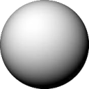
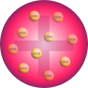
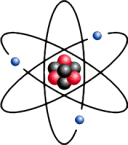
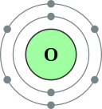
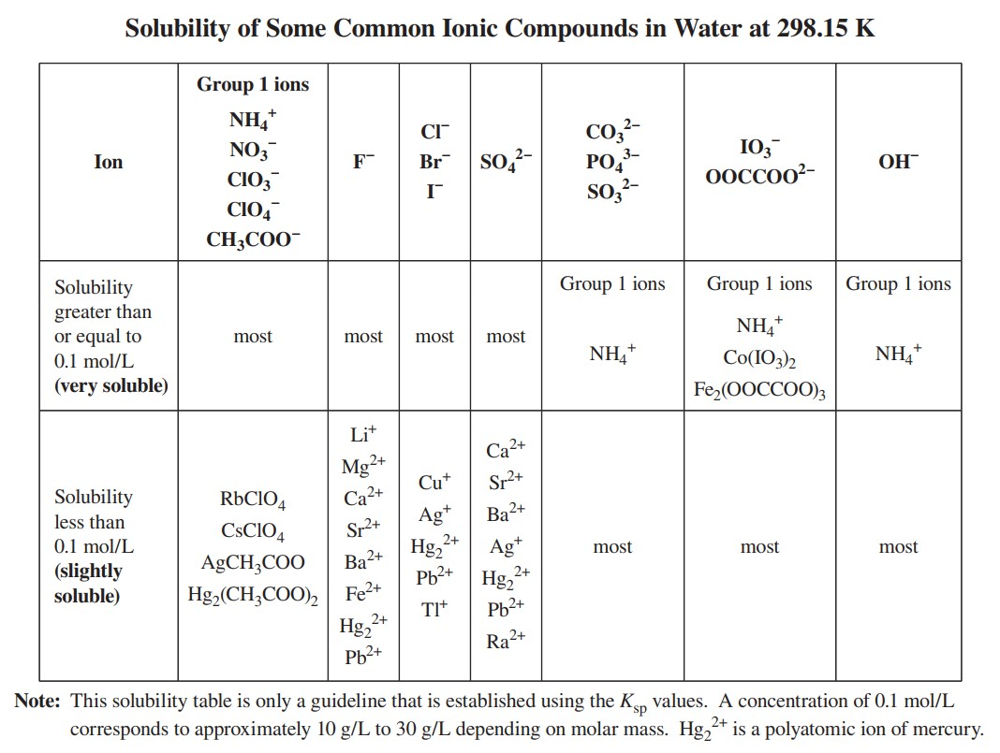
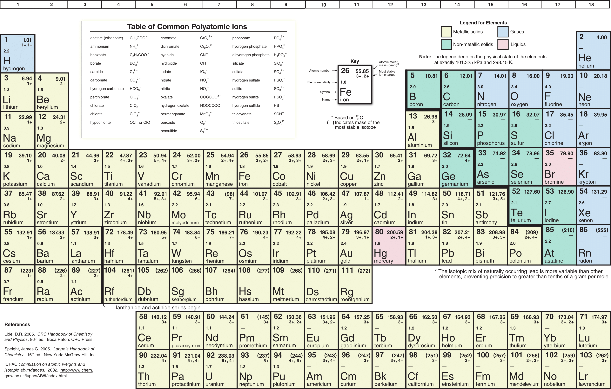
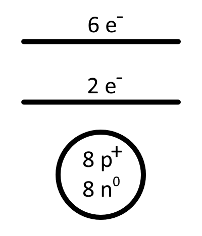

# Review of Chemistry 10 (and more...)

?> To be perfectly honest... these notes are kind of all over the place.  
They sample content from both the beginning of 20 IB and 35 IB, as both of those courses start pretty similarly.  
As the course continues and further notes are created, the distinction and organization will be much better.

---

# Scientific Knowledge
### Empirical Knowledge  
Knowledge gained through ~~observation~~.  
(*e.g. quantitative, as in measurements, or qualitative, as in descriptions using five senses*)

### Theoretial Knowledge
Knowledge that explains/describes observations of non-observables.  
(*e.g. you can't see an atom... if you can, speak with your doctor*)

# Significant Digits
I won't be going over the entirety of sig digs here, but here are some things that are new...

If you are only ~~adding or substracting~~ in an equation, your final answer should use the ~~lowest number~~ of ~~decimal places~~ in the question. (i.e. not sig digs)  
If you are ~~multiplying or dividing~~, (even if you also are adding or substracting) your final answer should use the ~~lowest siginificant digit~~.

# Models

| Model | Name | Description |
| :---: | :--: | ----------- |
|  | John Dalton *Billiard Ball* | All matter composed of ~~atoms~~—~~tiny, indivisible particles~~.   Atoms of ~~different elements~~ have ~~different sizes/shape/etc.~~ |
|  | J. J. Thomson *Plum Pudding* | ~~Positively charged sphere~~ with negatively charged ~~electrons embedded~~. |
|  | Ernest Rutherford *Nuclear* | Positively charged ~~nucleus surrounded by electrons~~. Proved this with ~~gold foil experiement~~. |
|  | Niel Bohr *Orbital* | Electrons are in specific ~~energy levels~~. |
|  | Modern Science *Quantum Mechanical* | Electrons occupy ~~orbitals~~—~~probability patterns of movement~~ of electrons around the nucleus. |

# Subatomic Particles
The nucleus is located at the centre of the atom.  
It contains protons ~~(positively charged)~~ and neutrons. ~~(neutral charge)~~

The ~~atomic number~~ is how many ~~protons or electrons~~ are in an atom.  
A ~~neutral~~ atom contains an ~~equal amount~~ of protons and electrons.  
Therefore, in neutral atoms the atomic number equals the quantity of both of these subatomic particles.

When an atom ~~loses~~ an electron, it becomes a ~~+1 charged ion~~. When an atom ~~gains~~ an electron, it becomes a ~~-1 charged ion~~.  
When calculating the ~~number of electrons in an ion~~, ~~subtract~~ the ~~charge~~ from the number of ~~protons~~.

~~Electrons determine chemical properties~~, and ~~mass determines physical properties~~ like density and boiling point. 

# Chemical Reactions
In chemical reactions, ~~only valence electrons are rearranged and shared~~.  
Valence electrons are electrons on the outermost shell of an atom.

The ~~arrangement and interactions~~ between electrons of an atom and its peers is the basis for chemical reactions.  
Electrons are attracted to the protons of other atoms, they meet and begin to exchange.  
There are two types of exchanges.
* **Ionic**: ~~Losing or gaining~~ electrons.
* **Covalent**: ~~Sharing~~ electrons. (aka. molecular)

~~Metal~~ atoms form ~~positive~~ charged ions, known as ~~cations~~.  
~~Non-metal~~ atoms form ~~negatively~~ charged ions, known as ~~anions~~.

# Ionic Compounds
## Identification
If a compound ~~starts with a metal or $NH^+_4$~~, that compound is ionic.  
The ionic compound starts with a metal/ammonium, and ends with a non-metal or anion.

## Formula
In ionic compounds, you must ~~balance ion charges~~.  
All ionic compounds are ~~solid~~ in room temperature.

### Examples
> sodium phosphide  
$Na^+$ and $P^{-3}$  
= $Na_3P_{(s)}$

> magnesium borate  
$Mg^{2+}$ and $BO^-3_3$  
= $Mg_3(BO_3)_{2 (s)}$

## Nomenclature (Naming)
1. Name the metal (or ammonium)
2. Name the non-metal/anion
	a. The anion name should end in `-ide`, unless it is a polyatomic.
There are ~~no prefixes~~, and there are no capitals unless it is the start of a sentence.

### Examples
> $NaCl$  
sodium chloride

> $SrCO_{3 (s)}$  
strontium carbonate

## Multivalent Metals
Multivalent metals are metals that have ~~more than one charge~~ listed on the periodic table.  
The top charge is the most common in nature.

Naming them is the same as ionic compounds, but state the ~~roman numeral of the charge~~ you're using after the element name.

### Examples
> $Cu^{2+}O^{-2}_{(s)}$  
copper (II) oxide

## Hydrates
Hydrates are ~~ionic compounds~~ with ~~water molecules trapped~~ between the compound's molecules.

The formula is just like an ionic compound, but at the end there is a ~~dot, number of water molecules, and $H_2O$~~.  
> $MgSO_4 \cdot 7H_2O_{(s)}$

The naming is just like an ionic compound, but at the end you state the ~~numerical prefix~~ (see molecular compounds) and the word ~~"hydrate."~~  
> magnesium sulfate heptahydrate

Alternatively, a less common but nearer naming method is below.
> magnesium sulfate-7-water

# Molecular Compounds

## Binary Molecular Compounds
### Identification
If a compound consists of ~~two non-metals~~, that compound is molecular.  

### Formula
Molecular compounds do not need to have balanced charged.
The state of a molecular compound varies, and is covered later in the bonding unit.

### Nomenclature
1. Name the first element (if there is only one, do not put a "mono" prefix)
2. Name the second element, ending in `-ide`.
3. Use prefixes on both names to specify quantities...
	a. `mono-`, `di-`, `tri-`, `tetra-`, `penta-`, `hexa-`, `hepta-`, `nona-`, `deca-`

## Hydrogen Compounds
### Identification
If a compound ~~starts with $H$~~ or ~~ends with $COOH$~~.  
Hydrogen compounds ~~form acids~~ when ~~aqueous~~; (dissolved in water) before that, they can be any state.
Hydrogen compounds are molecular, but you need to ~~balance charges~~ and ~~name them like ionic compounds~~.

### Nomenclature
1. Write "`hydrogen`".
2. Name the rest (anion) as if it were ionic. (end in `-ide`)

#### Examples
> $H_2S_{(g)}$  
  => hydrogen sulfide

> $CH_3COOH_{(l)}$  
  => hydrogen acetate

## Acids
### Identification
As stated before, acids are ~~hydrogen compounds dissolved in water~~, aka. aqueous.  
If a compound follows the hydrogen compound identification rules, and its aqueous, its an acid.

In addition, if a compound ~~ends in $OH$~~ and is ~~ionic~~, it is a ~~base~~.

### Nomenclature
The following is the most common, "classical" system.  
Basically just take the name of the hydrogen compound, and perform the following based on that.

#### Ends in `-ide`
If the name ends in `-ide`, take the anion root and put it in here.  
> hydro\_\_\_\_\_ic acid

For example, hydrogen chloride becomes hydrochloric acid.

#### Ends in `-ate`
If the name ends in `-ate`, take the anion root and put it in here.  
> \_\_\_\_\_ic acid

For example, hydrogen chlorate becomes chloric acid.

#### Ends in `-ite`
If the name ends in `-ite`, take the anion root and put it in here.
> \_\_\_\_\_ous acid

For example, hydrogen chlorite becomes chlorous acid.

The rarer, "modern" IUPAC system is basically just prepending "`aqueous`" to the hydrogen compound name.  
For example, hydrogen phosphate becomes aqueous hydrogen phosphate. Now if only everyone used that. >:(

# Multiatomic Elements
Some specific elements, when ~~by themselves~~, must be in specific quantities.

## Diatomic
The following are all the diatomic elements you need to memorize.

$Br_2$, $I_2$, $N_2$, $Cl_2$, $H_2$, $O_2$, $F_2$

## Multiatomic
The following are all the multiatomic elements you need to memorize.

$P_4$, $S_8$

# Solubility Table

The solubility table states a few (not all) solubility of different molecules.

## When
You should check the solubility of ~~every compound~~ if ~~water~~ is stated to be anywhere, or if ~~any compound is aqueous~~.

## Use
To check solubility, find the ~~anion in the headers~~.  
Then, look for where your cation is.

The rows will either be...
* ~~"(very soluble)"~~: Will dissolve in water, and become aqueous. (aq)
* ~~"(slighlty soluble)"~~: Will not dissolve in water, and will become solid. (as a precipitate, making the water cloudly as it will be suspended)

## Tips
"Group 1 Ions" means all the elements in group 1, alkali metals.

Multivalent elements ~~make a difference in solubility~~.

If something isn't on the table, ~~assume it does not dissolve~~ in water.

# Periodic Table Patterns

The periodic table is arranged horizontally in order of ~~increasing atomic number~~.

## Periods (aka. rows)
The ~~period number~~ represents the ~~number of energy levels~~ an atom has. (i.e. period 2 contains elements with 2 energy levels)

The ~~number of elements in a period~~ represents the ~~maximum capacity~~ an energy level has ~~ignoring the transition metals~~. (columns 3-12 inclusive)

## Groups (aka. columns)
### Valence Electrons
The ~~ones place of the column~~ number is ~~how many valence electrons~~ an element has.  
For instance, chlorine is on column #17, so it has 7 valence electrons.

### Non-metal charges
The elements on the righthand side of the periodic table have no charge displayed. You have to "memorize" their charges.  
(It just decreases as you move away from the nobel gasses)

| Column # | Charge |
| :------: | :----: |
| 18       | $0$    |
| 17       | $-1$   |
| 16       | $-2$   |
| 15       | $-3$   |

There are still elements missing charges beyond this ruling, but since it wasn't covered, let's assume its not our level yet. :)

### Chemical Properties
Elements in the same column have ~~similar chemical properties~~, and are assigned names because of this quality.

| Column # | Name | Reactivity |
| :------: | :--: | :--------: |
| **1** | Alkali Metals | ~~Most reactive metals~~. ~~Explode in water~~ |
| **2** | Alkali Earth Metals | ~~Pretty reactive~~ metals, less than alkali |
| **3-12** | Transition Metals | Don't follow any reactivity rules |
| **13-16** under staircase (yellow) | (Post) Transition Metals |
| **13-16** touching staircase (green) | Metalloids |
| **13-16** above staircase (blue) | Non-metals |
| **17** | Halogens | ~~Most reactive non-metals~~ |
| **18** | Noble Gasses | ~~Non-reactive~~, inert |

Due to the periodic table arrangement, with some exceptions...
* ~~non-metallic properties~~ increase as you go from ~~left to right~~.
* ~~metallic properties~~ increase as you go from ~~top to bottom~~.

By this logic, the ~~most metallic element is francium~~ and the ~~most non-metallic element is fluorine~~. (note, noble gasses don't react like non-metals, so they don't count)

# Diagrams
## Electron Energy Level Diagram (Bohr Model)
Although this diagram is no longer accurate (quantum mechanical model) it still is somewhat useful and may appear in tests.  
Here is the model for oxygen: it has 8 protons, 8 neutrons, 8 electrons split between the first 2 energy levels, and it has 6 valence electrons.  

## Electron Configuration Diagram
Also known as the electron arrangement diagram, this is just a shorthand for Bohr's model.

Simply list the ~~amount of electrons in each energy level~~, and ~~seperate~~ each number with a ~~period~~. This means the last number in this diagram are the number of valence electrons.

#### Formula
<h1>$X.Y.Z$</h1>

#### Example
> Chlorine is in row 3, so it has 3 energy levels.  
The first two levels are full, but the 3rd level isnt.  
Chlorine is in column 17, meaning its 3rd level, the valence level, has 7 electrons.  
Therefore, a chlorine atom's electron configuration is $2.8.7$.

# Isotopes
Atoms of an ~~element~~ have the ~~same number of protons~~; this is what identifies which element an atom is.  
However, atoms of the same element can have a ~~different number of neutrons~~.  
Those are called an ~~isotope~~ of an element, and since the number of neutrons is different, they have a different atomic mass compared to what is on the periodic table.
 
Isotopes of an element have the ~~same chemical properties~~, but ~~different physical properties~~, since mass determines physical properties and the electrons of isotopes of the same element are unchanging.

## Notation
<h1>
$^A_ZX^{\pm c}$
</h1>

**X** = Element of isotope.  
**A** = ~~Number of protons + number of neutrons~~. (whole number, not an average like relative atomic mass)  
**Z** = ~~Atomic Number~~ (the number of protons, the number of electrons, and identifies the element the atom belongs to)  
**c** = ~~Charge~~ (atoms do not have charges, so this is usually blank. however, if an atom gains/loses an electron, it'll become an ion and be written here)

#### Example

> The aforementioned carbon isotope, carbon-12.
> <h1>$^{12}_{6}C$</h1>

# Moles
!> Coming soon...

# Mass
## Atomic Mass
The mass of electrons are negligable, so ~~atomic mass~~ is sum of the ~~number of protons and neutrons~~ in an atom.  
Unlike the following measurements of mass, atomic mass is not an average, and should be a whole number.

## Mole
A mole is a convenient measurement used by chemist, just like how a "dozen" means 12.

### Avogadro's Number
Avogadro's Number equals...

$6.02\times10^23$

...atoms, molecules, or ions. ~~One mole is equal to avogadro's number~~.  
Such a high number is used due to atomic particles being extraordinarily small.

## Molar Mass
### Elements
The atomic/molar mass of an element is stated on the periodic table.

### Compounds
To calculate the molar mass of a compound, ~~multiply~~ each molar mass of an element of the compound by it's ~~subscript~~. (not coefficient)  
Then, ~~add~~ the mass of all the elements together.

#### Example
> $H_2O$  
$2\timesH (1.01) + 1\timesO (16.00)$  
$= 18.02 \frac{g}{mol}$

### Hydrates
To calculate the molar mass of a hydrate, it is exactly the same as a compound, but ~~multiply the $H_2O$ by its coefficient~~.

#### Example
> $CuSO_4\cdot5H_2O$  
Add the molar mass of...
$1\timesCu + 1\timesS + 4\timesO + 10\timesH + 5\timesO$

### Mass to Moles
Use the following formula.

<h1>
$n = \frac{m}{M}$
</h1>
$n$ = Number of moles  
$m$ = Mass (in grams)  
$M$ = Molar Mass (in $\frac{g}{mol}$)

*Tip: If a variable is in moles, it often becomes capitalized*

#### Example
> *Find the number of moles in 5.5 grams of $NaCl$*  
M = molar mass of NaCl = $58.44 \frac{g}{mol}$  
m = mass = $5.5 g$  
n = number of moles = $\frac{5.5 g}{58.44 g\cdotmol^-1}$
n = $0.094 mol$

!> Todo: Describe unit analysis

## Relative Atomic Mass
The "atomic mass" on the period table is actually the ~~average relative molar mass~~ of all ~~naturally occuring isotopes~~ of the element.

All atomic masses are relative to the molar mass of a carbon-12, a carbon isotope with ~~$6 p^+$ (protons) and $6 n^0$.~~ (neutrons)  
A relative mass $>1$ is heavier than carbon-12, and $<1$ is lighter.

To calculate the relative atomic mass of an element, you need to calculate a ~~weighted average~~ of all naturally occuring isotope's mass and their natural frequency.

### Weighted Average
To calculate weighted average, multiply each value you have by their respective percent frequency, add all of those together, and then divide by 100.

For example, naturally occuring chlorine contains 75% $^{35}_{17}Cl$ and 25% $^{17}_{17}Cl$.  
The weighted mean molar mass would be...
<h1>
$\frac{(75*35)+(25*17)}{100}$
</h1>
<h3>
$=30.5\frac{g}{mol}$
</h3>

### Relative Mass of ~~Subatomic~~ Particles
| Particle | Relative Mass    | Relative Charge |
| :------: | :--------------: | :-------------: |
| proton   |      $1$         |       $+1$      |
| neutron  |      $1$         |        $0$      |
| electron | $\frac{1}{1840}$ |       $-1$      |

# Properties
### Physical Properties
A property that can be ~~observed or measured~~ ~~without changing~~ the ~~chemical composition~~ of a substance.  
These changes are ~~reverseable~~.  
*(e.g. colour, density, volume, mass, boiling point, melting point, conductivity)*

#### Metals and Non-metals
The physical properties of ~~metals~~ are...
* ~~Shiny, lustrous~~
* ~~Ductile~~ (stretch without crumbling)
* ~~Malleable~~ (compress, bend, and reshape without cracking/breaking)
* ~~Excellent conductors~~, ~~poor insulators~~

The physical properties of ~~non-metals~~ are basically the ~~opposites~~ of the above.

### Chemical Properties
A property that can ~~only~~ be observed by ~~changing the chemical composition~~ of a substance.  
These changes are ~~irreversable~~.  
*(e.g. flammability, reactivity, heat of combustion)*

### What's the difference?
The chemical formula/composition/identity does not change when looking for physical properties.  
For instance, melting a substance only changes the spaces between molecules, but the molecules are the same regardless of state.

The chemical formula/composition/identity does change when looking for chemical properties.  
For instance, to test flammability, a combustion reaction must occur, which alters the chemical composition of the substance.

In addition, chemical changes leave signs that they have happened, such as...
* Bubbling (when not boiling)
* Odor
* Colour Change
* Temperature Change
* Rust/rotting
* Precipitate Formation (cloudy material)
* and more...

# IB Periodic Table & Properties
!> Under construction...
## Chemical Properties

### Properties of Elements in the same group
#### Group 1: Alkali Metals
p.7, slide 1

#### Group 7: Halogens
p.7, slide 2

#### Test for Halide Ions
p.7, slide 3

### Change from Metallic to Non-Metallic Nature of Elements Across Period 3
p.7, slide 4

## Periodicity
p.8, slide 1

## Physical Properties
p.8, slide 2-3

### Ionization Energies
p.8, slide 4 & p.9, slide 2
page 8 of ib data booklet

### Electron Arrangement
p.9, slide 3

### Particle Radius
all p.10
#### Atomic Radius

#### Ionic Radius

# Balancing Chemical Equations
## Rules
These rules are not required, but they will help you significantly.

1. Balance the element you have the ~~most of first~~.
2. If that element is ~~joined~~ to something, balance that ~~next~~.
3. Treat ~~polyatomic ions~~ as ~~one group~~. (i.e. like an element)
4. If an atom appears in ~~more than one compound~~ on ~~one side~~ of the equation, ~~do it last~~. (happens often with oxygen)
5. In any ~~combustion~~ reaction, ~~balance carbons first~~, then ~~balance hydrogens~~, then ~~balance oxygens last~~.

You can have ~~fractional coefficients~~ when you balance.

~~Balance~~ the ~~sum of an element~~ on ~~each side~~.  
In other words, if there were 2 oxygen in one compound and 3 in another on one side, balance for 5 oxygens on the other side.

## Types of Chemical Reactions
### Formation/Synthesis

### Decomposition

### Single Replacement

### Double Replacement

### Combustion
