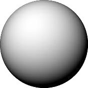
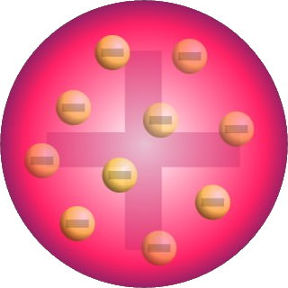
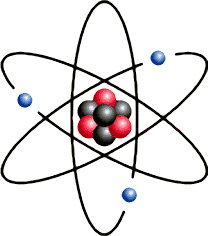
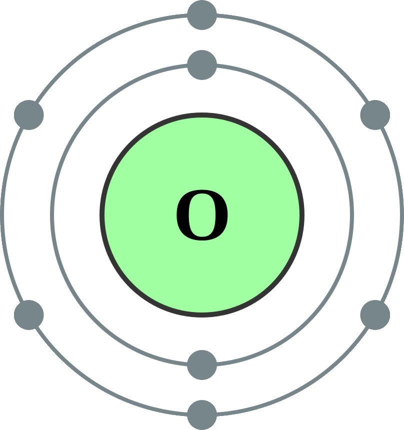

# Review of Chemistry 10 (and more...)

## Models of the Atom

| Model | Name | Description |
| :---: | :--: | ----------- |
|  | John Dalton *Billiard Ball* | All matter composed of **atoms**—**tiny, indivisible particles**.   Atoms of **different elements** have **different sizes/shape/etc.** |
|  | J. J. Thomson *Plum Pudding* | **Positively charged sphere** with negatively charged **electrons embedded**. |
|  | Ernest Rutherford *Nuclear* | Positively charged **nucleus surrounded by electrons**. Proved this with **gold foil experiement**. |
|  | Niel Bohr *Orbital* | Electrons are in specific **energy levels**. |
|  | Modern Science *Quantum Mechanical* | Electrons occupy **orbitals**—**probability patterns of movement** of electrons around the nucleus. |