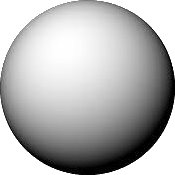
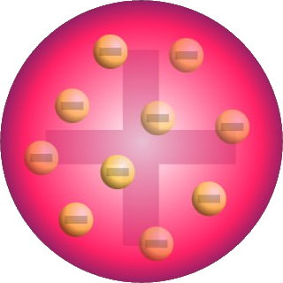
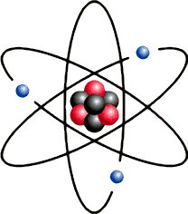
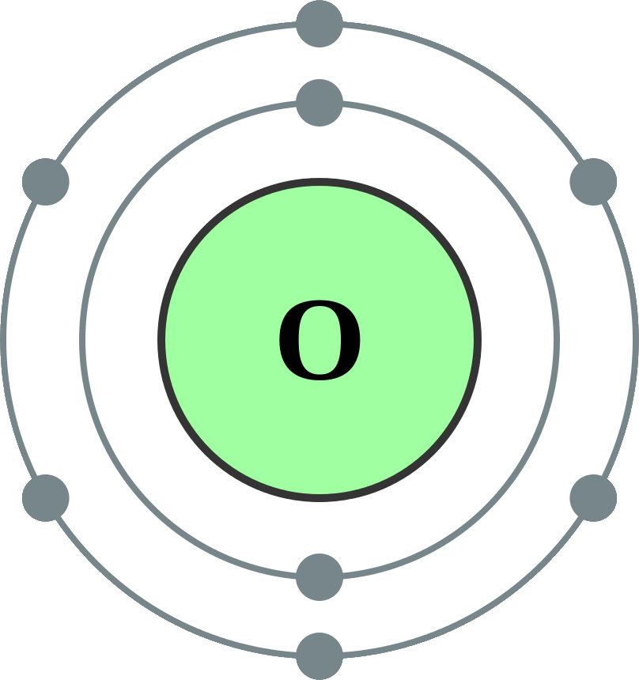

[Test 1](/README.md)
[Test 1](../README.md)
[Test 1](README.md)
[Test 1](../../../README.md)

# Review of Chemistry 10 (and more...)

| Table of Contents |
| ----------------- |
| [Models of the Atom (quick summary)](#models-of-the-atom) |

## Models of the Atom

| Model | Creator | Name | Description |
| :---: | :-----: | :--: | ----------- |
|  | John Dalton | Billiard Ball | All matter composed of **atoms**—**tiny, indivisible particles**.   Atoms of **different elements** have **different sizes/shape/etc.** |
|  | J. J. Thomson | Plum Pudding | **Positively charged sphere** with negatively charged **electrons embedded**. |
|  | Ernest Rutherford | Nuclear | Positively charged **nucleus surrounded by electrons**. Proved this with **gold foil experiement**. |
|  | Niel Bohr | Orbital | Electrons are in specific **energy levels**. |
|  | Modern Science | Quantum Mechanical | Electrons occupy **orbitals**—**probability patterns of movement** of electrons around the nucleus. |