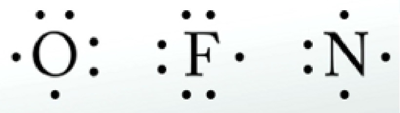
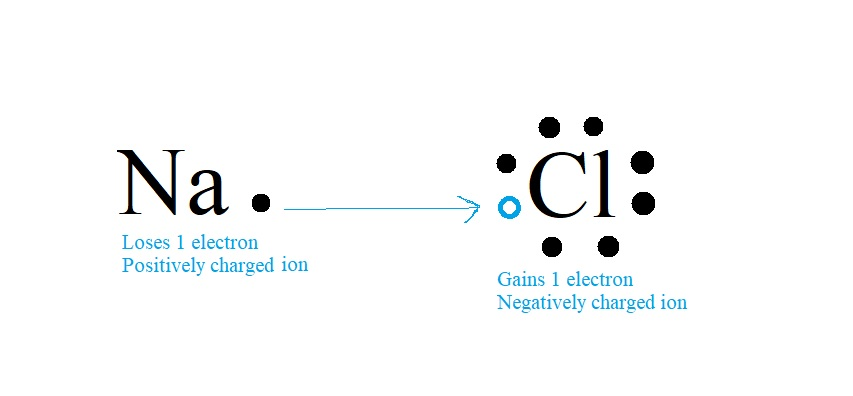
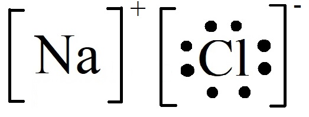
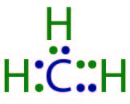
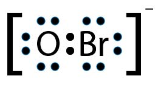
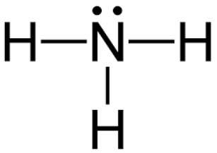

# Bonding

?> These notes are unfinished and subject to change.

---

# Development of Bonding Theory
| Year | Scientist | Discovery |
| :--: | :-------: | :-------: |
| 1852 | Frankland | Each element has a specific bonding capacity. |
| 1858 | Kekule    | Created structural formulas, showing atoms and bonds. |
| 1874 | van't Hoff & LeBel | 3D versions of structural formulas with polarized light. |
| 1904 | Abegg | Atom bonding capacity linked to electron arrangement. Explained stability of noble gas. Explained electrons transferring to form bonds. |
| 1911 | Rutherford | Nuclear atomic model supported Abegg's theory. |
| 1916 | ~~Gilbert Lewis~~ | Atoms ~~share molecules~~ too. Covalent bonds involve ~~valence electrons~~. Created the ~~Lewis Dot Diagram~~ |
| 1939 | ~~Linus Pauling~~ | Electron sharing is a range. From ~~equal attraction~~ (covalent) to ~~total transfer~~. (ionic) |

## Quantum Mechanical Orbital Theory
### Valence Electrons
Bonding ~~only involves~~ interactions of ~~valence electrons~~, electrons in the outermost shell, as lower levels...
* Attract more strongly to the nucleus
* Harder to get to (other levels in the way)

### Orbital
An orbital is a ~~region of space~~ around the nucleus where ~~electrons may exist~~.

An orbital can only contain...
* **0 Electrons**: ~~Empty Orbital~~
* **1 Electron**: ~~Bonding Electron~~ (Shares with other atoms)
* **2 Electrons**: ~~Lone Pair~~

There are always ~~4 valence orbitals~~ in an atom, with a maximum of 8 electrons total. (octet rule)  
The only exception to this rule is $\textrm{H}$ and $\textrm{He}$, as they ~~only have 1 orbital~~.

Electrons will occupy ~~each empty~~ valence orbital ~~before pairing~~ up to make lone pairs.

It should also be stated that ~~atoms in column 14 can never become ions~~. (they can both lose or gain 4 electrons, so they do nothing)

# Lewis Dot Diagram
The lewis dot diagram is used to represent the valence electron and bonding of atoms.

## Lewis Dot Diagram of Atoms
* The symbol of the ~~element is drawn in the middle~~. It represents the nucleus of the atom.
  * ~~Each side~~ of the symbol is an ~~orbital~~. There are four total.
* A ~~dot~~ represents each ~~valence electron~~.
* Fill the orbitals with ~~dots/electrons~~ equal to the ~~number of valence electrons~~ that element has. (ones place of column #)
  * Draw ~~one dot in each orbital first~~, going ~~clockwise or counterclockwise~~ over each one
  * If ~~every orbital has a dot~~ and you still have more valence electrons, then ~~start pairing~~ them up.
		* Alternatively, instead of two dots you may draw a line. Means the same thing.
### Example

## Lewis Dot Diagram for Ionic Compounds
In ionic compouds, an electron transfer occurs. To explain how to draw the diagram, lets use $\textrm{NaCl}$ as an example.

The following are the lewis dot diagrams for sodium and chloride on their own.  

As you can see, sodium has one electron that it transfers to chlorine to fill it's bonding pair to make it full.  
Sodium lost an electron, it has a $1+$ charge. Chlorine gained an electron, it has a $1-$ charge.

To draw a lewis dot diagram of an ionic compound, essentially draw how the ~~dots look like after the transfer~~, surround each atom in ~~square brackets~~, and ~~state the charge in the top right~~ and ~~quantities in the bottom right~~.  

### Example
This is the lewis dot diagram for $\textrm{Mg}^{2+}_3\textrm{P}^{3-}_2$

## Lewis Dot Diagram for Molecular Compounds
* Draw a Lewis dot diagram for every atom
* The ~~central atom~~ is the atom with the ~~most bonding electrons~~.
* Attach the ~~next highest~~ bonding electron atom.
  * This atom should share its electrons.
* Keep attaching atoms until ~~every atom's orbitals are full~~. (2 electrons)

### Example
$\textrm{CH}_4$

These are the lewis/electron-dot diagrams for carbon and hydrogen on their own.  
![](images/unit1/lewis-ionic3a.jpg]

Then, we can put them together and they share electrons.  
![](images/unit1/lewis-ionic3b.jpg]

However, not every valence orbital of carbon is filled. We need more hydrogens.  
![](images/unit1/lewis-ionic3c.jpg]

### Multibonds
If your empirical formula seemingly doesn't have enough of something to fill all orbitals, you may need to make double or triple bonds.

For instance, $\textrm{CH}_3$ doesn't have enough hydrogens to fill all of carbon's orbitals with just single bonds.  

## Lewis Dot Diagram for Polyatomic Ions
* Count the ~~total number of valence electrons~~ in ~~all atoms~~ of the polyatomic.
* Subtract/add electrons based on the polyatomic's charge.
  * *e.g. If the polyatomic had a 1+ charge, subtract 1 electron from the total count*
* This number equals the total number of dots on the diagram.

* The atom with the ~~highest bonding capacity~~ is the ~~central atom~~.
* ~~Attach~~ the other atoms with a ~~bonding pair of electrons between~~.
* Make up the ~~rest of the total~~ number of electrons by ~~adding lone pairs~~ to ~~any atom~~.
* Add ~~square brackets and charge~~ like any other ionic compound.

### Example
$\textrm{BrO}^{-}$

$\textrm{Br} = 7 e^-$  
$\textrm{O} = 6 e^-$  
$^- = 1$ extra electron 
Total number of electrons in compound = $14 e^-$

  
*Outlined electrons are lone pairs that were added to make up the total.*

# Electronegativity
* Valence electrons of another atom are attracted to an atom's nucleus. (the protons)
* The ~~farther from the nucleus~~ an electron is, the ~~weaker the attraction~~.
* The valence electrons don't just get attracted to their own nucleus because ~~inner electrons are in the way~~.
* The ~~more protons~~ in the nucleus, the ~~greater the attraction~~.

* **Electronegativity** is the ability of an atom to ~~attract a pair of bonding electrons~~ into its valence.
  * It was created by ~~Linus Pauling~~.
  * Electronegativity ~~increases~~ as you move from the ~~bottom left to the top right~~ of the periodic table.
  * The electronegitivity of an element is on the periodic table.

# Bond Polarity
## Non-polar
A covalent bond is nonpolar if the ~~sharing of electrons is equal~~.  
This only occurs when the bond is between...
* Two ~~identical atoms~~
* Two atoms with the ~~same electronegativity~~

Non-polar bonds can be represented with ~~structural diagrams~~, using an ~~arrow pointing in both directions~~.  
e.g. $\textrm{C} \longleftrightarrow \textrm{C}$

## Polar
A covalent bond is polar if the ~~sharing of electrons is not equal~~.  
This occurs when the bond is between...
* Two atoms with differing electronegativity
* The ~~more electronegative~~ atom will ~~attract~~ the ~~less electronegative~~ more strongly
  * This makes the more electronegative atom have a ~~slight negative charge~~. ($\delta^-$)
  * Therefore the less electronegative atom has a ~~slight positive charge~~. ($\delta^+$)
* The ~~greater the difference~~ in electronegativity, the ~~more polar the bond~~.

Polar bonds can be represented with ~~structural diagrams~~, using an ~~arrow pointing towards the higher electronegativity~~.  
e.g. $\textrm{C} \longleftarrow \textrm{H}$, $\textrm{Cl} \longrightarrow \textrm{F}$

## Ionic Bonds
If the electronegativity difference is high enough (> 1.8), electrons can be ~~completely transferred~~ to another atom.  
This is an ionic bond, it forms ~~cations (+) and anions (-)~~. It also forms crystal lattice structures.

# Molecule Polarity
Polar bonds can result in the molecule itself being polar.  
This is called a ~~**dipole**~~: where there are a positive ($\delta^+$) and negative ($\delta^-$) ends to a molecule.

## Effects/Forces of Polar Bonds
The effects/forces of polar bonds are the ~~direction a molecule is pushed~~ towards due to the ~~polar bonds~~.

For instance, if this carbon and hydrogen were in a molecule, the molecule would be polar in the left direction.  
$\textrm{C} \longleftarrow \textrm{H}$

However, the polar bond's push/effects can be ~~cancelled~~ by another polar bond's with the exact same electronegativity's ~~push in the opposing direction~~.  
$\textrm{H} \longrightarrow \textrm{C} \longleftarrow \textrm{H}$  
This molecule has polar bonds, but the molecule is non-polar as it does not get pushed in any direction.

Lastly, the higher the electornegativity, the more polar something is. If a polar bond is opposed by another polar bond, but that bond has a ~~lower electronegativity~~, then the molecule still moves in a direction and is ~~still polar~~.  
$\textrm{N} \longleftarrow \textrm{C} \longrightarrow \textrm{O}$  
In this example, oxygen has a highe electronegativity than nitrogen, so the molecule is still polar towards the right.

## Polar Molecules
A molecule is polar if...
* The shape is ~~not symmetrical~~
* The ~~effects/forces~~ of the polar bonds ~~do not cancel~~ (the bonds don't cancel)
  * If this is the case, then the molecule has a dipole

## Non-polar Molecules
A molecule is non-polar if...
* Every bond in the molecule is a ~~non-polar bond~~, or...
* The ~~effects/forces~~ of the polar bonds ~~cancel~~

## Examples
| Structural Diagram | Formula | Bonds? | Molecule? |
| :----------------: | :-----: | :----: | :-------: |
|  | $\textrm{CO}_{2}$ | Polar | Non-polar |
|  | $\textrm{CCl}_{4}$ | Polar | Non-polar |
|  | $\textrm{NH}_{3}$ | Polar | Polar |
|  | $\textrm{C}_{2}\textrm{H}_{6}$ | Polar | Non-polar |

# IB Stereochemistry
Also known as VSEPR, sterochemistry is regarding the ~~shapes of molecules in 3 dimensions~~.  
In addition, IB **bond angles** are the ~~angle formed between 2 bonds~~.

## Drawing in 3D
At this level, you don't actually need to draw 3D molecules. However, you need to know how to identify them.

| Bond Appearance | Meaning |
| :-------------: | :-----: |
| Normal, solid line | The atom is on the page |
| Dotted Line or Wedge | The atom is in the page (down, into your desk) |
| Wedge | The atom is out of the page (up) |

If you decide to use wedges, you must either ~~fill them in or leave them hollow~~ to distinguish between the atom going up or down. ~~Whichever you choose does not matter~~, the point is that they are ~~distinguished~~.

$\textrm{SiF}_{4 (g)}$  

## Guidelines
| General Formula | Has lone pairs? | Name | Shape | Bond Angle |
| :-------------: | :-------------: | :--: | :---: | :--------: |
| $\textrm{AX}$   | N/A | Linear |  | $180^\circ$ |
| $\textrm{AX}_{2}$   | N/A | Linear |  | $180^\circ$ |
| $\textrm{AX}_{2}$   | N/A | Linear |  | $180^\circ$ |
| $\textrm{AX}_{3}$   | N/A | Linear |  | $180^\circ$ |
| $\textrm{AX}_{3}$   | N/A | Linear |  | $180^\circ$ |
| $\textrm{AX}_{4}$   | N/A | Linear |  | $180^\circ$ |
