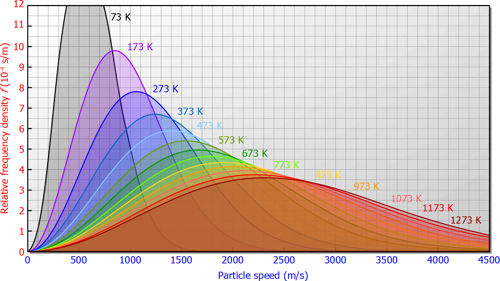

# Gases

!> These notes are unfinished and are subject to change.

---

# Properties of Gases
1. Gases are ~~highly compressible~~.
2. Gases have indefinite volumes, as they ~~fill their containers uniformly~~.
3. Gas particles are ~~spread far apart~~, therefore gases have ~~low density~~, ~~expand when heated~~, and can be ~~mixed~~.
   * This explains why they are highly compressible.
4. Confined gases ~~exert constant pressure~~ on the ~~walls~~ of their container ~~uniformly in all directions~~.

# Kinetic Molecular Theory
1. All particles/molecules of matter are in ~~continuous, random motion~~.
2. Molecules move in ~~straight lines~~ until they ~~collide with another particle~~ or the ~~walls of a container~~.
3. Molecules collisions completely ~~transfer kinetic energy~~ to the collided (another molecule, or wall) with ~~no loss~~.
4. Gases are composed of tiny particles or molecules with ~~large empty space~~ between them.
5. There are ~~no intermolecular forces of attraction~~ between molecules or the walls of a container.
6. ~~Kinetic energy~~ of ~~all gas molecules~~ are the ~~same at a constant Kelvin temperature~~, and are directly proportional to the Kelvin temperature.

# Volume
Volume is represented by the variable $v$ and is measured in $\textrm{mL}$ (or $\textrm{L}$)  
$v$ = Volume (ml, L)  

# Temperature
Temperature is the ~~average kinetic energy of molecules~~. It is represented by the variable $T$.

$T$ = Temperature (Celsius, Kelvin)  

## Kelvin
Kelvin is a measurement of temperature identical to Celsius, except 0 K represents ~~absolute zero~~--the temperature at which ~~all molecules cease motion~~.

To convert between the two measurements, $\pm273.15$

* $^\circ\textrm{C} + 273.15 = \textrm{K}$
* $\textrm{K} - 273.15 = ^\circ\textrm{C}$

# Pressure
Pressure is ~~force per unit area~~.  
Pressure is from ~~collisions of gas particles with the walls of the container~~.  
The pressure depends on ~~how often and how hard~~ the molecule collides with the wall.

An area with no gas particles, and therefore no pressure, is called a ~~vacuum~~.

## Units
It is measured in ~~pascals~~, but more commonly ~~kilopascals~~.

$1 \space\textrm{Pa} = 1 \space\textrm{N}/\textrm{m}^2$  
$1 \space\textrm{kPa} = 1000 \space\textrm{N}/\textrm{m}^2$

However, there are also many other less common units you need to memorize. The following are all equal to the same pressure.

| $1 \space\textrm{atm}$ | $101.325 \space\textrm{kPa}$ | $760 \space\textrm{mm Hg}$ | $760 \space\textrm{torr}$ | $14.68 \space\textrm{psi}$ |
| :-----: | :-----------: | :---------: | :--------: | :---------: |
| Atmospheres | Kilopascals | Millimeters of mercury | Torr | Pounds per Square Inch |

$p$ = Pressure (atm, kPa, mm Hg, torr, psi)

### Unit Conversion
To convert between units, use the following diagram.

$\textrm{initial units} \times \dfrac{\textrm{desired units}}{\textrm{initial units}}$

The numerator and denominator should be equal, but different units.

#### Example
> What is 10 atm in kPa?  
  $10 \space\textrm{atm} \times \frac{101.325 \space\textrm{kPa}}{1 \space\textrm{atm}}$  
  $10 \space\textrm{atm} = 1013.250 \space\textrm{kPa}$

## Atmospheric Pressure
Gases in the atmosphere constantly exert pressure on the Earth.  
The atmospheric pressure at ~~sea level~~ is ~~$101 \space\textrm{kPa}$~~.

## Standard Conditions
The following are standards that you must memorize.

| Standard | Temperature | Pressure |
| :------: | :---------: | :------: |
| Standard Temperature and Pressure (~~**STP**~~) | $0^\circ\textrm{C}$ | $1 \space\textrm{atm}$ or $101.325 \space\textrm{kPa}$ |
| Standard Ambient Temperature and Pressure (~~**SATP**~~) | $25^\circ\textrm{C}$ | $100 \space\textrm{kPa}$ |

# IB Distribution of Molecular Speeds
~~Maxwell and Boltzmann~~ analyzed the behaviour of gas molecules and stated the following.

At ~~higher temperatures~~, ~~more molecules~~ are moving at ~~faster speeds~~.

~~Lighter molecules~~ tend to ~~move faster~~ than heavier molecules.

# Boyle's Law
Pressure and volume of a gas are ~~inversely proportional~~.  
In other words, the ~~greater the pressure~~, the ~~smaller the volume~~.  
If the volume of a container is reduced, gas particles will have to move a ~~shorter distance to hit the walls~~ of their container, and therefore the ~~frequency of collisions increases~~, making the pressure increase.

<h1>
$p_1v_1 = p_2v_2$
</h1>

* $p_1$: Initial pressure in x units.
* $v_1$: Initial volume in y units.
* $p_2$: Final pressure in x units.
* $v_2$: Final volume in y units.

Units can be any of the aforementioned ones, but ensure ~~units are consistent on both sides~~.

#### Example
> A gas occupies a volume of 10.0 L at a pressure of 80.0 kPa. At what pressure will the volume be 12.0 L?  
  $p_1v_1 = p_2v_2$  
  $(80.0 \space\textrm{kPa})(10.0 \space\textrm{L}) = p_2(12.0 \space\textrm{L})$  
  $66.7 \space\textrm{kPa} = p_2$

For the following question, the pressure isn't specified. You can put any pressure you want.

> A gas is compressed from 4.0 L to 1.0 L. What happens to the pressure?  
  $p_1v_1 = p_2v_2$  
  $(1)(4.0 \space\textrm{L}) = p_2(1.0 \space\textrm{L})$  
  $p_2 = 4.0 \space\textrm{L}$  
  The pressure was multiplied by 4.

# Charles' Law
Volume and temperature are ~~directly proportional~~.  
In other words, the ~~greater the temperature~~, the ~~greater the volume~~.  
Increased temperature increases the speed of particles, and faster moving particles ~~collide more often and with greater force~~, ~~pushing the walls of container outward~~, increasing the volume.

<h1>
$\dfrac{v_1}{T_1} = \dfrac{v_2}{T_2}$
</h1>

* $v_1$: Initial volume in x units.
* $T_1$: Initial temperature in Kelvin.
* $v_2$: Final volume in x units.
* $T_2$: Final temperature in Kelvin.

Units for volume can be any of the aforementioned ones, but units for temperature ~~must be in Kelvin~~.

#### Example
> A gas occupies a volume of 473 mL at 36 degrees Celsius. What is the volume of the gas if the temperature is raised to 94 degrees Celsius?  
  $v_1 = 473 \space\textrm{mL}$  
  $v_2 = ?$  
  $T_1 = 36^\circ\textrm{C} + 273.15 = 309.15\space\textrm{K}$  
  $T_2 = 94^\circ\textrm{C} + 273.15 = 367.15\space\textrm{K}$  
> 
> $\dfrac{473 \space\textrm{mL}}{309.15 \space\textrm{K}} = \dfrac{v_2}{367.15 \space\textrm{K}}$
> 
> $v_2 = 562 \space\textrm{mL}$

# Gay-Lussac's Law
Pressure and temperature are ~~directly proportional~~.  
In other words, the ~~greater the temperature~~, ~~the greater the pressure~~>

<h1>
$\dfrac{p_1}{T_1} = \dfrac{p_2}{T_2}$
</h1>

* $p_1$: Initial pressure in x units.
* $T_1$: Initial temperature in Kelvin.
* $p_2$: Final pressure in x units.
* $T_2$: Final temperature in Kelvin.

Units for pressure can be any of the aforementioned ones, but units for temperature ~~must be in Kelvin~~.

#### Example
> A gas exerts a pressure of 660 kPa at 25 degrees Celsius. What is the pressure of the gas if the temperature is cooled to 0 degrees Celsius?  
  $p_1 = 660 \space\textrm{kPa}$  
  $p_2 = ?$  
  $T_1 = 25^\circ\textrm{C} + 273.15 = 298.15\space\textrm{K}$  
  $T_2 = 0^\circ\textrm{C} + 273.15 = 273.15\space\textrm{K}$  
> 
> $\dfrac{660 \space\textrm{kPa}}{298.15 \space\textrm{K}} = \dfrac{v_2}{273.15 \space\textrm{K}}$
> 
> $p_2 = 605 \space\textrm{kPa}$

# Combined Gas Law
Like the name implies, the combined gas law is Charles', Boyle's and Gay-Lussac's law combined into one formula.  

<h1>
$\dfrac{p_1v_1}{T_1} = \dfrac{p_2v_2}{T_2}$
</h1>

#### Example
> A gas occupies a volume of 2.00 L at 27 degrees Celsius and 1 atm of pressure.  
  What will be the volume if the temperature is increased to 35 degrees Celsius and pressure is degrees to 0.8 atm?  
>
> $p_1 = 1.0 \space\textrm{atm}$  
  $p_2 = 0.8 \space\textrm{atm}$  
  $v_1 = 2.0 \space\textrm{L}$  
  $v_2 = ?$  
  $T_1 = 300.15 \space\textrm{K}$  
  $T_2 = 308.15 \space\textrm{K}$  
> 
> $\dfrac{ (1.0 \space\textrm{atm}) (2.0 \space\textrm{L}) }{ 300.15 \space\textrm{K} } = \dfrac{ (0.8 \space\textrm{atm}) v_2 }{ 308.15 \space\textrm{K} }$  
> 
> $v_2 = 2.57 \space\textrm{L}$

# Law of Combining Volumes
If the volume and chemical equation are given to you, you can determine the volume of each element with this formula.

$\textrm{volume of element you have in the units you want} \times \dfrac{\textrm{coefficient of element you need}}{\textrm{coefficient of element you have}}$

You also need to determine the chemical equation if it is only given in words, and ~~balance the equation~~.

In addition, if you have ~~two or more volumes given~~ to you, ~~use all of them each seperately~~ and ~~choose the lowest answer~~ of them.

#### Example
> If 5.0 L of carbon dioxide gas is produced during the combusion of methane gas, how much water is produced?  
> 
> $\textrm{CH}_4 + 2\textrm{O}_2 \longrightarrow \textrm{CO}_2 + 2\textrm{H}_2\textrm{O}$  
> 
> Coefficient of element you need (water) = 2  
  Coefficient of element you have (carbon dioxide) = 1  
> 
> $5.0 \space\textrm{L} \times \dfrac{2}{1} = 10.0 \space\textrm{L}$

# Ideal Gas Law
!> TODO
