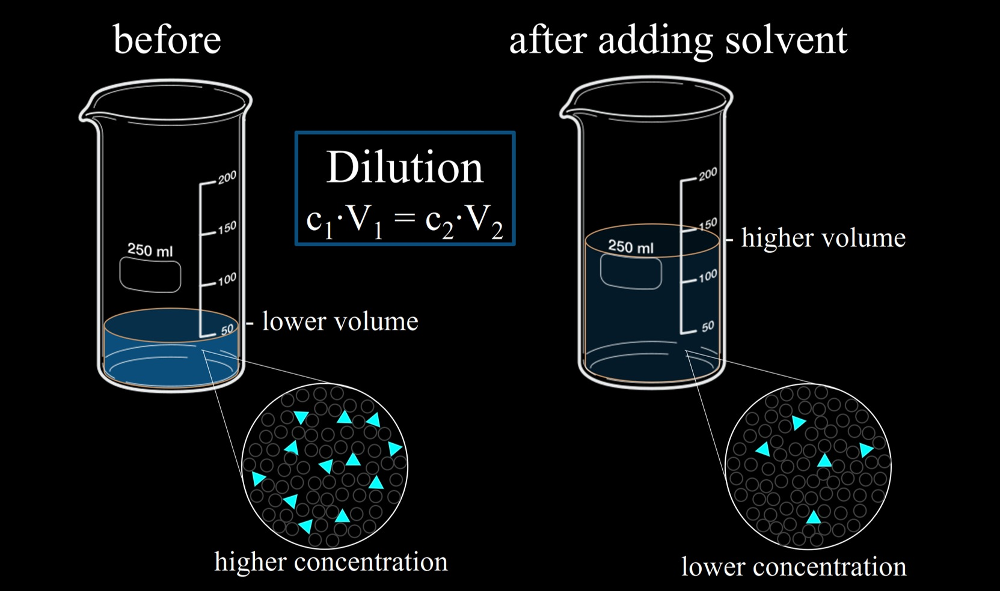

# Solutions

---

# Definition

A solution is a single ~~homogenous~~--no distinct seperation of components--substance (~~liquid, solid, or gas~~) that is a mixture in which ~~all components are uniformally distributed~~.

For instance...
* Air (Gas Solution)
* Tap water (Liquid Solution, Aqueous)
* Alloys, like brass (Solid Solution)

Solutions are made up of a solvent and solute(s).

## Solute
* Substance present in solution at ~~lower quantities~~.
* Typically ~~dissolves~~.
* ~~1 or more~~.

## Solvent
* Substance present in solution at ~~higher quantities~~.
* Typically ~~dictates the phase~~ (solid/liquid/gas) of the final solution.
* ~~Usually only 1~~.
* In aqueous solutions--the focus of this unit--the solvent is always water.

# Comparisons
The primary focus of this unit is around the following four substance types.
* Acid (Molecular)
* Base (Ionic)
* Neutral Molecular
* Neutral Ionic

| Substance | Composition |
| :-------- | :---------- |
| Acid | $\textrm{H\_\_\_ (aq)}$ $\textrm{\_\_\_COOH (aq)}$ Produces $\textrm{H}^+\textrm{ (aq)}$ in solution. |
| Base | $\textrm{X-OH (aq)}$ $\textrm{X}$ = Metal or $\textrm{NH}_4^+$ Produces $\textrm{OH}^-\textrm{(aq)}$ in solution. |
| Neutral Ionic | Metal/$\textrm{NH}_4^+$ + Anion (that isn't hydroxide) Ionic solution, not a base. |
| Neutral Molecular | Nonmetals only, no hydrogen compounds Not an acid. |

| Substances | Conductive? (aka. an electrolyte?) |
| :--------- | :-- |
| Acid | Yes |
| Base | Yes |
| Neutral Ionic | Yes |
| Neutral Molecular | No (has no ions) |

| Substances | Litmus |
| :--------- | :-- |
| Acid | red -> red blue -> red |
| Base | red -> blue blue -> blue |
| Neutral Ionic | red -> red blue -> blue |
| Neutral Molecular | red -> red blue -> blue |

| Substances | Properties |
| :--------- | :-- |
| Acid | - Sour   - Gritty/sandy feel   - Neutralizes bases   - Reacts with metal to produce $\textrm{H}_{2 (g)}$   - Reacts with carbonate to produce $\textrm{CO}_{2 (g)}$ |
| Base | - Bitter   - Slippery feel   - Neutralizes acids |
| Neutral Ionic | - Solid at SATP   - Coloured or colourless in solution |
| Neutral Molecular | - Solid, liquid, or gas at SATP   - Colourless in solution |

| Substances | pH |
| :--------- | :-- |
| Acid | Less than $7$ |
| Base | Greater than $7$ |
| Neutral Ionic | $7$ |
| Neutral Molecular | $7$ |

| Substances | Dissociation/Ionization |
| :--------- | :-- |
| Acid | Strong acids ionize $>9.99%$ Weak acids ionize $<50%$ |
| Base | Dissociate in solution |
| Neutral Ionic | Dissociate in solution |
| Neutral Molecular | Does not ionize or dissociate (not conductive) |

| Substances | Examples |
| :--------- | :-- |
| Acid | $\textrm{HCl}_{(aq)}$   $\textrm{H}_2\textrm{SO}_{4 (aq)}$   $\textrm{CH}_3\textrm{COOH}_{(aq)}$ |
| Base | $\textrm{NaOH}_{(aq)}$   $\textrm{NH}_4\textrm{OH}_{(aq)}$   $\textrm{Al}(\textrm{OH})_{3 (aq)}$ |
| Neutral Ionic | $\textrm{NaCl}_\textrm{(aq)}$   $\textrm{NaNO}_{3 (aq)}$ |
| Neutral Molecular | $\textrm{N}_2\textrm{O}_{4 (aq)}$   $\textrm{C}_6\textrm{H}_12\textrm{O}_{6 (aq)}$   $\textrm{C}_2\textrm{H}_5\textrm{OH}_{(aq)}$ |

# Conductivity

| Class | Solid | Liquid | Aqueous |
| :---: | :---: | :----: | :-----: |
| metal | ~~✓~~ | ~~✓~~ |
| nonmetal | X | X |
| ionic | X | ~~✓~~ | ~~✓~~ |
| molecular | X | X | X |
| acid | X | X | ~~✓~~ |

# Strength
## Strong Acids
Strong acids differ from weak acids in many ways, covered in this unit.

To determine if an acid is strong, go to ~~page 8-9~~ in your data booklet.  
~~The first 6 acids are the strong acids~~.

## Strong Bases
Weak bases are not covered at this level, so assume all bases are strong.

# Solubility
| Compound | Behavior in aqueous solution |
| :------ | :-- |
| High Soluble Ionic Compounds | Dissociate.  Each ion is (aq) |
| Low Soluble Ionic Compounds | Form precipitates.  Entire compound is (s) |
| Molecular Compounds | Never dissociate.  May be soluble (aq) or insoluble (s) |
| Strong Acids | Ionize/dissociate. Always a proton and a negative ion.   Each ion is (aq) |
| Weak Acids | Partially ionize/dissociate.   Compound remains together, state is now (aq) |
| Strong Bases | Dissociate.   Each ion is (aq) |
| Elements | Halogens, oxygen, and nitrogen are the only* elements that can dissolve in water.  Each element is now (aq) |

# Dissociation & Ionization
## Dissociation
Seperation of a molecule into ~~its two ion components~~ when ~~in solution~~.  
It is linked to conductivity, i.e. if something is conductive, it likely dissociates too.

## Ionization
~~Formation~~ of ions following a ~~neutral molecule~~ dissolving in solution.

## Rules
Compounds that dissociate/ionize are...
* Soluble Ionic Compounds
  (includes bases)

* Strong Acids
  (ionized in solution)

Compounds that don't do either...
* Insoluble Ionic Compounds

* Weak Acids  
  (Only partially ionize, i.e. ~~only change state into aqueous~~)

* Neutral Molecular Compounds  
  (may dissolve, but not dissociate, i.e. ~~only change state into aqueous~~)

* Elements

## Equations
### Dissociation
* Before the arrow is the original compound.
* Arrow stands for placing compound in water.
* After arrow is each ion that made up the compound.
  * ~~Each ion~~ should now be ~~aqueous~~. (aq)

#### Example
$\textrm{NaCl}_\textrm{(s)} \longrightarrow \textrm{Na}^+_\textrm{(aq)} + \textrm{Cl}^-_\textrm{(aq)}$

## Identification of Ions in Solution
### Litmus Paper
You know the drill.
* Acids make blue litmus paper red.
* Bases make red litmus paper blue.

### Colour
Some ions have specific colours in solution.  
These ions can be found in ~~page 11 of your data booklet~~.

### Flame Test
Some ions release specific colours when in fire.  
These ions can be found in ~~page 6 of your data booklet~~.

### Odor
Some dissolved material in solutions have a characteristic odor. This test isn't used as frequently.
* Ammonia has a very sharp odor.
* Vinegar solutions have a disinct odor.

### Selective Precipitation
Specific ions can be identified by adding compounds that dissociate and form precipitates with the specific ions.

#### How (WIP)
* Go to your solubility table on page 6 of your data booklet.
* Find the cation you want to seperate/precipitate in the **slightly soluble** row (bottom)
* Look at the top row and find an anion you could use
* Add any valid cation to it.
* Now you have a compound that is solid on its own, but when dissolved in solution, dissociates and forms another solid compound with your desired ion.

#### Example
* A solution is full of $\textrm{Ag}^+$ ions.
* Adding $\textrm{NaCl}_{(s)}$ causes the compound to dissociate into $\textrm{Na}^+$ and $\textrm{Cl}^-$
* The $\textrm{Ag}^+$ ions bind to the $\textrm{Cl}^-$ ions, abandoning $\textrm{Na}^+$
* $\textrm{AgCl}$ is not soluble, so it forms a solid precipitate.

#### Tip
* Group 1 ions as cations and $\textrm{NO}_3^-$ ions as anions ~~never form a precipitate with anything~~.  
  This makes them very useful as an anion/cation for the ion that precipitates with your desired ion.

### Filtration
Once the desired ion is precipitated, it can be removed from solution via filtration. This is as simple as using a funnel.  
The **filtrate** is what the solution is called after filtering the precipitate.

# When To Use Significant Digits
## Multiplication/Division
Answer with significant digits with the rules you know.  
(i.e. answer cannot have more sig digs than lowest sig dig number in question)

## Addition/Subtraction
Answer must have the ~~same number of decimal places~~ as the number with the ~~fewest decimal places~~.

# Concentration
Concentration is the quantitative description of the ~~amount of solute dissolved~~ in a given amount of ~~solvent~~. (water in aqueous solutions)

Qualitative terms to describe concentration include...
* **Dilute**: low molar concentration
* **Concentrated**: high molar concentration

## Expressing as Percentage of Solute
### Mass/Volume Percent
> $\textrm{m/v} = \dfrac{\textrm{mass of solute}}{\textrm{volume of solution}} \times 100$

* Most common

### Percent By Mass
> $\textrm{m/m} = \dfrac{\textrm{mass of solute}}{\textrm{mass of solute} + \textrm{mass of solvent}} \times 100$

* Remember that the denominator contains the ~~mass of entire solution~~. (solute + solvent)

### Percent By Volume
> $\textrm{v/v} = \dfrac{\textrm{volume of solute}}{\textrm{volume of solution}} \times 100$

### Percent In Parts Per Million
Parts per million expressions are simply the same as the previous, except ~~multiplied by a million~~ rather than 100.  
This is used for very small amounts.

#### Example
> $\textrm{ppm(m/v)} = \dfrac{\textrm{mass of solute (g)}}{\textrm{volume of solution (mL)}} \times 10^6$

## Molar Concentration
This is the most used unit of concentration.

> $c = \dfrac{\textrm{moles of solute}}{\textrm{volume of solution}}$

> $c = \dfrac{n\space\textrm{mol}}{v\space\textrm{L}}$

### Hydrates
If you are calculating the molar mass of a compound and it is a hydrate, just ~~add the number of water molecules~~.

### Mass and Volume
If a question asks about mass (solids) and volume (any state), then you will have to find ~~moles~~.  
This is because you can convert between using the following two units.

* Molar Mass: $\dfrac{\textrm{mol}}{\textrm{g}}$
* Molar Concentration: $\dfrac{\textrm{mol}}{\textrm{L}}$

#### Example Questions
> What is the concentration of a solution with 0.150 mol of sucrose is dissolved in 500 mL of water?
>
> $c = \dfrac{n\space\textrm{mol}}{v\space\textrm{L}}$
>
> $c = \dfrac{0.150 \space\textrm{mol}}{0.500 \space\textrm{L}}$
>
> $c = 0.300 \frac{\textrm{mol}}{\textrm{L}}$

> 1.13 mol of KMnO4(s) in solution has a concentration of 1.50 mol/L. What is the volume of the solution?
>
> $v = 1.13\space\textrm{mol} \times \dfrac{1\space\textrm{L}}{1.50\space\textrm{mol}}$ (unit analysis)
>
> $v = 0.753 \space\textrm{L}$

> What is the mass of potassium bromide needed for 250 mL of 0.600 mol/L solution?
>
> $n = 0.250 \space\textrm{L} \times \dfrac{0.600 \space\textrm{mol}}{1 \space\textrm{L}}$
>
> $n = 0.150 \space\textrm{mol}$
>
> Molar mass of $\textrm{KBr}$ is $119 \space\frac{\textrm{g}}{\textrm{mol}}$
>
> $0.15 \space\textrm{mol} \times 119 \space\frac{\textrm{g}}{\textrm{mol}}$  
> $= 17.9 \space\textrm{g}$

## Dilution

Dilution, which is often done by ~~adding water to a solution~~, causes the following...
* The number of moles ~~does not change~~.
* The volume of the solution ~~increases~~.
* The concentration of the solution ~~decreases~~.

With these three properties, a formula can be made.

> $c_iv_i = c_fv_f$
>
> $c$ = concentration  
> $v$ = volume  
> The product of the concentration and volume (i.e. moles) initially and at the end are ~~equal~~.

### Keywords
Questions regarding dilution often state that water is ~~"added to solution"~~.  
In this case, add the amount the question is adding to the initial volume. That is your final concentration. (rather than just replacing it)

For instance, if a question states the initial concentration is 1.0 mL, and 2.0 mL is added.  
Then the final concentration is not 2.0 mL, but actually 3.0 mL.

I'm making this very, very clear because it is easy to forget.

#### Example Questions
> What is the initial concentration of 50.0 mL of a solution that is then diluted to 700 mL and 0.130 mol/L?
>
> $c_iv_i = c_fv_f$
>
> $(c_i)(50.0 \space\textrm{mL}) = (0.130 \frac{\textrm{mol}}{\textrm{L}})(700 \space\textrm{mL})$
>
> $c_i = 1.82 \frac{\textrm{mol}}{\textrm{L}}$

You might have noticed that we are multiplying L and mL together. In this situation, this is okay.  
You only need the same unit on ~~both sides of an equal sign~~ for each variable.
