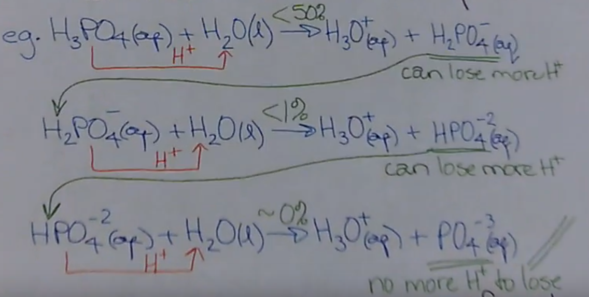
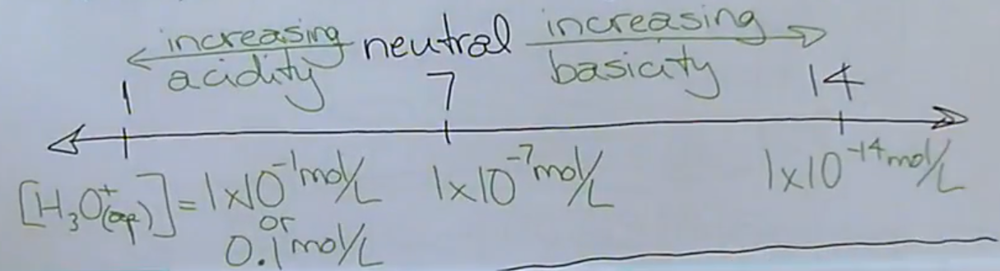
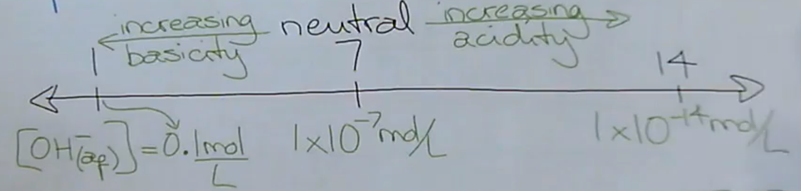

# Acids & Bases

---

# Nomenclature

## Bases
Bases follow ionic naming rules, with ~~`aqueous` prepended~~ to the name.  
(`hydroxide` appending, because all strong bases are a cation and a hydroxide anion)

> NaOH(s) is named `aqueous sodium hydroxide`

## Acids
Acids are named with either the classical or IUPAC system.

### IUPAC
Acids are named like any other compound in solution, except you ~~prepend `aqueous`~~.

> HCl is named `aqueous hydrogen chloride`

### Classical
The classical naming system is based off of the presence of oxygen atoms.

| Substance Ending | Oxygen Atoms? | Acid Nomeclature             |
| ---------------- | ------------- | ---------------------------- |
| Ends in `-ide`   | No            | hydro\_\_\_\_\_\_\_\_ic acid |
| Ends in `-ate`   | Yes           | \_\_\_\_\_\_\_\_ic acid      |
| Ends in `-ite`   | Yes           | \_\_\_\_\_\_\_\_ous acid     |

# Neutralization

$\textrm{H}^+_{(aq)} + \textrm{OH}^-_{(aq)} \longrightarrow \textrm{HOH}_{(l)}$

# Empirical Properties

<b>Emperical/Operational</b>  
A property that can be ~~observed~~.

| Acids             | Bases              |
| ----------------- | ------------------ |
| Taste sour        | Taste bitter       |
| Feels gritty      | Feels slippery     |
| pH < 7            | pH > 7             |
| litmus -> red     | litmus -> blue     |
| electrolyte       | electrolyte        |
| neutralizes bases | neutralizes acids  |
| reacts with... - metals -> H2 (g) - carbonate -> CO2 (g) | Too great of a variety in bases to generalize |

# Theoretical Properties

<b>Theoretical/Conceptual</b>  
A definition that ~~explains empirical~~ properties.  
A non-observable idea.

## People

| Person    | Theory                                                                                                        |
| ----------| ------------------------------------------------------------------------------------------------------------- |
| Lavoisier | Oxygen is responsible for acidic properties. Issue: There are acids w/o oxygen, and non-acids with oxygen. |
| Davy      | Hydrogen is responsible for acidic properties.                                                                |
| Arrhenius | Acids ionize in water to produce hydrogen ions. Bases dissociate in water to produce hydroxide ions. Issue: Misses all weak bases, and some weak acids. |

# Modified/Revised Arrhenius Theory

## Acids
Acids are actually substances that ~~react with water~~ to produced ~~hydronium ions~~ and a ~~balancing species~~.  
The acid ~~gives a H+~~ to the water.

$\textrm{H}_2\textrm{O} + \textrm{H}^+ \longrightarrow \textrm{H}_3\textrm{O}^+_{(aq)}$

#### Example
> $\textrm{HCl}_{(g)} + \textrm{H}_2\textrm{O}_{(l)} \longrightarrow \textrm{H}_3\textrm{O}^+_{(aq)} + \textrm{Cl}^-_{(aq)}$

## Strong Bases/Ionic Hydroxides
Use the original Arrhenius theory--use a ~~dissociation equation~~.

## Weak Bases
Bases actually ~~react with water~~ to produce ~~hydroxide ions~~ and a ~~balancing species~~.  
The base ~~takes a H+~~ from water.

#### Example
$\textrm{NH}_{3 (g)} + \textrm{H}_2\textrm{O}_{(l)} \longrightarrow \textrm{NH}^+_{4 (aq)} + \textrm{OH}^-_{(aq)}$

## Limitation of Theory
This theory ~~only covers reactions in water~~.  
However, acid + base reactions can occur.

## Utilizing
Write both equations.  
If the balancing species is not real, then it is not that.

#### Example

> Is hydrogen fluoride (HF(g)) an acid or a base in solution?
> 
> **Base Formula**  
> $\textrm{HF}_{(g)} + \textrm{H}_2\textrm{O}_{(l)} \longrightarrow \textrm{OH}^-_{(aq)} + \textrm{H}_2\textrm{F}^+_{(aq)}$
> 
> Balancing species isn't real. Not a base.
> 
> **Acid Formula**  
> $\textrm{HF}_{(g)} + \textrm{H}_2\textrm{O}_{(l)} \longrightarrow \textrm{H}_3\textrm{O}^+_{(aq)} + \textrm{F}^-_{(aq)}$
> 
> Balencing species is real. It's an acid.

## Exceptions
### No Hydrogens To Give Up
Compounds give a hydrogen ion to water to become acidic. What if a compound doesn't have any hydrogen ions though?  
These compounds must ~~combine with water first~~, then they can do the acid equation with an ~~additional water~~.

For instance, acid anhydrides are the acids of ~~oxides of non-metals~~. (CO2, SO2, etc...)  
They need an ~~additional water molecule~~ to do the acid equation. In other words, ~~two water~~ molecules added.

#### Example
> Is CO2 an acid in solution?
>
> $\textrm{CO}_{2 (g)} + \textrm{H}_2\textrm{O}_{(l)} \longrightarrow \textrm{H}_2\textrm{CO}_{3 (aq)}$  
> $\textrm{H}_2\textrm{CO}_{3 (aq)} + \textrm{H}_2\textrm{O}_{(l)} \longrightarrow \textrm{H}_3\textrm{O}^+_{(aq)} + \textrm{HCO}^-_{3 (aq)}$
>
> Balencing species is real. It's an acid.

### Basic Anhydrides
Basic anhydrides are the bases of ~~oxides of metals~~ (MgO, Na2O, etc...)  

~~Only the anion reacts~~ with water in all ionic compounds, so the compound must ~~dissociate first~~.  
The only exception is if the ~~cation is NH4+~~, then they both react.

#### Example
> Is MgO(s) a base in solution?
>
> $\textrm{MgO}_{(s)} \longrightarrow \textrm{Mg}^{2+}_{(aq)} + \textrm{O}^{2-}_{(aq)}$  
> $\textrm{O}^{2-}_{(aq)} + \textrm{H}_2\textrm{O}_{(l)} \longrightarrow \textrm{OH}^-_{(aq)} + \textrm{OH}^-_{(aq)}$
>
> Balencing species is real. It's an acid.

### Amphiprotic/Amphoteric Compoundss
Amphiprotic compounds can act like ~~either a base or an acid~~.  
To determine how they act on their own, look in the ~~data booklet pg. 8-9~~.

An amphiprotic will be on both the acid and base columns of the table.  

The most acidic compound is H3O+.  
The most basic compound is OH-.  
Whichever compound the amphiprotic is ~~closest to~~ will be it's behaviour.

#### Example
What does HCO3- behave like on its own?

Data Booklet Page 8-9...

| Acid | Base |
| :--: | :--: |
| $\textrm{H}_3\textrm{O}^+$ |  |
| &nbsp; |  |
| &nbsp; |  |
| &nbsp; |  |
| HCO3- |  |
| &nbsp; | HCO3- |
| &nbsp; |  |
| &nbsp; | $\textrm{OH}^-$ |

HCO3- is closest to $\textrm{OH}^-$, so this compound behaves like a base on its own.

# Polyprotic Substances
* [Video](https://drive.google.com/file/d/12o4RmVUyGbD7GpjIdJZsBDCJKVIC4V2V/view)
  * 0:00 - 4:40 is review of modified arrhenius
* [Teacher's Notes](https://drive.google.com/file/d/1W-NMXW5ZKpWgbEtpNRsxL725ZtXF92HU)

## Acids
### Monoprotic
A monoprotic acid is a compound with only ~~one acidic hydrogen~~. i.e. what we have covered so far.  
Use the modified arrhenius equations like earlier.

#### Acidic Hydrogens
$\textrm{H\_\_\_\_}_{(aq)}$ or $\textrm{\_\_\_\_COOH}_{(aq)}$

The hydrogens in these two groups are acidic hydrogens.  
Hydrogens anywhere else should be ignored when determining proticity
*e.g. benzoic acid, C6H5COOH, is monoprotic*

### Polyprotic
A polyprotic acid is a compound with ~~more than one acidic hydrogens~~.

$\textrm{H}_x\textrm{\_\_\_\_}_{(aq)}$ or $\textrm{\_\_\_\_}(\textrm{COOH})_{x (aq)}$

### Equation
To determine if this is an acid, use the ~~modified Arrhenius equation~~.   
Then determine if the balancing species ~~can lose any more protons~~.  
If it can, ~~repeat the equation~~ until no more protons can be lost.

#### Example
See `6:50` in the video for an example.

### Weak
Polyprotic acids tend to be ~~weak acids~~.  
This is because they have ~~many successive reactions~~ to lose all their protons, with ~~each succession being less likely~~ to occur.

For this level, only the ~~first reaction is significant~~, in which only ~~< 50%~~ of the molecule performs the reaction, making it weak.

#### Exception
The only polyprotic acid that is strong is ~~sulphuric acid~~, H2SO4 (aq).  
~~>99.9%~~ of the molecule performs the ~~1st reaction~~, while ~~<50%~~ of the molecule performs the ~~2nd~~.

## Bases
### Monoprotic/Monobasic
Monoprotic bases ~~gain only one proton~~.  
You can tell if a balencing species can't gain anymore protons if it ~~does not have a negative charge~~.

### Polyprotic/Polybasic
Polyprotic bases can ~~gain more than one proton~~.  
Like acids, repeat the equation, adding protons, until there is no negative charge on the balencing species and you can't add anymore.

#### Example
See `12:20` in the video for an example.

Since all bases are ionic compounds, ~~only the anion reacts~~. (unless the cation is ammonium)
Remember that ~~coefficients are irrelevant~~ to the amount of protons that can be gained/lost.

### Weak
Polyprotic bases tend to be ~~weak bases~~.  
~~Each successive reaction performs on less of the molecule each time~~. (starting at < 50%)

# pH
[Video](https://drive.google.com/file/d/1AEtzlgWg_bK-geMuZuD5pXVg8BXls6r0/view)

pH is a ~~measure of acidity~~ of an aqueous solution.

It is the power of the ~~hydronium/hydrogen~~ ion concentration.  
(Hydronium ions, $\lbrack\textrm{H}_3\textrm{O}^+_{(aq)}\rbrack$, and hydrogen ions, $\lbrack\textrm{H}^+_{(aq)}\rbrack$, are the ~~same thing~~ at this level)

$\textrm{pH}\space x = \lbrack\textrm{H}_3\textrm{O}^+_{(aq)}\rbrack = 1\times10^{-x} \frac{\textrm{mol}}{\textrm{L}}$

The $1$ in $1\times10^{-x}$ (i.e. the number multiplied by the power) is not always 1, so a different formula must be used.

## pH from Concentration Calculation

<h1>
$\textrm{pH} = -\log{\lbrack\textrm{H}_3\textrm{O}^+_{(aq)}\rbrack}$
</h1>

See 7:25 in the video for more information.

You do not have to write down this formula when showing work.

## Concentration from pH Calculation

<h1>
$\lbrack\textrm{H}_3\textrm{O}^+_{(aq)}\rbrack = 10^{-\textrm{pH}}$
</h1>

See 14:00 in the video for more information.

# pOH
pOH is a ~~measure of basicity~~ of an aqueous solution.

It is the power of the ~~hydroxide~~ ion concentration.

## pOH from Concentration Calculation

<h1>
$\textrm{pOH} = -\log{\lbrack\textrm{OH}^-_{(aq)}\rbrack}$
</h1>

## Concentration from pOH Calculation

<h1>
$\lbrack\textrm{OH}^-_{(aq)}\rbrack = 10^{-\textrm{pOH}}$
</h1>

## pH or pOH with pH or pOH

<h1>
$\textrm{pH} + \textrm{pOH} = 14$
</h1>

If you know one, you know the other.

# Limits of pH and pOH
There are no limits. pH and pOH are not constrained to values 0 - 14.  
You can have negative pH/pOH.

# Significant Digits Rule
Both pH and pOH have a different rule for significant digits.

The number of ~~significant digits of the hydronium ion concentration~~ is the ~~number of decimal places of the pH~~.

| $\lbrack\textrm{H}_3\textrm{O}^+_{(aq)}\rbrack$ | pH | 
| :--: | :--: |
| $1.00 \times 10^{-4} \frac{\textrm{mol}}{\textrm{L}}$ | 4.000 |
| $1.0 \times 10^{-4} \frac{\textrm{mol}}{\textrm{L}}$ | 4.00 |
| $1 \times 10^{-4} \frac{\textrm{mol}}{\textrm{L}}$ | 4.0 |

pH/pOH is ~~never written in scientific notation~~.

# Dissociation Constant of Water
[Video](https://drive.google.com/file/d/1MZkShlF4mUrQQw07xC5XGsCVQZwuon81/view)

<h1>
$K_w = 1.0 \times 10^{-14} \frac{\textrm{mol}^2}{\textrm{L}^2}$
</h1>

This value is in your data booklet.  
Remember sigdig rules. Kw always has 1 sigdig.

<h1>
$K_w = \lbrack\textrm{H}_3\textrm{O}^+_{(aq)}\rbrack \lbrack\textrm{OH}^-_{(aq)}\rbrack$
</h1>

The concentration of either hydronium or hydroxide ions in a neutral solution, which are equal as it is neutral, is the square root of Kw. (See 3:15 in the video)

# Measuring pH/pOH
* **pH Paper**  
  Colour-changing paper with a legend.

* **Portable pH Meter**  
  Pen-like tool you dip in solution. Accurate to 1-2 decimals.

* **Stationary pH Meter**  
  Accurate to 4 decimals.

* **Indicators**  
  Chemicals that change colour depending on pH.

# pH of Common Substances
* Food is generally acidic.
  * Pop is very acidic (pH 2.5), but this taste is masked by sugar.
* Human blood is a pH of 7.4, maintained by buffers like hemoglobin

* Soaps and Cleansers are generally basic.
