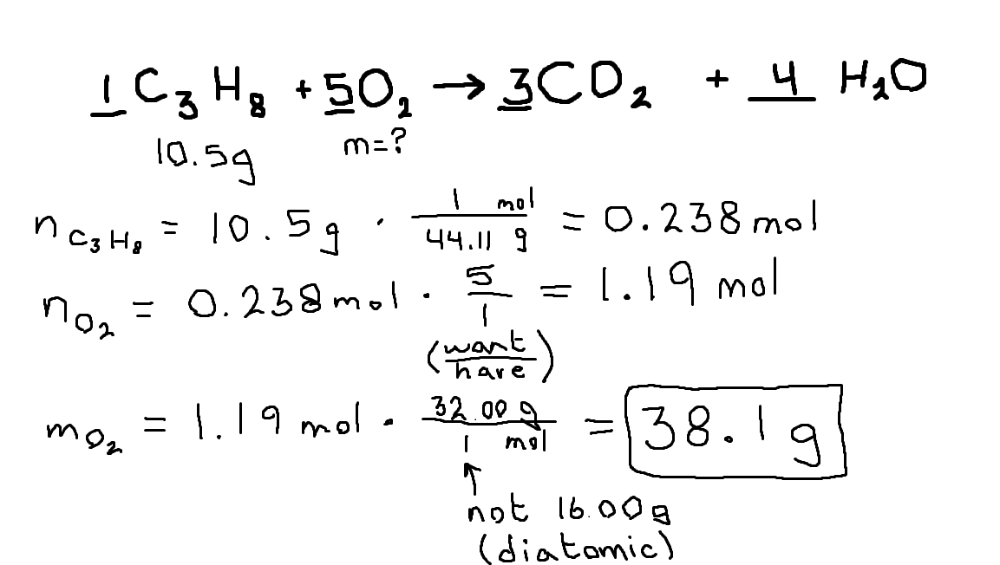
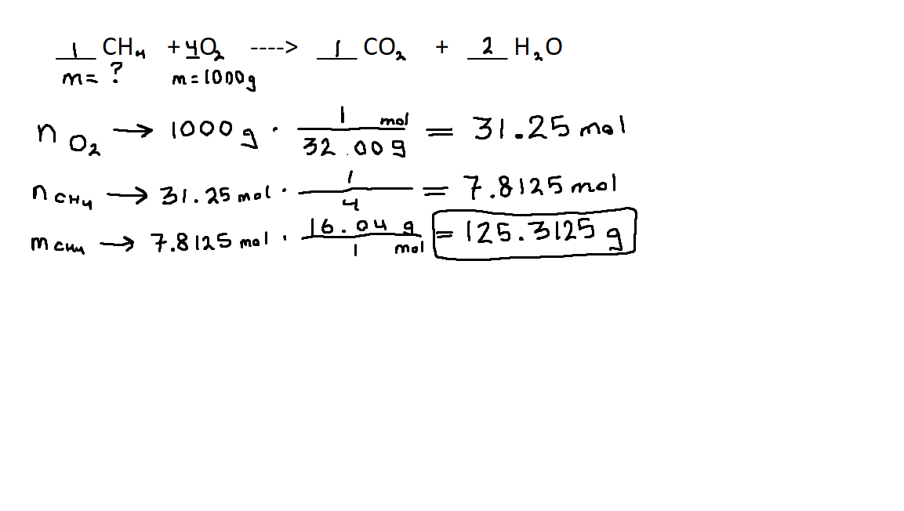
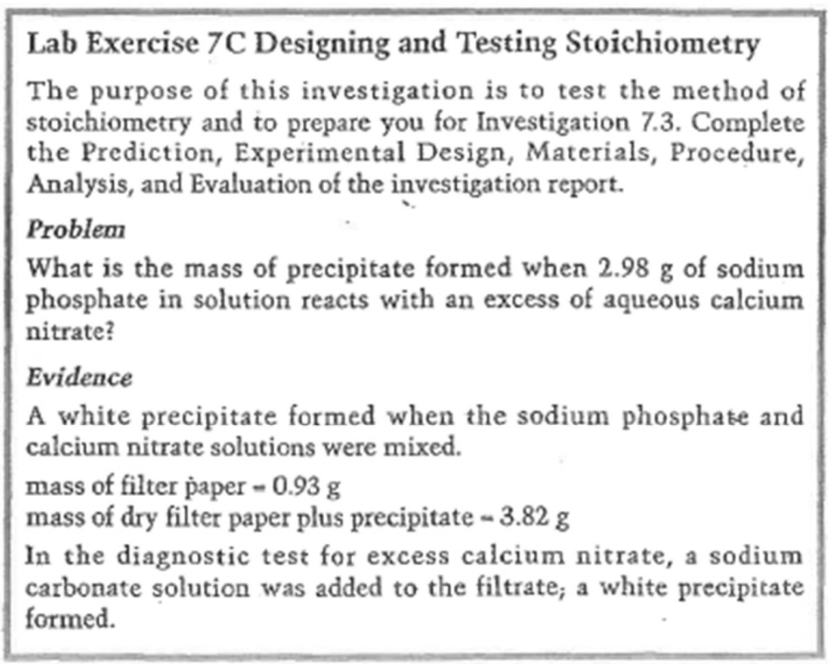

# Stoichiometry

---

[Video](https://drive.google.com/file/d/1dpBWXLBIiKRGruj2w4HtZ1FWgx4wI9-J/view)

# Review of Chemical Reactions and Equations

## Evidence of Chemical Reaction
1. Precipitate
2. Gas
3. Color change
4. Energy change (endo/exothermic)

## Laws of Conservation
The following are conserved in all reactions.
1. number of each kind of atom
2. mass
3. energy

## Balanced Chemical Equation
A balanced chemical equation tells us the...
1. chemical composition of reactants and products
2. phase of the substances involved
3. mole relationship of the substances involved
4. reaction type

## Molecular Elements
$\textrm{Br}_2\space\textrm{I}_2\space\textrm{N}_2\space\textrm{Cl}_2\space\textrm{H}_2\space\textrm{O}_2\space\textrm{F}_2$  
$\textrm{P}_4$  
$\textrm{S}_8$

## Reaction Types
### Formation
$\textrm{element} + \textrm{element} \longrightarrow \textrm{compound}$

### Decomposition (Simple)
$\textrm{compound} \longrightarrow \textrm{element} + \textrm{element}$

### Single Replacement
$\textrm{AB} + \textrm{C} \longrightarrow \textrm{AC} + \textrm{B}$

### Double Replacement
$\textrm{AX} + \textrm{BY} \longrightarrow \textrm{AY} + \textrm{BX}$

### Combustion
$\textrm{compound} + \textrm{O}_2 \longrightarrow \textrm{oxide}$

#### Detailed
$\textrm{compound w/ C} + \textrm{O}_2 \longrightarrow \textrm{CO}_{2 (g)}$  
$\textrm{compound w/ H} + \textrm{O}_2 \longrightarrow \textrm{H}_2\textrm{O}_{(g)}$  
$\textrm{compound w/ N} + \textrm{O}_2 \longrightarrow \textrm{NO}_{2 (g)}$  
$\textrm{compound w/ S} + \textrm{O}_2 \longrightarrow \textrm{SO}_{2 (g)}$  

$\textrm{compound w/ metal} + \textrm{O}_2 \longrightarrow \textrm{metal oxide}_{(s)}$  
*(append oxygen to the metal, balance charges)*

If a compound contains more than one of the above elements, then there are two products. Write each one.

## Balancing
There are two types of balancing.
1. Balancing charges
2. Balancing quantities

### Balancing charges
You must balance charges ~~within~~ a compound.  
To balance, you must change the quantities of each atom in the compound.

State the quantity of the atom as a ~~subscript~~.

$\textrm{Fe}^{3+} + \textrm{NO}_3^- \longrightarrow \textrm{Fe}(\textrm{NO}_3)_{3 (aq)}$

**Tip:** When using an atom in the product, like in a replacement equation, ~~do not carry over the subscript~~.  
The subscript is purely there to balance charges, and since you've now moved the atom, the charges will have to be balanced again with a new atom.

### Balancing quantities
You must balance the quantity of each atom in the ~~entire equation~~.  
To balance, you must change the quantities of ~~each "term"~~ in the equation.

State the quantity of each term with a ~~coefficient~~, which multiplies with each atom in the "term."

**Tip:** Always balance oxygens last.

### Solubility
Remember to verify if new elements together are soluble using the solubility table.

If they are, write the compound as aqueous. (aq)  
If they aren't, write the compound as solid. (s)

# Stoichiometry
A process used to predict the amount of reactant required or product formed in a quantitative (complete, 100%) chemical reaction.

## Steps
1. Write a balanced chemical equation.  
   Include any information given in the question.

2. Calculate the number of moles of the given substance, in order to compare fairly.

3. Use a molar ratio to calculate the moles of the required substance. ~~ALWAYS SHOW IT.~~ (even if it's 1/1)  
   
   $\dfrac{\textrm{want}}{\textrm{have}}$

4. Convert the moles into the requested units.

#### Example
See 29:00 in the video.

# Lab Questions
[Video](https://drive.google.com/file/d/1Yx1rqfcazNW6AS_FrrhsopPIiFc3-AUI)

## Prediction
To get the ~~theoretical/predicted yield~~, what you predict that the yield of the experiment will be.

Simply perform a standard stoichiometry question.  
Ignore the "Evaluation" section for this question.

Tip: The term "excess" is simply stating that the reaction was completed 100%.

## Analysis
To get the ~~actual yield~~, what the yield of the experiment that was actually done is. 

This is often given to you in "Evaluation."  
This depends on every question.

One type of question has the mass of both the precipitate and filter paper and just filter paper. Just subtract to get the mass of precipitate.

## Evaluation
### Quantitative
Calculate *either*...
* % Yield
* % Error

Both of these calculations should add together to equal 100%.

**Legend**
* $Y_a$ Actual yield
* $Y_p$ Predicted/theoretical yield

### % Yield

<h1>
$\textrm{\% yield} = \dfrac{ Y_a }{ Y_p } \times 100$
</h1>

### % Error

<h1>
$\textrm{\% error} = \dfrac{\lvert Y_a - Y_p \rvert}{Y_p} \times 100$
</h1>

### Qualitative
**Experimental Error**  
Describe any aspects ~~not controlled~~ in the procedure.  
Not your errors: flaws with the experiment's wording.

#### Examples
* Some precipitate remained in the beaker, and not on the filter paper.
* Some precipitate may have been blown off the filter paper while drying.

## Example Lab Question

### Prediction
$2 \space\textrm{Na}_3\textrm{PO}_{4 (aq)} + 3 \space\textrm{Ca}(\textrm{NO}_3)_{2 (aq)} \longrightarrow 1 \space\textrm{Ca}_3(\textrm{PO}_4)_{2 (s)} + 6 \space\textrm{NaNO}_{3 (aq)}$

* $m_{\textrm{Na}_3\textrm{PO}_{4 (aq)}} = 2.98\textrm{ g}$
* $m_{\textrm{Ca}_3(\textrm{PO}_4)_{2 (s)}} = ?$

$n_{\textrm{Na}_3\textrm{PO}_{4 (aq)}} \longrightarrow 2.98\textrm{ g} \times \dfrac{163.94\textrm{ g}}{1\textrm{ mol}} = 0.018177382\textrm{ mol}$  
$n_{\textrm{Ca}_3(\textrm{PO}_4)_{2 (s)}} \longrightarrow 0.018177382 \times \dfrac{1}{2} = 0.009088691\textrm{ mol}$  
$m_{\textrm{Ca}_3(\textrm{PO}_4)_{2 (s)}} \longrightarrow 0.009088691\textrm{ mol} \times \dfrac{310.18\textrm{ g}}{1\textrm{ mol}}$  
$m_{\textrm{Ca}_3(\textrm{PO}_4)_{2 (s)}} = 2.819130174\textrm{ g}$

$m_{\textrm{Ca}_3(\textrm{PO}_4)_{2 (s)}} = 2.82\textrm{ g}$

### Analysis
* $m_{\textrm{paper \& precip}} = m_{\textrm{precip}} + m_{\textrm{paper}}$
* $m_{\textrm{paper \& precip}} - m_{\textrm{paper}} = m_{\textrm{precip}}$

$3.82\textrm{ g} - 0.93\textrm{ g} = 2.89\textrm{ g}$  
$m_{\textrm{precip}} = 2.89\textrm{ g}$

### Evaluation
#### Quantitative
$\textrm{\% error} = \dfrac{\lvert \textrm{actual yield} - \textrm{predicted yield} \rvert}{\textrm{predicted yield}} \times 100$

$\textrm{\% error} = \dfrac{\lvert 2.89\textrm{ g} - 2.82\textrm{ g} \rvert}{2.82\textrm{ g}} \times 100$

$\textrm{\% error} = 2.42\%$

#### Quantitative
* Some calcium nitrate precipitate may have remained in the beaker, and not on the filter paper.
* Some calcium nitrate precipitate may have been blown off the filter paper while drying.

# Limiting and Excess Reagants
[Video](https://drive.google.com/file/d/1xBtZMa0vefus0uuYDi0LW3YXRSEtoFti/view)
 
Imagine a 5 hats and 3 people. The product is a person wearing the hat.
 
**Limiting Reagent (LR)**  
Substance that is completely consumed/used up during a reaction.  
It dictates how much product you create. (*e.g. this would be the 3 people.*)
 
**Excess Reagants (ER)**  
Substances that are present when the reaction is complete. (i.e. excess/left over)  
It does not dictate how much product you create. (*e.g. this would be the 5 hats*)
 
## Determining LR & ER
The moles of each substance (aka. coefficients) in a balanced chemical equation is the quantities needed of each substance to complete the reaction and form the product.
 
Therefore...
1. Multiply each molecule by it's molar ratio in the original chemical equation to the product.
2. Whichever molecule gives the ~~smallest~~ number of moles of the product is the only possible option, as it is the limiting reagant.  
    Therefore, the other molecule would be the excess reagant.

See 15:10 in the video for a demonstration.
