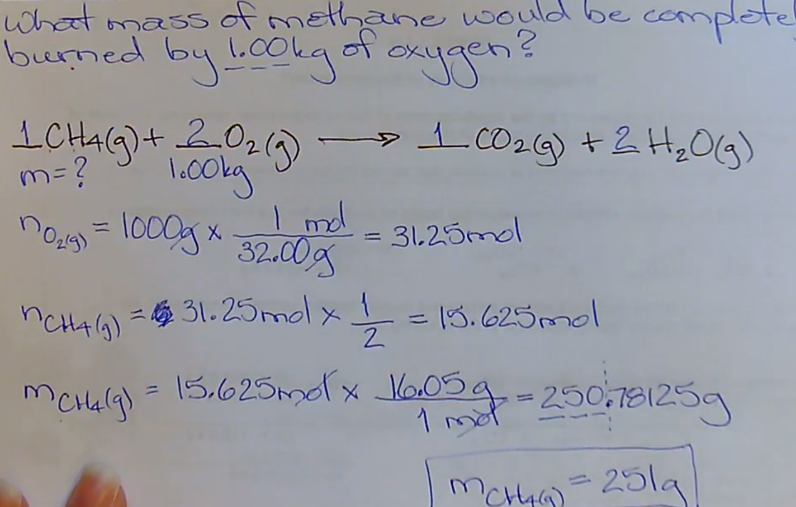

# Stoichiometry

---

[Video](https://drive.google.com/file/d/1dpBWXLBIiKRGruj2w4HtZ1FWgx4wI9-J/view)

# Review of Chemical Reactions and Equations

## Evidence of Chemical Reaction
1. Precipitate
2. Gas
3. Color change
4. Energy change (endo/exothermic)

## Laws of Conservation
The following are conserved in all reactions.
1. number of each kind of atom
2. mass
3. energy

## Balanced Chemical Equation
A balanced chemical equation tells us the...
1. chemical composition of reactants and products
2. phase of the substances involved
3. mole relationship of the substances involved
4. reaction type

## Molecular Elements
$\textrm{Br}_2\space\textrm{I}_2\space\textrm{N}_2\space\textrm{Cl}_2\space\textrm{H}_2\space\textrm{O}_2\space\textrm{F}_2$  
$\textrm{P}_4$  
$\textrm{S}_8$

## Reaction Types
### Formation
$\textrm{element} + \textrm{element} \longrightarrow \textrm{compound}$

### Decomposition (Simple)
$\textrm{compound} \longrightarrow \textrm{element} + \textrm{element}$

### Single Replacement
$\textrm{AB} + \textrm{C} \longrightarrow \textrm{AC} + \textrm{B}$

### Double Replacement
$\textrm{AX} + \textrm{BY} \longrightarrow \textrm{AY} + \textrm{BX}$

#### Replacement with Hydrocarbons
Swap the metal with the final hydrogen in the hydrocarbon.  

### Combustion
$\textrm{compound} + \textrm{O}_2 \longrightarrow \textrm{oxide}$

#### Detailed
$\textrm{compound w/ C} + \textrm{O}_2 \longrightarrow \textrm{CO}_{2 (g)}$  
$\textrm{compound w/ H} + \textrm{O}_2 \longrightarrow \textrm{H}_2\textrm{O}_{(g)}$  
$\textrm{compound w/ N} + \textrm{O}_2 \longrightarrow \textrm{NO}_{2 (g)}$  
$\textrm{compound w/ S} + \textrm{O}_2 \longrightarrow \textrm{SO}_{2 (g)}$  

$\textrm{compound w/ metal} + \textrm{O}_2 \longrightarrow \textrm{metal oxide}_{(s)}$  
*(append oxygen to the metal, balance charges)*

If a compound contains more than one of the above elements, then there are two products. Write each one.

## Balancing
There are two types of balancing.
1. Balancing charges
2. Balancing quantities

### Balancing charges
You must balance charges ~~within~~ a compound.  
To balance, you must change the quantities of each atom in the compound.

State the quantity of the atom as a ~~subscript~~.

$\textrm{Fe}^{3+} + \textrm{NO}_3^- \longrightarrow \textrm{Fe}(\textrm{NO}_3)_{3 (aq)}$

**Tip:** When using an atom in the product, like in a replacement equation, ~~do not carry over the subscript~~.  
The subscript is purely there to balance charges, and since you've now moved the atom, the charges will have to be balanced again with a new atom.

### Balancing quantities
You must balance the quantity of each atom in the ~~entire equation~~.  
To balance, you must change the quantities of ~~each "term"~~ in the equation.

State the quantity of each term with a ~~coefficient~~, which multiplies with each atom in the "term."

**Tip:** Always balance oxygens last.

### Solubility
Remember to verify if new elements together are soluble using the solubility table.

If they are, write the compound as aqueous. (aq)  
If they aren't, write the compound as solid. (s)

# Stoichiometry
A process used to predict the amount of reactant required or product formed in a quantitative (complete, 100%) chemical reaction.

## Steps
1. Write a balanced chemical equation.  
   Include any information given in the question.

2. Calculate the number of moles of the given substance, in order to compare fairly.  
   To calculate number of moles of a solid...  
   $n = m \times \dfrac{1 \textrm{ mol}}{\textrm{molar mass (g)}}$

3. Use a molar ratio to calculate the moles of the required substance. ~~ALWAYS SHOW IT.~~ (even if it's 1/1)  
   
   $\dfrac{\textrm{want}}{\textrm{have}}$

4. Convert the moles into the requested units.  
   To calculate the mass of a solid from the number of moles...  
   $m = n \times \dfrac{\textrm{molar mass (g)}}{1 \textrm{ mol}}$

#### Example
See 29:00 in the video.

### Concentration
[Video (before 19:30)](https://drive.google.com/file/d/1555sNDgcoaihalCE_VEIhbpKoMLTFscc/view)

You may also use concentration and volume.  
~~Volume times concentration equals moles.~~

$\textrm{volume (L)} \times \dfrac{1 \textrm{ mol}}{\textrm{? L}} = \textrm{moles (mol)}$

$\textrm{moles (mol)} \times \dfrac{\textrm{? L}}{1 \textrm{ mol}} = \textrm{volume (L)}$

$\textrm{concentration} = \dfrac{a \textrm{ mol}}{b \textrm{ L}}$

Some questions will give you the volume and concentration of a substance.  
Perform step 2 of stoich by getting the moles using volume and concentration.

# Lab Questions
[Video](https://drive.google.com/file/d/1Yx1rqfcazNW6AS_FrrhsopPIiFc3-AUI)

## Prediction
To get the ~~theoretical/predicted yield~~, what you predict that the yield of the experiment will be.

Simply perform a standard stoichiometry question.  
Ignore the "Evaluation" section for this question.

Tip: The term "excess" is simply stating that the reaction was completed 100%.

## Analysis
To get the ~~actual yield~~, what the yield of the experiment that was actually done is. 

This is often given to you in "Evaluation."  
This depends on every question.

One type of question has the mass of both the precipitate and filter paper and just filter paper. Just subtract to get the mass of precipitate.

## Evaluation
### Quantitative
Calculate *either*...
* % Yield
* % Error

Both of these calculations should add together to equal 100%.

**Legend**
* $Y_a$ Actual yield
* $Y_p$ Predicted/theoretical yield

### % Yield

<h1>
$\textrm{\% yield} = \dfrac{ Y_a }{ Y_p } \times 100$
</h1>

### % Error

<h1>
$\textrm{\% error} = \dfrac{\lvert Y_a - Y_p \rvert}{Y_p} \times 100$
</h1>

### Qualitative
**Experimental Error**  
Describe any aspects ~~not controlled~~ in the procedure.  
Not your errors: flaws with the experiment's wording.

#### Examples
* Some precipitate remained in the beaker, and not on the filter paper.
* Some precipitate may have been blown off the filter paper while drying.

## Example Lab Question

### Prediction
$2 \space\textrm{Na}_3\textrm{PO}_{4 (aq)} + 3 \space\textrm{Ca}(\textrm{NO}_3)_{2 (aq)} \longrightarrow 1 \space\textrm{Ca}_3(\textrm{PO}_4)_{2 (s)} + 6 \space\textrm{NaNO}_{3 (aq)}$

* $m_{\textrm{Na}_3\textrm{PO}_{4 (aq)}} = 2.98\textrm{ g}$
* $m_{\textrm{Ca}_3(\textrm{PO}_4)_{2 (s)}} = ?$

$n_{\textrm{Na}_3\textrm{PO}_{4 (aq)}} \longrightarrow 2.98\textrm{ g} \times \dfrac{163.94\textrm{ g}}{1\textrm{ mol}} = 0.018177382\textrm{ mol}$  
$n_{\textrm{Ca}_3(\textrm{PO}_4)_{2 (s)}} \longrightarrow 0.018177382 \times \dfrac{1}{2} = 0.009088691\textrm{ mol}$  
$m_{\textrm{Ca}_3(\textrm{PO}_4)_{2 (s)}} \longrightarrow 0.009088691\textrm{ mol} \times \dfrac{310.18\textrm{ g}}{1\textrm{ mol}}$  
$m_{\textrm{Ca}_3(\textrm{PO}_4)_{2 (s)}} = 2.819130174\textrm{ g}$

$m_{\textrm{Ca}_3(\textrm{PO}_4)_{2 (s)}} = 2.82\textrm{ g}$

### Analysis
* $m_{\textrm{paper \& precip}} = m_{\textrm{precip}} + m_{\textrm{paper}}$
* $m_{\textrm{paper \& precip}} - m_{\textrm{paper}} = m_{\textrm{precip}}$

$3.82\textrm{ g} - 0.93\textrm{ g} = 2.89\textrm{ g}$  
$m_{\textrm{precip}} = 2.89\textrm{ g}$

### Evaluation
#### Quantitative
$\textrm{\% error} = \dfrac{\lvert \textrm{actual yield} - \textrm{predicted yield} \rvert}{\textrm{predicted yield}} \times 100$

$\textrm{\% error} = \dfrac{\lvert 2.89\textrm{ g} - 2.82\textrm{ g} \rvert}{2.82\textrm{ g}} \times 100$

$\textrm{\% error} = 2.42\%$

#### Quantitative
* Some calcium nitrate precipitate may have remained in the beaker, and not on the filter paper.
* Some calcium nitrate precipitate may have been blown off the filter paper while drying.

# Limiting and Excess Reagants
[Video](https://drive.google.com/file/d/1xBtZMa0vefus0uuYDi0LW3YXRSEtoFti/view)
 
Imagine a 5 hats and 3 people. The product is a person wearing the hat.
 
**Limiting Reagent (LR)**  
Substance that is completely consumed/used up during a reaction.  
It dictates how much product you create. (*e.g. this would be the 3 people.*)
 
**Excess Reagants (ER)**  
Substances that are present when the reaction is complete. (i.e. excess/left over)  
It does not dictate how much product you create. (*e.g. this would be the 5 hats*)
 
## Determining LR & ER
The moles of each substance (aka. coefficients) in a balanced chemical equation is the quantities needed of each substance to complete the reaction and form the product.
 
Therefore...
1. Multiply each molecule by it's molar ratio in the original chemical equation to the product.
2. Whichever molecule gives the ~~smallest~~ number of moles of the product is the only possible option, as it is the limiting reagant.  
    Therefore, the other molecule would be the excess reagant.

See 15:10 in the video for a demonstration.

## Example
What would be the mass of precipitate produced by the reaction of 2.00 g of strontium nitrate in solution with 2.56 g of copper (II) sulfate in solution?

# Gas Stoichiometry
[Video](https://drive.google.com/file/d/1rNnHGHbaoiJRdWhD8lIH017EyZMKju5x/view)

## Steps
1. Write a balanced chemical equation.  
   Include any information given in the question.

2. Calculate the number of moles of the given substance, in order to compare fairly.  
   To get the molar mass of a gas, solve for $n$ in the following formula.  
   $pv = nRT$
   
   $R = \textrm{universal gas constant} = 8.314 \dfrac{\textrm{kPa}\cdot\textrm{L}}{\textrm{mol}\cdot\textrm{K}}$)

3. Use a molar ratio to calculate the moles of the required substance. ~~ALWAYS SHOW IT.~~ (even if it's 1/1)  
   
   $\dfrac{\textrm{want}}{\textrm{have}}$

4. Convert the moles into the requested units.  
   For gases, use the following formula, solving for whichever value is requested.  
   $pv = nRT$

## Reminder

# Titrations
[Video (after 19:30)](https://drive.google.com/file/d/1555sNDgcoaihalCE_VEIhbpKoMLTFscc/view)

Titration is the progressive addition of one reactant to another until equivalent quantites have reacted.  
Think of it as slowing dripping a solution into another, until the exact moment that it reacts.

It must be done into an ~~Erlenmeyer flask~~.

| Term | Definition |
| ---- | ---------- |
| **titrant** | The solution in the buret used to analyze the sample.  The titrant must be a standard solution. (known concentration) |
| **equivalence point** | The volume of titrant added for a complete reaction,  OR, when chemically equivalent (moles) amounts of the reactants have reacted. |
| **equivalent/end point** | When there is a change in a physical property of the solution to indicate a complete reaction has occured. Often a colour change from the indicator. |

## Volume in Buret
The volume measurements of a buret are read from ~~top down~~.

The initial volume is how much solution in the buret before you've done any titration.  
The final volume is how much solution is in the buret after you've performed titration and the solution in the flask has reacted.

To calculate the volume of titrate added, subtract the initial volume from the final volume. ($V_f - V_i = V_{\textrm{added}}$)

## Trial Values

### Extremes
When looking at data, it's a good idea to only use the pieces of data that are close to each other.  
A common way is to only include data that is within 0.2 mL of each other.  
Anything else is considered an "extreme value."

### Average
Once you have decided the values you want to use, calculate the average of them.  
You can round this average or keep it complete, both are acceptable answers.

# Titration Curves
[Video](https://drive.google.com/file/d/1IjXPn7HPinDLdq4Ff_K7r8H_BOezhp4l/view)

Majority of titration analysises involve acid-base reactions.  
Acid-base reactions...
* are very common
* involve a pH change
* have easy to find indicators of reactions

**Equivalence Point** (in the context of acid-base reactions)  
The point at which equal amount of moles of the acid reactant and base reactant have combined.

When strong monoprotic acids--acids with only one hydrogen--are neutralized by strong bases, the equivalence point has a pH of 7.  
All hydronium ions have been neutralized/cancelled by an equal amount of hydroxide ions.

**End Point**  
A physical property change marking the completion of a reaction.  
This is usually a colour change using an indicator.  
You can also use a pH meter to watch the progress to this point.

The indicator should be where the reaction takes place. In the context of titration, in the Erlenmeyer flask.

## pH/Titration Curve
An S-shaped curve graph of the pH of a reaction in relation to the volume of titrant added.

### Steep Changes
* Steep rise = complete neutralization of strong acid sample
* Steep drop = complete neutralization of strong base sample

### pH of Equivalence Point
* The middle of the steep rise/drop of the curve is the pH at the equivalence point.
* All monoprotic strong acids titrated with a monoprotic strong base have an equivalence point with a pH of 7.

### Examples
A strong base titrant added to a strong acid sample will...
* start as a low pH
* pH gradually increases as reaction progresses (buffering action)
* suddenly jumps to the pH of the base titrant (because all acids have been neutralized, so the base is by itself)
* will eventually reach a pH close to the pH of the base titrant
* the pH of the middle of the jump is the equivalence point

A strong acid titrant added to a strong base sample will...
* start as a high pH
* pH gradually decreases as reaction progresses (buffering action)
* suddenly jumps to the pH of the base sample (because all bases have been neutralized, so the acid is by itself)
* will eventually reach a pH close to the pH of the base sample
* the pH of the middle of the jump is the equivalence point

## Indicators
Indicators are listed in your data booklet.

A good indicator is one that's entire pH range is during the steep rise/drop of the curve.  
The ideal indicator additionally includes the equivalence/end point pH in the range.

In this case, bromothymol blue is the ideal indicator, since it's pH range is $6.0$ to $7.6$.  
Since this is a strong acid and a strong base, the equivalence point has a pH of 7, which is within the range of bromothymol blue.

## Questions
See 37:00 in the video for a titration curve question.
