# Electrochemistry

?> In most examples, states of substances will not be written; remember that they are still required in all equations in an actual examination.

?> Arrows in equations are written as one direction for aesthetics.  
   In reality, all redox reactions are reversable.

---

# Essentials
**Oxidation**  
Complete or partial loss of electrons.  
(or, gain of oxygen)

**Reduction**  
Complete or partial gain of electrons.  
(or, loss of oxygen)

**Reduction Oxidation (Redox) Reaction**  
Electrons are transferred between reactants.  
All oxidation reactions are accompanied by reduction reactions.

## Half Reactions
Separation of net redox reactions into two separate oxidation and reduction reactions.

Always write the $e^-$ on the side with the ~~most positive charge~~.

##### Oxidation Half Reaction Example
$\textrm{Mg} \longrightarrow \textrm{Mg}^{2+} + 2e^-$

~~$e^-$ always on the **right** of the arrow.~~

##### Reduction Half Reaction Example
$\textrm{S} + 2e^- \longrightarrow \textrm{S}^{2-}$

~~$e^-$ always on the **left** of the arrow.~~

#### Bonus
I personally remember this by thinking *\"Reduction left the electrons.\"*  
No fun abbreviation here, just remember it. 

## Agents
The substance that makes a reaction possible is the agent of that reaction.

For instance, in a redox reaction,
* the substance that donates the electrons (oxidizes) is the **reducing agent (RA)**.
* the substance that receives the electrons (reduces) is the **oxidizing agent (OA)**.

In other words, a substance is the ~~opposite agent to what it did~~.

## Spectator Ion
An ion that undergoes no electron transfer.  
*e.g. $\textrm{NO}_3^-$ in the upcoming section*

You can determine these by...
* Checking if ~~charges change~~ from the reactant to product side.
* Checking if ~~oxidation numbers~~ (covered later) ~~change~~ from the reactant to product side.
* Checking if the ion is anywhere on the half reduction reaction table. (covered later)  
  If it ~~isn't~~, its a ~~spectator~~, at this level.

You can even optionally ~~remove spectators from your equations~~ to clean them up.

# Determing the Redox of an Equation
1. Identify and ~~ignore~~ any ~~spectator~~ ions.
2. Determine ~~what has gained~~ electrons, and ~~what has lost~~ electrons.
   1. Pay attention to ~~quantities~~ (coefficients and subscripts) as the amount of ~~electrons gained/lost~~ will be ~~multiplied by them~~.
      *e.g. $\textrm{Br}_2 + 2e^- \longrightarrow 2\textrm{Br}^-$, $2\textrm{Br}^-$ needs 2 electrons to be neutral.*
3. Write out the equation showing ions.  
   This can be done by ~~cancelling the equal electrons~~ between both half reactions.
4. Verify that the ~~sum of charges~~ of all ions on both sides remains ~~constant~~. (if not, it isn't truly redox)

#### Example Problem
*What is oxidized and what is reduced in the following reaction?*

$2\textrm{AgNO}_3 + \textrm{Cu} \longrightarrow \textrm{Cu} ( \textrm{NO}_3 )_2 + 2\textrm{Ag}$

1. $\textrm{NO}_3^-$ is a spectator ion. Ignore it.  

2. $2\textrm{Ag}^+ + 2e^- \longrightarrow 2\textrm{Ag}$ (or $2(\textrm{Ag}^+ + e^- \longrightarrow \textrm{Ag})$)  
   *($\textrm{Ag}$ went from missing 1 electron to being balanced, but since there are 2 of them on both sides, 2 electrons were actually missing)*

   $\textrm{Cu} \longrightarrow \textrm{Cu}^{2+} + 2e^-$

3. $2\textrm{Ag}^+ + \textrm{Cu} \longrightarrow 2\textrm{Ag} + \textrm{Cu}^{2+}$

4.

The following tables are simply the charges of each ion in the equation.

| $2\textrm{Ag}^+$ | $+$ | $\textrm{Cu}$ | $\longrightarrow$ | $2\textrm{Ag}$ | $+$ | $\textrm{Cu}^{2+}$ |
| --- | --- | --- | --- | --- | --- | --- |
| $2+$ | $+$ | $0$ | $=$ | $0$ | $+$ | $2+$ |

They are equal on both sides, therefore the redox reaction is verified.

## Inequal Net Charges
Sometimes the net charges of both sides of the equation will not be equal, despite being a redox reaction.

In these cases, ~~multiply both~~ half reactions by the ~~lowest common denominator~~, so that the net electrons of both half reactions are equal.

#### Example Problem
$\textrm{Al} + \textrm{Cd}(\textrm{NO}_3)_2 \longrightarrow \textrm{Al}(\textrm{NO}_3)_3 + \textrm{Cd}$

1. $\textrm{NO}_3^-$ is a spectator ion. Ignore it.  

2. $\textrm{Al} \longrightarrow \textrm{Al}^{3+} + 3e^-$  
   $\textrm{Cd}^{2+} + 2e^- \longrightarrow \textrm{Cd}$

   Issue: The electrons of both equations do not cancel with each other.  
   Solution: Multiply each entire half reaction by something so that the electrons are equal and can cancel.

   $2(\textrm{Al} \longrightarrow \textrm{Al}^{3+} + 3e^-)$  
   $3(\textrm{Cd}^{2+} + 2e^- \longrightarrow \textrm{Cd})$

   $2\textrm{Al} \longrightarrow 2\textrm{Al}^{3+} + 6e^-$  
   $3\textrm{Cd}^{2+} + 6e^- \longrightarrow 3\textrm{Cd}$

   Now both half reactions have $6e^-$.

3. $2\textrm{Al} + 3\textrm{Cd}^{2+} \longrightarrow 2\textrm{Al}^{3+} + 3\textrm{Cd}$  
   Net charge is constant: $0 + +6 = +6 + 0$

## Don't Be Fooled By Compounds
Always ~~separate compounds~~---probably in your head---before determining if there was an electron transfer.

#### Example Problem
$\textrm{Pb}^{2+} + 2\textrm{I}^- \longrightarrow \textrm{PbI}_2$

Seems like electrons were transferred, but separate the elements in the compound...

$\textrm{Pb}^{2+} + 2\textrm{I}^- \longrightarrow \textrm{Pb}^{2+} + 2\textrm{I}^-$

There was no transfer! Not redox.


# Oxidation Numbers
Oxidation numbers are like a ~~fake/virtual charge~~.

~~Molecules~~ have ~~no charges~~.  
Polyatomic ions only have charges for the ~~entire ion~~, not individual elements.

Despite these factors, redox is still possible on them.
Therefore, we need to "make up" a charge.

Oxidation numbers are a positive or negative number assigned to an atom in a molecule or polyatomic ion ~~based primarily on electronegativities~~.  
It is the charge an atom *would have*, since ~~electrons are inequally shared~~, ~~favoring~~ the element with the ~~greater electronegativity~~.

## Steps
1. Determine the ~~charge~~ on the ~~entire compound~~.  
   The ~~net charge of all elements~~ in the compound must ~~equal this value~~.
   1. For molecular compounds, this is zero.
   2. For polyatomic ions, it depends, so use your data booklet.
2. Identify and state any ~~exceptions~~. [*(see the next section)*](#Exceptions)
3. The element with the ~~highest electronegativity~~ has an oxidation number ~~equal to its ionic charge~~. (data booklet)
4. For all previous and future elements, ~~multiply the oxidation number by the quantity~~ of an element.  
   *This is ~~not a new oxidation number~~ value;* this value is solely used for ~~calculating the net charge~~.
5. Do one of the two options below on any remaining elements to ultimately reach the desired net charge.
   1. The element with the ~~next highest electronegativity~~ has an oxidation number equal to its ionic charge. (data booklet)
   2. The oxidation number is ~~any positive or negative value~~ that causes the ~~net charge~~ to be the ~~desired value~~.  

## Exceptions

* **Atoms = $0$**  
  All atoms (monotomic, diatomic, or polyatomic) have an oxidation number equal to their charge---zero.

* **Ions = Charge**  
  All ~~monatomic/simple~~ ions have an oxidation number equal to their charge.

* **Group 1 = $1+$**  
  All alkali metals---group 1---have an oxidation number of +1.

* **Group 2 = $2+$**  
  All alkaline earths---group 2---have an oxidation number of +2.

* **$\textrm{F}$ = $1-$**  
  Fluorine is the most electronegative element, so its oxidation number is always -1.

* **$\textrm{H}^+$ = $1+$, or $\textrm{H}^-$ = $1-$**  
  Hydrogen has an oxidation number of +1 in most cases.  
  In an ionic ~~hydride~~, hydrogen has an oxidation number of -1.  
  *e.g. $\textrm{NaH}$ aka. $\textrm{Na}^+\textrm{H}^-$*  
  *tip: most of the time, hydrides can only be ~~paired with metals~~*

* **$\textrm{O}$ = $2-$, or $\textrm{O}$ = $1-$**  
  Oxygen has an oxidation number of -2 in most cases.  
  In a peroxide, which is $\textrm{O}_2^{2-}$, oxygen has an oxidation number of -1.  
  *e.g. $\textrm{H}_2\textrm{O}_2$, $\textrm{Na}_2\textrm{O}_2$*  
  *tip: peroxides are only ~~paired with metals~~, ~~except~~ for ~~hydrogen~~ peroxide*

## Examples
The oxidation number of an element is typically written above it. (its all preference)  
I cannot do that, so it'll be beside, the elements the same order as in the compound.

[Oxidation Number Calculator](https://www.periodni.com/oxidation_numbers_calculator.php)

* $\textrm{S}_8$: 0
* $\textrm{H}_2\textrm{S}$: 1+, 2+
* $\textrm{CuF}_2$: 2+, 1-
* $\textrm{PbCrO}_4$: 2+, 6+, 2-
* $(\textrm{Cr}_2\textrm{O}_7)^{2-}$: 6+, 2-
* $\textrm{NH}_4\textrm{NO}_3$: -3, +1, +5, -2
  * This is unique, because its actually two polyatomic ions combined together.  
    $\textrm{NH}_4$ has a 1+ charge, and $\textrm{NO}_3$ has a 1- charge.

* Probably won't appear on exams: $\textrm{I}_3^-$: -1/3


# Spontaneity
You can determine if a redox reaction will be spontaneous or not using the reduction half reactions on ~~page 7~~.

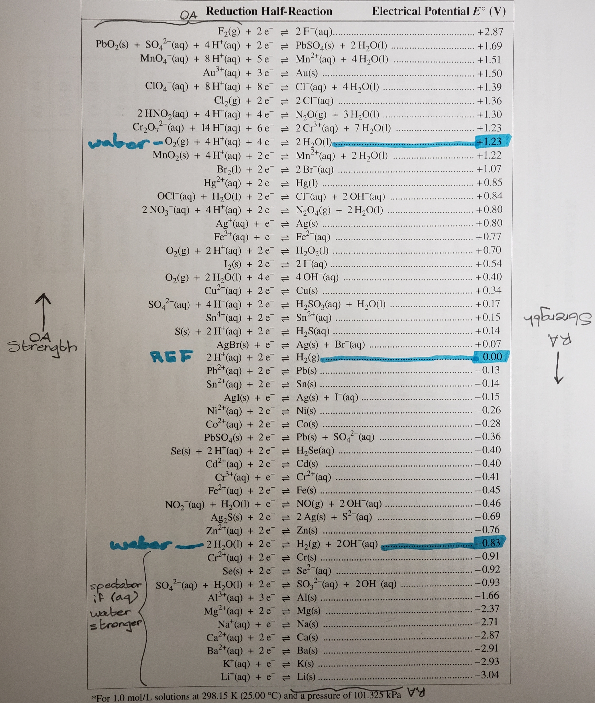

## Interpretation
The ~~left~~ hand side contains ~~oxidizing agents~~. (meaning they reduce)  
The ~~right~~ hand side contains ~~reduction agents~~. (meaning they oxidize)

The ~~strength~~ of the ~~oxidizing agents~~ increases as you ~~go up~~ in the page.  
The ~~strength~~ of the ~~reducing agents~~ increases as you ~~go down~~ in the page.  

To put it short, ~~top left is strongest oxidizing agent~~, ~~bottom right is strongest reducing agent~~.

In addition, the ~~greater the distance~~ between the two agents, the ~~faster the reaction~~ will occur.

## Application
Spontaneous reactions occur in voltaic cells, non-spontaneous reactions in electrolytic cells. (covered later) Otherwise, nothing happens.

A ~~spontaneous~~ redox reaction only occurs if the ~~oxidizing agent is stronger/above the reducing agent~~ in the table.  
If the ~~oxidizing agent is weaker/below the reducing agent~~, the reaction is ~~non-spontaneous~~.

<span id="ib">IB</span> *Since the only point of IB is mindless memorization, their data booklet's table is upside-down.*  
For ~~only the IB table~~, a spontaneous redox reaction only occurs if the ~~reducing agent is above the oxidizing agent~~ in the table.  

Pay attention to the electrical potentials also on the table.  
If they start high to low from top to bottom, its like the Alberta databook.  
If they start high to low from bottom to top, its like the IB databook.


# Making Reduction Half Reaction Tables

## From Lab Data
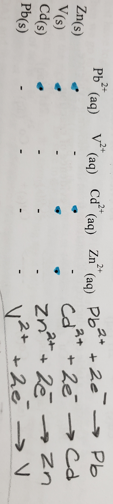

The dots denote that the reaction was spontaneous.

Since these tables are about reduction reactions, you should be ~~reading the table~~ from the ~~direction of the oxidizing agents~~.  
In this case, the ions on the top are the oxidizing agents, so read the data vertically.

The element that is ~~spontaneous with more~~ other elements is the ~~stronger oxidizing agent~~ and weaker reducing agent.  
The element that is ~~spontaneous with fewer~~ other elements is the weaker oxidizing agent and ~~stronger reducing agent~~.

You can then write a reduction half reaction table, strongest oxidizing agent in the top left, strongest reducing agent in the bottom right.

## From Reactions
The following steps are to be used when asked for a reduction half reaction table.  
You will usually be given a ~~series of redox reactions~~...
* some with a solution
* some with "no evidence of reaction," meaning there was no reaction.

## Steps
1. Identify the oxidation agent and the reduction agent.  
   *(remember, OA reduces/gains $e^-$, RA oxidizes/loses $e^-$)*

2. If there is evidence of a reaction, the reaction is ~~spontaneous~~.  
   ~~OA must be above the RA~~ in the table.  
   You can denote this with $\dfrac{\textrm{OA}}{\textrm{RA}}$ (charges not needed)

   If there is no evidence of a reaction, the reaction is ~~non-spontaneous~~.  
   ~~RA must be above the OA~~ in the table.  
   You can denote this with $\dfrac{\textrm{RA}}{\textrm{OA}}$ (charges not needed)

   Do this for every unique element in the reaction.

3. Combine the denotations to get the ~~order~~ of the table.  
   *e.g. If I had $\dfrac{\textrm{X}}{\textrm{Y}}$ and $\dfrac{\textrm{Y}}{\textrm{Z}}$, then the combined true order is X/Y/Z.*

3. Once you have the order, write a ~~redox reaction for each unique element~~ in said ~~order~~.  
   $\textrm{OA}^x + xe^- \longrightarrow \textrm{OA}$  
   $x$: the charge of the OA from anywhere, even across equations in the same problem.  

4. With a complete "table"/list, you can now determine...  
   * The highest element on the left-hand side (top-left) is the ~~strongest oxidation agent~~. (SOA)
   * The lowest element on the right-hand side (bottom-right) is the ~~strongest reduction agent~~. (SRA)

#### Example
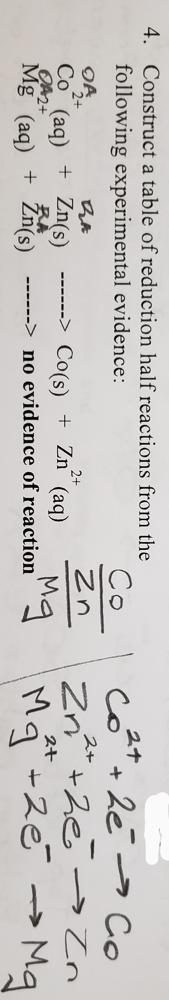

In this example...
* $\textrm{Co}^{2+}$ is the strongest oxidizing agent
* $\textrm{Mg}$ is the strongest reducing agent
* $\textrm{Mg}^{2+}$ is the weakest oxidizing agent
* $\textrm{Co}$ is the weakest reducing agent


# Predicting Redox Reactions
When given a ~~mixture of aqueous substances~~ (ions and molecules), you may be asked to ~~predict which substances will react~~.  
This heavily relies on page 7 of your data booklet.

## Identifying Substances
For reaction prediction questions, most of the time you will be given a ~~*word problem*~~, and you have to find out the equation notation for each compound.  
Here are some tips.

### Atoms
If the species is an atom, include it with ~~no modifications~~.  
Make sure to properly denote diatomic and polyatomic atoms from Science 10. (e.g. $S_8$)

### Molecular
If the species is molecular compound, include it with ~~no modifications~~.

### Ionic
For ionic species, you need to ~~check the solubility~~ of the compound using ~~page 6~~ in your data booklet.

#### Low Solubility
If the species is a lowly soluble ionic compound, include it with ~~no modifications~~.

#### High Solubility
If the species is a highly soluble ionic compound...
1. ~~Dissociate~~/separate the compound into its ions.
2. ~~Add $\textrm{H}_2\textrm{O}_{\textrm{(l)}}$~~ to the equation.

### Acids
For acid species, you need to check if the acid is strong or weak.  
An acid is strong if it is ~~one of the first six~~ in the table on ~~page 8~~ in your data booklet.  
Otherwise, its weak.

#### Weak Acids
If the species is a weak acid...
1. Include it with ~~no modifications~~.
2. ~~Add $\textrm{H}_2\textrm{O}_{\textrm{(l)}}$~~.

#### Strong Acids
If the species is a strong acid...
1. ~~Ionize~~/separate the acid into its ions. (the acid's anion & ~~$\textrm{H}^+_{\textrm{(aq)}}$~~)
2. ~~Add $\textrm{H}_2\textrm{O}_{\textrm{(l)}}$~~.

**Example**  
$\textrm{HCl}_{\textrm{(aq)}}$'s components are...
* $\textrm{Cl}^-_{\textrm{(aq)}}$.
* $\textrm{H}^+_{\textrm{(aq)}}$.

### Extra Tips
* If the question mentions...
  * just an elements name and nothing else, such as "Copper is added..."  
    It is most likely a solid copper atom with no charge.
  * "exposed to moist air."  
    It most likely just means water and air is present.
* Most *(not all!)* oxides have low solubility. (e.g. $\textrm{PbO}_2$)

## Steps
1. * For every substance identified (see previous section) find out whether they are an ~~oxidizing agent or a reducing agent~~.  
     (Using page 7 and seeing if they are on the left or right side respectively)
   * Some substances can appear on ~~both sides on the table~~, meaning they are both an oxidizing and reducing agent ~~depending on other reactants~~.  
     Make sure not to mix up their reactions.
   * Some substances are ~~not agents on their own~~, rather only when ~~other specific reactants are present~~.  
     Make sure to include these, making it clear that they are only an agent when together.

2. The predicted redox reactions will ~~only occur~~ with the ~~strongest oxidizing agent~~ and the ~~strongest reduction agent~~.  
   Identify both of those as usual.  
   (strongest oxidizing top left of table, strongest reducing bottom right of table)

3. Once each strongest agent is identified, ~~write~~ down the ~~entire equation/line of both~~.
   * Make sure one reaction is reduction and one reaction is oxidation.  
     (one with electrons before arrow, one with electrons after)  
     You can switch between the two if needed by swapping the substances on each side. (i.e. ~~write it backwards~~)

Beyond this point is things you've done before.

4. Get the electrons on both sides to ~~equal the same to cancel them~~.  
   You can do this by multiplying by the lowest common denominator.

5. Combine the reactions after cancelling the electrons.

6. You can also optionally state that the equation is spontaneous.  
   (no specific way to do this, I personally just write an 'S' above the arrow)

#### Example
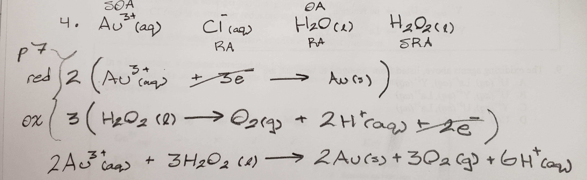


# Balancing Redox Equations
Ultimately you still end up with a net redox reaction, but these questions give you an ~~unbalanced redox equation~~.  
You need to balance said equations without using page 7.

## Steps (Half Reaction Method)
1. Break down the redox reaction ~~into half reactions~~.  
   You should have two unbalanced half reactions.
   * Pair up each compound on one side with the other.  
     Make sure to pair up compounds that ~~share an element~~.

For each of the two half reactions, perform the following steps.

2. Use coefficients to ~~balance the quantity of atoms~~ on both sides, ~~**except oxygen and hydrogen**~~.

3. Add any number of $\textrm{H}_2\textrm{O}_{\textrm{(l)}}$ molecules to ~~balance the quantity of oxygen~~ on both sides.

4. Add any number of $\textrm{H}^+_{\textrm{(aq)}}$ molecules on the other side of the water molcules to ~~balance the quantity of hydrogen~~ on both sides.  
   *(you are essentially undoing the hydrogens you added with water)*

*(For 3. and 4., make sure to ~~account for pre-existing quantities~~ of H & O)*

5. Balance the ~~net charges of the entire sides~~ by adding electrons like before.

Everything beyond this point is not new.

6. If the electrons in both half equations are equal, cancel them out.  
   If not, multiply both half equations by a lowest common denominator to make them equal.

7. Combine the half reactions.  
   Reduce/simplify coefficients of substances on both sides if possible.

8. Verify that it's still a redox reaction by making sure net charges on both sides are equal, like before.

### Summary
1. Split into 1/2 Reactions
Then, balance...
2. Atoms (no O or H)
3. Oxygens
4. Hydrogens
5. Charges (aka. Cancel Electrons)

## Example
### Step-by-Step
$\textrm{NO}_3^- + \textrm{P}_4 \longrightarrow \textrm{H}_3\textrm{PO}_4 + \textrm{NO}_2$

1. Reduction  
   OA ---> $\textrm{NO}_3^- \longrightarrow \textrm{NO}_2$  
   Oxidation  
   RA ---> $\textrm{P}_4 \longrightarrow \textrm{H}_3\textrm{PO}_4$

2. $\textrm{NO}_3^- \longrightarrow \textrm{NO}_2$  
   $\textrm{P}_4 \longrightarrow 4\textrm{H}_3\textrm{PO}_4$

3. $\textrm{NO}_3^- \longrightarrow \textrm{NO}_2 + \textrm{H}_2\textrm{O}$  
   $16\textrm{H}_2\textrm{O} + \textrm{P}_4 \longrightarrow 4\textrm{H}_3\textrm{PO}_4$

4. $2\textrm{H}^+ + \textrm{NO}_3^- \longrightarrow \textrm{NO}_2 + \textrm{H}_2\textrm{O}$  
   $16\textrm{H}_2\textrm{O} + \textrm{P}_4 \longrightarrow 4\textrm{H}_3\textrm{PO}_4 + 20\textrm{H}^+$

5. $1e^- + 2\textrm{H}^+ + \textrm{NO}_3^- \longrightarrow \textrm{NO}_2 + \textrm{H}_2\textrm{O}$  
   $16\textrm{H}_2\textrm{O} + \textrm{P}_4 \longrightarrow 4\textrm{H}_3\textrm{PO}_4 + 20\textrm{H}^+ + 20e^-$

6. $20(1e^- + 2\textrm{H}^+ + \textrm{NO}_3^- \longrightarrow \textrm{NO}_2 + \textrm{H}_2\textrm{O})$  
   $16\textrm{H}_2\textrm{O} + \textrm{P}_4 \longrightarrow 4\textrm{H}_3\textrm{PO}_4 + 20\textrm{H}^+ + 20e^-$

7. $40\textrm{H}^+ + 20\textrm{NO}_3^- + 16\textrm{H}_2\textrm{O} + \textrm{P}_4 \longrightarrow 20\textrm{NO}_2 + 20\textrm{H}_2\textrm{O} + 4\textrm{H}_3\textrm{PO}_4 + 20\textrm{H}^+$

  Simplified:  
  $20\textrm{H}^+ + 20\textrm{NO}_3^- + \textrm{P}_4 \longrightarrow 20\textrm{NO}_2 + 4\textrm{H}_2\textrm{O} + 4\textrm{H}_3\textrm{PO}_4$

8. $+20$ + $-20$ + $0$ = $0$ + $0$ + $0$

### Concise
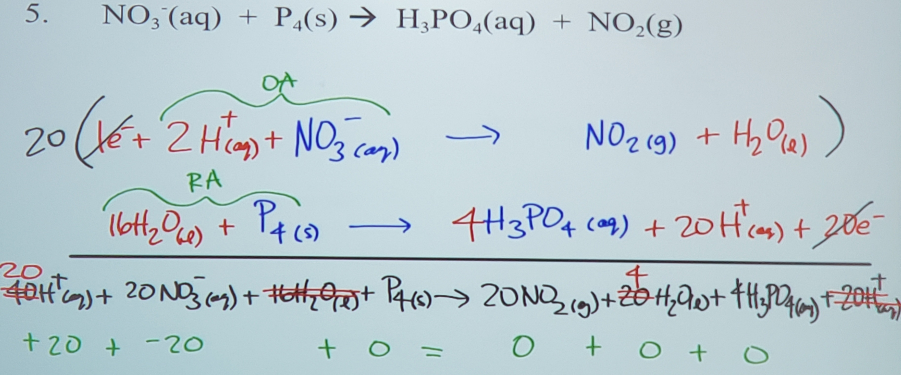

## More Examples
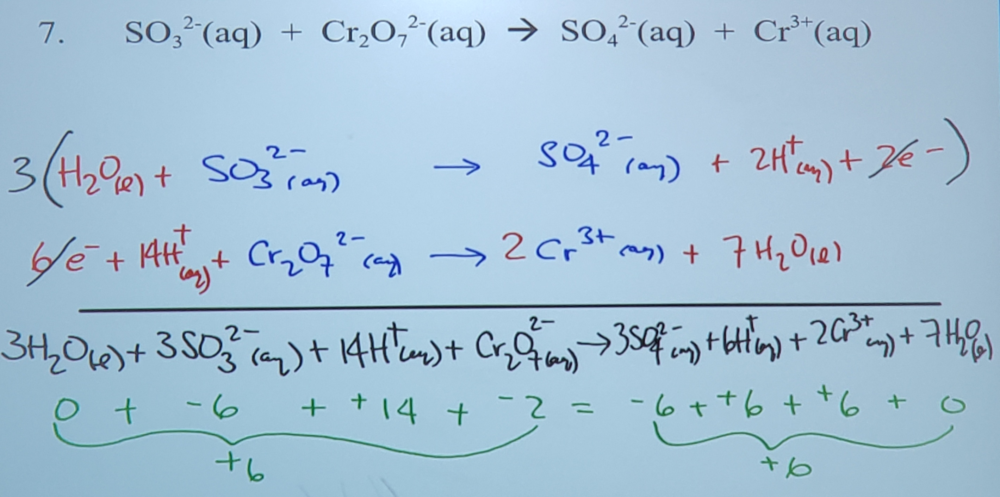
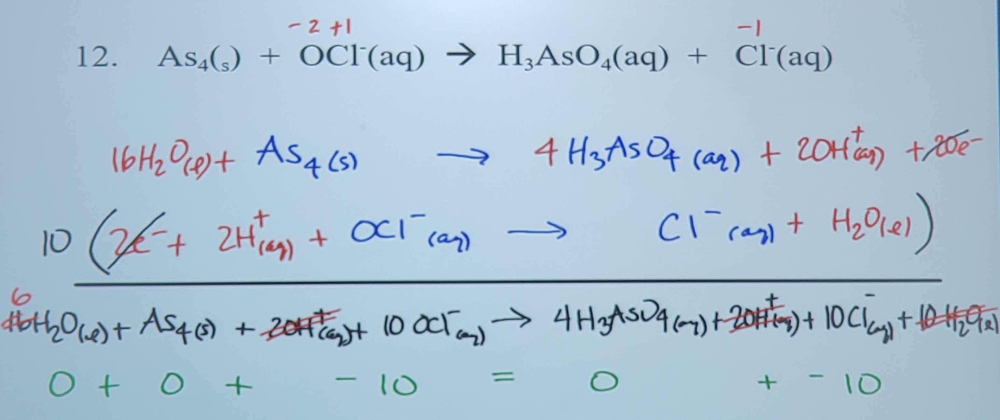


# Disproportionation
*also known as Autoxidation.*  

When a single species is ~~*both* oxidized and reduced~~.  

For the 30 level, all you need to do is be ~~**be able to identify them**~~ in an equation. No balancing needed.

## Steps
1. Identify the ~~oxidation numbers of all atoms~~ in the equation.
2. Determine if any element on one side has ~~two of the same element~~ on the other with ~~different oxidation numbers **each**~~.  
   If so, disproportionation has occured.

#### Examples
$\textrm{H}_2\textrm{O}_2 \longrightarrow \textrm{H}_2\textrm{O} + \textrm{O}_2$

**Oxidation #s**
* $\textrm{H}_2$: +1
* $\textrm{O}_2$: -1

$\longrightarrow$

* $\textrm{H}_2$: +1
* $\textrm{O}$: -2
* $\textrm{O}_2$: 0

As you can see, the -1 charged oxygen ends up as both -2 (reduction) and 0 (oxidation).  
Therefore, since it did both, this is disproportionation.


?> You have completed the first half of the unit!  
   Coming up, applications of the tools you've just learnt.


# Electrochemical Cells

**Electrochemical Processes**  
The conversion of ~~chemical energy into electrical energy~~ (voltaic),  
and the conversion of ~~electrical energy into chemical energy~~ (electrolytic).  
These are redox reactions.

# Voltaic Cells
Voltaic cells are electrochemical cells that convert ~~chemical energy into electrical energy~~.

It is usually a ~~metal rod~~ submerged in a ~~solution of one of its ions~~.

#### Half Cells
One part of a voltaic cell.  
Either ~~oxidation or reduction~~ occurs.

#### Porous Partition
The two half cells are separated by a porous partition.  

This can either be a...
* ~~salt bridge~~ (solution containing a conducting solution)
* ~~porous cup~~

The purpose of the partition is to allow the ~~passage of electrons externally~~ without the solutions mixing completely.

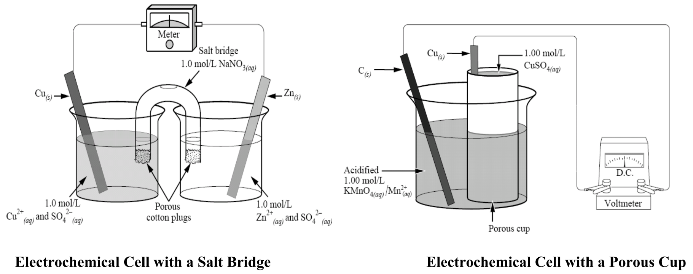

#### Redox Couple
The reduced and oxidized forms of a chemical entity.  
In other words, the ~~pair of chemical entities in a half reaction~~.  
*e.g. $\textrm{Cu}_{\textrm{(s)}}$ and $\textrm{Cu}^{2+}_{\textrm{(aq)}}$ are a redox couple.*

## Electrodes
A conductor in a circuit.  
Carries electrons to or from a substances.

#### Anode
The electrode where ~~oxidation~~ occurs. (therefore, its the reducing agent)  
Electrons are given off/lost here. # of electrons decreases.  
It is the ~~negative electrode~~.

~~Corrosion occurs at the anode.~~

#### Cathode
The electrode where ~~reduction~~ occurs. (therefore, its the oxidizing agent)  
Electrons are recieved/gained here. # of electrons increases.  
It is the ~~positive electrode~~.

~~Solid formation occurs at the cathode.~~

### Tip
The following ancronym can be used to remember this.

~~**LEOA GERC**~~

**L**ose  
**E**lectrons  
**O**xidation  
**A**node

**G**ain  
**E**lectrons  
**R**eduction  
**C**athode

#### Direction
The direction that electrons flow is ~~**always from anode to cathode**~~.  
You can remember this by the saying, *\"the cat goes home.\"* Cat-hode, cat-home. Get it? 

## Electrolyte
The conducting solution.  
Usually is comprised of the ~~same ions as the electrode~~ in said solution. (exceptions covered later)

The ~~positive electrolyte~~---the one that the cathode is submerged in---is called the ~~anolyte~~.  
The ~~negative electrolyte~~---the one that the anode is submerged in---is called the ~~catholyte~~.

## Anions and Cations
Anions and cations are also being transferred from anode to cathode. However...
* ~~Excess cations at the anode~~ migrate through the salt bridge ~~to the cathode~~.
* ~~Excess anions at the cathode~~ migrate through the salt bridge ~~to the anion~~.

For most of your cases, just know that...
* anions travel ~~internally~~ to the anode
* cations travel ~~internally~~ to the cathode

## Standard Voltaic Cells
* $25^\circ\textrm{C}$.
* Electrolyte at $1.0 \textrm{ mol}\cdot\textrm{dm}^{-3} (aka. \frac{\textrm{mol}}{\textrm{L}})$ concentratiion.
* Comprises of two standard half cells/electrodes.
  * Must contain a solid electrode. Usually one of the entities in the redox couple.
* Contains a redox couple.

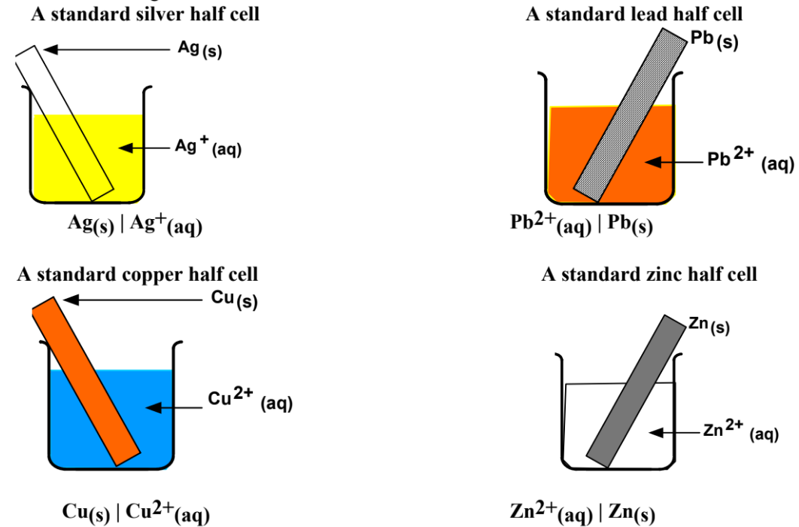

## No Solid Electrode
If a half cell has a solution of an ion, the ~~electrode~~ has to be the ~~solid variant~~ of that electrolyte.  
Sometimes this isn't possible---as in, the ~~ion has no solid~~ (usually metallic) variant---such as with $\textrm{MnO}^-_{\textrm{4 (aq)}}$ or $\textrm{Cr}_2\textrm{O}^{2-}_{\textrm{7 (aq)}}$.

You still need a solid electrode, so an ~~**inert electrode**~~ must be selected, so that it ~~does not react/partake in the electrochemistry~~.  
There are two options.

### Carbon
Cheap, but not completely inert.
(~~No good when oxygen is a product~~)

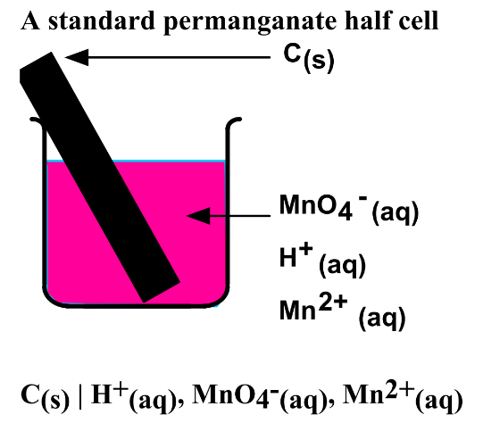

### Platinum
Expensive, but completely inert.

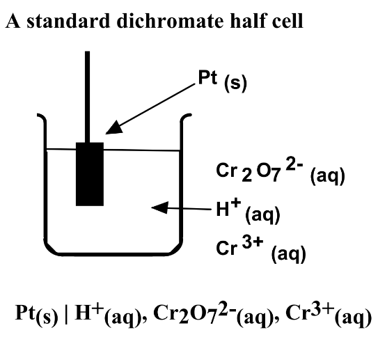

## Gas Electrode Required
If one of the components of a redox couple is a gas, such as in a hydrogen electrode.

A platinum electrode is dipped into the electrolyte.  
The ~~gas flows over the inert electrode~~ at standard pressure.

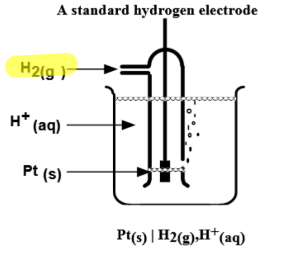

In this example...
* platinum is the *inert* electrode (still an electrode)
* H<sup>+</sup> is the electrolyte
* hydrogen gas is the electrode that actually reacts.

## Cell Notation
```
anode / anolyte // catholyte / canode
```

The double slash (//) is a symbol for the ~~bridge between the half cells~~. (salt bridge or porous cup)

*e.g. for a copper and zinc couple*  
$\textrm{Cu}_{\textrm{(s)}} / \textrm{Cu}^{2+}_{\textrm{(aq)}} // \textrm{Zn}^+{2+}_{\textrm{(aq)}} / \textrm{Zn}_{\textrm{(s)}}$

### "Multiple" Anolytes
If there is more than just an anode and anolyte, ~~write every compound~~ except the anode as the anolyte.

#### Example
The cell notation for each half cell is written below it.

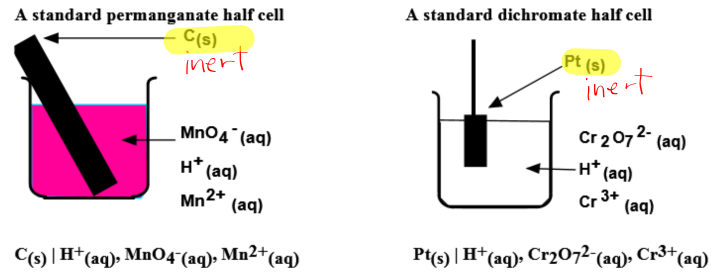

# Electric Potential
Measured in volts, $\textrm{V}$, the ~~ability~~ of the cell to ~~produce an electric current~~.  
It is the competition between the two half cells for electrons.

## Potential
The potential of an ~~isolated half cell cannot be measured~~.  
Two half cells together produce an electric current.

#### Reduction
The ~~higher the electric potential~~, the ~~more likely the cell will reduce~~, gaining electrons.  
This is the reduction potential, $\textrm{E}^0_{\textrm{R}}$.

#### Oxidation
The ~~lower the electric potential~~, the ~~more likely the cell will oxidize~~, losing electrons.  
This is the oxidation potential, $\textrm{E}^0_{\textrm{O}}$.

## The 0
The "<sup>0</sup>" on the E means the cell potential was measured when...
* ion concentration of the half cells are $1.00 \frac{\textrm{mol}}{\textrm{L}}$
* conditions are STP

## Predicting
The *reduction* potential of all cells is listed on the right-most column on page 7.  

If there are ~~no aqueous compounds~~ in the cell, the values on page 7 do not work, and you ~~cannot get the potential~~.

### Method 1
~~Subtract~~ the reduction potential of the ~~anode~~ ~~from~~ the reduction potential of the ~~cathode~~.

$\textrm{E}^0_{\textrm{net}} = \textrm{E}^0_{\textrm{RC}} - \textrm{E}^0_{\textrm{RA}}$

### Method 2
This is the harder for no reason method. Only here to give more information.  
The sum of the reduction and oxidation potential. The oxidation potential is the opposite sign as the reduction potential.

$\textrm{E}^0_{\textrm{oxid}} = -\textrm{E}^0_{\textrm{red}}$

$\textrm{E}^0_{\textrm{net}} = \textrm{E}^0_{\textrm{red}} + \textrm{E}^0_{\textrm{oxid}}$

## Application
A ~~**voltmeter or multimeter**~~ will measure the ~~electric potential difference~~ of two half cells.

The ~~presence of a voltmeter~~ can also indicate that a ~~cell is voltaic~~. (covered later, electrolytic cells don't have voltmeter)

## Reference Electrode
Numbers cannot be measured---only the electric potential differences between redox reactions.  
Therefore a reference electrode is used.

In standard scenarios, this electrode is ~~**hydrogen**~~.  
Hydrogen is given a value of ~~$0.00 \textrm{V}$~~.  
*This does not mean it has no electric potential, its just relative to hydrogen.*

A standard hydrogen electrode is a platinum electrode immersed in a solution of hydrogen ions at a concentration of $1.00 \frac{\textrm{mol}}{\textrm{L}}$. H<sub>2</sub> gas is bubbled around the inert electrode. The half reaction that occurs is...

$2\textrm{H}^+_{\textrm{(aq)}} + 2e^- \longrightarrow \textrm{H}_{2 \textrm{(g)}}$  
$\textrm{E}^0_{\textrm{H}^+} = 0.00 \textrm{V}$

### Different Reference Electrode
You can choose any reduction half reaction's electric potential from page 7 as the reference electrode.  
~~Electric potential difference is **unaffected** by doing this.~~

#### Steps
1. Add/subtract to make your desired reference electrode's electric potential equal 0.
2. Perform this same arithmetic to every electric potential on the table.
Now all the electric potentials are relative to your new reference electrode.

## Spontenity
A ~~positive~~ electric potential difference means the reaction is ~~spontaneous~~.

A ~~negative~~ electric potential difference means the reaction is ~~non-spontaneous~~.

# Completing A Voltaic Cell
Some questions will ask you to complete a voltaic cell.  
This includes...
* [label all components](#label-all-components)
* [cell notation](#cell-notation)
* [half reactions](#half-reactions)
* net redox reaction (just add the half reactions together)
* E<sup>0</sup> of each half cell (read right-most column of page 7)
* [E<sup>0</sup> of net reaction](#electric-potential)
* [evidence](#evidence)

Click these links to see what you have to do.

The finished question should look like this.
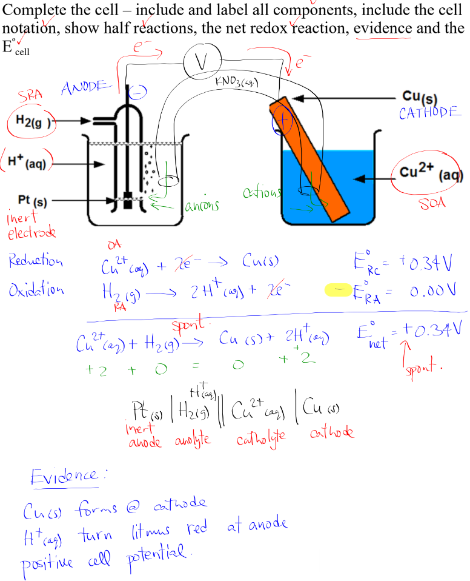

## Label All Components
* Identify and label the SOA and the SRA between the half cells.  
  The half cell with the SOA should be labeled as the ~~cathode~~.  
  The half cell with the SRA should be labeled as the ~~anode~~.

* Identify and label any inert electrodes. (platinum and carbon)

* Draw the voltmeter.
  * Draw a ~~line connecting the electrodes~~ of each half cell.
  * Make sure both lines ~~connect to a voltmeter~~, denoted by a V in a circle.
  * Draw ~~arrows~~ indicating the ~~flow of electrons~~. (anode to cathode)

* Draw the salt bridge. (you could draw porous cups---a salt bridge is easier to draw)
  * State what the salt bridge is made of.  
    It must not partake in the electrochemistry, so it has to be composed of spectator ions.  
    ~~$\textrm{KNO}_{3 \textrm{ (s)}}$ or $\textrm{NaNO}_{3 \textrm{ (s)}}$~~ are often used.

* Draw the pathway of anions and cations.
  * An ~~arrow~~ from the ~~salt bridge~~ and from the ~~solution~~ pointing ~~towards the relevant electrode~~.  
    *For instance, anions come from the salt bridge and anolyte and go into the anode*

## Evidence
You must write a brief sentence describing the ~~qualitative evidence~~ of electrons being transferred.

### Electric Potential
If the E<sup>0</sup><sub>net</sub> that you calculated earlier is positive, this is evidence of electrons being transferred.

### pH
If there are ~~more H<sup>+</sup>~~ ions on the product side of the net reaction compared to the reactant side, then the reaction became ~~more acidic~~.  
If there are ~~more OH<sup>-</sup>~~ ions on the product side of the net reaction compared to the reactant side, then the reaction became ~~more basic~~.

You can state this by saying ~~red/blue litmus paper turns blue/red~~, depending on ~~basic/acidic~~ respectively.

### Colour
If any of the substances have a colour, as seen on page 11, then you can use that as evidence.

* If said substance is being ~~produced~~, the color is getting ~~darker~~ and more saturated
* If said substance is being ~~removed/oxidized~~, the color is getting ~~lighter~~

### Solid Products
In a redox couple, if the ~~ion reactant becomes a solid product~~, that means the ~~solid is forming on the cathode~~. (since its always anode to cathode)

In a redox couple, if the ~~product reactant becomes an ion product~~, that means the ~~anode is being corroded~~. (since its always anode to cathode)

#### Example
$\textrm{Cu}^{2+}_{\textrm{(aq)}} + \textrm{Zn}_{\textrm{(s)}} \longrightarrow \textrm{Cu}_{\textrm{(s)}} + \textrm{Zn}^{2+}_{\textrm{(aq)}}$

* Solid zinc anode corrodes.
* Solid copper forms at cathode.

If you are wondering *why* copper forms at the cathode, its because both electrons and cations (Cu<sup>2+</sup><sub>(aq)</sub>) are being transferred to the cathode. This is the recipe to forming copper atoms.


# Batteries
A battery contains two or more cells linked together for a ~~combined higher voltage~~.

You don't have to memorize the real life examples, and more detail is in the actual booklet.


## Primary Cells
* ~~Not rechargeable~~.
  * Products/by-products are either too delicate or unsuitable for recharging.
* Deliever a ~~constant voltage~~ over their entire lifetime.

#### Examples
* LeClanche Cell
  * old acid battery
  * 1.5 V
* Alkaline Dry Cell
  * modern battery
  * 1.5 V
* Mercury Cell
  * disc shaped small battery
  * 1.35 V

## Secondary Cells
* ~~Rechargeable~~.
  * Uses electricity to ~~reverse the redox reaction~~ that usually produces electricity.

#### Examples
* Lithium-Ion Battery
  * modern phone battery
  * anode is lithium, cathode is TiS<sub>2</sub>
  * 3 V
* Nickel-Cadmium Cell
  * cheapest rechargeable
  * looks like LeClanche Cell
  * has a memory effect
    * over time, the cell will "think" its minimum is the lowest charge its had.
    * if this isn't 0%, then you'll have less capacity.
  * 1.25 V
* Lead Storage Battery (Car Battery)
  * two lead electrodes submerged in sulphuric acid
  * acid thickens in cold, battery stops working; not dead, just need to warm up
  * 12 V

## Fuel Cells
* ~~Do not need to be recharged~~.
* Requires a ~~constant supply of fuel~~.
  * emphasis on constant: it cannot store energy, electricity will cease if fuel supply does
* ~~Electrical energy~~ obtained from ~~fuel oxidizing~~.

#### Examples
* Hydrogen Fuel Cell
  * input is hydrogen and oxygen gas.
  * output is water.
  * more efficient than combustion engines, less lost to heat. (40% vs 80%)

* Aluminum-Air Cell
  * fuel is solid aluminum and oxygen gas.

# Corrosion
The deterioration of metals by electrochemical means.  
*e.g. iron rusting, silver tarnishing, copper patina*

#### Rust
In rusting, ~~oxygen and water~~ act as ~~oxidizing agents~~, and oxidize metals.

$\textrm{O}_{2 \textrm{(s)}} + 2\textrm{H}_2\textrm{O}_{\textrm{(l)}} + 4e^- \longrightarrow 4\textrm{OH}^-_{\textrm{(aq)}}$  
$E^0_{\textrm{red}} = +0.40 \textrm{ V}$

In acidic conditions...  
$\textrm{O}_{2 \textrm{(g)}} + 4\textrm{H}^+_{\textrm{(aq)}} + 4e^- \longrightarrow 2\textrm{H}_2\textrm{O}_{\textrm{(l)}}$  
$E^0_{\textrm{red}} = +1.23 \textrm{ V}$

## Prevention
* **Painting**
* **Oiling/greasing**
* **Plasticizing**
  * plastic used for the inner surface of food cans
* **Dipping**
  * dip iron into another metal that forms a non-porous oxide
  * magnesium and zinc are used since they are oxidized over iron
* **Galvanizing/electroplating**
  * electrolytic process
  * adds thin layer of metals (above iron in page 7)
* **Alloying**
  * some alloys form a thin layer that prevents oxidation/corrosion
  * e.g. stainless steel. iron + chromium + nickel. forms a thin layer of chromium oxide
* **Sacrificial Anode**
  * main metal corrodes and loses electrons
  * however, the lost electrons are immediately replenished by a sacrificial anode connected to it
  * in the end, the anode corrodes instead
  * anode typically composed of zinc or magnesium
* **Cathodic Protection**
  * connect the corrosive metal to the negative of a DC electrical circuit
  * metal flooded with electrons, discouraging oxidation
  * e.g. bodywork of cars connected to negative of car battery


# Electrolytic Cells
Electrolytic cells use electrical energy to cause a chemical change.  
In other words, cause **electrolysis**---using ~~electrical energy~~ to cause a ~~non-spontaneous~~ chemical reaction.

## Comparison to Voltaic

* Does not need separation  
  *(as opposed to separation with porous cup or salt bridge)*

* Require current from outside source, like a battery  
  *(as opposed to produces current internally and independently)*

* Negative electric potential  
  *(as opposed to positive)*

Highlighted = different

| Aspect | Electrolytic | Voltaic |
| :----: | :-----: | :----------: |
| Reaction @ Cathode | Reduction | Reduction |
| Reaction @ Anode | Oxidation | Oxidation |
| Anion Movement | To anode | To anode |
| Cation Movement | To cathode | To cathode |
| ~~Energy Conversion~~ | Electrical to Chemical | Chemical to Electrical |
| ~~Salt Bridge/Porous Cup~~ | No | Yes |
| ~~Power Supply~~ | Yes | No |
| ~~Voltage~~ | Negative | Positive |
| ~~Sponteneity~~ | Non-spontaneous | Spontaneous |
| ~~Position of RA~~ | Electrolyte | Anode |
| ~~Position of OA~~ | Electrolyte | Cathode |
| ~~Anode Qualitative~~ | Nothing | Corrodes |
| ~~Cathode Qualitative~~ | Gets plated | Forms element |

### Anode and Cathode Changes
Due to the ~~power source~~, electrons travel from the ~~positive terminal to the negative terminal~~.  
However, electrons still also travel from ~~anode (-) to cathode (+)~~.

The only way for this to be possible is to ~~swap anode and cathode~~, and ~~nothing else~~.

* ~~Cathode is the negative electrode (-)~~  
  *(as opposed to positive)*  
  It is connected to the negative/anode of the battery, so it has to be negative.

* ~~Anode is the positive electrode (+)~~  
  *(as opposed to negative)*  
  It is connected to the positive/cathode of the battery, so it has to be positive.

### Voltage Minimum
The ~~absolute sum of electrical potentials~~ of the oxidation and reduction reactions of an electrolytic cell also serves as the ~~minimum voltage~~ required for the ~~non-spontaneous reaction to occur~~.

Keyword minimum---you can go ~~above this voltage~~ for the reaction to ~~occur quicker~~.

### Battery Symbol
A short and long line denote a 1.5 V cell. You can have multiple beside each other to denote more cells and therefore higher net charges.  
The short line is the negative.  
The long line is the positive.

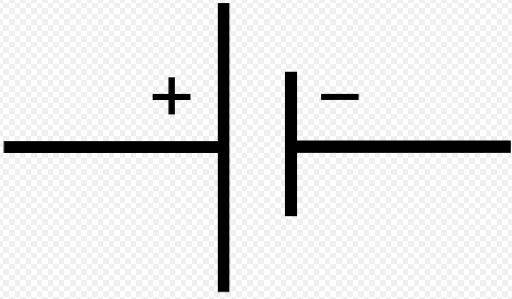


## Electrolysis Examples

General ground rule for electrolysis...
* The reduction reaction occurs ~~around the cathode~~
* The oxidation reaction occurs ~~around the anode~~
* Electrons still travel from anode to cathode, but  
  anode is connected to the power source positive, and  
  cathode is at the power source negative

?> You don't need to memorize any of these, just have a rough idea on how these things look and behave, since they may show up on exams.  
   EXCEPT ~~DEFINITELY KNOW BRINE ELECTROLYSIS~~!

### Electrolysis of Water
~~In pure water, no current can flow~~.  
An electrolyte of spectators---such as KNO<sub>3</sub>--is used to allow the flow of electrons when used in *low concentrations*.

Water is reduced to hydrogen at the cathode.  
$2\textrm{H}_2\textrm{O}_{\textrm{(l)}} + 2e^- \longrightarrow \textrm{H}_{2 \textrm{ (g)}} + 2\textrm{OH}^-_{\textrm{(aq)}}$  
(region around cathode more basic)

Water is oxidized to oxygen at the anode.  
$2\textrm{H}_2\textrm{O}_{\textrm{(l)}} \longrightarrow \textrm{O}_{2 \textrm{ (g)}} + 4\textrm{H}^+_{\textrm{(aq)}} + 4e^-$  
(region around anode more acidic)

Tip: Remember that hydrogen ions and hydroxide ions can combine into water.

Net reaction  
$2\textrm{H}_2\textrm{O}_{\textrm{(l)}} \longrightarrow 2\textrm{H}_{2\textrm{ (g)}} + \textrm{O}_{2 \textrm{(g)}}$

### Electrolysis of Brine
This is very commonly on exams, and thats because it is an exception to a rule. It is an ~~anomaly~~.

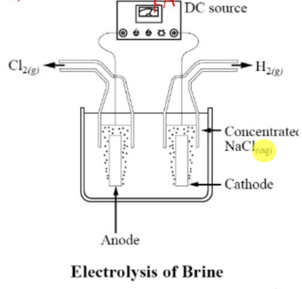

Anode: $2\textrm{Cl}^-_{\textrm{(aq)}} \longrightarrow \textrm{Cl}_{2 \textrm{ (g)}} + 2e^-$  
Cathode: $2\textrm{H}_2\textrm{O}_{\textrm{(l)}} + 2e^- \longrightarrow \textrm{H}_{2 \textrm{ (g)}} + 2\textrm{OH}^-_{\textrm{(aq)}}$

* Electrolyte is $\textrm{NaCl}_{\textrm{(aq)}}$.  
* Strongest reduction agent\* is chloride, so its oxidized and chlorine gas is produced at the anode.  
* Strongest oxidizing agent is water, so its reduced and hydrogen gas is produced at the cathode.  
* Sodium metal is not reduced, since water is more easily reduced. (water above sodium, page 7)  
* Hydroxide ions also produced at anode, which combine with left over sodium ions to form sodium hydroxide.

#### The Anomaly
On the page 7 table, water is actually a stronger reduction agent than chloride, yet chloride ends up being the SRA.

The reason is that to oxidize water, you actually need a ~~greater voltage than page 7~~ indicates.  
This additional voltage is called an ~~**overvoltage**~~.  
Chlorine gas ends up ~~forming before~~ the voltage can reach the minimum for water to form oxygen.

Imagine it as activation energy. Chloride to chlorine gas has a lower activation energy than water to oxygen.

~~**THIS ANOMALY ONLY OCCURS WHEN FINDING THE STRONGEST REDUCTION AGENT, I.E. OXIDATION**~~

#### Applications
* Chlorine gas: Making bleach, plastics, agriculture
* Hydrogen gas: Industrial production of ammonia, fuel
* Combine into hydrogen chloride gas: becomes hydrochloric acid
* Sodium hydroxide: Industrial cleaner
* NaOH: drain cleaner, dishwashing detergent

### Hoffman Apparatus
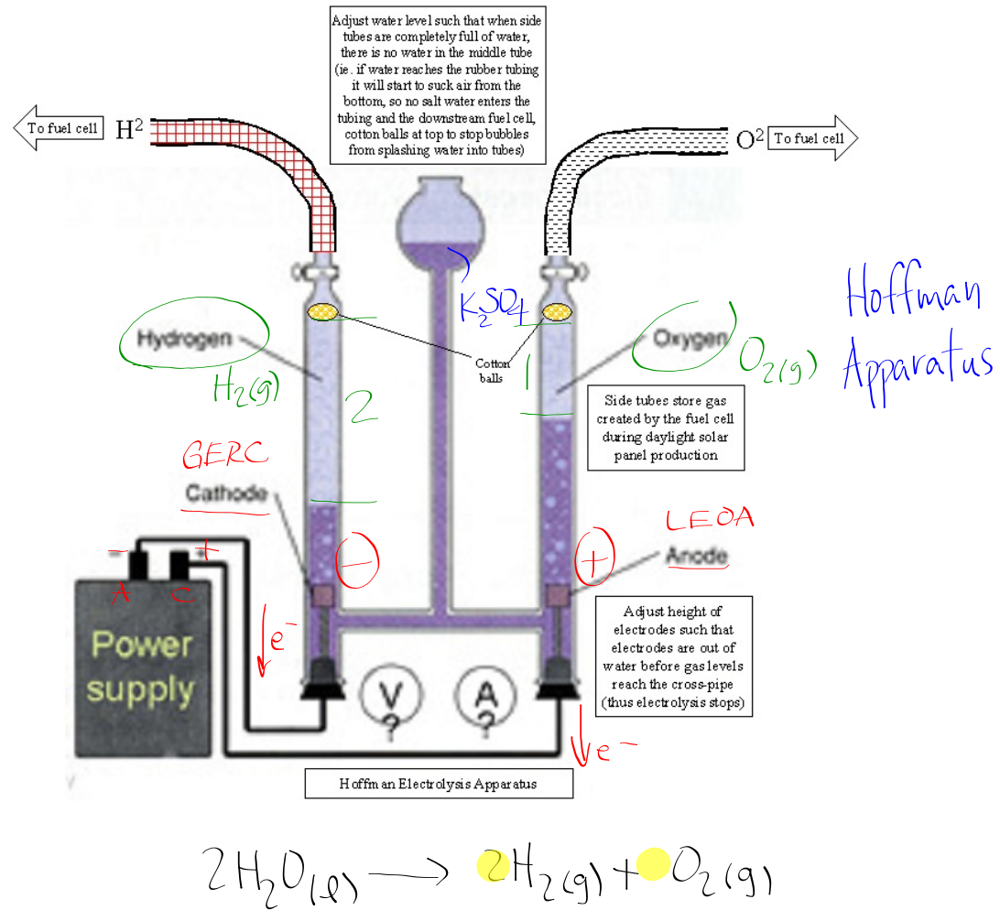

You don't need to know these in detail, just recognize the shape of this and the following...
* Solution must be spectator, conductive, but also aqueous.  
  (the water that is decomposed comes from the fact that the solution is aqueous)
* The products of oxidation and reaction will be in their own tubes.  
  They are also ~~in their molar ratio~~---for instance, hydrogen is taking up two times more space than oxygen. 2:1 ratio like in the equation.

### Electrolysis of Copper to Purify

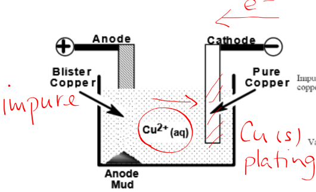

* Pure copper connected to negative, cathode
* Impure/blister copper connected to positive, anode
* In solution of copper (II) sulfide (Cu<sup>2+</sup> & SO<sub>4</sub>)


1. Blister copper loses e<sup>-</sup> at anode
2. e<sup>-</sup> return to pure copper at cathode
3. Cu<sup>2+</sup> cations in solution go to cathode, pure copper, and pick up electrons
4. This forms pure solid copper, which plates/forms on the pure copper cathode

### Electrolysis of Aluminum: Hall-Heroult Process
Honestly, the actual booklet says this well.
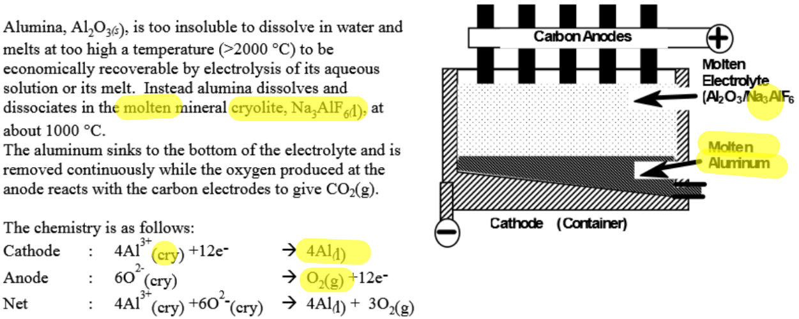
Solvent is cryolite, solute is alumina dissolved in said cryolite, which is why its denoted with (cry).

## Complete Electrolysis Examples
Just like voltaic cells, you need to be able to show a labelled diagram, redox reactions, net redox reaction, electric and net electric potentials, and evidence.

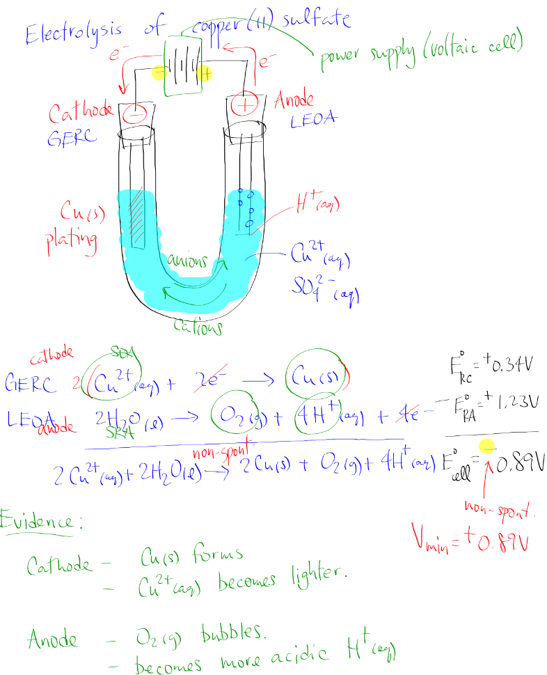


# Faraday's Law for Electrolytic Stoichiometry
Used for determining ~~mass (g)~~ in electrolysis of...
* electrons transferred
* metal plated onto the cathode
* metal lost at the anode

You need to know...
* flow of electrons, called current, measured in amperes (A)
* time (in seconds) that the current was applied

With that information, you can calculate the ~~charge, $q$~~, measured in ~~Coulombs (C)~~.

$q = I \times t$

or 

$I = \dfrac{q}{t}$  
$\textrm{amperes} = \dfrac{\textrm{Coulombs}}{\textrm{seconds}}$

You can't do stoichiometry with Coulombs, you need moles. This is where Faraday's Constant comes in...

## Faraday's Constant

$F = 9.65 \times 10^4 \frac{\textrm{C}}{\textrm{mol e}^-}$  
*(on your data sheet, page 3)*

## Tip
* Out of all the values you have, ~~start with~~ the one that has one of or both of the ~~units of the final answer~~
* Amps are just Coulombs per second

## Applications
### Number of Electrons
Calculate the number of Coulombs using the formula, than cancel the Coulumbs and convert it to moles with Faraday's Constant.

$n_{e^-} = (I \cdot t) \times \dfrac{1 \textrm{ mol e}^-}{9.65 \times 10^4 \textrm{ C}}$

aka. $n_{e^-} = \dfrac{I \cdot t}{F}$

#### Example
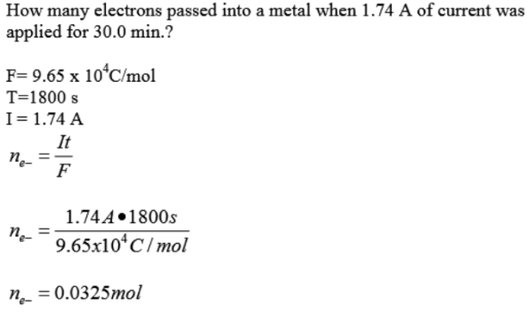

### Mass
One unique thing is that you need to ~~multiply the molar mass~~ by a ~~molar ratio of the element~~, in this case copper, ~~*with electrons*~~.  
This is so you can get moles of electrons, allowing you to use Faraday's Constant to cancel all units except grams.

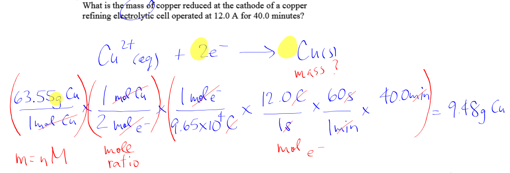

# Tips for any Stoicheometry
This also applies to redox titrations, which were not explicitly covered as they are basically just stoicheometry questions.

* You are basically just taking whatever data you have and ~~cancelling units~~ with other things you know until you have the units the question asks for.  
  The other things you can cancel your units with include...
  * molar ratio (to cancel moles of an element or moles of electrons)
  * Faraday's (to cancel moles or Coloumbs)
  * amps = Coloumbs/time (to cancel Coloumbs and isolate time, for e.g.)
  And probably more I don't remember.

* If a question asks for "original concentration," it means that the value was ~~divided earlier in the question~~.  
  Try to find what it was divided by, and once you ~~calculate your final answer~~, ~~undo the division by multiplying by said number~~.
