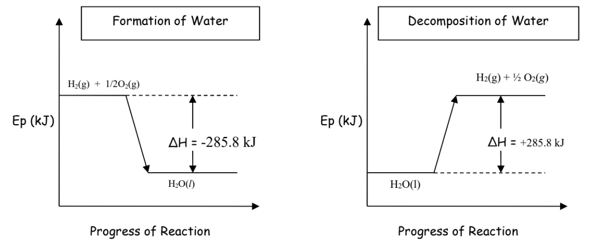
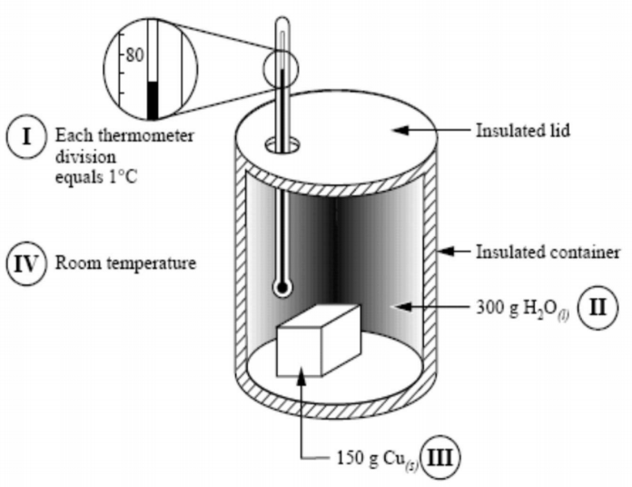

# Thermochemistry

!> These notes are unfinished and subject to change.

---

# Introduction

## Terms

#### Thermochemistry
Study of heat changes assosiated with chemical processes.

#### Heat
Energy that ~~flows~~ between two entities at different temperatures.  
Always ~~hot to cold~~.

#### Temperature
~~Average kinetic energy~~ of the molecules. (higher = faster random movement)  
Not total kinetic energy, only average.

#### Thermal Energy
~~Total heat energy~~ of a substance.  
Heat energy absorbed = Temperature increase (~~except during phase changes~~)

*For instance...*

* A cup of water has a ~~higher temperature~~ than a bathtub  
  due to a greater average kinetic energy

* A bathtub of water has ~~more thermal energy~~ than a cup  
  due to the thermal energy of more molecules coming to a greater total thermal energy

#### Exothermic
Energy is ~~released~~/lost to surroundings.

#### Endothermic
Energy is ~~absorbed~~/gained from surroundings.

## Laws of Thermodynamics
1. Energy can be ~~converted between forms~~,  
   but ~~cannot be created or destroyed~~

2. Heat flows from ~~hot to cold~~,  
   until ~~thermal equilibrium~~ is reached

## Energy
#### Units
The units for energy are ~~Joules (J)~~.  
Derived from ~~$\textrm{kg}\cdot\frac{\textrm{m}^2}{\textrm{s}^2}$~~.

### Potential Energy Ep
*aka. enthalpy ($\textrm{H}$)*

~~Stored energy~~ in the ~~bonds~~ ~~within and between~~ molecules. (chemical energy only at 30 IB level)

~~Absorbed when bonds break.~~  
~~Released when bonds form.~~

### Kinetic Energy Ek
Energy of ~~motion~~.  
Motion of ions, atoms, molecules. (translational, rotational, vibrational motion)

Kinetic energy ~~absorbed~~ = ~~temperature increases~~  
Kinetic energy ~~released~~ = ~~temperature decreases~~

# Calculating Kinetic Energy Changes
## Heat Capacity
~~Heat energy~~ required to raise temperature of substance by ~~1&deg;C~~. (1 K)

#### Specific Heat Capacity
Heat energy to raise ~~1 g by 1&deg;C~~. (units: $\dfrac{\textrm{J}}{\textrm{g}\cdot \!^\circ\textrm{C}}$ or $\dfrac{\textrm{kJ}}{\textrm{kg}\cdot \!^\circ\textrm{C}}$)

*Make sure the killo cancels out, so always have kJ and kg together.*

#### Molar Heat Capacity
Heat energy to raise ~~1 mol by 1&deg;C~~. (units: $\dfrac{\textrm{J}}{\textrm{mol}\cdot \!^\circ\textrm{C}}$ or $\dfrac{\textrm{kJ}}{\textrm{kmol}\cdot \!^\circ\textrm{C}}$)

*Make sure the killo cancels out, so always have kJ and kmol together.*

### Comparing
**Metals typically have ~~low heat capacities~~.**  
They heat up quick and cool off quick.

**Water has almost the ~~highest heat capacity~~.** ($E_{k_\textrm{water}} = 4.19 \textrm{ J}/\textrm{g}\cdot\!^\circ\textrm{C}$)  
It takes a lot of energy---and therefore time---to heat up, but also takes a while to cool down.  
*(theres more energy for the water to lose)*

The higher the specific heat capacity, and the greater the mass, the more energy a substance can store, and the more time it needs to heat up.

## Formula
<h3>
$\textrm{Q} = \Delta{\textrm{E}_\textrm{k}} = \textrm{mc}\Delta{\textrm{t}}$
</h3>

All of the following variables are for one substance at a time.
* Q or Ek = Kinetic Energy (J)
* m = Mass of substance thats heating/cooling (g)
* c = Specific heat capacity of said substance (J/g&middot;&deg;C)
* &Delta;t = Change in temperature (&deg;C)

### Positive or Negative
* If Ek is ~~positive~~, the substance ~~absorbed~~ heat.
* If Ek is ~~negative~~, the substance ~~released~~ heat.

*tip: so if a question says the kinetic energy was released, you should set Ek to a negative in the formula*

# Calculating Potential Energy Changes
Potential energy ($\textrm{E}_\textrm{p}$)---also called ~~**enthalpy**~~ ($\textrm{H}$)---is the ~~total~~ chemical potential energy of a substance.  
It is a substance's ~~capacity to exchange energy~~---usually heat, hence the H---with its surroundings at constant pressure ~~during a chemical change~~.

Enthalpy can differ depending on state or temperature.  
~~Enthalpy cannot be measured~~, only ~~change in enthalpy (&Delta;H)~~ can.

#### Types
* **Molar Enthalpy** $\textrm{kJ}/\textrm{mol}$
* **Specific Enthalpy** $\textrm{kJ}/\textrm{g}$ (less common)

## Enthalpy Types
### Enthalpy of Reaction
<h3>
$\Delta_\textrm{rxn}\textrm{H} = \textrm{H}_\textrm{products} - \textrm{H}_\textrm{reactants}$
</h3>

* Endothermic: ~~Hproducts > Hreactants~~ (&Delta;rxnH is positive, energy is absorbed)
* Exothermic: ~~Hproducts < Hreactants~~ (&Delta;rxnH is negative, energy is released)

### Other Types
* $\Delta_\textrm{rxn}\textrm{H}$ = Enthalpy of Reaction
* $\Delta_\textrm{f}\textrm{H}$ = Enthalpy of Formation (~~listed in your data booklet, page 4 & 5~~)
* $\Delta_\textrm{c}\textrm{H}$ = Enthalpy of Combustion
* $\Delta_\textrm{sol}\textrm{H}$ = Enthalpy of Solution
* $\Delta_\textrm{sd}\textrm{H}$ = Enthalpy of Decomposition

## Formula
<h3>
$\Delta{\textrm{E}_\textrm{p}} = \textrm{n}\Delta{\textrm{H}}$
</h3>

* &Delta;Ep = total potential energy (kJ)
* n = number of moles of a substance (mol)
* &Delta;H = molar enthalpy of a substance (enthalpy per mole, kJ/mol)

Sometimes you may even see $\Delta{\textrm{H}} = n\Delta{\textrm{H}}$, because Alberta does not differentiate total enthalpy and molar enthalpy.

### Difference

#### Molar Enthalpy
* The enthalpy/potential energy of ~~1.00 mole~~
* ~~Always &Delta;H~~
* Units are ~~kJ/mol~~

#### Enthalpy
* The enthalpy/potential energy of ~~$n$ moles~~ (see formula)
* Always &Delta;Ep, sometimes &Delta;H
* Units are ~~kJ~~ ~~(not per 1 mol!)~~

## Enthalpy of Specific Compounds
The enthalpy of reaction will change directly with the ~~coefficients/moles~~ of the ~~entire reaction~~---to ~~**maintain the ratio**~~ that enthalpy and all the compounds have to one another.

?> Therefore, for example with decomposition/formation of water... (shown below)  
   When the equation is normal quantities, the enthalpy is normal. (571.6 kJ)  
   However, when a question states that the coefficient/moles of any substance is different,  
   that means the ~~moles of every substance in the equation is also different~~  
   to ~~**maintain the ratio**~~ they have with one another, ~~even the enthalpy~~.  
   Therefore, if say the moles of water are halved (2 -> 1) then the rest of the equations quantities are doubled, but the question will probably only ask for enthalpy, so enthalpy will be (285.8 kJ)  
   This was over explained because it confused me initially. You want concise? Read the real notes!!!

#### Example
<h3>
$2\textrm{H}_2 + \textrm{O}_2 \longrightarrow 2\textrm{H}_2\textrm{O} + 571.6\textrm{ kJ}$
</h3>

>  **The enthalpy given off in the above equation**  
>  $\Delta_{\textrm{rxn}}\textrm{H} = -571.6\textrm{ kJ}$

>  **The molar enthalpy of the reaction for 1.00 mol of H2O**  
>  $\Delta_\textrm{f}\textrm{H} = \frac{-571.6 \textrm{ kJ}}{2 \textrm{ mol}} = -285.8 \frac{\textrm{kJ}}{\textrm{mol}}$

>  **The enthalpy of reaction for the production of 0.500 moles of H2O**  
>  $\Delta{\textrm{H}} \times n = \textrm{E}_\textrm{p}$  
>  $\frac{-571.6\textrm{ kJ}}{2\textrm{ mol}} \times 0.5\textrm{ mol} = -142.9\textrm{ kJ}$

>  **The &Delta;H/Ep for the production of 10.0 g of H2O**  
>  $\frac{-571.6\textrm{ kJ}}{2\textrm{ mol}} \times \frac{1\textrm{ mol}}{18.02\textrm{ g}} \times 10.0\textrm{ g} = -159\textrm{ kJ}$

>  **If hydrogen is formed from the decomposition of water, what is the enthalpy of reaction per mole of H2 produced?**  
>  (Decomposition of water is just formation of water backwards, so flip signs, since the enthalpy would now be on the reactant side instead of product side)  
>  $\Delta_\textrm{sd}\textrm{H} = \frac{+571.6 \textrm{ kJ}}{2 \textrm{ mol}} = +285.8 \frac{\textrm{kJ}}{\textrm{mol}}$

*more examples on page 15 of workbook*

## Communicating Enthalpy
### In Equation
By adding the enthalpy to either
* the reactants side---endothermic, absorbed energy
* the products side---exothermic, released energy

#### Example
$\textrm{H}_2 + \frac{1}{2}\textrm{O}_2 \longrightarrow \textrm{H}_2\textrm{O} + 285.8\textrm{ kJ}$

(x2)  
$2\textrm{H}_2 + \textrm{O}_2 \longrightarrow 2\textrm{H}_2\textrm{O} + 571.6\textrm{ kJ}$

### &Delta;H Notation
By stating the &Delta;H on the right side of the equation.
* Exothermic, energy released = &Delta;H is negative
* Endothermic, energy absorbed = &Delta;H is positive

#### Example
$\textrm{H}_2 + \frac{1}{2}\textrm{O}_2 \longrightarrow \textrm{H}_2\textrm{O}$ &nbsp;&nbsp;&nbsp; $\Delta{\textrm{H}} = -285.8\textrm{ kJ}$  
$\textrm{H}_2\textrm{O} \longrightarrow \textrm{H}_2 + \frac{1}{2}\textrm{O}_2$ &nbsp;&nbsp;&nbsp; $\Delta{\textrm{H}} = +285.8\textrm{ kJ}$

## Potential Energy Diagram

# Calorimetry
A calorimeter is a heat measuring device.

## Information
#### Heat Flows
In a calorimeter when an...
* exothermic reaction occurs,  
  energy is released, and flows from the ~~reaction to the water/solution~~ in the calorimeter

* endothermic reaction occurs,  
  energy is absorbed, and flows from the ~~water/solution~~ in the calorimeter  ~~to the reaction~~

#### Isolated System
A calorimeter is assumed to be an isolated system---100% of the energy is conserved.
* Heat ~~absorbed by liquid~~ = Heat ~~released by reaction~~
* Heat ~~released by liquid~~ = Heat ~~absorbed by reaction~~

## Principle of Heat Transfer
<h3>
$\Delta\textrm{E}_\textrm{p reaction} + \Delta\textrm{E}_\textrm{k calorimeter} = 0$
</h3>
<h3>
$\Delta\textrm{E}_\textrm{p reaction} = -\Delta\textrm{E}_\textrm{k calorimeter}$  
</h3>
<h3>
$n\Delta\textrm{H} = -\textrm{mc}\Delta\textrm{t}$
</h3>

## Calculations
1. Find energy absorbed by calorimeter water/solution  
   $\textrm{E}_\textrm{k} = \textrm{mc}\Delta\textrm{t}$

2. Principle of Heat Transfer  

3. Find energy released by reaction  
   $\textrm{E}_\textrm{p} = \textrm{n}\Delta\textrm{H}$
   

## Types
### Styrofoam Calorimeter

