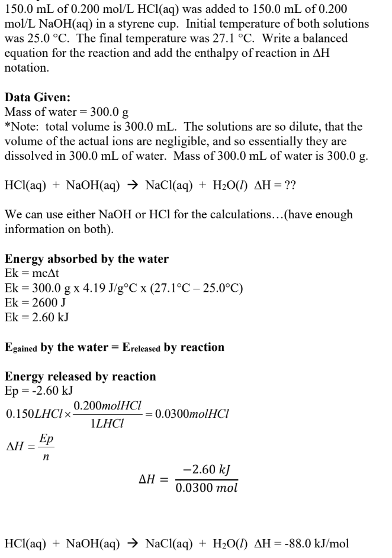

# Thermochemistry

---

# Introduction

## Terms

#### Thermochemistry
Study of heat changes assosiated with chemical processes.

#### Heat
Energy that ~~flows~~ between two entities at different temperatures.  
Always ~~hot to cold~~.

#### Temperature
~~Average kinetic energy~~ of the molecules. (higher = faster random movement)  
Not total kinetic energy, only average.

#### Thermal Energy
~~Total heat energy~~ of a substance.  
Heat energy absorbed = Temperature increase (~~except during phase changes~~)

*For instance...*

* A cup of water has a ~~higher temperature~~ than a bathtub  
  due to a greater average kinetic energy

* A bathtub of water has ~~more thermal energy~~ than a cup  
  due to the thermal energy of more molecules coming to a greater total thermal energy

#### Exothermic
Energy is ~~released~~/lost to surroundings.

#### Endothermic
Energy is ~~absorbed~~/gained from surroundings.

## Laws of Thermodynamics
1. Energy can be ~~converted between forms~~,  
   but ~~cannot be created or destroyed~~

2. Heat flows from ~~hot to cold~~,  
   until ~~thermal equilibrium~~ is reached

## Energy
#### Units
The units for energy are ~~Joules (J)~~.  
Derived from ~~$\textrm{kg}\cdot\frac{\textrm{m}^2}{\textrm{s}^2}$~~.

### Potential Energy Ep
*aka. enthalpy ($\textrm{H}$)*

~~Stored energy~~ in the ~~bonds~~ ~~within and between~~ molecules. (chemical energy only at 30 IB level)

~~Absorbed when bonds break.~~  
~~Released when bonds form.~~

### Kinetic Energy Ek
Energy of ~~motion~~.  
Motion of ions, atoms, molecules. (translational, rotational, vibrational motion)

Kinetic energy ~~absorbed~~ = ~~temperature increases~~  
Kinetic energy ~~released~~ = ~~temperature decreases~~

# Calculating Kinetic Energy Changes
## Heat Capacity
~~Heat energy~~ required to raise temperature of substance by ~~1&deg;C~~. (1 K)

#### Specific Heat Capacity
Heat energy to raise ~~1 g by 1&deg;C~~. (units: $\dfrac{\textrm{J}}{\textrm{g}\cdot \!^\circ\textrm{C}}$ or $\dfrac{\textrm{kJ}}{\textrm{kg}\cdot \!^\circ\textrm{C}}$)

*Make sure the killo cancels out, so always have kJ and kg together.*

#### Molar Heat Capacity
Heat energy to raise ~~1 mol by 1&deg;C~~. (units: $\dfrac{\textrm{J}}{\textrm{mol}\cdot \!^\circ\textrm{C}}$ or $\dfrac{\textrm{kJ}}{\textrm{kmol}\cdot \!^\circ\textrm{C}}$)

*Make sure the killo cancels out, so always have kJ and kmol together.*

### Comparing
**Metals typically have ~~low heat capacities~~.**  
They heat up quick and cool off quick.

**Water has almost the ~~highest heat capacity~~.** ($E_{k_\textrm{water}} = 4.19 \textrm{ J}/\textrm{g}\cdot\!^\circ\textrm{C}$)  
It takes a lot of energy---and therefore time---to heat up, but also takes a while to cool down.  
*(theres more energy for the water to lose)*

The higher the specific heat capacity, and the greater the mass, the more energy a substance can store, and the more time it needs to heat up.

## Formula
<h3>
$\textrm{Q} = \Delta{\textrm{E}_\textrm{k}} = \textrm{mc}\Delta{\textrm{t}}$
</h3>

All of the following variables are for one substance at a time.
* Q or Ek = Kinetic Energy (J)
* m = Mass of substance thats heating/cooling (g)
* c = Specific heat capacity of said substance (J/g&middot;&deg;C)
* &Delta;t = Change in temperature (&deg;C)

### Positive or Negative
* If Ek is ~~positive~~, the substance ~~absorbed~~ heat.
* If Ek is ~~negative~~, the substance ~~released~~ heat.

*tip: so if a question says the kinetic energy was released, you should set Ek to a negative in the formula*

# Calculating Potential Energy Changes
Potential energy ($\textrm{E}_\textrm{p}$)---also called ~~**enthalpy**~~ ($\textrm{H}$)---is the ~~total~~ chemical potential energy of a substance.  
It is a substance's ~~capacity to exchange energy~~---usually heat, hence the H---with its surroundings at constant pressure ~~during a chemical change~~.

Enthalpy can differ depending on state or temperature.  
~~Enthalpy cannot be measured~~, only ~~change in enthalpy (&Delta;H)~~ can.

#### Types
* **Molar Enthalpy** $\textrm{kJ}/\textrm{mol}$
* **Specific Enthalpy** $\textrm{kJ}/\textrm{g}$ (less common)

## Enthalpy Types
### Enthalpy of Reaction
<h3>
$\Delta_\textrm{rxn}\textrm{H} = \textrm{H}_\textrm{products} - \textrm{H}_\textrm{reactants}$
</h3>

* Endothermic: ~~Hproducts > Hreactants~~ (&Delta;rxnH is positive, energy is absorbed)
* Exothermic: ~~Hproducts < Hreactants~~ (&Delta;rxnH is negative, energy is released)

### Other Types
* $\Delta_\textrm{rxn}\textrm{H}$ = Enthalpy of Reaction
* $\Delta_\textrm{f}\textrm{H}$ = Enthalpy of Formation (~~listed in your data booklet, page 4 & 5~~)
* $\Delta_\textrm{c}\textrm{H}$ = Enthalpy of Combustion
* $\Delta_\textrm{sol}\textrm{H}$ = Enthalpy of Solution
* $\Delta_\textrm{sd}\textrm{H}$ = Enthalpy of Decomposition
* $\Delta_\textrm{neut}\textrm{H}$ = Enthalpy of Neutralization

## Formula
<h3>
$\Delta{\textrm{E}_\textrm{p}} = \textrm{n}\Delta{\textrm{H}}$
</h3>

* &Delta;Ep = total potential energy (kJ)
* n = number of moles of a substance (mol)
* &Delta;H = molar enthalpy of a substance (enthalpy per mole, kJ/mol)

Sometimes you may even see $\Delta{\textrm{H}} = n\Delta{\textrm{H}}$, because Alberta does not differentiate total enthalpy and molar enthalpy.

### Difference

#### Molar Enthalpy
* The enthalpy/potential energy of ~~1.00 mole~~
* ~~Always &Delta;H~~
* Units are ~~kJ/mol~~

#### Enthalpy
* The enthalpy/potential energy of ~~$n$ moles~~ (see formula)
* Always &Delta;Ep, sometimes &Delta;H
* Units are ~~kJ~~ ~~(not per 1 mol!)~~

## Enthalpy of Specific Compounds
The enthalpy of reaction will change directly with the ~~coefficients/moles~~ of the ~~entire reaction~~---to ~~**maintain the ratio**~~ that enthalpy and all the compounds have to one another.

?> Therefore, for example with decomposition/formation of water... (shown below)  
   When the equation is normal quantities, the enthalpy is normal. (571.6 kJ)  
   However, when a question states that the coefficient/moles of any substance is different,  
   that means the ~~moles of every substance in the equation is also different~~  
   to ~~**maintain the ratio**~~ they have with one another, ~~even the enthalpy~~.  
   Therefore, if say the moles of water are halved (2 -> 1) then the rest of the equations quantities are doubled, but the question will probably only ask for enthalpy, so enthalpy will be (285.8 kJ)  
   This was over explained because it confused me initially. You want concise? Read the real notes!!!

#### Example
<h3>
$2\textrm{H}_2 + \textrm{O}_2 \longrightarrow 2\textrm{H}_2\textrm{O} + 571.6\textrm{ kJ}$
</h3>

>  **The enthalpy given off in the above equation**  
>  $\Delta_{\textrm{rxn}}\textrm{H} = -571.6\textrm{ kJ}$

>  **The molar enthalpy of the reaction for 1.00 mol of H2O**  
>  $\Delta_\textrm{f}\textrm{H} = \frac{-571.6 \textrm{ kJ}}{2 \textrm{ mol}} = -285.8 \frac{\textrm{kJ}}{\textrm{mol}}$

>  **The enthalpy of reaction for the production of 0.500 moles of H2O**  
>  $\Delta{\textrm{H}} \times n = \textrm{E}_\textrm{p}$  
>  $\frac{-571.6\textrm{ kJ}}{2\textrm{ mol}} \times 0.5\textrm{ mol} = -142.9\textrm{ kJ}$

>  **The &Delta;H/Ep for the production of 10.0 g of H2O**  
>  $\frac{-571.6\textrm{ kJ}}{2\textrm{ mol}} \times \frac{1\textrm{ mol}}{18.02\textrm{ g}} \times 10.0\textrm{ g} = -159\textrm{ kJ}$

>  **If hydrogen is formed from the decomposition of water, what is the enthalpy of reaction per mole of H2 produced?**  
>  (Decomposition of water is just formation of water backwards, so flip signs, since the enthalpy would now be on the reactant side instead of product side)  
>  $\Delta_\textrm{sd}\textrm{H} = \frac{+571.6 \textrm{ kJ}}{2 \textrm{ mol}} = +285.8 \frac{\textrm{kJ}}{\textrm{mol}}$

*more examples on page 15 of workbook*

## Communicating Enthalpy
### In Equation
By adding the enthalpy to either
* the reactants side---endothermic, absorbed energy
* the products side---exothermic, released energy

#### Example
$\textrm{H}_2 + \frac{1}{2}\textrm{O}_2 \longrightarrow \textrm{H}_2\textrm{O} + 285.8\textrm{ kJ}$

(x2)  
$2\textrm{H}_2 + \textrm{O}_2 \longrightarrow 2\textrm{H}_2\textrm{O} + 571.6\textrm{ kJ}$

### &Delta;H Notation
By stating the &Delta;H on the right side of the equation.
* Exothermic, energy released = &Delta;H is negative
* Endothermic, energy absorbed = &Delta;H is positive

#### Example
$\textrm{H}_2 + \frac{1}{2}\textrm{O}_2 \longrightarrow \textrm{H}_2\textrm{O}$ &nbsp;&nbsp;&nbsp; $\Delta{\textrm{H}} = -285.8\textrm{ kJ}$  
$\textrm{H}_2\textrm{O} \longrightarrow \textrm{H}_2 + \frac{1}{2}\textrm{O}_2$ &nbsp;&nbsp;&nbsp; $\Delta{\textrm{H}} = +285.8\textrm{ kJ}$

## Potential Energy Diagram

# Calorimetry
A calorimeter measures calories, therefore it is a ~~heat measuring device~~.

## Information
#### Heat Flows
In a calorimeter when an...
* exothermic reaction occurs,  
  energy is released, and flows from the ~~reaction to the water/solution~~ in the calorimeter

* endothermic reaction occurs,  
  energy is absorbed, and flows from the ~~water/solution~~ in the calorimeter  ~~to the reaction~~

#### Isolated System
A calorimeter is assumed to be an isolated system---100% of the energy is conserved.
* Heat ~~absorbed by liquid~~ = Heat ~~released by reaction~~
* Heat ~~released by liquid~~ = Heat ~~absorbed by reaction~~

## Principle of Heat Transfer
* The $\Delta\textrm{E}_\textrm{p}$, and all its variables, always refers to the ~~substance that reacts~~
* The $\Delta\textrm{E}_\textrm{k}$, and all its variables, always refers to the ~~solution in the calorimeter~~  
  At this level, its ~~always water~~. (or, an ~~aqueous solution so dilute~~ that it behaves as water)

<h3>
$\Delta\textrm{E}_\textrm{p reaction} + \Delta\textrm{E}_\textrm{k calorimeter} = 0$
</h3>
<h3>
$\Delta\textrm{E}_\textrm{p reaction} = -\Delta\textrm{E}_\textrm{k calorimeter}$  
</h3>
<h3>
$n\Delta\textrm{H} = -\textrm{mc}\Delta\textrm{t}$
</h3>

## Calculations
1. Find energy absorbed by calorimeter water/solution  
   $\textrm{E}_\textrm{k} = \textrm{mc}\Delta\textrm{t}$

2. Principle of Heat Transfer  

3. Find energy released by reaction  
   $\textrm{E}_\textrm{p} = \textrm{n}\Delta\textrm{H}$
   
## Types
### Polystyrene (Styrofoam) Calorimeter

#### Formula
Normal principle of heat transfer. ($\Delta\textrm{E}_\textrm{p reaction} = -\Delta\textrm{E}_\textrm{k calorimeter}$)

### Metal Can Calorimeter

Metals, typically aluminum or copper, are good conductors, and have ~~low heat capacities~~.  
This means they heat up and cool down quickly, ~~quickly transferring all thermal energy to the water~~.  
Due to this, the change in temperature of the water and metal are the ~~same~~. ($\Delta\textrm{t}_\textrm{water} = \Delta\textrm{t}_\textrm{metal}$)

#### Formula
Since the metals are heating up too, they must be ~~included in the kinetic energy calculation~~.

~~$\Delta\textrm{E}_\textrm{p reaction} = -(\Delta\textrm{E}_\textrm{k water} + \Delta\textrm{E}_\textrm{k metal})$~~

~~$n\Delta\textrm{H} = -(\textrm{mc}\Delta\textrm{t} + \textrm{mc}\Delta\textrm{t})$~~

### Bomb Calorimeter

Used for combustion reactions. (reaction ~~occurs in oxygen gas~~, ~~surrounded by liquid water~~)  
Used for reactions that ~~cannot occur underwater~~. (like combustion, but they still need some water)  

If a ~~combustion~~ reaction occurs in a(n)...
* ~~closed environment (bomb calorimeter)~~ = product will be ~~liquid water~~
* ~~open environment~~ = product will be ~~water vapour~~

#### Formula
The following kinetic energy formula is used instead, everything else is the same.

$\textrm{E}_\textrm{k} = \textrm{C}\Delta{\textrm{t}}$

* $\textrm{C}$ = Calorimeter Constant. ~~Mass x Heat Capacity of ALL objects~~. ~~Always given to you~~  
  Units: $\dfrac{\textrm{kJ}}{^\circ\textrm{C}}$ (because $m \cdot c = \textrm{g} \cdot \dfrac{\textrm{J}}{\textrm{g} \,^\circ\textrm{C}}$)

## General Tips
* If a question is only asking the energy released/absorbed by the reaction or calorimeter, calculate Ep or Ek respectively only
* If a question is asking for the molar enthalpy, the formula is $\Delta\textrm{H} = \dfrac{-\textrm{mc}\Delta\textrm{t}}{\textrm{n}}$, which is both Ep and Ek
  * $n$ is always the number of moles of the ~~limiting reagent~~ the a reaction. Review Chemistry 20.  
    (to summarize: get moles of all reactants, divide each one by their coefficient, lowest value is limiting reagent, highest is excess reagent)

## Finding Water Volume in Dilute Aqueous Solutions
At this level, ~~all aqueous solutions~~---even acids and bases---are ~~very dilute~~.  
Therefore, the ~~sum of masses~~ of ~~every aqueous reactant~~ is equal to the ~~mass (and therefore volume) of water~~.  

## Molar Enthalpy Examples

> 
> 

> 
> 

> 

> 

> 

# Enthalpy of Formation in Data Booklet
The enthalpy of formation of numerous ~~balanced reactions~~ is in your data booklet---~~page 4 and 5~~.

The enthalpies of formation stated on that page are based on ~~one mole of the compound~~. In other words, its molar enthalpy.

## Open and Closed
The enthalpy of formation of a compound, such as water, may be different depending on whether the system is open or closed.  
* ~~closed environment (e.g. bomb calorimeter)~~ = product will be ~~liquid water~~
* ~~open environment~~ = product will be ~~water vapour~~

## Elements
Molar enthalpies of formation are for compounds only.  
The ~~molar enthalpy of formation for elements~~ are assumed to be ~~zero~~. (at this level)

## Examples

>   
> 

# Catalysts
Catalysts are chemical entities that speed up reactions.

They only...
* ~~lower activation energy~~
* ~~increase reaction rate~~/speed

They ~~DO NOT~~...
* effect energy of reaction (&Delta;H)
* release or absorb any energy

They reduce time and energy required for a reaction by providing shortcuts/optimizations.  
Such as instructions on how to produce a product without breaking all the bonds, for instance.

## Activation Energy
The minimum energy required for a reaction to progress.

<h3>
$\textrm{E}_\textrm{a} = |\textrm{E}_\textrm{out}| + |\Delta\textrm{H}|$
</h3>

?> This is probably an equation you'll never use, and I honestly am not sure how correct it is... I'm really tired.

## Stability
The ~~larger the molar enthalpy of formation~~ of a substance, the ~~more stable~~ it is.

It requires more energy to disrupt and make unstable, which means its harder to destabilize, making it more stable.

# IB Maxwell-Boltzmann Diagram
A diagram displaying the ~~distribution of molecules~~ at ~~differing kinetic energy~~ levels in a gas sample.

~~Higher temperature~~ = ~~Larger~~ fraction of molecules have ~~more kinetic~~ energy ~~than activation~~ energy.

The point is ~~higher temperature~~ means ~~more particles doing reaction~~ due to more being above activation energy.

## Collision Reaction Theory
For a reaction to occur...
1. Particles must collide
2. Particles must collide with sufficient energy
3. Particles must collide with correct orientation

# Hess' Law
In order to find either...
* Enthalpy of reaction
* Enthalpy of formation of a specific reactant or product

You need to know both methods.

## Equation Method
1. Write the balanced equation for the reaction you need to find the enthalpy for  
   * If enthalpy of reaction, write entire reaction
   * If enthalpy of formation, write a reaction that has the target compound ~~by itself on a side~~

> IF EQUATIONS AREN'T GIVEN TO YOU... (rare)
>
> * Using page 4 & 5, write the balanced formation equations to ~~form one mole of every product~~
>
> * Using page 4 & 5, write the balanced decomposition equations to ~~decompose one mole of every reactant~~ (remember to flip sign of &Delta;H)

2. ~~Multiply and flip the entire reactions~~ given to you until ~~adding all of them together~~ creates the desired equation from step 1  
   * Remember that any manipulation also effects &Delta;H. (multiplying = multiply enthalpy by same, flip = flip signs of enthalpy)
   * You'll need to set up the equations to ~~cancel compounds you don't want~~ (i.e. equal coefficients, opposite sides, can cancel)
   * This is all honestly judgement---trial and error until it works :)

### Examples
#### Enthalpy of Reaction

Equations were not given.

Oxygen not included in adding as its an element and therefore has no enthalpy.

#### Enthalpy of Formation

Equations were given. (far more common, diploma type question)

## Formula Method

$$\Delta{H}_\textrm{rxn} = \sum{n\cdot\Delta_f H_\textrm{products} - n\cdot\Delta_f H_\textrm{reactants} }$$

**Simplified: Sum of moles times formation enthalpy of every product subtracting sum of moles times formation enthalpy of every reactant**

1. For every product, multiply its coefficient (moles) by its formation enthalpy (from page 4 & 5)  
   Add all of the products together. (this is &Delta;fH)

2. For every reactant, multiply its coefficient (moles) by its formation enthalpy (from page 4 & 5)  
   Add all of the reactants together. (this is &Delta;sdH)

3. Subtract the sum calculated in steps 2 from the sum calculated in steps 1. (products - reactants)

#### Example

