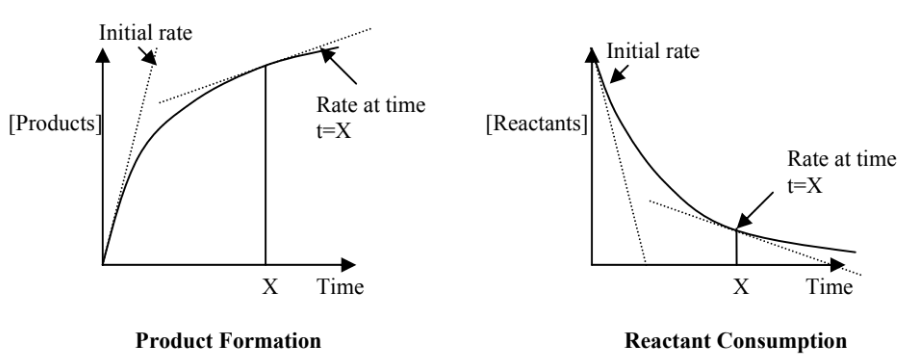
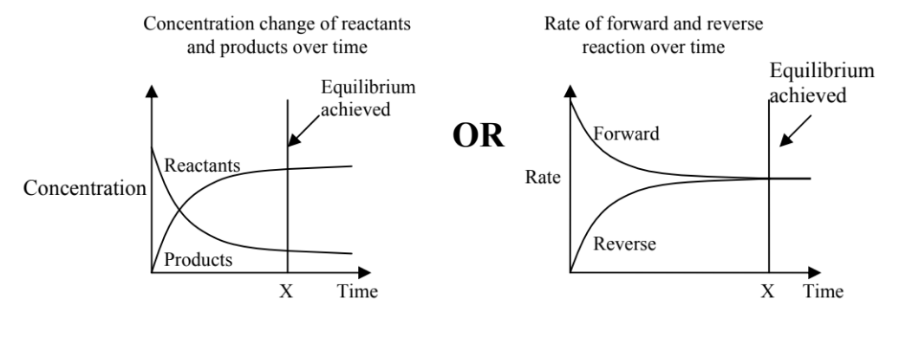
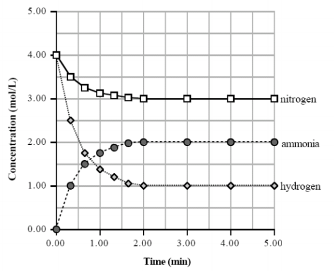
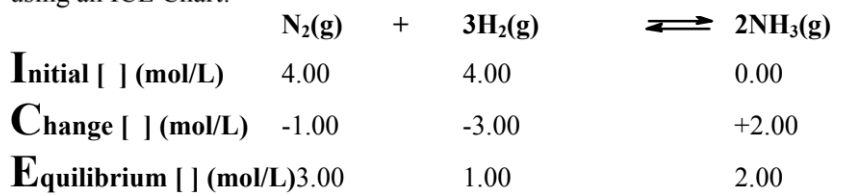
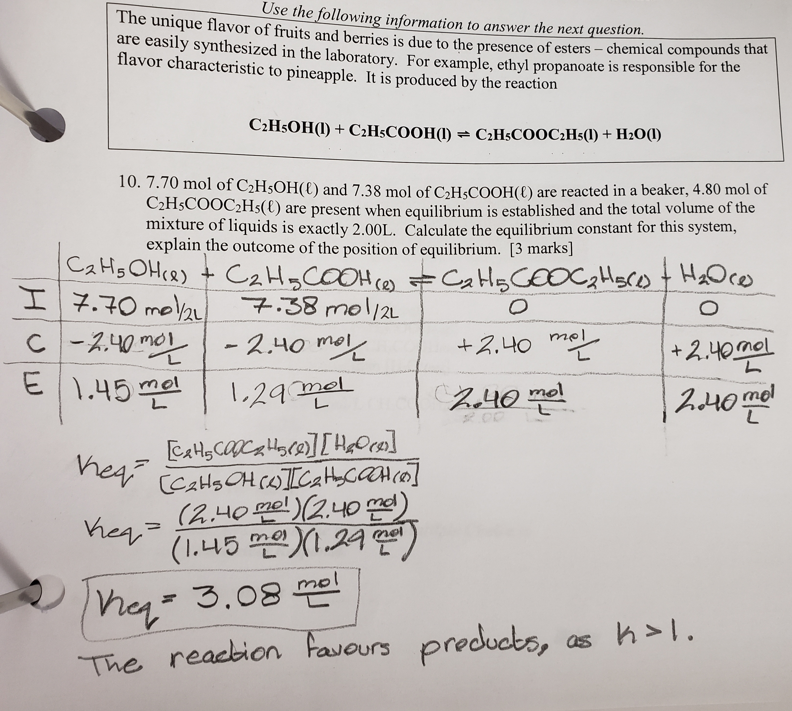
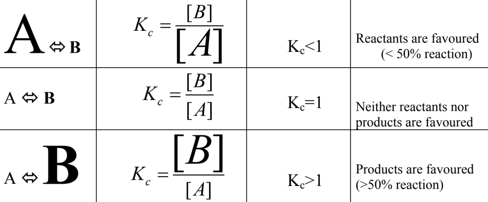
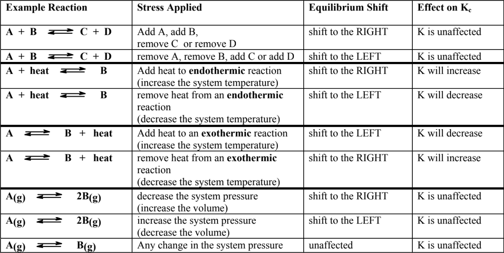

# Equilibrium

---

# Equilibrium
## Static Equilibrium
No motion occurs, usually equally applied forces.  
*e.g. Tug-of-war*

## Dynamic Equilibrium
~~Two opposing processes~~ occur at the ~~same rate~~.

Nothing appears to be happening. (shape of solid can change)  
At a molecular level, a reaction is both going forward and backwards at the same rate, ~~cancelling itself~~.

# Collision Theory
* Molecules/atoms must ~~collide~~ with each other
* Molecules/atoms must collide with each other with sufficient energy (above ~~activation energy~~, Ea)
* Molecules/atoms must collide with each other in the ~~correct orientation~~ (aka. steric factor)

# Chemical Equilibrium
Systems at (dynamic) equilibrium...
* are closed systems (energy in/out, not matter)
* rate of forward reaction = rate of reverse reaction
* macroscopically, appears to do nothing

## Concentration Graphs
As each process progresses, the rate (slope) of said process decreases.  

The rate of the forward reaction ~~starts high and decreases~~.  
The rate of the reverse reaction ~~starts low and increases~~.

The rate of reaction is dependent on the concentration of the reactants.  
(~~[reactant] decrease~~ -> ~~rate decrease~~)

When the slope is 0, the rate is 0, and ~~equilibrium is reached~~.

#### Individually

#### Together

# ICE Chart
Used to find any of the following when the other two are known.
* initial concentrations
* change in concentrations
* equilibrium concentrations (needed for equilibrium constant, $\textrm{K}$, covered later)

Its just a fancy way of adding the initial and delta concentrations together.

#### Example
> $\textrm{N}_{2\textrm{ (g)}} + 3\textrm{H}_{2\textrm{ (g)}} \longleftrightarrow 2\textrm{NH}_{3\textrm{ (g)}}$
>
> 
>
> 

#### Example from Quiz

# Equilibrium Constant
The equilibrium constant of an equation, $\textrm{K}_\textrm{eq}$, is the product of the concentration of products to the power of their coefficients divided by the product of the concentrations of reactants to the power of their coefficients.

$$\textrm{aA} + \textrm{bB} \longleftrightarrow \textrm{cC} + \textrm{dD}$$

$$\textrm{K}_\textrm{eq} = \dfrac{ [\textrm{products}] }{ [\textrm{reactants}] }$$

$$\textrm{K}_\textrm{eq} = \dfrac{ [\textrm{C}]^\textrm{c}[\textrm{D}]^\textrm{d} }{ [\textrm{A}]^\textrm{a}[\textrm{B}]^\textrm{b} }$$

#### Special Constants
* Kw: equilibrium constant for the ionization of water
* Ka: equilibrium constant for the ionization of acids in water
* Kb: equilibrium constant for the dissociation of bases in water
* Ksp: equilibrium constant for the dissocation of ionic compounds in water (solubility)

## Favourability
Some reactions **favor products**---~~>50% of reactants convert into products~~, [products] increases, [reactants] decreases  
Some reactions **favor reactants**---~~<50% of reactants convert into products~~, [reactants] stays high

You can write >50% or <50% above the reaction arrow if you know it.

#### K
The value of the equilibrium constant can tell you which is favoured. Larger letters means larger concentrations.

Sidenote: If K is near but not equal to 1, there is likely still no favorability due to uncertainty.

## Homogeneous
An equilibrium reaction with all reactants and products in the same phase/state.

## Heterogeneous
An equilibrium reaction with not all reactants and products in the same phase/state.

In this case, only some compounds are included in the equilibrium expression.

* ~~ALWAYS include gases~~
* ~~ALWAYS include aqueous ions~~
* ~~NEVER include solids~~
* ~~ONLY~~ include liquids if ~~ALL COMPOUNDS are liquids~~
* ~~ONLY~~ include liquid water if there are ~~no aqueous ions present~~

If all products or all reactants ~~cannot be included, put 1~~ in their place.

# Le Chatelier's Principle
A stress is any external manipulation of the variables in a system. (e.g. adding heat, decreasing pressure, etc.)

If a stress is applied to a system at equilibrium, the system will adjust to minimize the stress.  
It will try to ~~**consume any additions and replenish any removals**~~.

## Shifting
* A system shifting right means a system reacting forward---[products] increase, [reactants] decrease.
* A system shifting left means a system reacting reverse---[products] decrease, [reactants] increase.

This has ~~no effect~~ on whichever side is ~~favourable~~. (this is dictated by K)

## Responses to Stresses

### Concentration
* ~~Increasing concentration of a compound~~ on a side will shift the reaction to the ~~other side~~, to ~~consume the excess~~.  
* ~~Decreasing concentration~~ of a compound on a side will shift the reaction to the ~~its side~~, to ~~replace the loss~~.

$\textrm{K}$ is unaffected.

#### Substances Not In Reaction
A substance can be added that comprises of a cation/anion and a spectator.  
*e.g. $\textrm{AgNO}_{3\textrm{(aq)}} \longrightarrow \textrm{Ag}^+$, $\textrm{NaOH}_\textrm{(aq)} \longrightarrow \textrm{OH}^-$*

These lone ions can ~~bind to any pre-existing ions~~ in the reaction, forming a new compound.
* If the new compound is ~~soluble~~, the ~~pre-existing ions are technically still present~~, so ~~no concentrations are changed~~.
* If the new compound is ~~insoluble~~, the ~~pre-existing ions are technically removed~~ from the reaction, ~~shiftng to its side to replenish the lost ions~~.

### Temperature
* ~~Adding heat energy~~ to a reaction will shift the reaction to the ~~side without the heat~~---if heat is integrated in the equation.  
* ~~Removing heat energy~~ from a reaction will shift the reaction to the ~~side with the heat~~---if heat is integrated in the equation.  

(remember, heat flows hot to cold)

~~$\textrm{K}$ is affected~~. (only energy changes can affect K)
* Depending on wherever side the reaction shifts to, K will either increase/decrease if the shift increases the concentration of products/reactants respectively.
* In other words, ~~right shift increases K~~, ~~left shift decreases K~~

### Pressure
* Increasing pressure will shift the reaction towards the ~~side with least gas molecules~~---sum of coefficients. (less molecules to hit walls)
* Decreasing pressure will shift the reaction towards the ~~side with most gas molecules~~---sum of coefficients. (theres room for more molecules now)

* If the sum of molecules on both sides are equal, there is ~~no response to stress~~. 

$\textrm{K}$ is unaffected.

#### Tip
Use the ancronym `vpn` to remember. (volume, pressure, numbers of moles)
* If `v` increases, `p` decreases, `n` increases (therefore, shift to where `n` is higher)
* If `v` decreases, `p` increases, `n` decreases (therefore, shift to where `n` is lower)

#### Concise

