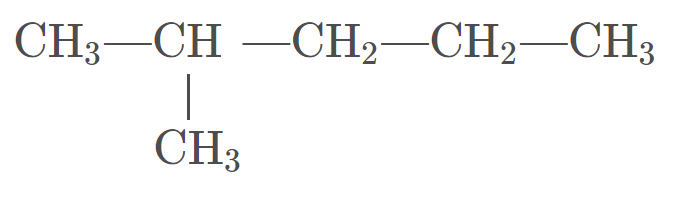

# Organic Chemistry
The prerequisite to these notes is to read the beginning of the [20 IB Bonding Unit](../20ib/unit1.md)

!> These notes are **unfinished**, anything you see may be inaccurate and subject to change.

---

# What is an organic compound?
An organic compound is any ~~molecular compound~~ ~~containing carbon atoms~~ which are nearly always ~~bonded~~ to ~~each other~~, to ~~hydrogen~~, or to atoms of a few ~~specific elements~~.

The only exception to this rule are ~~oxides of carbon~~, any compound containing ~~only carbon and oxygen~~. (e.g. $\textrm{CO}_2$ or $\textrm{CO}$)  
Any compound not following these aforementioned criteria would be classified as ~~inorganic compounds~~.

# Formulas
There are three types of formulas used for organic compounds.

## Molecular Formula
Shows ~~number~~ and ~~types of atoms~~.  
Does not show ~~structure~~.

#### Example
> $\textrm{C}_2\textrm{H}_4\textrm{O}_{2 (l)}$

## Empirical Molecular Formula
Shows ~~ratios~~ of types of atoms.  
Not useful for most applications.

#### Example
> The following is the previous compound in empirical molecular formula. It is basically just a simplified version.  
$\textrm{CH}_2\textrm{O}$

## Expanded Molecular Formula
Shows ~~grouping of atoms~~.  
Every element is bonded to the ~~closest carbon~~ in the formula's order.  

This will make more sense as you progress in the unit.

#### Example
> $\textrm{CH}_3\textrm{COOH}_{(l)}$  
The first carbon ($\textrm{C}$) is bonded to 3 hydrogens ($\textrm{H}_3$) as well as another carbon. ($\textrm{C}$) This other carbon is bonded to an oxygen ($\textrm{O}$) as well as an oxygen ($\textrm{O}$) thats bonded to a hydrogen ($\textrm{H}$)

# Diagrams
There are three types of diagrams used to draw organic compounds.

## Structural Diagrams

This diagram shows ~~all atoms and bonds~~.  
It can be drawn many different ways and still have the same name.

> **Remember**: All available bonds must be used.  
For instance, carbon has 4.  
This can be done by bonding an element to every single one, or creating double or triple bonds.

## Condensed Structural Diagrams
$\textrm{CH}_3\text{\textemdash}\textrm{CH}_2\text{\textemdash}\textrm{CH}_2\text{\textemdash}\textrm{CH}_2\text{\textemdash}\textrm{CH}_3$

This diagram is the same as a structural diagram, except ~~only hydrogens are condensed~~.

## Line Structural Diagrams

This diagram is the most commonly used. Bonds are represented with ~~lines~~.

~~Every end or bend~~ is a ~~carbon~~.  
Hydrogens are ~~not drawn~~, but they are there. Whatever of the four carbon bonds is "empty" is assumed to be a hydrogen.

# Organic Compound Classification

## Hydrocarbons
Hydrocarbons are compounds that contain ~~only carbon and hydrogen~~.  
These includes ~~alkanes, alkenes, alkynes, and cyclics~~.

There are two types.

### Aliphatic Compounds
Hydrocarbons that ~~do not contain benzene~~.

### Aromatic Compounds
Hydrocarbons that ~~contain benzene~~.

## Hydrocarbon Derivatives
~~Molecular compounds~~ that contain ~~carbon and hydrogen~~ ~~plus at least one other element~~. (e.g. halogen, oxygen, etc.)

# Hydrocarbons
## Alkanes
Alkanes are hydrocarbons containing ~~only single carbon-to-carbon bonds~~.  
Because of this, they are ~~saturated~~, meaning that ~~all possible hydrogen bonds are made~~. They are saturated with hydrogen.

### General Formula
<h1>
$\textrm{C}_n\textrm{H}_{2n+2}$
</h1>

### Physical Properties
Alkanes are ~~non-polar~~.  
Non-polar molecules ~~only dissolve in non-polar solutions~~.  
They can dissolve in ~~benzene~~, but ~~not water~~.

Alkanes have ~~low boiling points~~. The boiling point of molecule gets ~~larger as molecule gets larger~~.

## Alkenes
Alkenes are hydrocarbons containing ~~at least one double bond~~.  
Because of this, they are ~~unsaturated~~.

### General Formula
A double bond removes 2 hydrogens, so the formula is changed to...
<h1>
$\textrm{C}_n\textrm{H}_{2n}$
</h1>

This formula only works if there is ~~only one double bond~~.

## Alkynes
Alkynes are hydrocarbons containg ~~at least one triple bond~~.
Because of this, they are ~~unsaturated~~.

### General Formula
A triple bond removes 4 hydrogens, so the formula is changed to...
<h1>
$\textrm{C}_n\textrm{H}_{2n-2}$
</h1>

This formula only works if there is ~~only one triple bond~~.

# Hydrocarbon Nomenclature
There are three components to naming a hydrocarbon.  
The **prefix**, the **root**, and the **suffix**.

In addition, naming is often written from ~~right-to-left~~.

## Suffix
The suffix dictates the whether the compound is an alkane, alkene, or alkyne.  
This is done by using the suffix of those names.

**Alkanes**: ~~End in `-ane`~~  
**Alkenes**: ~~End in `-ene`~~  
**Alkynes**: ~~End in `-yne`~~

## Root
The root dictates the ~~number of carbons in the main chain~~.

### Main Chain
The main chain is the ~~longest chain of carbons~~ that ~~may bend~~ but ~~do not overlap or backtrack~~.  

### Root Prefix
To actually state the number of carbons in the main chain, write the corresponding prefix.

| Number of $\textrm{C}$ | Prefix |
| :--------------------: | :----: |
| 1 | `meth-` |
| 2 | `eth-` |
| 3 | `prop-` |
| 4 | `but-` |
| 5 | `pent-` |
| 6 | `hex-` |
| 7 | `hept-` |
| 8 | `oct-` |
| 9 | `non-` |
| 10 | `dec-` |

#### Example
> $\textrm{CH}_3\text{\textemdash}\textrm{CH}_2\text{\textemdash}\textrm{CH}_2\text{\textemdash}\textrm{CH}_2\text{\textemdash}\textrm{CH}_3$  
There are only single C-C bonds. This is an alkane. Prefix is `-ane`.  
There are 5 carbons in the main chain. 5 is `pent-`.  
There are no branches. We are done. The name is **pentane**.

## Prefix
The prefix dictates the ~~position~~, ~~number of~~, and ~~size~~ of ~~branches~~.

### Branches
Anything that is sticking off of and not a part of the main chain is a ~~branch~~.  

~~Branches of branches cannot exist~~. There are no ways of naming these, so make sure the main chain is set up to prevent this.

Branches cannot be located at the ~~ends of the main chain~~. This would make them just a part of the main chain.  
*(It should be mentioned that other elements, like iodine, can go to the end of the main chain. This is covered more in the hydrocarbon derivitives portion)*

Branches should be written in ~~alphabetical order~~ ~~ignoring any prefixes~~ (like di-, tri-, etc...)  
For instance, write an etyhl branch before a methyl branch.

### Size
When naming a branch, you start with the number of carbons it has. It is the ~~same naming as a root prefix~~.  
The only difference is that it now ~~ends in `-yl`.

For instance, a branch with 3 carbons in it is a propyl.

### Number Of
If there are multiple instances of the same size of branch, prefix the size with the following.

| Number of Same Branch | Prefix |
| :-------------------: | :----: |
| 2 | `di-` |
| 3 | `tri-` |
| 4 | `tetra-` |
| 5 | `penta-` |
| 6 | `hexa-` |
| 7 | `hepta` |
| 8 | `octo-` |
| 9 | `nona-` |
| 10 | `deca-` |

For instance, if there are two branches with two carbons in it, write down diethyl

### Position
A ~~number position~~ must be given to ~~every branch~~, even if there are ~~multiple in the same spot~~.

The number states ~~which carbon~~ in the ~~main chain~~ that a branch is ~~bonded to~~.  
You can either start counting the carbons in the main chain from the ~~left or the right~~, but you must start counting from the side that ~~gives you the lowest numbers~~.

Once you have got your number, you state it before everything, ~~seperating each number with a comma~~ if there are multiple of the same branch, and ~~encompassing all the numbers with dashes~~.

It is important to mention that if there is ~~only one possible location for a branch~~, ~~do not write the number~~. For instance, if you had a propane or butane.

#### Example
>   
  You could count from left to right and say the methyl branch is at 2, or you could count right to left and say the methyl branch is 3.  
  The correct choice would be left to right, as it gives you the lowest number.  
  If you include everything, the name of this is **2-methylpentane**. 

# Structural Isomers
Structural isomers are molecules with the ~~same empirical formula~~ (i.e. same number of elements), but ~~different structural formula~~.  
Most of the time this occurs when you ~~remove a carbon from the main chain~~ and ~~replace it with a branch~~.

A structural isomer has the ~~same formula~~, ~~different structure~~, ~~different names~~ and ~~different properties~~.

## Example
> **butane and methylpropane**  
Empirical formula for both is $\textrm{C}_4\textrm{H}_10$  
Butane is one chain of 4 carbons, while methyplpropane is a chain of 3 carbons with a branch of 1 carbon.
