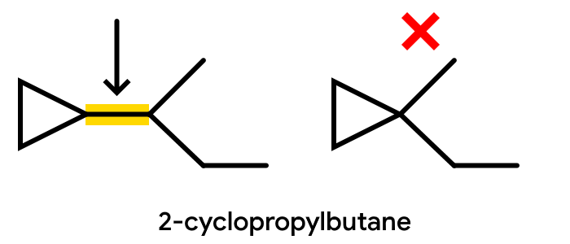
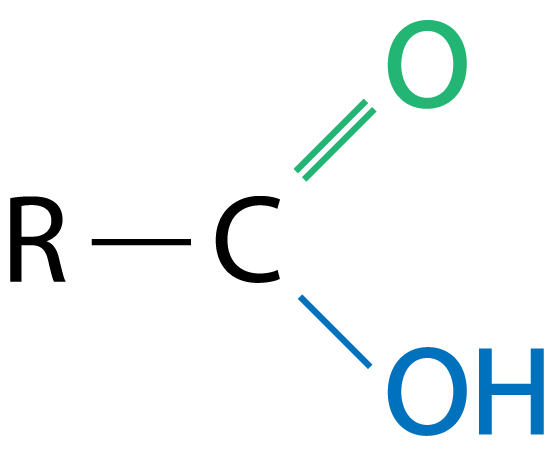
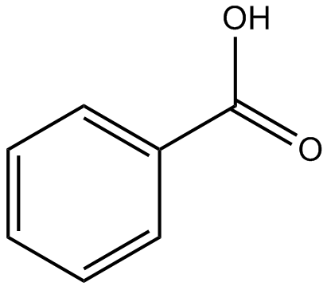

# Organic Chemistry
The prerequisite to these notes is to read the beginning of the [20 IB Bonding Unit](../20ib/unit1.md)

!> These notes are **unfinished**, anything you see may be inaccurate and subject to change.

---

# What is an organic compound?
An organic compound is any ~~molecular compound~~ ~~containing carbon atoms~~ which are nearly always ~~bonded~~ to ~~each other~~, to ~~hydrogen~~, or to atoms of a few ~~specific elements~~.

The only exception to this rule are ~~oxides of carbon~~, any compound containing ~~only carbon and oxygen~~. (e.g. $\textrm{CO}_2$ or $\textrm{CO}$)  
Any compound not following these aforementioned criteria would be classified as ~~inorganic compounds~~.

# Formulas
There are three types of formulas used for organic compounds.

## Molecular Formula
Shows ~~number~~ and ~~types of atoms~~.  
Does not show ~~structure~~.

#### Example
> $\textrm{C}_2\textrm{H}_4\textrm{O}_{2 (l)}$

## Empirical Molecular Formula
Shows ~~ratios~~ of types of atoms.  
Not useful for most applications.

#### Example
> The following is the previous compound in empirical molecular formula. It is basically just a simplified version.  
$\textrm{CH}_2\textrm{O}$

## Expanded Molecular Formula
Shows ~~grouping of atoms~~.  
Every element is bonded to the ~~closest carbon~~ in the formula's order.  

This will make more sense as you progress in the unit.

#### Example
> $\textrm{CH}_3\textrm{COOH}_{(l)}$  
The first carbon ($\textrm{C}$) is bonded to 3 hydrogens ($\textrm{H}_3$) as well as another carbon. ($\textrm{C}$) This other carbon is bonded to an oxygen ($\textrm{O}$) as well as an oxygen ($\textrm{O}$) thats bonded to a hydrogen ($\textrm{H}$)

# Diagrams
There are three types of diagrams used to draw organic compounds.

## Structural Diagrams

This diagram shows ~~all atoms and bonds~~.  
It can be drawn many different ways and still have the same name.

> **Remember**: All available bonds must be used.  
For instance, carbon has 4.  
This can be done by bonding an element to every single one, or creating double or triple bonds.

## Condensed Structural Diagrams
$\textrm{CH}_3-\textrm{CH}_2-\textrm{CH}_2-\textrm{CH}_2-\textrm{CH}_3$

This diagram is the same as a structural diagram, except ~~only hydrogens are condensed~~.

## Line Structural Diagrams

This diagram is the most commonly used. Bonds are represented with ~~lines~~.

~~Every end or bend~~ is a ~~carbon~~.  
Hydrogens are ~~not drawn~~, but they are there. Whatever of the four carbon bonds is "empty" is assumed to be a hydrogen.

# Organic Compound Classification

## Hydrocarbons
Hydrocarbons are compounds that contain ~~only carbon and hydrogen~~.  
These includes ~~alkanes, alkenes, alkynes, and cyclics~~.

There are two types.

### Aliphatic Compounds
Hydrocarbons that ~~do not contain benzene~~.

### Aromatic Compounds
Hydrocarbons that ~~contain benzene~~.

## Hydrocarbon Derivatives
~~Molecular compounds~~ that contain ~~carbon and hydrogen~~ ~~plus at least one other element~~. (e.g. halogen, oxygen, etc.)

# Hydrocarbons
## Alkanes
<h1>
$\textrm{C} - \textrm{C}$
</h1>

Alkanes are hydrocarbons containing ~~only single **carbon-to-carbon** bonds~~.  
Because of this, they are ~~saturated~~, meaning that ~~all possible hydrogen bonds are made~~. They are saturated with hydrogen.

### General Formula
<h1>
$\textrm{C}_n\textrm{H}_{2n+2}$
</h1>

### Physical Properties
Alkanes are ~~non-polar~~.  
Non-polar molecules ~~only dissolve in non-polar solutions~~.  
They can dissolve in ~~benzene~~, but ~~not water~~.

Alkanes have ~~low boiling points~~. The boiling point of molecule gets ~~larger as molecule gets larger~~.

## Alkenes
<h1>
$\textrm{C} = \textrm{C}$
</h1>

Alkenes are hydrocarbons containing ~~at least one **carbon-to-carbon** double bond~~.  
Because of this, they are ~~unsaturated~~.

### General Formula
A double bond removes 2 hydrogens, so the formula is changed to...
<h1>
$\textrm{C}_n\textrm{H}_{2n}$
</h1>

This formula only works if there is ~~only one double bond~~.

### Physical Properties
~~Non-polar~~. (not water soluable, but oil soluable)  
~~More atoms means higher boiling point~~. Since alkenes have less atoms due to the double bond, ~~alkenes boiling point~~ is ~~lower than alkanes~~.

## Alkynes
<h1>
$\textrm{C} \equiv \textrm{C}$
</h1>

Alkynes are hydrocarbons containing ~~at least one triple **carbon-to-carbon** bond~~.
Because of this, they are ~~unsaturated~~.

### General Formula
A triple bond removes 4 hydrogens, so the formula is changed to...
<h1>
$\textrm{C}_n\textrm{H}_{2n-2}$
</h1>

This formula only works if there is ~~only one triple bond~~.

### Physical Properties
~~Non-polar~~.

The boiling/melting point of alkynes are actually ~~higher than alkanes~~.  
There is a technical reason to this, but you don't really need to know. (it is because they are linear and squeeze closer together)

## Cyclics
Cyclic hydrocarbons are ~~aliphatic~~ hydrocarbons chains that have ~~no beginning and end~~, but instead form a ~~ring~~.  
They can still be alkanes, alkenes, or alkynes.

### Diagrams
The ring's ~~shape~~ is based of off the ~~number of carbons~~.  
For instance, cyclopropane looks like a triangle, cyclobutane looks like a square, cyclohexane looks like a hexagon, etc...

When a cyclic is a branch, it must connect to the main branch with a line. ~~Do not mistake this line as another carbon. It is only a bond.~~

## Benzene
Alkanes, alkenes, alkynes, and cyclics are all aliphatics. Aromatics are hydrocarbons containing ~~benzene~~. ~~($\textrm{C}_6\textrm{H}_{6 (l)}$)~~  
Benzene is a ~~6 carbon ring~~ with ~~no true double or triple bonds~~.

It is rather an ~~intermediate form~~ between a single and a double bond. (resonance hybrid)  
It ~~rapidly alternates between single and double bonds~~ in the alternate benzene image. (2nd one)
This is because the ~~electrons are equally distributed~~, hence the circle.

This also means that each carbon in the benzene ring only has ~~one bonding pair on each carbon~~, unlike cyclohexane and other cyclics which have two bonding pairs on each carbon.

### Diagram
The diagram for benzene is just a diagram of a cyclohexane, so a hexagon, with a circle in the middle.

You may also see it drawn as with double bonds. This is not entirely accurate as benzene has no true double bonds.

### Physical Properties
Benezene is ~~non-polar~~ with ~~nothing on it~~.  
Benzene is ~~polar~~ if it has ~~branches on it~~.

It is large enough to be a ~~liquid at room temperature~~.

# Hydrocarbon Nomenclature
There are three components to naming a hydrocarbon.  
The **prefix**, the **root**, and the **suffix**.

In addition, naming is often written from ~~right-to-left~~.

## Suffix
The suffix dictates the whether the compound is an alkane, alkene, or alkyne.  
This is done by using the suffix of those names.

**Alkanes**: ~~End in `-ane`~~  
**Alkenes**: ~~End in `-ene`~~  
**Alkynes**: ~~End in `-yne`~~

## Root
The root dictates the ~~number of carbons in the main chain~~.

### Main Chain
The main chain is the ~~longest chain of carbons~~ that ~~may bend~~ but ~~do not overlap or backtrack~~.  

In the context of cyclics and benzene, the main chain must either be only a cyclic or benzene, or a chain thats longer.  
The main chain ~~cannot include both~~ the carbons in the ~~cyclic/benzene~~ and ~~another chain~~.

### Root Prefix
To actually state the number of carbons in the main chain, write the corresponding prefix.

| Number of $\textrm{C}$ | Prefix |
| :--------------------: | :----: |
| 1 | `meth-` |
| 2 | `eth-` |
| 3 | `prop-` |
| 4 | `but-` |
| 5 | `pent-` |
| 6 | `hex-` |
| 7 | `hept-` |
| 8 | `oct-` |
| 9 | `non-` |
| 10 | `dec-` |

#### Example
> $\textrm{CH}_3-\textrm{CH}_2-\textrm{CH}_2-\textrm{CH}_2-\textrm{CH}_3$  
There are only single C-C bonds. This is an alkane. Prefix is `-ane`.  
There are 5 carbons in the main chain. 5 is `pent-`.  
There are no branches. We are done. The name is **pentane**.

## Prefix
The prefix dictates the ~~position~~, ~~number of~~, and ~~size~~ of ~~branches~~.

### Branches
Anything that is sticking off of and not a part of the main chain is a ~~branch~~.  

~~Branches of branches cannot exist~~. There are no ways of naming these, so make sure the main chain is set up to prevent this.

Branches cannot be located at the ~~ends of the main chain~~. This would make them just a part of the main chain.  
*(It should be mentioned that other elements, like iodine, can go to the end of the main chain. This is covered more in the hydrocarbon derivitives portion)*

Branches should be written in ~~alphabetical order~~ ~~ignoring any prefixes~~ (like di-, tri-, etc...)  
For instance, write an etyhl branch before a methyl branch.

### Size
When naming a branch, you start with the number of carbons it has. It is the ~~same naming as a root prefix~~.  
The only difference is that it now ~~ends in `-yl`.

For instance, a branch with 3 carbons in it is a propyl.

### Number Of
If there are multiple instances of the same size of branch, prefix the size with the following.

| Number of Same Branch | Prefix |
| :-------------------: | :----: |
| 2 | `di-` |
| 3 | `tri-` |
| 4 | `tetra-` |
| 5 | `penta-` |
| 6 | `hexa-` |
| 7 | `hepta` |
| 8 | `octo-` |
| 9 | `nona-` |
| 10 | `deca-` |

For instance, if there are two branches with two carbons in it, write down diethyl

### Position
A ~~number position~~ must be given to ~~every branch~~, even if there are ~~multiple in the same spot~~.

The number states ~~which carbon~~ in the ~~main chain~~ that a branch is ~~bonded to~~.  
You can either start counting the carbons in the main chain from the ~~left or the right~~, but you must start counting from the side that ~~gives you the lowest numbers~~.

Once you have got your number, you state it before everything, ~~seperating each number with a comma~~ if there are multiple of the same branch, and ~~encompassing all the numbers with dashes~~.

It is important to mention that if there is ~~only one possible location for a branch~~, ~~do not write the number~~. For instance, if you had a propane or butane.

#### Example
>   
  You could count from left to right and say the methyl branch is at 2, or you could count right to left and say the methyl branch is 3.  
  The correct choice would be left to right, as it gives you the lowest number.  
  If you include everything, the name of this is **2-methylpentane**. 

## Multibond Naming
When you are dealing with organic compounds with a double or triple bond, you must state where said bond is in the compound.  
This is just like naming the position of branches, except for a few key differences.

* Instead of the branches needing the lowest number, the ~~multibond should have the lowest number~~. Choose to count from whichever side to ensure that the multibond has the lowest number.
  * The only time this is not the case is if ~~both directions give the same number~~, then you choose the side with the ~~lowest branch numbers~~ like before.
* You place the ~~position number between the root and the suffix~~, seperated with dashes like before.
* The position number should be on the compound ~~right before the double bond~~.

In addition, if there are ~~more than one of a multibond~~, you write a prefix and add more numbers just ~~like branch positions~~. See the last example.

### Example
> $\textrm{CH}_2=\textrm{CH}-\textrm{CH}_2-\textrm{CH}_3$  
The name of this organic compound is **but-1-ene**.

> $\textrm{CH}_2=\textrm{CH}-\textrm{CH}_3$  
The name of this organic compound is **propene**.   
There is only one possible position for the double bond, so you must write no number.

> $\textrm{CH}_2=\textrm{C}=\textrm{CH}-\textrm{CH}_2$  
The name of this organic compound is **but-1,2-diene**.

## Cyclic Nomenclature
The naming of cyclics is very similiar to the other aliphatics, with a few key differences.
* Add the prefix `cyclo-` to the root name.
  * *e.g. cyclobutane, cyclobutene*
* If there are ~~no branches~~ or ~~only one branch~~ and nothing else, or ~~only one multibond~~ and nothing else, ~~do not state the number~~.
  * This is because the counting ~~starts from a branch or multibond always~~ in cyclics.
    * If there are both multibonds and branches, give the ~~multibond the lowest number~~.
* If there are ~~more than one branch~~, number the branches with the ~~lowest possible numbers~~ like before.
* If the cyclic is ~~a branch~~, give it the suffix of `-yl` like a normal branch.

## Benzene Nomenclature
The naming of benzene is very similar to cyclics, with a few key differences.
* When benzene is the main chain, nothing is special.
  *e.g. methylbenzene is a benzene with 1 branch with 1 carbon*
* When benzene is not the main chain, and therefore a ~~branch~~, it is called ~~`phenyl`~~.
  *e.g. 2-phenylheptane is a single carbon-to-carbon chain with a benzene branched off of the 2nd carbon*
* Benzene as a branch ~~does not get lowest number priority~~.

# Structural Isomers
Structural isomers are molecules with the same empirical formula (i.e. ~~same quantity of every single element~~), but ~~different structural formula~~.  
Most of the time this occurs when you ~~remove a carbon from the main chain~~ and ~~replace it with a branch~~.

A structural isomer has the ~~same formula~~, ~~different structure~~, ~~different names~~ and ~~different properties~~.

### Example
> **butane and methylpropane**  
Empirical formula for both is $\textrm{C}_4\textrm{H}_{10}$  
Butane is one chain of 4 carbons, while methyplpropane is a chain of 3 carbons with a branch of 1 carbon.

# Shared General Compounds
Use the following table to help you identify the type of hydrocarbon compound when only given an empirical (ratios) structural formula.

| General Formula | Used By |
| :-------------: | :-----: |
| $\textrm{C}_n\textrm{H}_{2n+2}$  | alkanes |
| $\textrm{C}_n\textrm{H}_{2n}$ | alkenes cycloalkanes |
| $\textrm{C}_n\textrm{H}_{2n-2}$ | alkynes cycloalkenes |
| $\textrm{C}_n\textrm{H}_{2n-4}$ | cycloalkynes |

Just remember the pattern.

# Hydrocarbon Derivatives
Hydrocarbon derivatives are hydrocarbons (carbon-to-carbon compounds with vacant orbitals bonded to hydrogen) with a ~~specific arrangement of atoms besides carbon or hydrogen~~.

This specific arrangement of atoms is called the ~~**functional group**~~.

## General Rules
$\textrm{R}$ in general formulas represents the rest of the hydrocarbon. (Not another functional group!)

A **terminal carbon** is a carbon on the end of a chain.

The priorities of numbering of different functional groups is not something that is directly tested, but the general jist of it is, from ~~highest to lowest priority for lowest number~~...
* Multibonds (double, triple)
* Carboxylic Acids
* Alcohols
* Halogens
* Branches
These different groups are often not mixed together, so this order is not completely accurate or even necessary.

All prefixes must be ~~ordered alphabetically~~, ignoring quantity prefixes. (di-, tri-, etc...)  
For instance, ethyl should be written first, then methyl.

## Halogenoalkanes
Also known as alkyll halides.

### General Formula
A hydrocarbon with ~~atleast one halogen~~.
<h1>
$\textrm{R}-\textrm{X}$
</h1>

$\textrm{X}$ = Halogen

### Nomenclature
* The main chain must have ~~all the halogens attached~~.
* Name the halogens like branches, as in prefixes with quantities (di-, tri-, etc...) if applicable. However...
* The prefixes should ~~end in `-o`~~
  * `fluro-`, `chloro-`, `bromo-`, `iodo-`, `astatido-`

### Examples
> A butane chain with a chlorine on the 1st carbon is called "1-chlorobutane."

### Properties
Halogenoalkanes vary too much from each other to have generalized properties.

## Alcohols

### General Formula
<h1>
$\textrm{R}-\textrm{OH}$
</h1>

The functional group of alcohols is called a ~~**hydroxyl**~~. ($-\textrm{OH}$)  
Not to be confused with hydroxide, which is an ion.

### Nomenclature
* The main chain must have ~~all hydroxyls attached~~.
* Replace the "e" in the suffix with ~~`-ol`~~
* Between the rest of the suffix and `-ol`, ~~state the position~~ of the hydroxyl if applicable, seperating the number with dashes.
* If there are ~~multiple alcohols/hydroxyls~~, prefix the `-ol` with ~~quantitative prefixes~~. (di-, tri-, etc...)
  * If you do use the quantitative prefixes, ~~put back the "e"~~ you took out earlier. (unless the prefix starts with a vowel)
    * This is because that "e" must be removed if the suffix starts with a vowel.
* A benzene ring with a hydroxyl attached is called ~~**phenol**~~. It just is. Remember it.

### Examples
> A propane chain with a hydroxyl on the 2nd carbon is called "propan-2-ol."

> A ethane chain with two hydroxyls on the 1st and 2nd carbon is called "ethane-1,2-diol."

### Properties
* The hydroxyl is ~~polar~~.
* They are ~~soluable~~ in water.
* They are ~~toxic~~.
* They ~~increase the boiling/melting points~~ of compounds they are attached to.
* In all polar hydrocarbons, ~~small molecules are water soluable~~, but ~~larger molecules are not water soluble~~.

## Carboxylic Acids

### General Formula

The functional group of carboxylic acids is a ~~**carboxyl**~~. ($-\textrm{COOH}$)  
It is actually the combination of a hydroxyl ($\textrm{C}-\textrm{OH}$, highlighted in blue) and a carbonyl. ($\textrm{C}=\textrm{O}$, highlighted in green)

### Nomenclature
* The main chain must have contain the ~~carboxyl on a terminal carbon~~.
* Drop the "e" and replace it with `-oic acid`
  * Do not specify numbers for position. This is because the carboxyl is ~~always numbered one~~.
* The only exception is benzene. Drop the "ene" in benzene to create "~~benzoic acid~~."

### Examples
> A pentane chain with a carboxyl a terminal carbon is called "pentanoic acid."

> ~~**Important Tip**~~  
> Cyclics and Aromatics with a carboxyl are often drawn with the carboxyl bonded to a mysterious carbon, and that mysterious carbon is what is bonded to the cyclic/aromatic. This is intentional and is not explicitly stated, but it is correct.  
> 

### Properties
* ~~Very polar~~
* ~~High boiling/melting points~~
* Smaller molecules soluable, larger insoluable.
* ~~Weak acids~~

## Esters

### General Formula

The functional group of esters is a $\textrm{C}-\textrm{O}$ bond *and* a carbonyl. ($\textrm{C}=\textrm{O}$)  
This functional group is ~~between two different hydrocarbon chains~~.

An ester is formed when ~~**an alcohol reacts with a carboxylic acid**~~.

### Nomenclature
* The main chain is the ~~chain attached to the carbonyl~~. ($\textrm{C}=\textrm{O}$)
  * The carbon the double bonded oxygen is attached to ~~counts in the main chain~~.
* After naming the main chain, drop the "e" and add `-oate`.
* The chain attached to the single bonded oxygen ($\textrm{C}-\textrm{O}$) is ~~named as a branch~~.
  * Name this branch before the main chain, ~~seperating them with a space~~.
* The chains are numbered ~~outward left and right from the ester's carbon~~, with that carbon being ~~numbered 1~~.

### Examples
> An ester with a propane attached to the carbonyl and a butane attached to the single bonded oxygen is called "butyl propanoate."

### Properties
* ~~Somewhat polar~~.
* ~~Lower boilng/melting~~ point than ~~alcohols or carboxylic acids~~.
* Smaller soluable, larger insoluable
* ~~Nice smelling, fruit-like aromas~~.

## Properties Tips
### Boiling/Melting Points
Boiling/Melting Points are higher if your compound...
* Contains ~~hydrogen bonding~~
* ~~Large~~

### Solubility
Solubility of a compound is higher if your compound...
* Is ~~polar~~
* ~~Small~~

## Classifying Compounds
Halogenoalkanes, alcohols, and amines can be classified to ~~primary ($1^\circ$), secondary ($2^\circ$), or tertiary ($3^\circ$)~~.

### Halogenoalkanes & Alcohols
The classification for halogenoalkanes and alcohols is the ~~number of carbons attached to the carbon the functional group is attached to~~.  
For halogenoalkanes, they are called ~~$\textrm{X}^\circ$ alkyl halide~~, where $\textrm{X}$ is the classification.  
For alcohols, they are called ~~$\textrm{X}^\circ$ alcohol~~, where $\textrm{X}$ is the classification.

#### Example
| No Classification | $1^\circ$ Primary | $2^\circ$ Secondary | $3^\circ$ Tertiary |
| :-: | :-: | :-: | :-: |
|  |  |  |  |

### Amines
The classification for amines are the ~~number of carbons attached directly to the nitrogen atom~~.  
They are called ~~$\textrm{X}^\circ$ amine~~, where $\textrm{X}$ is the classification.

# Organic Chemistry Summary Table
## Hydrocarbons
### Aliphatics
| Group | General Formula | Functional Group, Formula & Nomenclataure | Properties |
| :---- | :-------------: | :------------------------------------------: | :--------- |
| **Alkanes** | $\textrm{C}_n\textrm{H}_{2n+2}$ | Single carbon to carbon bonds. $\textrm{C}-\textrm{C}$ Ends in `-ane` | - Non-polar - Low boiling point - Saturated |
| **Alkenes** | $\textrm{C}_n\textrm{H}_{2n}$ | Double carbon to carbon bonds. $\textrm{C}=\textrm{C}$ Ends in `-ene` | - Non-polar - Lower BP than alkanes |
| **Alkynes** | $\textrm{C}_n\textrm{H}_{2n-2}$ | Triple carbon to carbon bonds. $\textrm{C}\equiv\textrm{C}$ Ends in `-yne` | - Non-polar - Higher BP than alkanes |
| **Cyclics** | One step ahead in pattern. Cycloalkanes: $\textrm{C}_n\textrm{H}_{2n}$ Cycloalkenes: $\textrm{C}_n\textrm{H}_{2n-2}$ Cycloalkynes: $\textrm{C}_n\textrm{H}_{2n-4}$ | Carbon-to-carbon bonds with no terminal carbon. Starts with `cyclo-` | &nbsp; |

### Aromatics
| Group | Functional Group, Formula & Nomenclataure | Properties |
| :---- | :------------------------------------------: | :--------- |
| **Benzene** | Contains $\textrm{C}_6\textrm{H}_{6 (l)}$ Main chain: `benzene` Branch: `phenyl-` | - Non-polar on its own - Polar with branches |

## Hydrocarbon Derivatives
$\textrm{R}$ represents the rest of a hydrocarbon.

| Group | Functional Group | Nomenclature | Properties |
| :---- | :--------------------------------: | :----------: | :--------- |
| **Halogenoalkanes** (aka. **Alkyll Halides**) | $\textrm{R}-\textrm{X}$ $\textrm{X}$ = Halogen | Name halogens like branch prefix. Ends in `-o` | &nbsp; |
| **Alcohols** | $\textrm{R}-\textrm{OH}$ Hydroxyl | Position between `e`, replace `e` with `-ol` | - Polar - Toxic - Small molecules soluable - Large molecules insoluable | 
| **Carboxylic Acids** | $\textrm{R}-\textrm{COOH}$ Carboxyl | Ends in `-oic acid` | - Very polar - High BP - Weak acids - Small molecules soluable - Large molecules insoluable | 
| **Esters** | . | . | . | 
| IB **Ethers** | . | . | . | 
| IB **Aldehydes** | . | . | . | 
| IB **Ketones** | . | . | . | 
| IB **Amines** | . | . | . | 
| IB **Amides** | . | . | . | 
| IB **Nitriles** | . | . | . | 
