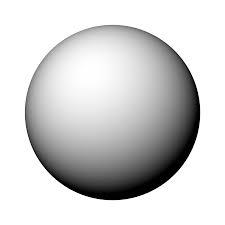
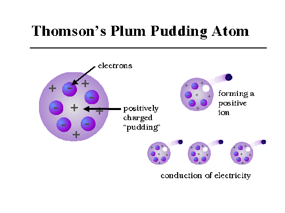

## [<](../)

# Review of Chemistry 10 (and more...)

| Table of Contents |
| ----------------- |
| [Models of the Atom](#models-of-the-atom) |

## Models of the Atom
    
*  **John Dalton's *"Billiard Ball"* Model**  
  All elements are composed of *atoms*.  
  *Indivisible/indestructable*.  
  Atoms of *different elements are different*.  
  Different atoms *seperate, join, or rearrange* to form *compounds*, which cause *chemical reactions*.

    
*  **J. J. Thomson's *"Plum Pudding"* Model**  
  Filled with *positively charged fluid*.  
  *Negatively charged electrons* scattered in said fluid.  
  Electrical forces held the negative electrons within the positive fluid.

* **Ernest Ruthrford's *"Nuclear"* Model**  
  .

* **Niel Bohr's Model**  
  .

* **Quantum Mechanical Model**  
  .

### People Involved
* **John Dalton**  
  Stated that all substances are composed of *atoms*—the smallest particles of matter.
* **J. J. Thomson & Micheal Faracay**  
  Discovered the electron.
* **E. Goldstein**  
  Discovered the proton.
* **James Chadwick**  
  Discovered the neutron.