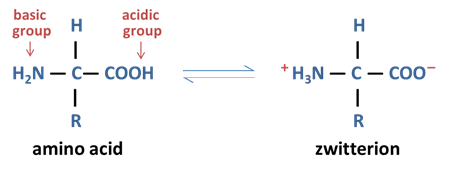
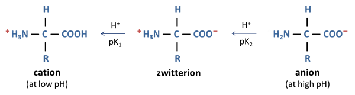

# Biochemistry

---

# Read Biochemistry from Biology!
It includes portions with Chemistry exclusive notes.  
Larger concepts are highlighted here.

# [Click here.](/bio/2035ib/unit3)

# Paper Chromatography
* Used to seperate and identify amino acids in proteins.
* Protein must first be hydrolyzed. (break all peptide bonds, only amino acids remain)

## Experiment (heavily simplified)
* A spot of ~~eluting solvent~~ is added to the paper.
* Each amino acid has a ~~specific solubility~~ to the eluting solvent.
* The greater the solubility, the ~~higher~~ it will travel up.
* After the solvent travels to the top, the paper is dried and sprayed with ~~ninhydrin~~ to colour the amino acids.

## Math
### Distances
* $\textrm{d}_\textrm{s}$: Distance travelled by solvent.
* $\textrm{d}_\textrm{c}$: Distance travelled by an amino acid.

### Retention Factor
* $\textrm{R}_\textrm{f} = \dfrac{\textrm{d}_\textrm{c}}{\textrm{d}_\textrm{s}}$
* Every amino acid has a ~~unique Rf~~, and can ~~identified~~ by it.
* Always less than 1.

# Electrophoresis
* A procedure that lets you sort molecules based on size and charge.
  * e.g. a mixture of amino acids at different isoelectric points can be seperated this way
  * The isoelectric points of a few amino acids can be found in your IB Data Booklet.

#### `CHEM` Isoelectric Point
* Radical groups can be neutral, acidic, or basic.
* The isoelectric point ($\textrm{pI}$) is the pH at which the charges of an entire amino acid are ~~net zero. (balanced)~~

## Experiment
* A paper or gel is used for support for a solution of a known pH.
* The mixture is placed in the center.
* An electric current is applied.

### Movement
* Amino acids will move depending on their pI related to their pH.
  * `pI = pH`: No movement, H+ from carboxyl migrates to amino
  * `pI > pH`: Gains a H+ from solution, net positive charge, ~~**moves toward negative electrode**~~ (cathode).
  * `pI < pH`: Loses a H- to solution, net negative charge, ~~**moves toward positive electrode**~~ (anode).
The greater the difference, the greater the movement.

* Cathode and anode are reversed in meaning in Electrophoresis.
* A nice trick is to subtract pH from pI. (pI - pH)  
  The sign of this new value is the net charge.

* After enough movement, ninhydrin is sprayed to make the amino acids visible.

# Vitamins
## Nutrients
* ~~Micronutrients~~ are substances required in very small amounts.
  * Usually cofactors for enzymes.
  * Include ~~vitamins~~ (organic), and minerals. (inorganic: Fe, Cu, F, Zn, I, Se, Mn, Mo, Cr, Co, B)
* ~~Macronutrients~~ are substances required in large amounts.
  * Include proteins, lipids, carbs, minerals. (Na, Mg, K, Ca, P, S, Cl)

## Classification
Vitamins can be classified as either...
* Water soluble
* Fat soluble

This can be predicted by a vitamin's structure.

### Water Soluble Vitamins
* Contain many hydrogen bonds. (i.e. -OH, -NH)
* Do not accumulate in the body. (~~dissolve in urine~~)
  * Cannot accumulate to toxic levels.
  * Must be ~~regularly resupplied~~ in diet.
* Do not decompose significantly when boiled/steamed.
* Example: Vitamin C

### Fat Soluble Vitamins
* Contain long nonpolar hydrocarbon chains/rings.
* Accumulate in the body. (~~dissolve in fat~~)
  * Can ~~accumulate to toxic levels~~. (~~**hypervitaminosis**~~)
  * Doesn't need to be regularly resupplied in diet.
* ~~Decompose significantly~~ when boiled/steamed, causing them to ~~leech out of food~~.
* Example: Vitamin A, Vitamin D

## Decomposition of Vitamins
* Vitamin A and Vitmain C are more sensitive to light and air than Vitamin D. (free-radical reactions)
* Transition metals catalyze free-radical reactions.
  * This causes canned foods to lose their vitamins.
* Vitamin C is a strong reducing agent, and should be kept away from atmospheric oxygen.

## Key Vitamins
| Vitamin | Alternative Name | Sources | Soluble In | Functions | Deficiency |
| :-----: | :--------------: | :-----: | :--------: | :-------: | :--------: |
| Vitamin C | Ascorbic Acid | Fresh fruits and vegetables | Water | Believed to cure common cold Aids immune system, healing wounds, preventing bacterial infections Synthesizes collagen (protein) | Scurvy |
| Vitamin A | Retinol | Cod liver oil, green vegetables, and fruit | Fat | Retinol -> retinal + opsin -> rhodopsin Rhodopsin converts light into optic nerve signals | Xeropthalmin |
| Vitamin D | N/A | Fish liver oil, egg yolk Synthesized by body in skin when UV light interacts with cholesterol | Fat | Allows absorption of calcium and phosphate ions Necessary for bone and teeth formation | Rickets |

## Deficiencies
* Primary deficiencies in vitamins can be cured with ~~regular intake of vitamins~~.
* Secondary deficiencies in vitamins are due to factors that ~~reduce the absorption of vitamins~~, such as...
  * Certain health disorders
  * Pregnancy
  * Smoking
  * Excessive alcohol consumption
  * Medical drugs

### Solutions to Deficiencies
* Providing vitamin ~~supplements~~ and technology needed for their production/distribution.
* ~~Fortification~~ of vitamins into common food. (e.g. water, salt, etc.)
* ~~Educating~~ people on proper diet including vitamin supplements.
* Designing ~~genetically modified foods~~. (GMOs)

# Environmental Biochemistry

## Xenobiotics
* Chemicals ~~not naturally present~~ or produced by an organism.
* Or, chemicals present in organisms in ~~unnaturally high amounts~~.
* Generally...
  * Toxic to various life forms
  * More resistant to biodegradation
* Persistent Organic Pollutants (POPs) can remain in soil and animal fat for decades.

### Metabolism
#### Digestion
* Can be completely digested
* Cannot be metabolized by existing enzymes, therefore...
  * remain in an organism or
  * excrete unchanged
* May produce toxic metabolites/intermediates
* Alter the metabolic pathways of other compounds
* Affect the reproduction, development, and growth of living organisms

#### Rate of Decomposition
Affected by...
* Functional groups
* Polarity
  * Polar are soluble in water, unlikely to accumulate for long
  * Nonpolar are soluble in fat, likely to accumulate for long

#### Biomagnification
* Concentration of xenobiotics increase exponentially up the food chain.

## Heavy Metals
* Heavy metals are any metal/metalloid of environmental concern. (e.g. mercury, cadmium, lead)
* Can cause...
  * Denaturation of proteins
  * Inhibit enzyme action
  * Affect the redox balance in cells

## Pharmaceutically Active Compounds (PACs)
* Group of xenobiotics including antibiotics
* Not produced by animals or are in diet
* Antibiotics in animal feed eventually get to us. (biomagnification)
* Antibiotic use may create bacteria strands immune to the antibiotic, which we have no current way of treating.
* Certain PACs increase risk of disease and inhibit reproduction in aquatic animals.

## Detergents
* Amphiphillic
* Very low biodegradability
* Accumulate in sewage treatment plants, producing persistant foam and altering bacterial composition of recycled water
* Biological detergents are an alternative
  * Contain thermophilic enzymes
  * Effective even in cold water

## Pesticides
* Many pesticides are xenobiotics, most popular example being ~~**DDT**~~.
* Now banned due to biomagnification in ~~birds thinning their shells~~ and killing the population.

## Supramolecules
* Man-made enzymes that can be used to...
  * Deliever drugs more efficiently (by increasing solubility, availability, and reducing resistance to said drug)
  * Remove toxic materials (xenobiotics) from the environment
  * Biodegrade pollutants (e.g. aiding in the breakdown and dispersal of oil spills)

## Plastics
* Plastics don't biodegrade for 100s of years.
* Accumulation affect marine animals by...
  * Entanglement
  * Ingestion
  * Reducing mobility
  * Interfere with digestive functions (>95% of sea birds can't fly due to undigestable heavy plastic in them)
  * Starvation and Death

### Biodegradable Plastics
* Plastic made with starch and cellulose

#### Benefits
* Can biodegrade and be ingested by microorganisms, such as bacteria.
* Easy ingested to produce water and carbon dioxide.

#### Issues
* Uses resources that could have been used to make food.
* Releases methane when decomposed anaerobically.

## Green Chemistry
* Traditional Chemistry only focusses on yield and cost.
* Green Chemistry includes environmental impact.

### Philosophy
The principles of green chemistry emphasize...
* benefits of non-hazardous chemicals and solvents
* efficient use of energy and reactants
* reduction of waste
* favoring renewable materials
* accident prevention
* utilization of any by-products formed during synthesis

### Atom Economy
A solvent-free reaction can potentially reach a yield of almost 100%, due to all reactants become the product.

$\textrm{A} + \textrm{B} \longrightarrow \textrm{C}$

A solvent reaction is significantly less efficient, since some reactants from an unwanted product that must be disposed.

$\textrm{A} + \textrm{B} \longrightarrow \textrm{C} + \textrm{D}$

### Issues
* Green chemistry tends to involve expensive equipment, raw materials, and recycling facilities.
  * In the long run, however, the prevention of accidents end up saving money.
* The terms "green," "environmentally friendly," and more are unregulated and often abused for marketting.
