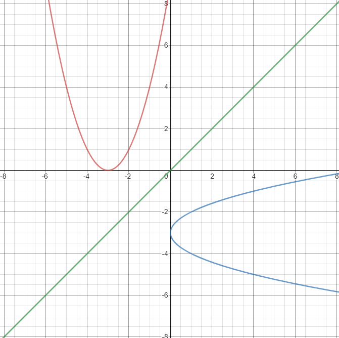

# Function Operations & Transformations

[Notes Package](https://drive.google.com/file/d/11MoCx_oiZZHKnFVTgb7ruvKOOWV25TwF/view)

---

# Review
## Functions
A function is something that takes in many inputs ($x$s) and gives you one output. ($y$)

### Line Test
To be a function, ~~every $x$~~ value must only have ~~one $y$~~ value.  
By drawing a vertical line at an $x$ value, if it intersects with ~~more than one~~ point/line, then it is ~~not a function~~.

### Arithmetic
Actions performed on the outside of a function effect the ~~entire function~~.  
Actions performed within the function are ~~subsituted for every instance~~ of a variable.

#### Examples
If $f(x)=x^2+4x+5$...
> $f(2)$  
  $=(2)^2+4(2)+5$  
  $=4+8+5$  
  $=17$

> $2f(x)$  
  $=2(x^2+4x+5)$  
  $=2x^2+8x+10$

## Domain and Range
**Domain** is ~~all possible values of $x$~~.  
**Range** is ~~all possible values of $y$~~.

There are two notations to represent these two concepts.

### Set Notation
The general formula for set notation is...

$\lbrace a|\textrm{(a possible)} \rbrace$

Where $a$ is any variable, such as $x$ for domain and $y$ for range.

#### Example
> $x$ is greater than 2, less than or equal to 0, cannot equal 1, and includes all values between (set of reals).  
  => $\lbrace x|x\leq0,x>2,x\neq1,x\epsilon\Reals \rbrace$

### Interval Notation
The general formula for interval notation is...

$[\textrm{min}, \textrm{max}]$ or $(\textrm{min}, \textrm{max})$ or a combination.

Use ~~square brackets~~ if the min/max is included (~~inclusive~~) or ~~normal brackets~~ if the min/max is not included. (~~exclusive~~)

You can only use interval notation for ~~real numbers~~. You couldn't use interval notation for numbers that had nothing in between.

#### Example
> $x$ is less than or equal to 6  
  => $(-\infty, 6]$

### Restrictions
The following should be kept in mind when determining the domain.

| Type | Restriction |
| :--: | :---------: |
| Line ($x$) | $x \epsilon\Reals$ |
| Quadratic ($x^2$) | $x \epsilon\Reals$ |
| Radical ($\sqrt{x}$) | $\textrm{radicand} \geq 0$ <h5>*e.g. $\sqrt{x - 3}$   $x - 3 \geq 0$   $x \geq 3$*</h5> |
| Fraction ($\frac{x}{y}$) | $\textrm{denominator} \neq 0$ |

# Sum and Differences of Functions
## Equation
To get the sum or difference of two functions, you really just get the sum or difference. It is nothing special.

* **Sum of Functions**: $(f + g)(x) = f(x) + g(x)$
* **Difference of Functions**: $(f - g)(x) = f(x) - g(x)$

### Graphing
To graph a sum/difference function, add/subtract the ~~$y$ values~~ of ~~both functions~~ at ~~each $x$~~ value.  
*(Incase you forgot, $f(x)$ gets the $y$ value at that specific $x$ value)*

#### Examples
$f(x) = 2x + 1$  
$g(x) = x - 2$  

> **What is $(f + g)(x)$?**  
  $= 2x + 1 + x - 2$  
  $= 3x - 1$  
  Therefore, $(f + g)(x) = 3x - 1$

> **What is $(f - g)(x)$?**  
  $= 2x + 1 - (x - 2)$
  $= 2x + 1 - x + 2$  
  $= x + 3$  
  Therefore, $(f - g)(x) = x + 3$

## Domain
The domain of a combined function is the ~~common domain~~ of ~~both individual~~ functions.

You can get this by ~~getting the domain of both functions~~, then choosing the domain that overlaps/~~applies to both functions~~.

#### Example
$f(x) = \sqrt{x+3}$  
$g(x) = \sqrt{x+7}$

> The domain of $f(x)$ is $x \geq -3$  
> The domain of $g(x)$ is $x \geq -7$  
>
> Therefore, the domain of $(f \cdot g)(x)$ is $x \geq -3$

## Range
The range of a combined function is determined using the ~~graph~~.  
Finding the range algebraically is not at the Math 30 level.

# Products and Quotients of Functions
## Equation
To get the product or quotient of two functions, you really just get the product or quotient. It is nothing special.

* **Product of Functions**: $(f \cdot g)(x) = f(x) \cdot g(x)$
* **Quotient of Functions**: $(\frac{f}{g})(x) = \frac{f(x)}{g(x)}$

### Graphing
To graph a product/quotient function, multiply/divide the ~~$y$ values~~ of ~~both functions~~ at ~~each $x$~~ value.  
*(Incase you forgot, $f(x)$ gets the $y$ value at that specific $x$ value)*

#### Examples
$f(x) = x + 4$  
$g(x) = 2x - 4$  

> **What is $(f \cdot g)(x)$?**  
  $= (x + 4)(2x - 4)$  
  $= 2x^2 - 4x + 8x - 16$  
  $= 2x^2 + 4x - 16$  
  $= 2(x^2 + 2x - 8)$

> **What is $(\frac{f}{g})(x)$?**  
  $= \frac{x + 4}{2x - 4}$

## Domain
The domain of a combined function is the ~~common domain~~ of ~~both individual~~ functions.

You can get this by ~~getting the domain of both functions~~, then choosing the domain that overlaps/~~applies to both functions~~.

~~Only~~ domain of a quotient function must also take into account as ~~division by zero is undefined~~.  
In addition, if there is a quadratic in the denominator, you must ~~factor it~~ and determine the NPVs. (then simplify, if you can)

Also remember, if you are ~~dividing two fractions~~, you can rather ~~multiply~~ the first fraction by the ~~second fraction's reciprocal~~. This means you need to determine the ~~NPVs before and after the flip~~.

#### Examples
$f(x) = \sqrt{x-1}$  
$g(x) = x-2$

> The domain of $f(x)$ is $x \geq 1$  
> The domain of $g(x)$ is $x \epsilon\Reals$  
> The domain of $g(x)$ as a denominator is $x \neq 2$
>
> Therefore, the domain of $(\frac{f}{g})(x)$ is $\lbrace x| x \geq 1, x \neq 2, x \epsilon\Reals \rbrace$

$f(x) = x + 2$  
$g(x) = x^2 + 9x + 14$  
$h(x) = \frac{f(x)}{g(x)}$

> The domain of $f(x)$ is $x \epsilon\Reals$  
> The domain of $g(x)$ is $x \epsilon\Reals$
>
> $h(x)=\frac{x + 2}{x^2 + 9x + 14}$  
> $h(x)=\frac{x + 2}{(x + 2)(x + 7)}$ (Therefore, the domain of $h(x)$ is $x \neq -7, -2$)  
> $h(x)=\frac{1}{x+7}$

## Range
The range of a combined function is determined using the ~~graph~~.  
Finding the range algebraically is not at the Math 30 level.

# Composite Functions
Composite functions are functions formed by ~~two functions~~. In other words, nested functions.

In order to simplify a composite function, determine the ~~expression of the most nested function~~.  
Then, determine the ~~expression~~ of the function the ~~previous function is nested in~~, and ~~replace all instances of $x$~~ in this "parent" function ~~with the previous function~~.  
See the examples if this explanation doesn't make sense.

## Notations
An unfilled circle ($\circ$) is the notation for composite functions.

* $f(g(x))$ or $(f \circ g)(x)$ is function $g$ nested within function $f$
* $g(f(x))$ or $(g \circ f)(x)$ is function $f$ nested within function $g$
* $f(g(h(x)))$ or $(f \circ g \circ h)(x)$ is function $h$ nested within function $g$ which is nested within function $f$

#### Examples
$f(x) = 2x$  
$g(x) = 3x$

> Determine $(g \circ f)(2)$...
>
> $=(g \circ 2x)$  
> $=3(2x)$  
> $(g \circ f)(x) = 6x$  
> $(g \circ f)(2) = 6(2) = 12$

$f(x) = x^2 + x$  
$g(x) = 3x + 5$

> Determine $(f \circ g)(x)$...
>
> $=(f \circ g)$  
> $=(f \circ (3x + 5))$  
> $=(3x + 4)^2 + (3x + 5)$  
> $=(9x^2 + 12x + 12x + 16) + 3x + 5$  
> $=9x^2 + 27x + 21$  
> $(f \circ g)(x) = 3(3x^2 + 9x + 7)$  
> *(I didn't bother checking if this simplfies further. You get the point.)*

## Domain
To determine the domain of a composite function, ~~combine the domains~~ of the ~~inner/nested functions~~ and the ~~final composite function~~.

This can be done by ~~getting the domain after each subsitution~~, then combining them all together. See the example.

#### Example
$f(x) = \sqrt{x - 1}$  
$g(x) = 3x$

> **Determine the domain of $(f \circ g)(x)$**  
> $f(g(x)) = f(3x)$ <-- Domain at this point is $x \epsilon\Reals$  
> $f(g(x)) = \sqrt{3x - 1}$ <-- Domain at this point is $x \geq \frac{1}{3}$
> 
> Therefore, the domain of the composite function is $\lbrace x | x \geq \frac{1}{3}, x \epsilon\Reals \rbrace$

## Range
The range of a combined function is determined using the ~~graph~~.  
Finding the range algebraically is not at the Math 30 level.

# Horizontal and Vertical Translations
A translation is a transformation that ~~adds/subtracts $x$ and $y$ coordinates~~, if it is a ~~horizontal or vertical translation~~ respectively.

## Description
> $y = f(x \pm a)$: Horizontal translation $a$ units `left (+)` or `right (-)`.  
  $y \pm a = f(x)$ or $y = f(x) \pm a$: Vertical translation a units `up (-)` or `down (+)`.

# Stretches
A stretch is a transformation that ~~multiplies/divides $x$ and $y$ coordinates~~, if it is a ~~horizontal or vertical stretch~~ respectively.

## Description
> $y = f(\frac{1}{a}x)$: Horizontal stretch by a factor of $a$  
  $\frac{1}{a}y = f(x)$: Vertical stretch by a factor of $a$  
  $y = af(x)$: Vertical stretch by a factor of $a$

## Tip
Remember to factor anything inside the $f(x)$ to make sure you have the actual transformations.

#### Example
> $y = 3\sqrt{2x - 6} + 5$  
  = $y = 3\sqrt{2(x - 3)} + 5$

# Reflections
A reflection is a transformation that ~~flips the signs of $x$ and $y$ coordinates~~, if it is a ~~horizontal or vertical reflection~~ respectively.  

## Description
> $y = -f(x)$: Reflection about the x axis  
  $y = f(-x)$: Reflection about the y axis

## Invariant Point
A point on a graph that remains ~~unchanged after a transformation~~.

In the context of reflections, the invariant points are whichever points are ~~intersecting the axis the reflection is about~~.
* The invariant points of a reflection about the x axis are the x intercepts of the original.
* The invariant points of a reflection about the y axis are the y intercepts of the original.

# Mapping Notation
Mapping notation describes ~~transformations to ordered pairs~~. It uses ~~normal signs~~, so it is ~~what actually happens~~, with no tricks.

#### Example
> What is the coordinates of $(5, 8)$ if the following transformation is applied? $(x, y) \longrightarrow (x - 5, y + 4)$  
  **Answer:** $(5 - 5, 8 + 4) = (0, 12)$

# Replacement Notation
Replacement notation describes ~~transformations to equations~~. ~~**It uses opposite signs and reciprocals**~~.

The following is the general formula for an equation.

<h1>
$ay + b = f(cx + d)$
</h1>

* $a$: Vertical Stretch
* $b$: Vertical Translation
* $c$: Horizontal Stretch
* $d$: Horizontal Translation

The opposite rule does not apply to a ~~vertical translation/stretch on the x side~~ of the equation, as moving it to the x side already makes it opposite/reciprocal.

<h1>
$y = \frac{1}{a} f(cx + d) - b$
</h1>

**Description of transformations are ~~always what actually happens~~, while the equation of a transformation is the ~~opposite signs and reciprocal coefficients~~.**

#### Example
> Describe the transformations applied to $y = f(x)$ in the equation $y = f(x - 3)$  
  **Answer:** Horizontal translation 3 units ~~right~~.

> Describe the transformations applied to $y = f(x)$ in the equation $3y = f(x)$  
  **Answer:** Vertical stretch by a factor of 1/3.

> Describe the transformations applied to $y = f(x)$ in the equation $y = \frac{1}{3} f(x)$  
  **Answer:** Vertical stretch by a factor of 1/3.

> Describe the transformations applied to $y = f(x)$ in the equation $y = f(x) + 3$  
  **Answer:** Vertical translation 3 units up.

# Combining Transformations
When there are multiple transformations, the order to apply them should be ~~**SMART**~~.
* **S** tretches
* M
* A
* **R** eflections
* **T** ranslations

# Inverse of a Relation
The inverse of an equation is when ~~$x$ and $y$ are swapped~~.  
Graphically, this is a ~~reflection about the line $y = x$~~.

## Notation
If the inverse of function $f(x)$ is ~~also a function~~, the notation is $x = f^{-1}(y)$  
If the inverse of function $f(x)$ is ~~no longer a function~~, the notation is $x = f(y)$

### Line Test
To determine if a graph is a function, you can do the vertical line test. This still applies to inverse functions.  
However, if you want to save a step, you can do a ~~horizontal line test~~ on the ~~original graph~~ to get the same result as a vertical line test on the inverse graph.

## Domain & Range
The domain and range of the original function is the range and domain of the inverse function respectively.  
In other words, ~~domain and range swap~~.

## Domain Restrictions To Ensure The Inverse Is A Function

As you can see here, the inverse of $y = x^2$ is no longer a function.  
If we restrict the domain of this equation so that only one "arm" of the parabola is kept, then when we inverse it, it will pass the vertical line test.

You can do this by getting the $x$ of the original parabola's vertex, and making a restriction greater than or equal to/less than or equal to that value.

For this example, the restriction could be $x \leq -3$, which cuts off the right arm of the parabola, even after the inverse.
