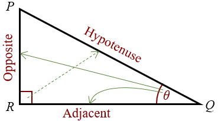
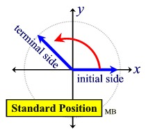
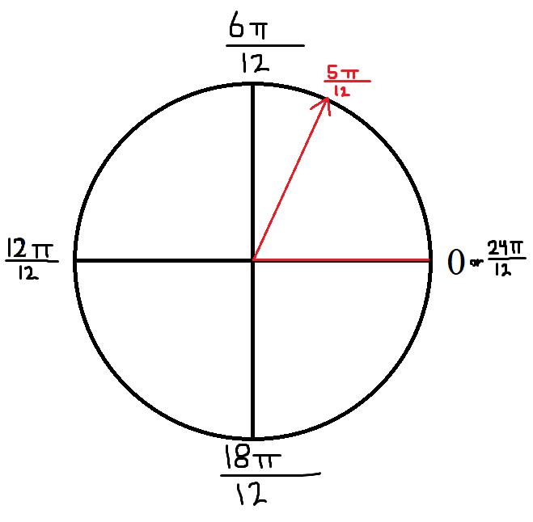
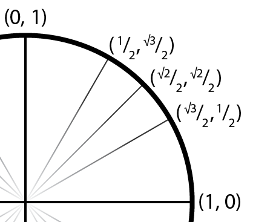
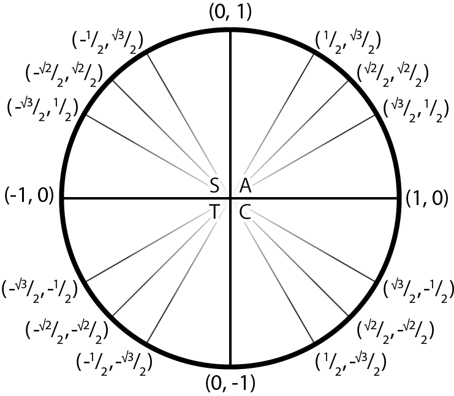

# Trigonometry

!> These notes are unfinished and subject to change.

---

# Trigonometric Ratios

| Primary | Reciprocal |
| ------- | ---------- |
| $\sin \theta = \dfrac{\textrm{opposite}}{\textrm{hypotenuse}}$ | $\csc \theta = \dfrac{\textrm{hypotenuse}}{\textrm{opposite}}$ |
| $\cos \theta = \dfrac{\textrm{adjacent}}{\textrm{hypotenuse}}$ | $\sec \theta = \dfrac{\textrm{hypotenuse}}{\textrm{adjacent}}$ |
| $\tan \theta = \dfrac{\textrm{opposite}}{\textrm{adjacent}}$ | $\cot \theta = \dfrac{\textrm{adjacent}}{\textrm{opposite}}$ |

$(x, y) = (\cos \theta, \sin \theta)$  
$\tan \theta = \dfrac{y}{x} = \dfrac{\sin \theta}{\cos \theta}$

# Radians
Radians are another form of measurement besides degrees.  
They are denoted as either $2\pi \textrm{radians}$ or, more commonly, ~~without any unit~~ specified. $2\pi$

One radian is equal to approximately $57.3^\circ$.  
In a radian, the radius and the arc the angle forms are equal length. ~~Arc length = radius~~.

One radian, i.e. ~~$\pi$, equals $180^\circ$~~. Everything else is based off of that, as seen in the table below.

| Degrees | Radians |
| :-----: | :-----: |
| $360^\circ$ | $2\pi$ |
| $180^\circ$ | $\pi$ |
| $90^\circ$ | $\dfrac{\pi}{2}$ |
| $45^\circ$ | $\dfrac{\pi}{4}$ |

## Conversions
To convert between degrees and radians, use the following formula.

$\textrm{degrees} \cdot \dfrac{\pi}{180^\circ} = \textrm{radians}$  

$\textrm{radians} \cdot \dfrac{180^\circ}{\pi} = \textrm{degrees}$

Just remember this: The ~~units you want on top~~, and the units you have (and are cancelling) on the bottom.

# Standard Position
An angle in standard position is when the ~~**initial arm**~~ is on the ~~positive x-axis~~.  
The inital arm rotates from the origin of a Cartesian Plane.  
The ~~**terminal arm**~~ represents the angle, and it can be in any of the four quadrants.  
A positive angle is rotation counter clockwise, and a negative angle is rotation clockwise.

## Reference Angle
The ~~**reference angle**~~ of an angle is the angle ~~between the terminal arm and the nearest x-axis~~.  
The reference angle is always ~~$0^\circ < \theta_R < 90^\circ$ or $0 < \theta_R < \frac{\pi}{2}$~~.

## Coterminal Angle
~~**Coterminal angles**~~ are angles with the ~~same terminal arm~~.  
The ~~difference between each coterminal~~ angle is one full rotation, i.e. ~~$\textrm{360}^\circ$~~ or ~~$2\pi$~~.  
There are ~~infinite coterminal angles~~.

#### Example
> Angles $150^\circ$ and $510^\circ$ are coterminal angles, as the difference is a multiple of $360^\circ$

### Principal Angle
The ~~**principal angle**~~ is the ~~smallest positive coterminal angle~~ of a set of coterminal angles.  
The principal angle is always ~~$0^\circ < \theta_P < 360^\circ$ or $0 < \theta_P < 2\pi$~~.

To get the principal angle, ~~add/subtract one full rotation~~ ($360^\circ$ or $2\pi$) on a coterminal angle until you get the ~~lowest positive angle~~.

#### Example
> **What is the principal angle of $\theta$, if $\theta = 989^\circ$?**  
  $989^\circ - 360^\circ = 629^\circ$  
  $629^\circ - 360^\circ = 269^\circ$  
  $269^\circ - 360^\circ = -91^\circ$ Must be between 0-360, therefore...  
  $\theta_P = 269^\circ$

### General Formula
Adding a full rotation to the principal angle n times will give you the nth coterminal angle, as long as n is an integer.

$\theta_P + 360^\circ n, n\varepsilon I$  
$\theta_P + 2\pi n, n\varepsilon I$

## Drawing Angles
### Degrees

Drawing angles in degrees is nothing special. Draw a Cartesian plane with 0/360, 90, 180, and 270 degree markings, then draw the angle.

### Radians
Drawing angles in radians is different.  

For example, lets say we need to draw $\theta = \dfrac{5\pi}{12}$.
* Remember that $180^\circ = \pi$
* Where $180^\circ$ would be on a degree diagram, put a number with the ~~same denominator as the angle~~, but still equals pi.
  * In this case, $\frac{12\pi}{12}$
* ~~Divide that number by 2~~, and write that ~~where $90^\circ$ would be~~ on a degree diagram.
  * In this case, $\frac{6\pi}{12}$
  * If the denominator and therefore the numerator are not divisible by two, start over, except ~~double the numerator and denominator~~ of the angle, so that it is divisible.
* ~~Add that to the first number~~, and write that ~~where $270^\circ$ would be~~ on a degree diagram.
  * In this case, $\frac{18\pi}{12}$

* All this has done is divide the Cartesian plane into 6 radians per quadrant, now everything is the same as before.

## Arc Length
Arc length can by found with the following formula.
<h1>
$\theta = \dfrac{a}{r}$
</h1>

* $\theta$: Measure of the angle in **radians**
* $a$: Length of the arc
* $r$: Length of the radius

# The Unit Circle
The unit circle is a circle with ~~radius equal to 1~~ and its center at the origin of a Cartesian plane.

Because the radius is always equal to 1, you can use ~~pythagoream theorem~~.  
$x^2 + y^2 = 1$  
Remember that when you root a number, there are ~~two answers; positive and negative~~ that number.

## Coordinates (Sine & Cosine)

### Quadrant I
The unit circle focuses on the three special triangles--30, 45, and 60 degrees--for each quadrant.  
As you increase the angle in those increments, the... 
* ~~radicand of sine's ratio (y) increases by 1.~~
* ~~radicand of cosine's ratio (x) decreases by 1.~~

| Angle | Cosine Ratio | Sine Ratio |
| :---: | :----------: | :--------: |
| $30^\circ$ | $\dfrac{\sqrt{3}}{2}$ | $\dfrac{1}{2}$ |
| $45^\circ$ | $\dfrac{\sqrt{2}}{2}$ | $\dfrac{\sqrt{2}}{2}$ |
| $60^\circ$ | $\dfrac{1}{2}$ | $\dfrac{\sqrt{3}}{2}$ |

### CAST Rule
The CAST Rule tells you ~~which numbers are positive~~ in a specific quadrant.  
They are written counter-clockwise, starting in quadrant IV.

* **C** osine are positive, everything else negative. (Quadrant IV)
* **A** everything is positive. (Quadrant I)
* **S** ine are positive, everything else negative. (Quadrant II)
* **T** angent are positive, everything else negative. (Quadrant III)

### Quadrants II-IV
To get the coordinates for the other quadrant's points, ~~reflect quadrant I's coordinates~~ across the x/y axis.

Then, use the ~~CAST rule~~ to determine the ~~signs of the ratios in their new quadrant~~.

### Final Outcome

