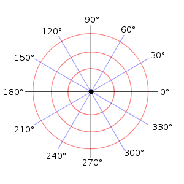

# Trigonometry

!> These notes are unfinished and subject to change.

---

# Trigonometric Ratios

| Primary | Reciprocal |
| ------- | ---------- |
| $\sin \theta = \dfrac{\textrm{opposite}}{\textrm{hypotenuse}}$ | $\csc \theta = \dfrac{\textrm{hypotenuse}}{\textrm{opposite}}$ |
| $\cos \theta = \dfrac{\textrm{adjacent}}{\textrm{hypotenuse}}$ | $\sec \theta = \dfrac{\textrm{hypotenuse}}{\textrm{adjacent}}$ |
| $\tan \theta = \dfrac{\textrm{opposite}}{\textrm{adjacent}}$ | $\cot \theta = \dfrac{\textrm{adjacent}}{\textrm{opposite}}$ |

$(x, y) = (\cos \theta, \sin \theta)$  
$\tan \theta = \dfrac{y}{x} = \dfrac{\sin \theta}{\cos \theta}$

# Radians
Radians are another form of measurement besides degrees.  
They are denoted as either $2\pi \textrm{radians}$ or, more commonly, ~~without any unit~~ specified. $2\pi$

One radian is equal to approximately $57.3^\circ$.  
In a radian, the radius and the arc the angle forms are equal length. ~~Arc length = radius~~.

One radian, i.e. ~~$\pi$, equals $180^\circ$~~. Everything else is based off of that, as seen in the table below.

| Degrees | Radians |
| :-----: | :-----: |
| $360^\circ$ | $2\pi$ |
| $180^\circ$ | $\pi$ |
| $90^\circ$ | $\dfrac{\pi}{2}$ |
| $45^\circ$ | $\dfrac{\pi}{4}$ |

## Conversions
To convert between degrees and radians, use the following formula.

$\textrm{degrees} \cdot \dfrac{\pi}{180^\circ} = \textrm{radians}$  

$\textrm{radians} \cdot \dfrac{180^\circ}{\pi} = \textrm{degrees}$

Just remember this: The ~~units you want on top~~, and the units you have (and are cancelling) on the bottom.

# Standard Position
An angle in standard position is when the ~~**initial arm**~~ is on the ~~positive x-axis~~.  
The inital arm rotates from the origin of a Cartesian Plane.  
The ~~**terminal arm**~~ represents the angle, and it can be in any of the four quadrants.  
A positive angle is rotation counter clockwise, and a negative angle is rotation clockwise.

## Reference Angle
The ~~**reference angle**~~ of an angle is the angle ~~between the terminal arm and the nearest x-axis~~.  
The reference angle is always ~~$0^\circ < \theta_R < 90^\circ$ or $0 < \theta_R < \frac{\pi}{2}$~~.

## Coterminal Angle
~~**Coterminal angles**~~ are angles with the ~~same terminal arm~~.  
The ~~difference between each coterminal~~ angle is one full rotation, i.e. ~~$\textrm{360}^\circ$~~ or ~~$2\pi$~~.  
There are ~~infinite coterminal angles~~.

#### Example
> Angles $150^\circ$ and $510^\circ$ are coterminal angles, as the difference is a multiple of $360^\circ$

### Principal Angle
The ~~**principal angle**~~ is the ~~smallest positive coterminal angle~~ of a set of coterminal angles.  
The principal angle is always ~~$0^\circ < \theta_P < 360^\circ$ or $0 < \theta_P < 2\pi$~~.

To get the principal angle, ~~add/subtract one full rotation~~ ($360^\circ$ or $2\pi$) on a coterminal angle until you get the ~~lowest positive angle~~.

#### Example
> **What is the principal angle of $\theta$, if $\theta = 989^\circ$?**  
  $989^\circ - 360^\circ = 629^\circ$  
  $629^\circ - 360^\circ = 269^\circ$  
  $269^\circ - 360^\circ = -91^\circ$ Must be between 0-360, therefore...  
  $\theta_P = 269^\circ$

### General Formula
Adding a full rotation to the principal angle n times will give you the nth coterminal angle, as long as n is an integer.

$\theta_P + 360^\circ n, n\varepsilon I$  
$\theta_P + 2\pi n, n\varepsilon I$

## Drawing Angles
### Degrees

Drawing angles in degrees is nothing special. Draw a Cartesian plane with 0/360, 90, 180, and 270 degree markings, then draw the angle.

### Radians
Drawing angles in radians is different.  

For example, lets say we need to draw $\theta = \dfrac{5\pi}{12}$.
* Remember that $180^\circ = \pi$
* Where $180^\circ$ would be on a degree diagram, put a number with the ~~same denominator as the angle~~, but still equals pi.
  * In this case, $\frac{12\pi}{12}$
* ~~Divide that number by 2~~, and write that ~~where $90^\circ$ would be~~ on a degree diagram.
  * In this case, $\frac{6\pi}{12}$
  * If the denominator and therefore the numerator are not divisible by two, start over, except ~~double the numerator and denominator~~ of the angle, so that it is divisible.
* ~~Add that to the first number~~, and write that ~~where $270^\circ$ would be~~ on a degree diagram.
  * In this case, $\frac{18\pi}{12}$

* All this has done is divide the Cartesian plane into 6 radians per quadrant, now everything is the same as before.

## Arc Length
Arc length can by found with the following formula.
<h1>
$\theta = \dfrac{a}{r}$
</h1>

* $\theta$: Measure of the angle in **radians**
* $a$: Length of the arc
* $r$: Length of the radius

# The Unit Circle
The unit circle is a circle with ~~radius equal to 1~~ and its center at the origin of a Cartesian plane.

Because the radius is always equal to 1, you can use ~~pythagoream theorem~~.  
$x^2 + y^2 = 1$  
Remember that when you root a number, there are ~~two answers; positive and negative~~ that number.

## Coordinates (Sine, Cosine, Tan)

### Quadrant I
The unit circle focuses on the three special triangles--30, 45, and 60 degrees--for each quadrant.  
As you increase the angle in those increments, the... 
* ~~radicand of sine's ratio (y) increases by 1.~~
* ~~radicand of cosine's ratio (x) decreases by 1.~~

| Angle | Cosine Ratio | Sine Ratio |
| :---: | :----------: | :--------: |
| $30^\circ$ | $\dfrac{\sqrt{3}}{2}$ | $\dfrac{1}{2}$ |
| $45^\circ$ | $\dfrac{\sqrt{2}}{2}$ | $\dfrac{\sqrt{2}}{2}$ |
| $60^\circ$ | $\dfrac{1}{2}$ | $\dfrac{\sqrt{3}}{2}$ |

### CAST Rule
The CAST Rule tells you ~~which numbers are positive~~ in a specific quadrant.  
They are written counter-clockwise, starting in quadrant IV.

* **C** osine (and secent) are positive, everything else negative. (Quadrant IV)
* **A** everything is positive. (Quadrant I)
* **S** ine (and cosecent) are positive, everything else negative. (Quadrant II)
* **T** angent (and cotangent) are positive, everything else negative. (Quadrant III)

### Quadrants II-IV
To get the coordinates for the other quadrant's points, ~~reflect quadrant I's coordinates~~ across the x/y axis.

Then, use the ~~CAST rule~~ to determine the ~~signs of the ratios in their new quadrant~~.

### Tan
Tangent is just the sin ratio divided by the cosine ratio.

| Angle | Sin Ratio | Cosine Ratio | ~~**Tangent Ratio**~~ |
| :---: | :-------: | :----------: | :-----------: |
| $30^\circ$ | $\dfrac{1}{2}$ | $\dfrac{\sqrt{3}}{2}$ | $\dfrac{\sqrt{3}}{3}$ |
| $45^\circ$ | $\dfrac{\sqrt{2}}{2}$ | $\dfrac{\sqrt{2}}{2}$ | $1$ |
| $60^\circ$ | $\dfrac{\sqrt{3}}{2}$ | $\dfrac{1}{2}$ | $\sqrt{3}$ |

For other quadrants, reflect just like before, with respect to CAST rules.

### Final Outcome

## Radians
To determine the radians of the unit circle, ~~split each quadrant into six segments~~.  
In other words, just like drawing radian angles like before, and $\pi$ radians is $\dfrac{12\pi}{12}$.  

Then simplify the radians to get the more common value.

### Tools
#### Trigonometric Functions
Normal trigonometric functions ~~take an angle~~ and give you ~~the trigonometric ratio~~ of that angle on the unit circle.

$\sin(a) = r$
* $a$ = Angle (degrees or radians)
* $r$ = [Trigonometric Ratio](#trigonometric-ratios)

($\sin$ is used for example, but this applies to all trigonometric functions)

Depending on degrees or radians, your ~~calculator must be set in the right mode~~.

Examples...
* $\sin(\dfrac{\pi}{6}) = \dfrac{1}{2}$

* $\cot(30^\circ) = \dfrac{1}{\tan(30^\circ)} = \dfrac{3}{\sqrt{3}} = \sqrt{3}$

#### Inverse Trigonometric Functions
Inverse trigonometric functions ~~take a trigonometric ratio~~ and give you ~~the **reference** angle~~ of that ratio on the unit circle.

$\sin^{-1}(r) = a$
* $r$ = [Trigonometric Ratio](#trigonometric-ratios)
* $a$ = Angle (degrees or radians)

Examples...
* $\sin^{-1}(\dfrac{1}{2}) = \dfrac{\pi}{6}$

* $\cot^{-1}(\sqrt{3}) = \tan^{-1}(\dfrac{1}{\sqrt{3}}) = 30^\circ$

Note, the negative one power is ~~calculator exclusive notation~~ and should not be written.  
Because of this, the same questions are more commonly formatted like this.

* $\sin\theta = \dfrac{1}{2}$  
  $\theta = \dfrac{\pi}{6}$

* $\cot\theta = \sqrt{3}$  
  $\theta = \tan^{-1}(\dfrac{1}{\sqrt{3}}) = 30^\circ$

#### Summary
* Finding ratio? Use standard. ($\sin(a) = r$)
* Finding angle $\theta$? Use inverse. ($\sin^{-1}(r) = a$)

# Approximate Values
* Ensure the calculator is in the correct mode for the units specified.

## Trigonometric Ratios from Angles
* Use the normal trigonometric function on your calculator.
* If you need to use a reciprocal trig ratio, (csc, sec, cot) then get the reciprocal of the entire trig function and ratio, not just the ratio.

$\csc{\theta} = \dfrac{1}{\sin{\theta}}$

$\csc{\theta} \neq \sin{\dfrac{1}{\theta}}$

#### Examples
> $\csc{\dfrac{5\pi}{6}} = (\sin{\dfrac{5\pi}{6}})^{-1} = 2$

## Angles
* Use the inverse trigonometric function on your calculator.
* ~~Ignore any negatives~~ in the ratio.
  * ~~Find the reference angle first~~
  * Find which quadrant it is in (using ~~CAST rules~~) based on the negative you just ignored
  * Place the reference angle in its appropriate quadrant(s) to get the actual angle.
    * There may be multiple quadrants that are valid for the reference angle and its sign.
* The angle you get from a ratio in radian mode will have ~~pi already multiplied into it~~.
  * If you want the angle in fraction form you can try ~~dividing it by pi to get the fraction itself~~ and then multiplying pi back.
  * e.g. $\cos{\theta} = \frac{\sqrt{3}}{2} = 0.52359...$
  * $0.52359... \div \pi = 0.1666... = \frac{1}{6}$
  * $\frac{1}{6} \cdot \pi = \frac{\pi}{6} (\textrm{aka.} 0.52359)$

#### Examples
> $\sin{\theta} = 0.879$, $0 \leq \theta \leq 2\pi$  
> $\sin^{-1}{0.879} = 1.07$  
> Sin is positive, so C ~~**A**~~ ~~**S**~~ T, quadrants 1 and 2.  
> Quadrant 1 = $1.07$, Quadrant 2 = $\pi - 1.07 = 2.07$
> $\theta = 1.07, 2.07$

## Bonus: Decimal to Exact Value on Unit Circle
If you have the radians of an angle in decimal form that you know is on the unit circle, you can do this.

* Square it.
* Square root the numerator and denominator.
* Rationalize if applicable.

# Trigonometric Equations
There is nothing new with trigonometric equations: it is identical to polynomials except that every instance of x has a trig function attached to it.  
This allows you to temporarily ignore the trig functions, perform factoring techniques such as ~~common factors~~, ~~difference of squares~~, and ~~trinomials of the form $ax^2 + bx + c, a \neq 0$.  
Then, once you have factored it, put the trig functions back.

* $\sin x \longrightarrow x$
* $\sin^2 x \longrightarrow x^2$

#### Example
> $\sin^2 x - 3\sin x \longrightarrow x^2 - 3x$  
> $x(x - 3)$  
> $x = 0$, $x = 3$  
> $\sin x = 0$, $sin x = 3$

> $2\cos^2 x + 7\cos x - 4 \longrightarrow 2x^2 + 7x - 4$  
> $(2x - 1)(x + 4)$  
> $(2\cos{x} - 1)(\cos{x} + 4)$

## General Formula
You will often have multiple answers for the angle. You will be asked to put them as a general formula.

$a + b\pi n, n\varepsilon I$
* $a$: The ~~lowest positive~~ angle answer you have.
* $b$: How much to ~~rotate~~ until the ~~next answer~~. (degrees or radians)

You can have ~~multiple general formulas~~.

Trick: If two different angles form a ~~straight line~~ on the unit circle, they are ~~180o degrees or pi away~~.

#### Example
> $x = 30^\circ, 60^\circ, 90^\circ$
>
> $x = 30^\circ + 30^\circ n, n\varepsilon I$

> $x = 0, \pi, 2\pi$
>
> $x = \pi n, n\varepsilon I$

> $x = 30^\circ, 60^\circ, 210^\circ, 240^\circ$
>
> $x = 30^\circ + 180^\circ n, n\varepsilon I$  
> $x = 60^\circ + 180^\circ n, n\varepsilon I$

# Graphing
* **Periodic Function**: A function that ~~repeats~~ every period. $\sin$ and $\cos$ are periodic functions.

* **Period**: The ~~shortest distance~~ ~~along the horizontal~~ axis until the graph begins to ~~repeat~~.  

* **Sinusoidal Graph**: A sinusoidal curve is one that ~~fluctuates back and forth~~. Both $\sin$ and $\cos$ graphs are sinusoidal, as the curve moves up and down from the midline.

* **Midline**: The ~~halfway~~ between the minimum and maximum of a graph.  
  $\textrm{midline} = \dfrac{\textrm{max} + \textrm{min}}{2}$

* **Amplitude**: The distance from the ~~midline to the highest point~~ of the graph. This is a measurement, so it is ~~never negative~~.  
  $\textrm{amplitude} = \dfrac{\textrm{max} - \textrm{min}}{2}$

## Sine Graph

A sine graph with ~~no transformations~~ ($y = \sin{x}$) has the following properties.
* Starts at ~~$x = 0$~~.
* Oscillates $y = \pm 1$
* Period = $2\pi$ or $360^\circ$

## Cosine Graph

A cosine graph with ~~no transformations~~ ($y = \cos{x}$) has the following properties.
* Starts at ~~$x = 1$~~.
* Oscillates $y = \pm 1$
* Period = $2\pi$ or $360^\circ$

## Vertical Stretches
$y = af(x)$ is related to $y = f(x)$ by a ~~vertical stretch by a factor of $\lvert a \rvert$ about the x-axis~~.  
If $a < 0$, then the function is also ~~reflected by the x-axis~~.

($\dfrac{1}{2}y = \sin{x}$ is identical to $y = 2\sin{x}$)

## Horizontal Stretches
$y = f(bx)$ is related to $y = f(x)$ by a ~~horizontal stretch by a factor of $\lvert b \rvert$ about the y-axis~~.  
If $b < 0$, then the function is also ~~reflected by the y-axis~~.

### Period
You can get the period of a graph from the $b$ variable.

$\dfrac{2\pi}{\lvert b \rvert}$ or $\dfrac{360^\circ}{\lvert b \rvert}$

## Horizontal Phase Shift (Translation)
$y = f(x - c)$ is related to $y = f(x)$ by a ~~horizontal phase shift~~ (translation) $c$ units ~~right~~. (opposite direction of sign)

## Vertical Displacement (Translation)
$y = f(x) + d$ is related to $y = f(x)$ by a ~~vertical displacement~~ (translation) $d$ units ~~down~~. (opposite direction of sign)  

This is also the [~~$y$ of the midline~~](#graphing).  

## General Equation

$y = a \sin b(x - c) + d$  
$y = a \cos b(x - c) + d$

* $a$ = Vertical Stretch (Amplitude, max)
* $b$ = $\dfrac{2\pi}{\textrm{period}}$ = Horizontal Stretch (Period)
* $c$ = Horizontal Phase Shift/Translation
* $d$ = Vertical Displacement/Translation

## Find An Equation With Only A Graph
Use the following equations to get the variables you need.

* $d = \dfrac{\textrm{max} + \textrm{min}}{2}$
* $a = \dfrac{\textrm{max} - \textrm{min}}{2}$
* $b = \dfrac{2\pi}{\textrm{period}}$

To find $c$, there are a number of things you could do.

### Find $c$
#### Cosine
The distance between $x = 0$ and the smallest $x$ (i.e. first instance) of the ~~maximum~~ $y$ is $c$.

To find $c$ in a graph with a negative $a$, do the same thing except ~~minimum~~ instead of maximum.

#### Sine
The distance between $x = 0$ and the smallest $x$ (i.e. first instance) of $y$ intersecting $d$ ~~travelling up~~ is $c$.  

To find $c$ in a graph with a negative $a$, do the same thing except the intersect when the graph is ~~travelling down~~ instead of up.

## Applications
There are a few common questions. Here are great videos to watch about them.

* [Ferris Wheel Question](https://youtu.be/Gfjnv9GXYn4)
  * The radius is the amplitude
  * The max is the diameter + the minimum
  * It helps significantly to have a diagram drawn for this question, especially when finding $c$, make sure it makes the graph match the context of the question.

## Tangent Graph

### Drawing

The asymptotes of a tangent graph is whenever tan is undefined, which is whenever cosine is zero.

The general formula for asymptotes is ~~$x \neq \dfrac{\pi}{2} + \pi n, n\varepsilon I$~~. (the purple lines)

The x-intercepts of a tangent graph is ~~$x = \pi n, n\varepsilon I$~~.  
From each intercept the line ~~reaches positive and negative 1~~.  
After reaching $\pm 1$, the line ~~approaches the asymptopes~~. ($\pm \infty$)

### Parameters
All of the aforementioned parameters behave the same in a tangent graph, except...

* The amplitude formula does not work, as there is no max or min. (it is infinite)
* The ~~period~~ is calculated with a ~~different formula~~.  
  $\dfrac{180^\circ}{\lvert b \rvert}$ or $\dfrac{\pi}{\lvert b \rvert}$

# Identities
A trigonometric identity is an equation that is ~~true for all permissible values~~ of the variable on ~~both sides~~ of the equation.  
In other words, when the expressions on each side are evaluated with permissible values, the expressions equal each other.

## Reciprocal Tip
Remember the following things.

* The reciprocal of a fraction flips the fraction -- swapping the numerator and denominator.

  * $\dfrac{1}{\frac{\sqrt{3}}{2}} = \dfrac{2}{\sqrt{3}}$

* Dividing by a number is identical as dividing by said number's reciprocal.

  * $\dfrac{\frac{1}{2}}{\frac{3}{2}} = \dfrac{1}{2} \times \dfrac{2}{3}$

## Non-permissible Values
Non-permissible values occur when an expression is evaluated as undefined -- i.e. the denominator is zero.

### Case 1: $\sin{x}$ is in the denominator
Any value that makes $\sin{x} = 0$ would be an NPV.

#### General Formula
* $\pi n, n\varepsilon I$

* $180^\circ n, n\varepsilon I$

### Case 2: $\cos{x}$ is in the denominator
Any value that makes $\cos{x} = 0$ would be an NPV.

#### General Formula
* $\dfrac{\pi}{2} + \pi n, n\varepsilon I$

* $90^\circ + 180^\circ n, n\varepsilon I$

### Case 3: $\tan{x}$ or $\cot{x}$ is in the numerator
* ~~$\tan{x} = \dfrac{\sin{x}}{\cos{x}}$~~

* ~~$\cot{x} = \dfrac{\cos{x}}{\sin{x}}$~~

If $\tan{x}$ is in the numerator, that means $\cos{x}$ is in the denominator, and the NPV's are the same as case 2.  
If $\cot{x}$ is in the numerator, that means $\sin{x}$ is in the denominator, and the NPV's are the same as case 1.

### Case 4: $\sec{x}$ or $\csc{x}$ is in the numerator
* $\sec{x} = \dfrac{1}{\cos{x}}$

* $\csc{x} = \dfrac{1}{\sin{x}}$

If $\sec{x}$ is in the numerator, that means $\cos{x}$ is in the denominator, and the NPV's are the same as case 2.  
If $\csc{x}$ is in the numerator, that means $\sin{x}$ is in the denominator, and the NPV's are the same as case 1.

### Case 5: Anything else
Any zero/x-intercept/value that causes the denominator to equal zero is an NPV.

## Verification
To verify an identity...
* Treat the left side of the equal sign and the right seperately.
* Evaluate each side using the given values.
* Compare each side.
  * If both sides are equal, you sucessfully verified the identity.
  * If both sides aren't equal, this doesn't commonly happen at the Math 30 level.

## Proven Identities
The following identities have been proven for you and will 100% appear on exams.  
They can be found on your formula sheet.

### Pythagorean Identites
* $\sin^2{\theta} + \cos^2{\theta} = 1$
* $1 + \tan^2{\theta} = \sec^2{\theta}$
* $1 + \cot^2{\theta} = \csc^2{\theta}$

### Sum and Difference Identites
* $\sin(x + y) = \sin{x}\cos{y} + \cos{x}\sin{y}$
* $\sin(x - y) = \sin{x}\cos{y} - \cos{x}\sin{y}$
* $\cos(x + y) = \cos{x}\cos{y} - \sin{x}\sin{y}$
* $\cos(x - y) = \cos{x}\cos{y} + \sin{x}\sin{y}$

* $\tan{x + y} = \dfrac{\tan{x} + \tan{y}}{1 - \tan{x}\tan{y}}$
* $\tan{x - y} = \dfrac{\tan{x} - \tan{y}}{1 + \tan{x}\tan{y}}$

### Double Angle Identities
* $\sin(2x) = 2\sin{x}\cos{x}$
* $\cos(2x) = \cos^2{x} - \sin^2{x}$
* $\cos(2x) = 2\cos^2{x} - 1$
* $\cos(2x) = 1 - 2\sin^2{x}$

* $\tan(2x) = \dfrac{2\tan{x}}{1 - \tan^2{x}}$

## Using Identities
With the aforementioned identities, you can replace any instance of an identity with what it equals to.  
You can rearrange, cancel, factor, all that good stuff.

#### Example
Simplify the following into a single trigonometric function.

> $\dfrac{\tan{x}}{\sin{x}}$
> 
> $= \dfrac{\frac{\sin{x}}{\cos{x}}}{\sin{x}}$
>
> $= \dfrac{\sin{x}}{\cos{x}} \times \dfrac{1}{\sin{x}}$
>
> $= \dfrac{1}{\cos{x}}$
>
> $= \sec{x}$

### Using Identities To Find Exact Trigonometric Values
If a ratio isn't on the unit circle, use Pythagoream theorem to find the other trig ratios.

If an angle isn't on the unit circle, ~~rewrite the angle~~ as a ~~sum or difference~~ of two angles that are ~~on the unit circle~~.  
Then, use an applicable sum or difference identity.

#### Example
> Find the exact value of $\cos{15^\circ}$
>
> $45^\circ - 30^\circ = 15^\circ$  
> $\cos(45^\circ - 30^\circ) = \cos{45^\circ}\cos{30^\circ} + \sin{45^\circ}\sin{30^\circ}$  
> $(\frac{\sqrt{2}}{2})(\frac{\sqrt{3}}{2}) + (\frac{\sqrt{2}}{2})(\frac{1}{2})$  
>
> $\dfrac{\sqrt{6} + \sqrt{2}}{4}$

# Proving Identities
* Treat the left side and the right side ~~seperately~~. ~~Do not move things across the equal sign~~. 
* Simplify each side until they equal each other.

## Tricks
This is in no order.

* Begin with the more ~~complex side first~~.

* If needed, multiply the numerator and denominator by its ~~conjugate~~ and simplify.

* Subsitute with an ~~identity~~ when possible.

* Try to change all trigonometric ratios into sines and/or cosines.
  * $\csc{x} = \frac{1}{\sin{x}}$
  * $\sec{x} = \frac{1}{\cos{x}}$
  * $\tan{x} = \frac{\sin{x}}{\cos{x}}$
  * $\cot{x} = \frac{\cos{x}}{\sin{x}}$

* Try to ~~factor when possible~~.

* If there is a ~~sum or difference~~ of fractions, ~~combine~~ them as a ~~single fraction~~.
  * Multiply to create ~~common denominators~~ if you have to.

# Solving Trigonometric Equations
Solving trig equations is just like solving any equation, try to ~~isolate the trig function~~.  
This means you will be doing things like factoring, GCF, differences of squares, decomposition, etc...

The only difference is that you also need to ~~isolate the angle from the trig function~~, which means using CAST and reference angles covered earlier.

In addition, for second degree equations, remember that ~~square rooting anything gives a positive and negative value~~.

#### Example
> First Degree Equation  
> $4\cos{\theta} - 3 = 0, -360^\circ \leq \theta \leq 360^\circ$
>
> $\cos{\theta} = \dfrac{3}{4}$
>
> $\theta_R = 41.41^\circ$
>
> $\theta = 41.41^\circ, 318.6^\circ, -41.41^\circ, -318.6^\circ$
>
> **General Solutions**  
> $\theta = 41.41^\circ + $

!> TODO ^

> Second Degree Equation  
> $3\csc^2{\theta} = 4, 0 \leq \theta \leq 2\pi$
>
> $\csc^2{\theta} = \dfrac{4}{3}$
>
> $\csc{\theta} = \pm \dfrac{2}{\sqrt{3}}$
>
> $\sin{\theta} = \pm \dfrac{\sqrt{3}}{2}$
>
> $\theta = \dfrac{\pi}{3}, \dfrac{2\pi}{3}, \dfrac{4\pi}{3}, \dfrac{5\pi}{3}$
>
> **General Solutions**  
> $\theta = \dfrac{\pi}{3} + \pi n, n\varepsilon I$
>
> $\theta = \dfrac{2\pi}{3} + \pi n, n\varepsilon I$
