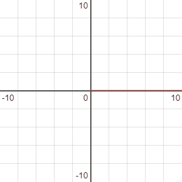
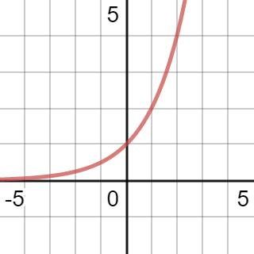
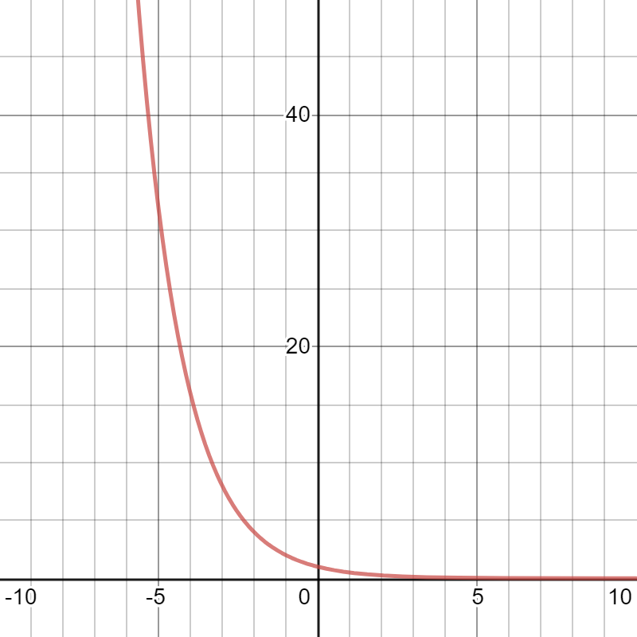
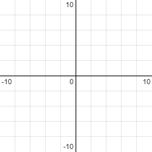
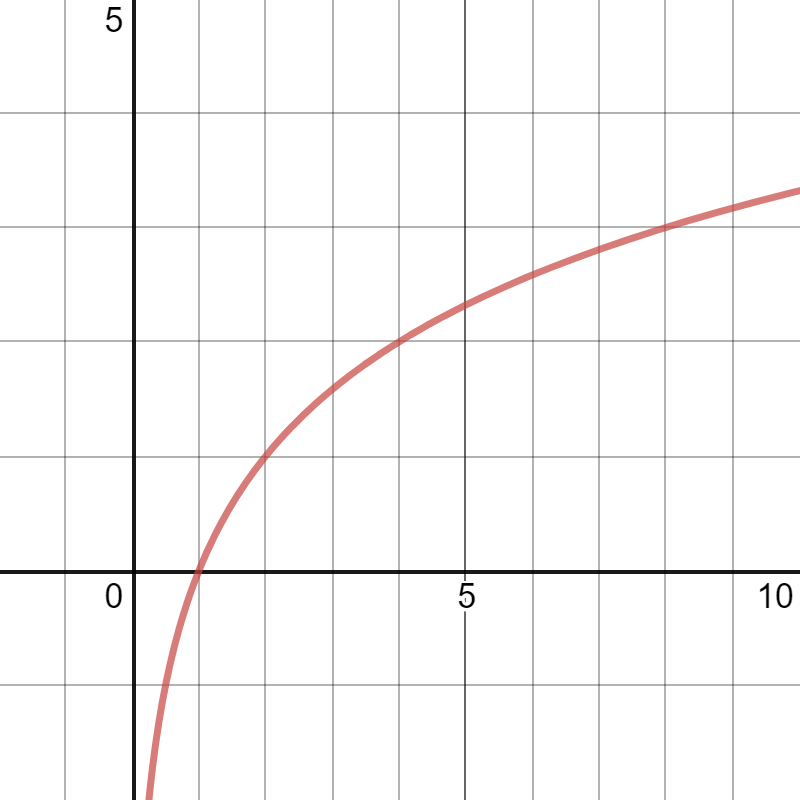
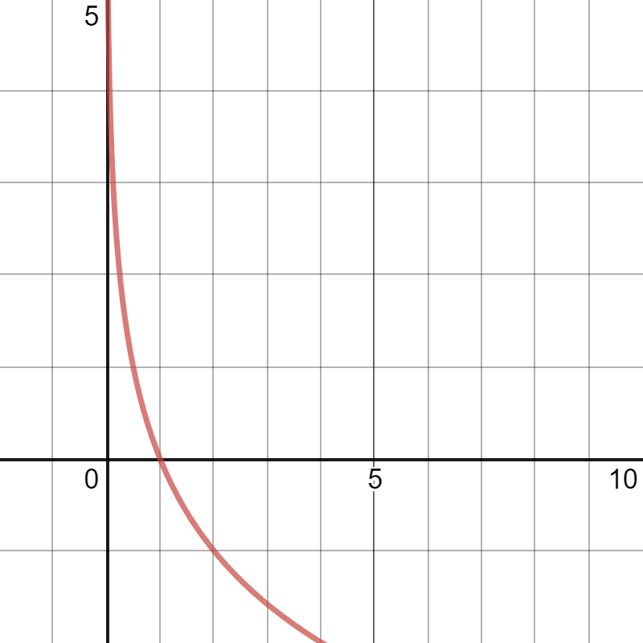
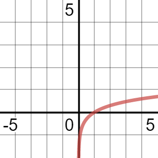
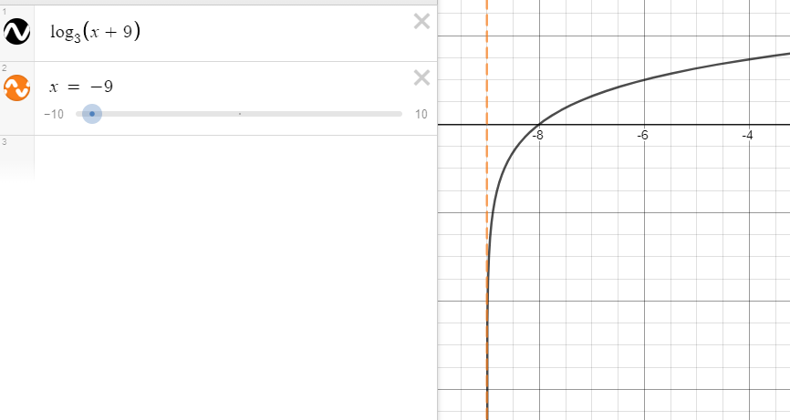

# Exponential & Logarithmic Functions

[Questions](https://drive.google.com/file/d/1-LEJH4mafq9kpBcLV_tWsfBQivJoLm4M/view)

---

# Exponential Function
An exponential function is the following...

<h1>
$y = ab^x$
</h1>

* $a$: Vertical stretch and Y-Intercept
* $b$: Constant. $b > 0, b \neq 1$
* $x$: Variable. $x\epsilon\R$

#### Example
* $y = 3^x$ is an exponential function.
* $y = x^3$ is not an exponential function.
* $y = (\dfrac{1}{4})^x$ is an exponential function.
* $y = (-2)^x$ is not an exponential function. ($-2 \ngtr 0$)
* $y = -2^x$ is an exponential function. ($2 > 0$)

# Graphing Exponential Functions

The following gif is $b$ in $y = b^x$ increasing from 0 to 3.

## Growth Function

$y = b^x$, where $b > 1$ forms a growth function.

As $b$ increases, the ~~curve rises~~ steeper.

## Decay Function

$y = b^x$, where $0 < b < 1$ forms a decay function.

As $b$ decreases, the ~~curve falls~~.

## Properties of Both
* **Domain**  
  $\{x | x \epsilon \R\}$

* **Range**  
  $\{y | y > 0, y \epsilon \R\}$

* **Horizontal Asymptote**  
  $y = 0$

* **Y-Intercept**  
  $a$ (in the above examples, $1$)

* **X-Intercept**  
  None

# Transformations of Exponential Functions

<h1>
$y = a(b)^{x-h} + k$
</h1>

Transformations can be applied to exponential functions like any other function.

#### Example
$y = 3(2)^{-x-3} + 2$

* Vertical stretch by a factor of 3
* Horizontal reflection about the y axis
* Horizontal translation 3 units left
* Vertical translation 2 units up

# Solving Exponential Equations

Recall the following rules...

* $a^m \times a^n = a^{m + n}$

* $\dfrac{a^m}{a^n} = a^{m - n}$

* $(a^m)^n = a^{m \times n}$

* $(ab)^m = a^m b^m$

* $a^{-m} = \dfrac{1}{a^m}$

* $(\dfrac{a}{b})^{-m} = \dfrac{a^{-m}}{b^{-m}} = \dfrac{b^m}{a^m}$

* $a^{\frac{m}{n}} = \sqrt[n]{a^m} = (\sqrt[n]{m})^m$

## Solving when base is a variable

Add a ~~reciprocal exponent~~.

<h1>
$x^{-\frac{1}{2}} \longrightarrow (x^{-\frac{1}{2}})^{-\frac{2}{1}} \longrightarrow x$
</h1>

#### Example
$x^2 = 81$  
$(x^2)^{\frac{1}{2}} = 81^{\frac{1}{2}}$  
$x = \sqrt{81}$  
$x = \pm 9$

## Solving with a common base

If the unknown variable is in the exponent...
1. Make the bases of both sides the same
2. Simplify using the laws of exponents until there is a single base with exponent on each side
3. Ignore the bases. Treat exponents as a normal equation
4. Solve

#### Example

Solve $3^{5x - 1} = 81^{3x}$

1. $3^{5x - 1} = 3^{4(3x)}$
3. $5x - 1 = 4(3x)$
4. $-1 = 7x$, $-\frac{1}{7} = x$

Solve $3^x = 27\sqrt{3}$

1. $3^x = 3^3 \times 3^{\frac{1}{2}}$
2. $3^x = 3^{\frac{7}{2}}$
4. $x = \frac{7}{2}$

# Applications of Exponential Functions

## Population Growth

<h1>
$y = ab^x$
</h1>

* $a$: Original amount
* $b$: Rate (double = 2, half-life = 1/2)
* $x$: Number of times the event occurs

Use this formula when total time and period time are equal.  

#### Example
todo

## Growth/Decay

<h1>
$y = ab^{\frac{t}{p}}$
</h1>

* $a$: Original amount
* $b$: Rate
* $x$: Total time of scenario
* $p$: Time frequency of growth/decay rate

Use this formula when total time and period time are not equal.

#### Example
todo

## Compounding Interest

<h1>
$A = P(1 + i)^n$
</h1>

* $A$: Final amount
* $P$: Initial amount
* $i$: Interest rate ~~per compounding period~~
* $n$: Number of ~~compounding periods~~

### Interest Rate ($i$) and Compounding Periods ($n$)

There is one special aspect of these variables you need to take into account.

Depending on the number of times interest is applied/compounded, you need to modify these variables.  
If interest is compounded $a$ times per year, then divide $i$ by $a$ and multiply $n$ by $a$.

#### Example
Ja invests \$7000 for 6 years compounded quarterly at a rate of 5% per annum.

5% per annum means the interest is 5% per year, BUT it is calculated/compounded/applied quarterly. Therefore...
* $i = 0.05 \div 4$, $i = 0.125$

Because we've essentially just reduced the interest now, we have to increase the number of times the amount is compounded.
* $n = 6 \times 4$, $n = 24$

Now we can plug it into the formula.
* $A = 7000(1 + 0.125)^{24}$
* $A = 9431.46$

## Rate Tip
The following applies to all exponential function applications.

$i$ is the growth/decay rate converted into a decimal. (i.e. 56% = 0.56)

For ~~growth~~ functions, ~~$b = 1 + i$~~  
For ~~decay~~ functions, ~~$b = 1 - i$~~

#### Examples
If a population increases 32% every year, then... $b = 1 + 0.32$  
If my height decreases 66% every year, then... $b = 1 - 0.66$

# Logarithmic Functions
A log function is the ~~inverse of an exponential function~~.  
Use them when you must ~~isolate the exponent~~ of an exponential function.

## Relation to Exponential

<h1>
$y = b^x$
</h1>

To isolate the $x$ in the exponent, the logarithmic function is...

<h1>
$x = \log_b y$
</h1>

* $x$: The value of the log (exponent in exponential)
* $b$: The base of the log (base in exponential)
* $y$: The argument of the log. This can ~~never be negative~~. (answer in exponential)

### Common Logs (No Base)
If no base is specified, the ~~base is 10~~.

$\log a = \log_{10} a$

#### Examples
> If $\log_2 32 = 5$, then $2^5 = 32$

> If $\log_4 2 = \frac{1}{2}$, then $4^\frac{1}{2} = 2$

> If $\log 1000 = 3$, then $10^3 = 1000$

> If $\log_x a = b^d$, then $x^{b^d} = a$

> If $a = (2x + 4)^{-1}$, then $\log_{(2x + 4)} a = -1$

> If $4\log_b 6 = 5$, then $\log_b 6 = \frac{5}{4}$, and therefore $b^\frac{5}{4} = 6$

### Change of Base Identity

The following are equal and may be used over the other in specific circumstances.

<h1>
$\log_b c = \dfrac{\log_a c}{\log_a b}$
</h1>

# Graphing Logarithmic Functions

This is just the inverse of exponential functions.

The following gif is $b$ in $y = \log_b x$ increasing from 0 to 5.

## Growth Function

$y = \log_b x$, where $b > 1$ forms a growth function.

As $b$ increases, the ~~curve flattens clockwise~~.

## Decay Function

$y = \log_b x$, where $0 < b < 1$ forms a decay function.

As $b$ decreases, the ~~curve flattens counter-clockwise~~.

## Properties of Both
* **Domain**  
  $\{x | x > 0, x \epsilon \R\}$

* **Range**  
  $\{y | y \epsilon \R \}$

* **Vertical Asymptote**  
  $x = 0$

* **Y-Intercept**  
  None

* **X-Intercept**  
  $a$ (in the above examples, $1$)

# Transformations of Logarithmic Functions

<h1>
$y = a\log_c (b(x - h)) + k$
</h1>

* $a$: Vertical stretch/y intercept
* $c$: Base of log
* $b$: Horizontal stretch
* $h$: Horizontal translation
* $k$: Vertical translation

### Vertical Asymptote

The vertical asymptote is the solution of $x$ when the log argument ~~equals zero~~.

#### Example
> The vertical asymptote of $y = log_3 (x + 9)$ ($x + 9 = 0$) is $x = -9$  
  

> The vertical asymptote of $y = -log_2 (2x + 6)$ ($2x + 6 = 0$, $2x = -6$) is $x = -3$

### Domain

The domain is $a > 0$, where $a$ is the vertical asymptote.

### Range

The range of log functions is $y \epsilon\Reals$

### Y Intercept

Solve the log function when $x = 0$

### X Intercept(s)

Solve the log function when $y = 0$

# Log Laws

The following laws ~~do not work~~ if the log function has a ~~coefficient~~.  
(You could use the power law to correct this)

* **Product Law**  
  The sum of log functions equals the log of the product of the arguments.  
  $\log_a (M \times N) = \log_a M + \log_a N$

* **Quotient Law**  
  The difference of log functions equals the log of the quotient of the arguments.  
  $\log_a (\frac{M}{N}) = \log_a M - \log_a N$

* **Power Law**  
  The exponent of a log's argument is also the log's coefficient.  
  $\log_a M^n = n\log_a M$

## Examples
> $\log_2 12 - \log_2 3 = \log_2 4$

> $\log_6 9 + \log_6 8 - \log_6 2 = \log_6 (\frac{9 \times 8}{2})$  
  $\log_6 36 = 2$

## Tip

The following are equal.

$\dfrac{5\log x}{2} = \dfrac{5}{2} \times \log x$

## Expanding Products

If you need a log with a specific argument from another log, you can expand the argument.

#### Examples
> For instance, $\log_2 12 = \log_2 (3 \times 4)$
>
> Then, you can use product laws.
>
> $\log_2 12 = \log_2 3 + \log_2 4$
> 
> This is useful for questions that replace a specific log with a variable, for instance...  
> If $log_2 3 = x$, then the answer for this example is $\log_2 12 = x + 2$

> If $\log_3 A = t$, then what is $\log_3 27A^3$
>
> $\log_3 27 + \log_3 A^3$  
> $\log_3 27 + \log_3 (A \times A \times A)$  
> $\log_3 27 + \log_3 A + \log_3 A + \log_3 A$  
> $\log_3 27 + 3t$  
> $3 + 3t$

# Solving Exponential Equations Using Logs

## Case 1: Common Bases (no logs)

1. Express both sides with a ~~common base~~.
2. Solve.

#### Example
> $3^{5x-1} = 81^{3x}$  
> $3^{5x-1} = 3^{3(3x)}$  
> $5x-1 = 3(3x)$  
> $x = -\frac{1}{4}$

## Case 2: Equation Has One Power

1. ~~Isolate~~ the power.
2. Rewrite in ~~logarithmic form~~.

#### Example
> $3(4^{x-1}) = 15$  
> $4^{x-1} = 5$  
> $\log_4 5 = x-1$  
> $\log_4 5 + 1 = x$  
> $2.16096... = x$

## Case 3: Equation Has One or Two Powers

1. Add a ~~log to both sides~~. This doesn't do anything to the equation.
2. Use log laws to solve.  
   a. Use power law to ~~move exponent to coefficient~~.  
   b. ~~Distribute~~ coefficient and log.  
   c. Get any log that includes ~~$x$ to one side~~.  
   d. ~~Factor out~~ a variable.  
3. Use any other log laws you can to ~~solve~~. (not simplify)

#### Example
> $17^{2x-3} = 3^{x+2}$  
> 1. $\log 17^{2x-3} = \log 3^{x+2}$  
> 2.  
> a. $2x-3(\log 17) = x+2(\log 3)$  
> b. $2x\log 17 - 3\log 17 = x\log 3 + 2\log 3$  
> c. $2x\log 17 - x\log 3 = 3\log 17 + 2\log 3$  
> d. $x(2\log 17 - \log 3) = 3\log 17 + 2\log 3$  
> 
> 
> 3. $x = \dfrac{3\log 17 + 2\log 3}{2\log 17 - \log 3}$  
>
>    $x = \dfrac{\log 17^3 + \log 3^2}{\log 17^2 - \log 3}$  
>
>    $x = \dfrac{\log 44217}{\log 96.333...}$  
>
>    $x = 459$

# Solving Logarithmic Equations

When solving a log equation, all solutions must pass ~~two verifications~~.

1. Any log ~~arguments~~ must be ~~positive~~.
2. If the ~~base~~ is a variable, it must be ~~positive~~ and ~~not equal 1~~.

Any solution that doesn't meet both of these criteria should be marked as ~~extraneous~~.

## Case 1: Logs on Both Sides

1. Use log laws to get each side of the equation to be ~~only a single log~~.
2. ~~Drop the logs~~ and solve.

#### Examples
> $\log 3 + \log x = \log 2$  
> $\log 3x = \log 2$  
> $3x = 2$, $x = \frac{2}{3}$

> $2\log x - \log (x + 2) = \log (2x - 3)$  
> $\frac{2\log x}{\log (x + 2)} = \log (2x - 3)$  
> $\frac{2x}{x + 2} = 2x - 3$
> Solve for $x$ using distribution, decomp, etc...

## Case 2: Log on One Side

You have two options.

1. Express one side as a single log, and the other side as a constant.  
   Rewrite in exponential form and solve.

2. Express both sides as a single log.  
   Solve.

### Nested Logs

To solve a log within a log, convert each log ~~into exponential form~~, starting from the ~~outermost log inward~~.

#### Example

> $0 = \log_5 (\log_x (2x - 3))$
>
> $5^0 = \log_x (2x - 3)$
>
> $x^1 = 2x - 3$
>
> $3 = x$

# Log Scale Applications

A logarithmic scale means that the difference in ~~one unit in magnitude~~ corresponds to ~~ten in intensity~~.  
In other words, each unit is 10x more intense than the last.

## Richter Scale

A log scale for earthquakes.  

Subtract exponents of base 10 to get how many times intense each magnitude is.

#### Example
> An earthquake of magnitude 8 is \_\_$x$\_\_ times as intense as an earthquake of magnitude 7.
> $x = 10^{8-7}$, $10 \times$

> An earthquake of magnitude 4 is \_\_$x$\_\_ times as intense as an earthquake of magnitude 9.
> $x = 10^{4-9}$, $\frac{1}{100000} \times$

### Comparing Intensities of Magnitude

<h1>
$\dfrac{I_1}{I_2} = 10^{M_1 - M_2}$
</h1>

* I1/I2: Difference in intensity
* M1/M2: Difference in magnitude (units)

If the difference in intensity ($\frac{I_1}{I_2}$) is ~~greater than 1~~, then $M_1$ should be the ~~larger, stronger, earthquake~~.  
If the difference in intensity ($\frac{I_1}{I_2}$) is ~~less than 1~~, then $M_1$ should be the ~~smaller, weaker, earthquake~~.

#### Examples
> An earthquake had a magnitude of 7.7. The next earthquake was a third the intensity of the first. What was the second earthquake's magnitude?
>
> $\frac{1}{3} = 10^{M_1 - M_2}$  
> $\frac{1}{3} = 10^{M_1 - 7.7}$  
> $\log \frac{1}{3} = M_1 - 7.7$  
> $\log \frac{1}{3} + 7.7 = M_1$  
> $7.2 = M_1$

> How many times more intense is an earthquake with magnitude 9.5 than an earthquake with magnitude 7.8?
>
> $\frac{I_1}{I_2} = 10^{9.5 - 7.8}$  
> $\frac{I_1}{I_2} = 10^1.7$  
> $\frac{I_1}{I_2} = 50.1$  
> 50x stronger.

## Decibel Scale

Decibels are a log scale for sound volume.  
For performing math with decibels, convert them into ~~Bels~~.

~~1 Bel = 10 decibels~~

### Formula

<h1>
$\dfrac{I_1}{I_2} = 10^{B_1 - B_2}$
</h1>

Example questions for Richter scale also apply here.

## pH Scale

The pH scale is a log scale for the acidity or alkalinity of a solution.

### More or Less Acidic?
For questions that compare how many times more alkaline or acidic something is, use the power of 10 like the previous applications, but also remember...
* If the question asks if something is ~~more acidic~~ than the other, the first number should be the ~~lower pH~~. 
* If the question asks if something is ~~more alkaline~~ than the other, the first number should be the ~~higher pH~~.

These kind of questions are (thankfully) not that common.

### Formula for H+ Concentration and pH

<h1>
$\textrm{pH} = -\log [\textrm{H}^+]$
</h1>

* $[\textrm{H}^+]$: Concentration of hydrogen ions/protons in mols per litre. (mol/L)

* pH = 7: Neutral
* pH < 7: Acidic
* pH > 7: Alkaline

#### Examples
> What is the hydrogen ion concentraiton of a substance with a pH of 5.7?
>
> $5.7 = -\log [\textrm{H}^+]$  
> $-5.7 = \log [\textrm{H}^+]$  
> $[\textrm{H}^+] = 10^{-5.7}$  
> $[\textrm{H}^+] = 2.0 \cdot 10^{-6} \frac{\textrm{mol}}{\textrm{L}}$
