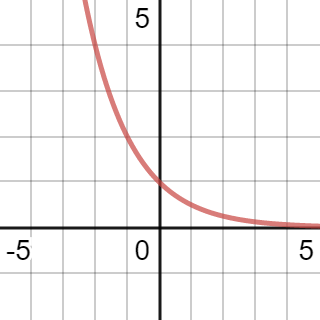

# Exponential & Logarithmic Functions

[Questions](https://drive.google.com/file/d/1-LEJH4mafq9kpBcLV_tWsfBQivJoLm4M/view)

---

# Exponential Function
An exponential function is the following...

<h1>
$y = ab^x$
</h1>

* $a$: Vertical stretch and Y-Intercept
* $b$: Constant. $b > 0, b \neq 1$
* $x$: Variable. $x\epsilon\R$

#### Example
* $y = 3^x$ is an exponential function.
* $y = x^3$ is not an exponential function.
* $y = (\dfrac{1}{4})^x$ is an exponential function.
* $y = (-2)^x$ is not an exponential function. ($-2 \ngtr 0$)
* $y = -2^x$ is an exponential function. ($2 > 0$)

# Graphing Exponential Functions
## Growth Function

$y = b^x$, where $b > 1$ forms a growth function.

As $b$ increases, the ~~curve rises~~ steeper.

## Decay Function

$y = b^x$, where $0 < b < 1$ forms a decay function.

As $b$ decreases, the ~~curve falls~~.

## Properties of Both
* **Domain**  
  $\{x | x \epsilon \R\}$

* **Range**  
  $\{y | y > 0, y \epsilon \R\}$

* **Horizontal Asymptote**  
  $y = 0$

* **Y-Intercept**  
  $a$ (in the above examples, $1$)

* **X-Intercept**  
  None

# Transformations of Exponential Functions

<h1>
$y = a(b)^{x-h} + k$
</h1>

Transformations can be applied to exponential functions like any other function.

#### Example
$y = 3(2)^{-x-3} + 2$

* Vertical stretch by a factor of 3
* Horizontal reflection about the y axis
* Horizontal translation 3 units left
* Vertical translation 2 units up

# Solving Exponential Equations

Recall the following rules...

* $a^m \times a^n = a^{m + n}$

* $\dfrac{a^m}{a^n} = a^{m - n}$

* $(a^m)^n = a^{m \times n}$

* $(ab)^m = a^m b^m$

* $a^{-m} = \dfrac{1}{a^m}$

* $(\dfrac{a}{b})^{-m} = \dfrac{a^{-m}}{b^{-m}} = \dfrac{b^m}{a^m}$

* $a^{\frac{m}{n}} = \sqrt[n]{a^m} = (\sqrt[n]{m})^m$

## Solving when base is a variable

Add a ~~reciprocal exponent~~.

<h1>
$x^{-\frac{1}{2}} \longrightarrow (x^{-\frac{1}{2}})^{-\frac{2}{1}} \longrightarrow x$
</h1>

#### Example
$x^2 = 81$  
$(x^2)^{\frac{1}{2}} = 81^{\frac{1}{2}}$  
$x = \sqrt{81}$  
$x = \pm 9$

## Solving with a common base

If the unknown variable is in the exponent...
1. Make the bases of both sides the same
2. Simplify using the laws of exponents until there is a single base with exponent on each side
3. Ignore the bases. Treat exponents as a normal equation
4. Solve

#### Example

Solve $3^{5x - 1} = 81^{3x}$

1. $3^{5x - 1} = 3^{4(3x)}$
3. $5x - 1 = 4(3x)$
4. $-1 = 7x$, $-\frac{1}{7} = x$

Solve $3^x = 27\sqrt{3}$

1. $3^x = 3^3 \times 3^{\frac{1}{2}}$
2. $3^x = 3^{\frac{7}{2}}$
4. $x = \frac{7}{2}$

# Applications of Exponential Functions

## Population Growth

<h1>
y = ab^x
</h1>

* $a$: Original amount
* $b$: Rate (double = 2, half-life = 1/2)
* $x$: Number of times the event occurs

Use this formula when total time and period time are equal.  

#### Example
todo

## Growth/Decay

<h1>
y = ab^{\frac{t}{p}}
</h1>

* $a$: Original amount
* $b$: Rate
* $x$: Total time of scenario
* $p$: Time frequency of growth/decay rate

Use this formula when total time and period time are not equal.

#### Example
todo

## Compounding Interest

<h1>
A = P(1 + i)^n
</h1>

* $A$: Final amount
* $P$: Initial amount
* $i$: Interest rate ~~per compounding period~~
* $n$: Number of ~~compounding periods~~

### Interest Rate ($i$) and Compounding Periods ($n$)

There is one special aspect of these variables you need to take into account.

Depending on the number of times interest is applied/compounded, you need to modify these variables.  
If interest is compounded $a$ times per year, then divide $i$ by $a$ and multiply $n$ by $a$.

#### Example
Ja invests \$7000 for 6 years compounded quarterly at a rate of 5% per annum.

5% per annum means the interest is 5% per year, BUT it is calculated/compounded/applied quarterly. Therefore...
* $i = 0.05 \div 4$, $i = 0.125$

Because we've essentially just reduced the interest now, we have to increase the number of times the amount is compounded.
* $n = 6 \times 4$, $n = 24$

Now we can plug it into the formula.
* $A = 7000(1 + 0.125)^24$
* $A = 9431.46$

