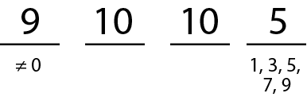
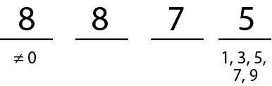
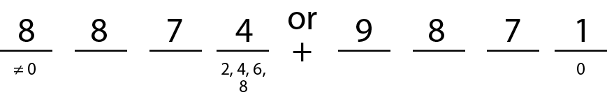
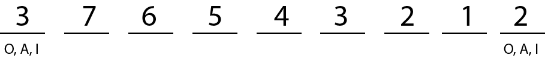
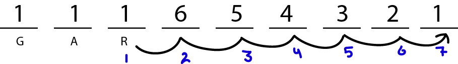

# Permutations & Combinations

---

# Key
[Permutations & Combinations Key](https://drive.google.com/file/d/1EiLdom9HFoQFWBlFBiLkDF80zDZz3pmM/view)

# Fundemental Counting Principle

Consider a task made of multiple stages. The product of the number of choices in each stage of the task is equal to all possible combinations. 

To draw this out...
* To arrange $n$ objects, write down $n$ blanks
* Fill in each blank with the number of possible objects that could be placed in the blank.
* Multiply.

#### Example
> How many ways can ABCDEF be arranged?  
>
> $6 \times 5 \times 4 \times 3 \times 2 \times 1$  
> $= 720$

## Restrictions

Deal with the restriction first.

#### Example
> How many odd four digit numbers are there?  
>
> 
>
> $= 4500$

> How many odd four digits are there without any repeating digits?
>
> 
>
> Imagine the digits are ABCD. Restrictions first. D must be 1, 3, 5, 7, or 9. A cannot be 0, leaving 9 options, but we must save one option for D. B has options 0-9, but we must save two options for D and A. C has options 0-9, but we must save three options for D, A, and B.
>
> $= 2240$

### Or
Any question involing ~~"or"~~ must be solved by ~~adding~~.

### And
Any question involing ~~"and"~~ must be solved by ~~multiplying~~.

### Even Numbers
~~Even~~ numbers which have ~~no repeating digits~~ must be ~~solved using two separate cases~~.  
This is because 0 is an even number, but it must also be used in the first digit to make the number four digits. This is not possible to represent with one case.

#### Example
> How many even four digits are there with no repeating digits?  
>
> 
>
> $= 504 + 1792$  
> $= 2296$

# Factorial Notation and Permutations

[Lesson 1](https://youtu.be/fi3Ms-GLboE?list=PLt63s1Gs-0mYsuc0gHPPVbCLkEGQgRJ9V)

## Factorial Notation

<h1>
$n! = n \times (n - 1) \times (n - 2) \times (n - 3) \times ...$
</h1>

$n$ is a natural number, meaning it is ~~1+ whole number~~.

### Factorial Constants
The factorial of zero is 1. ($0! = 1$)  
The factorial of one is 1. ($1! = 1$)

#### Example
> How many ways can ABCDEF be arranged?  
> $6! = 6\times5\times4\times3\times2\times1$  
> $6! = 720$

## Breaking Up Factorials
The following are all equal to $5!$.

* $5!$
* $5 \times 4!$
* $5 \times 4 \times 3!$
* $5 \times 4 \times 3 \times 2!$
* $5 \times 4 \times 3 \times 2 \times 1$

## Quotients of Factorials

<h1>
$\dfrac{\textrm{full factorial}}{\textrm{missing part of full factorial}}$
</h1>

#### Example
> $6 \times 5 \times 4 = ?$
>
> This starts at 6, so it's $6!$, but it's missing $3 \times 2 \times 1$, aka. $3!$  
> Therefore, the answer is $\dfrac{6!}{3!}$

## Simplifying Factorials

1. ~~Expand out the factorial~~. If there is more than one factorial in the question, expand out the ~~largest one~~.
2. Keep expanding the factorial until you have a ~~matching group of numbers~~ (~~including the factorial~~) in the numerator and denominator.
   * You may have to expand one extra time if cancelling would make it equal zero. (e.g. $\frac{n!}{n(n-1)!} = (n-2)!$)
3. You can now cancel those numbers.

#### Example

> Simplify $\dfrac{(n+2)!}{n!}$
>
> $= \dfrac{(n+2)(n+1)(n)!}{n!}$  
> 
> $= (n+2)(n+1)$

### Error Overflow
Some factorials are too big for your calculator to calculate. You can circumvent this limitation by simplifying the factorial.

$\dfrac{100!}{98!} = \dfrac{(100)(99)(98)!}{98!} = (100)(99)$

# Permutations

An arrangement of all or part of a set of objects in which the ~~order of arrangement is important~~.

If $n$ objects are arranged $r$ at a time, then the number of arrangements are...

<h1>
$_nP_r = \dfrac{n!}{(n-r)!}$
</h1>

**Restriction**: $n \geq r$

#### Example
> How many three letter arrangments are there for the word GRAPHITE?
>
> $_8P_3 = \dfrac{8!}{(8-3)!} = \dfrac{8\times7\times6\times5!}{5!} = 8\times7\times6$

## Restrictions
[Video](https://youtu.be/Mfe-Y4QiPc4?list=PLt63s1Gs-0mZAbidPdQIlW4eZMNmNlEk-)

Use the fundemental counting principle for when there are restrictions, replacing numbers with factorials when applicable.

#### Example
> How many ways can the word LOGARITHM be arranged if the first and last letters must be vowels?
>
> 
>
> $= 3 \times 7! \times 2$

### Objects Together
For restrictions that have a specific sequence of objects next to another, each "digit" of said sequence would just be 1, as their is only one possible choice.  
However, this sequence of objects can be anywhere in the arrangement. To include this in the total...
* Choose a letter from the group.
* Count how many spaces it could occupy.
* Multiply that by the rest of the arrangement's total.

#### Example
> How many ways can the word LOGARITHM be arranged if the letters GAR must be together in that order?
>
> 
>
> $= 6! \times 7$

### Objects Not Together
For restrictions that have a specific sequence of objects with any digit separating them, use the following formula.

<h1>
$\textrm{total combinations} - \textrm{combinations together}$
</h1>

#### Example
> How many ways can the word LOGARITHM be arranged if the letters GAR must be not together?
>
> $9! - 6!7$

## Repetitions
[Video (Recommend watching this)](https://youtu.be/capA4nIB6Gg?list=PLt63s1Gs-0mZAbidPdQIlW4eZMNmNlEk-&t=127)

If objects repeat in a sequence, divide the total number of objects factorial by each repetitive objects quantity factorial.  
The denominator requires brackets in this case.

#### Example
> How many permutations of the word ARRANGEMENTS are there?
>
> 2 A's, 2 R's, 2 N's, 2 E's
>
> $\dfrac{12!}{(2!2!2!2!)}$

> How many permutations of the word MISSISSIPPI are there?
>
> 4 I's, 4 S's, 2 P's
>
> $\dfrac{11!}{(4!4!2!)}$

## Restrictions, Repetitions, and "Together"
[Watch this video.](https://youtu.be/CeB74RIkC6o?list=PLt63s1Gs-0mZAbidPdQIlW4eZMNmNlEk-)

# Combinations
[Video](https://youtu.be/bqlaaCWNC9A?list=PLt63s1Gs-0mZQfYrqK9EM8zEHGpxmqA70)

A combination is a permutation in which the ~~order does not matter~~.  
The fundemental counting principal ~~does not work with combinations~~.

## Formula

If $n$ objects are selected $r$ at a time, and the order is not important, then...

<h1>
$_nC_r = \bigg( \dfrac{n}{r} \bigg) = \dfrac{n!}{r!(n-r)!}$
</h1>

#### Example
> A class of 30 students is going to elect a President, Vice President, and Treasurer.  
> In how many ways can this be done?
>
> Since the order is important, since the number of unelected students decreases each time, then this is a permutation.  
> $_{30}P_3$

> A class of 30 students is going to elect a committee of 3.  
> In how many ways can this be done?
>
> Since the order is not important, this is a combination.  
> $_{30}C_3$
