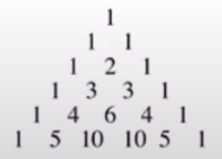
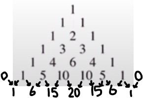
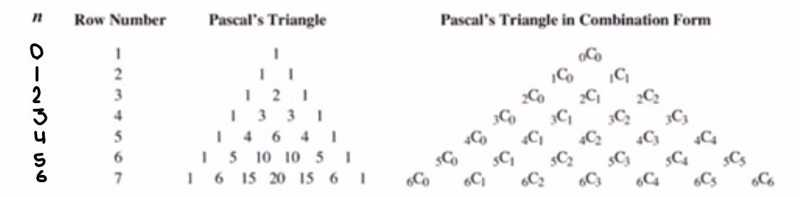

# Permutations & Combinations

---

# Key
[Permutations & Combinations Key](https://drive.google.com/file/d/1EiLdom9HFoQFWBlFBiLkDF80zDZz3pmM/view)

# Fundemental Counting Principle

Consider a task made of multiple stages. The product of the number of choices in each stage of the task is equal to all possible combinations. 

To draw this out...
* To arrange $n$ objects, write down $n$ blanks
* Fill in each blank with the number of possible objects that could be placed in the blank.
* Multiply.

#### Example
> How many ways can ABCDEF be arranged?  
>
> $6 \times 5 \times 4 \times 3 \times 2 \times 1$  
> $= 720$

## Restrictions

Deal with the restriction first.

#### Example
> How many odd four digit numbers are there?  
>
> 
>
> $= 4500$

> How many odd four digits are there without any repeating digits?
>
> 
>
> Imagine the digits are ABCD. Restrictions first. D must be 1, 3, 5, 7, or 9. A cannot be 0, leaving 9 options, but we must save one option for D. B has options 0-9, but we must save two options for D and A. C has options 0-9, but we must save three options for D, A, and B.
>
> $= 2240$

### Or
Any question involing ~~"or"~~ must be solved by ~~adding~~.

### And
Any question involing ~~"and"~~ must be solved by ~~multiplying~~.

### Even Numbers
~~Even~~ numbers which have ~~no repeating digits~~ must be ~~solved using two separate cases~~.  
This is because 0 is an even number, but it must also be used in the first digit to make the number four digits. This is not possible to represent with one case.

#### Example
> How many even four digits are there with no repeating digits?  
>
> 
>
> $= 504 + 1792$  
> $= 2296$

# Factorial Notation and Permutations

[Lesson 1](https://youtu.be/fi3Ms-GLboE?list=PLt63s1Gs-0mYsuc0gHPPVbCLkEGQgRJ9V)

## Factorial Notation

<h1>
$n! = n \times (n - 1) \times (n - 2) \times (n - 3) \times ...$
</h1>

$n$ is a natural number, meaning it is ~~1+ whole number~~.

### Factorial Constants
The factorial of zero is 1. ($0! = 1$)  
The factorial of one is 1. ($1! = 1$)

#### Example
> How many ways can ABCDEF be arranged?  
> $6! = 6\times5\times4\times3\times2\times1$  
> $6! = 720$

## Breaking Up Factorials
The following are all equal to $5!$.

* $5!$
* $5 \times 4!$
* $5 \times 4 \times 3!$
* $5 \times 4 \times 3 \times 2!$
* $5 \times 4 \times 3 \times 2 \times 1$

## Quotients of Factorials

<h1>
$\dfrac{\textrm{full factorial}}{\textrm{missing part of full factorial}}$
</h1>

#### Example
> $6 \times 5 \times 4 = ?$
>
> This starts at 6, so it's $6!$, but it's missing $3 \times 2 \times 1$, aka. $3!$  
> Therefore, the answer is $\dfrac{6!}{3!}$

## Simplifying Factorials

1. ~~Expand out the factorial~~. If there is more than one factorial in the question, expand out the ~~largest one~~.
2. Keep expanding the factorial until you have a ~~matching group of numbers~~ (~~including the factorial~~) in the numerator and denominator.
   * You may have to expand one extra time if cancelling would make it equal zero. (e.g. $\frac{n!}{n(n-1)!} = (n-2)!$)
3. You can now cancel those numbers.

#### Example

> Simplify $\dfrac{(n+2)!}{n!}$
>
> $= \dfrac{(n+2)(n+1)(n)!}{n!}$  
> 
> $= (n+2)(n+1)$

### Error Overflow
Some factorials are too big for your calculator to calculate. You can circumvent this limitation by simplifying the factorial.

$\dfrac{100!}{98!} = \dfrac{(100)(99)(98)!}{98!} = (100)(99)$

# Permutations

An arrangement of all or part of a set of objects in which the ~~order of arrangement is important~~.

If $n$ objects are arranged $r$ at a time, then the number of arrangements are...

<h1>
$_nP_r = \dfrac{n!}{(n-r)!}$
</h1>

**Restriction**: $n \geq r$

#### Example
> How many three letter arrangments are there for the word GRAPHITE?
>
> $_8P_3 = \dfrac{8!}{(8-3)!} = \dfrac{8\times7\times6\times5!}{5!} = 8\times7\times6$

## Restrictions
[Video](https://youtu.be/Mfe-Y4QiPc4?list=PLt63s1Gs-0mZAbidPdQIlW4eZMNmNlEk-)

Use the fundemental counting principle for when there are restrictions, replacing numbers with factorials when applicable.

#### Example
> How many ways can the word LOGARITHM be arranged if the first and last letters must be vowels?
>
> 
>
> $= 3 \times 7! \times 2$

### Objects Together
For restrictions that have a specific sequence of objects next to another, each "digit" of said sequence would just be 1, as their is only one possible choice.  
However, this sequence of objects can be anywhere in the arrangement. To include this in the total...
* Choose a letter from the group.
* Count how many spaces it could occupy.
* Multiply that by the rest of the arrangement's total.

#### Example
> How many ways can the word LOGARITHM be arranged if the letters GAR must be together in that order?
>
> 
>
> $= 6! \times 7$

### Objects Not Together
For restrictions that have a specific sequence of objects with any digit separating them, use the following formula.

<h1>
$\textrm{total combinations} - \textrm{combinations together}$
</h1>

#### Example
> How many ways can the word LOGARITHM be arranged if the letters GAR must be not together?
>
> $9! - 6!7$

## Repetitions
[Video (Recommend watching this)](https://youtu.be/capA4nIB6Gg?list=PLt63s1Gs-0mZAbidPdQIlW4eZMNmNlEk-&t=127)

If objects repeat in a sequence, divide the total number of objects factorial by each repetitive objects quantity factorial.  
The denominator requires brackets in this case.

#### Example
> How many permutations of the word ARRANGEMENTS are there?
>
> 2 A's, 2 R's, 2 N's, 2 E's
>
> $\dfrac{12!}{(2!2!2!2!)}$

> How many permutations of the word MISSISSIPPI are there?
>
> 4 I's, 4 S's, 2 P's
>
> $\dfrac{11!}{(4!4!2!)}$

## Restrictions, Repetitions, and "Together"
[Watch this video.](https://youtu.be/CeB74RIkC6o?list=PLt63s1Gs-0mZAbidPdQIlW4eZMNmNlEk-)

# Combinations
[Video](https://youtu.be/bqlaaCWNC9A?list=PLt63s1Gs-0mZQfYrqK9EM8zEHGpxmqA70)

A combination is a permutation in which the ~~order does not matter~~.  
The fundemental counting principal ~~does not work with combinations~~.

## Formula

If $n$ objects are selected $r$ at a time, and the order is not important, then...

<h1>
$_nC_r = \bigg( \dfrac{n}{r} \bigg) = \dfrac{n!}{r!(n-r)!}$
</h1>

#### Example
> A class of 30 students is going to elect a President, Vice President, and Treasurer.  
> In how many ways can this be done?
>
> Since the order is important, since the number of unelected students decreases each time, then this is a permutation.  
> $_{30}P_3$

> A class of 30 students is going to elect a committee of 3.  
> In how many ways can this be done?
>
> Since the order is not important, this is a combination.  
> $_{30}C_3$

## Combinations with "at least," "at most," etc...

[Video at 1:20](https://youtu.be/Y2_90OPRLZk?list=PLt63s1Gs-0mZV-ZVE9uXkM0m52cgJK4Jy)

Write out every possible combination that has at least/at most something.  
Calculate with the combination formula.  
Add each combination together.

## Equivalent Combinations

[Video at 3:33](https://youtu.be/505LxVUZim8?list=PLt63s1Gs-0mZV-ZVE9uXkM0m52cgJK4Jy)

In a combination, if you choose $x$ number of objects, you would have $y$ number of unchosen objects left over.  
If you only chose $y$ number of objects, then you would have $x$ number of unchosen objects.

Mathematically, these two combinations are identical.

#### Example
> ${}_7C_2 = {}_7C_x, x \neq 2$
>
> If you chose 2 out of 7, you would have 5 left.  
> If you chose 5 out of 7, you would have 2 left.  
> In both scenarios, you are left with a group of 2 and 5.
>
> Therefore, $x = 5$

This works when the total is a variable. Just add the number of objects chosen in each combination together.

#### Example
> ${}_xC_3 = {}_xC_7$
>
> $x = 3 + 7$  
> $x = 10$

## Pascal's Triangle
[Video](https://youtu.be/Zuv4yPdZmm4?list=PLt63s1Gs-0ma9yHdcDVl2XWIu-V4vPl38)

The number of terms in the expansion of a binomial with an exponent is the exponent plus one.  
> *e.g. $(x+y)^1$ is two terms, $(x+y)^2$ is three terms, etc...*

The sum of the exponents of each term is the largest exponent of the terms, usually the exponent on the unexpanded form.

### Term by term
In an expanded binomial, term by term, the...
* $x$ exponent decrease by one
* $y$ exponent increases by one

> *e.g.*  
> $(x+y)^3 = x^3 + 3x^2y + 3xy^2 + y^3$
>
> *$x$ goes from power of 3, to 2, to 1 and then 0.*  
> *$y$ goes from power of 0, to 1, to 2, and then 3.*

## Pascal's Triangle
[Video](https://youtu.be/W2WaUCbw1MY?list=PLt63s1Gs-0ma9yHdcDVl2XWIu-V4vPl38)

Pacal's triangle is formed by the coefficients of the expansion of $(x+y)^n$.

These are the expansions.

| Expansions |
| :--------: |
| $(x+y)^0 = 1$ |
| $(x+y)^1 = x+y$ |
| $(x+y)^2 = x^2+y^2$ |
| $(x+y)^3 = x^2 + 2xy + y^2$ |
| $(x+y)^4 = x^3 + 3x^2y + 3xy^2 + y^3$ |
| $(x+y)^5 = x^5 + 5x^4y + 10x^3y^2 + 10x^2y^3 + 5xy^4 + y^5$ |

If you draw a triangle with just the coefficients of these, you get pascal's triangle.

### Continuing the triangle

Add together the two numbers to the top left and top right of the current number position.

### Using the triangle in expansions

1. Look at the power plus one row of the triangle.  
   *(Not the power number, the triangle counts from zero)*

2. Write out each term as each coefficient times $xy$.

3. For the powers, remember that  
   $x$ starts at the max and decreases to 0 (= 1), and $y$ starts at 0 (= 1) and increases to the max.  
   *(The max is the exponent in the unexpanded form)*

> *e.g.*
>
> $(x+y)^5$  
> Pascal's triangle, row 6, says `1 5 10 10 5 1`
>
> $(x+y)^5 = 1 + 5 + 10 + 10 + 5 + 1$
>
> $(x+y)^5 = 1xy + 5xy + 10xy + 10xy + 5xy + 1xy$
>
> $(x+y)^5 = 1x^5y^0 + 5x^4y^1 + 10x^3y^2 + 10x^2y^3 + 5x^1y^4 + 5x^0y^5$
>
> $(x+y)^5 = x^5 + 5x^4y + 10x^3y^2 + 10x^2y^3 + 5xy^4 + y^5$

## Pascal's Triangle and Combinations
[Video](https://youtu.be/FrX_NuvzlhE?list=PLt63s1Gs-0ma9yHdcDVl2XWIu-V4vPl38)

Pascal's triangle is actually an array of combinations.
In $_xC_y$, $x$ is the ~~row number~~ starting from zero, and $y$ is the ~~column number~~ starting from zero.

## Patterns
[Video](https://youtu.be/XT0e2Ws5vBQ?list=PLt63s1Gs-0ma9yHdcDVl2XWIu-V4vPl38)

The sum of the coefficients in the expansion of $(x+y)^n$ is ~~$2^n$~~.

The sum of the coefficients, if ~~$k$ is the row number ($k = n + 1$)~~, then $2^{k-1}$.

## Pathways
[Video](https://youtu.be/1ZKmOBDBkBs?list=PLt63s1Gs-0ma9yHdcDVl2XWIu-V4vPl38)  
[Video](https://youtu.be/KfnTxt-9V-E?list=PLt63s1Gs-0ma9yHdcDVl2XWIu-V4vPl38)

You can draw a pascal's triangle when determining pathways/route questions.

### Multiple Pathways
Instead of writing 1's on the grid for a pathway, if there are multiple grids draw the final number of the first grid.

See the second video at 3:10.

# The Binomial Theorem
[Video](https://youtu.be/YaXh6jLZu44?list=PLt63s1Gs-0mZSZmStkJapkwB6HaRRBhv-)

This theorem allows you to get the value of any term ~~without expanding~~.

## General Term

To find a term of the expanded form of $(x+y)^n$
<h1>
$t_{k+1} = {}_nC_kx^{n-k}y^k$
</h1>

$k$ is always one less than the term number.  
*e.g. If you are asked for the 10th term, then $k = 9$*

This is because of the fact that the number of terms is always one more than the power ($n$).

### Tips for Finding $k$
These questions ask you to find the term containing a variable with a specific power, like $x^6$, in the expansion of a binomial.
* Separate constants and variables so that you have, in this case, $x$ and a power by itself. This power will contain $k$.  
  You can solve for $k$ now by ignoring the bases.
* "Find the term independent of..." means to find the term when the power is 0. ($x^0$)
