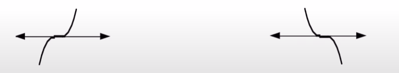
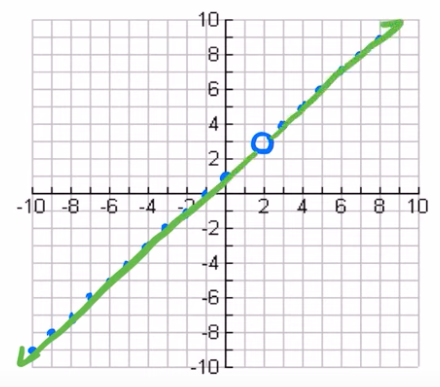

# Polynomial, Radical, & Rational Functions

---

# Review

## Polynomial Functions

[Video](https://youtu.be/bF-Uk0RcHxo?list=PLjvodYitAKMhThW27p8Tu_9VmIin4w_6K)

<h1>
$f(x) = a_nx^n + a_{n-1}x^{n-1} + ...$
</h1>

### Polynomials don't...
If the following are present, you are ~~not~~ dealing with a polynomial.

| Condition | Example |
| --------- | ------- |
| un-simplifyable roots of a variable | $y = \sqrt{x^7}$ |
| negative & fractional exponents     | $y = 5x^{-2}$, $y = 6x^{\frac{3}{2}}$ |
| variable exponents                  | $y = 3^x$ |
| non-real coefficients               | $y = \sqrt{-2}x^8$ |
| absolute value of variable          | $y = \lvert 16x \rvert$ |

## Degree
[Video](https://youtu.be/SGbn5DZ3t3Q?list=PLjvodYitAKMhThW27p8Tu_9VmIin4w_6K)

The degree is the highest value exponent of all exponents in a function.

| Degree | Name | Example  |
| :----: | ---- | -------- |
| $0$ | Constant Function  | $y = 5$ |
| $1$ | Linear Function    | $y = 2x^1 + 1$ |
| $2$ | Quadratic Function | $y = 2x^2 + 3x - 2$ |
| $3$ | Cubic Function     | $y = 4x^3 + 3x^2 - 3x + 2$ |
| $4$ | Quartic Function   | $y = 3x^4 + 3x^3 + 2x^2 - 2x + 6$ |
| $5$ | Quintic Function   | $y = 2x^5 + 3x^4 - 3x^3 + 2x^2 + 7x - 2$ |

### Odd and Even
Graphs with an ~~odd degree~~ have the graph arms going ~~up and down~~. (e.g. linear graph)  
Graphs with an ~~even degree~~ have the graph arms in the ~~same direction together~~. (e.g. parabola/quadratic)

## Constant Term
The term independent of $x$, i.e. the term without any variable.

## Leading Coefficient
The coefficient of the term with the degree, i.e. highest value exponent.

A shortcut for long functions is to...
* multiply together the leading coefficient of each term to get the degree and leading coefficient of the entire function.

## Systems Tip
If a question asks you to find more than one variable, and you are giving two different polynomial equations, it's likely you are going to add together the two different polynomials after simplifying/solving/etc...

## "Factored Form" Tip
A polynomial is only in factored form when it has ~~no even exponents in any term~~.

### Effect on Graph
[Video](https://youtu.be/xRrtqbOlHjg?list=PLjvodYitAKMhThW27p8Tu_9VmIin4w_6K)

The leading coefficient determines ~~which quadrant the graph arms extend to~~.
* If the leading coefficient is ~~positive~~, one of the ends will be in ~~quadrant I~~.
* If the leading coefficent is ~~negative~~, one of the ends will be in ~~quadrant IV~~.

# Dividing a Polynomial by a Binomial

## Pretext
For each term of a polynomial, the degree of each term must go down by one each time.  
If they don't, a term is missing, and you must ~~create the term with a coefficient of zero~~.  
*e.g. $m^3 - 6m + 20$ should be $m^3 - 0m^2 - 6m + 20$*

## Long Division
[Video](https://youtu.be/9SeArRMF_Z8?list=PLjvodYitAKMgCesVJfoc0Ud-q8651YO44)

<h1>
$\textrm{divisor}\overline{)\textrm{dividend}} = \textrm{quotient}$
</h1>

### Steps
See `4:20` of the video for a demonstration.

1. Ensure the dividend is ordered highest degree terms first, and there are no missing terms.  
2. Figure out what value multiplied by the highest degree term of the divisor would give you the highest degree term of the dividend.  
   Write this value above the long division line.
3. Multiply each term of the divisor by this value.
4. Write each product below the long division.
5. Subtract the products from the dividend.
6. Repeat steps 2-5 until a quotient and remainder are found.
7. Express the division statement in one of these forms...  
   $\textrm{polynomial} = \textrm{divisor} \times \textrm{quotient} + \textrm{remainder}$  
   $\frac{\textrm{polynomial}}{\textrm{divisor}} = \textrm{quotient} + \frac{\textrm{remainder}}{\textrm{divisor}}$ (everything was divided by the divisor)

If the ~~remainder~~ is not equal to 0, then the divisor is ~~not a factor~~ of the dividend.

## Synthetic Division
[Video](https://youtu.be/jdHDUDOp1V0?list=PLjvodYitAKMgCesVJfoc0Ud-q8651YO44)

### Steps
1. Focus on only the coefficients of each term of the dividend.
2. Determine the zero of the divisor. (e.g. $x+3$, $x=-3$)
3. Write a number 0 under the first coefficient.
4. For each coefficient, add the coefficient and the number beneath it together, and write the sum at the very bottom.
5. That sum, multiplied by *the zero*, is the number beneath the next coefficient.
6. Repeat steps 4-6 for each coefficient.
7. Write the quotient, i.e. a new polynomial using... 
     * the new coefficients
     * starting at the degree of the dividend ~~minus one~~.
8. After the term with an exponent of zero is reached, don't write a negative exponent.  
   Rather, the coefficient of that term is the remainder.

# The Remainder Theorem
[Video](https://youtu.be/2eKcnRxMZbc?list=PLjvodYitAKMgCesVJfoc0Ud-q8651YO44)

When a polynomial, $P(x)$, is divided by the binomial $x - a$, the remainder is equal to $P(a)$.  
In other words, subsituting $x$ in a polynomial with *the zero* of the binomial dividing it equals the remainder.

[Remainder Theorem Example Questions (I recommend at least watching examples 11 and 12 at `1:12`)](https://youtu.be/kV5qhUCSnAk?list=PLjvodYitAKMgCesVJfoc0Ud-q8651YO44)

# The Factor Theorem
[Video](https://youtu.be/biRwWCebIhk?list=PLjvodYitAKMgEG9fgoWpFDTRI4cYlpmw_)

If the remainder, $P(a)$, is equal to zero, then $x - a$ is a factor of the polynomial $P(x)$.

# The Integral Zero Theorem
[Video at `1:30`](https://youtu.be/qBxHgLW7V8U?list=PLjvodYitAKMgEG9fgoWpFDTRI4cYlpmw_)

If the factor theorem is true, i.e. $x - a$ is a factor of the polynomial $P(x)$, then $a$ is a factor of the constant term.

A value can be verified to be a factor of a polynomial if, when subsituting $x$ in the polynomial with *the zero* of the alledged factor, the polynomial equals 0. (aka. no remainder)

[Example Questions](https://youtu.be/TkTbjgzx9sU?list=PLjvodYitAKMgEG9fgoWpFDTRI4cYlpmw_)

# Graphing Polynomials
[Video](https://youtu.be/RpnIu51L3bE?list=PLjvodYitAKMiJKHLMsbPLe0mGP4cIQuil)

The factors of a polynomial are the zeros.

If a factor is repeated, i.e. has an exponent, then it has a different ~~multiplicity~~.  
If a factor has an exponent of 1, it has a multiplicity of 1. If it has an exponent of 2, multiplicity of 2. And so on...

"Integral linear factors" means no fractions.

## Multiplicity

| Multiplicity | Appearance |
| ------------ | ---------- |
| 1 | When it touches the $x$ axis, it ~~goes through~~, then ~~flips direction vertically~~. |
| 2 | When it touches the $x$ axis, it ~~bounces off~~. (~~tangent~~) |
| 3 | When it touches the $x$ axis, it ~~goes through~~. (~~point of inflection~~) |

### Tangent

The graph touches the $x$ axis without passing through it.

### Point of Inflection

The point of inflection is the point of the graph that ~~changes concavity on the $x$ axis~~.

## Even and Odd Multiplicities
* An even multiplicitity occurs when the graph is ~~tangent to the $x$ axis~~.
* An odd multiplicity occurs when the graph has a ~~point of inflection on the $x$ axis~~.
* The degree of a polynomial and the ~~sum of the multiplicities of the zeros~~ are the same.

# Unique Factorization Theorem
[Video](https://youtu.be/c7f6sJ7r9n8?list=PLjvodYitAKMhLojjh3vNW--hb_FoU_Ki7)

Every polynomial function of a degree greater than or equal to 1 can be written as a product of a leading coefficient, $c$, and $n$ linear factors.

<h1>
$P(x) = c(x-a_1)(x-a_2)(x-a_3)...(x-a^n)$
</h1>

Never assumed the leading coefficient, $c$, is 1 or -1, unless stated.

Watch the videos in the playlist for example questions.

# Graphing Rational Functions

[Playlist](https://www.youtube.com/playlist?list=PLjvodYitAKMiPOOznnDX8NRs1H407MhYL)

## Rational Functions
Any function that is the division of two polynomials. ($f(x) = \dfrac{n(x)}{d(x)}$, and $d(x) \neq 0$)

Since the denominator cannot equal zero, the zeros--also called discontinuity--of the denominator are the NPVs.  
There are two types...
* Vertical asymptote
* Point of discontinuity (hole in the graph)

Not all rational functions have NPVs. For instance, $f(x) = \dfrac{2}{x^2+1}$

The base rational function that all transformations modify is $y = \dfrac{1}{x}$

## Asymptotes
The graph will approach this line but never touch or cross it.

### Vertical Asymptotes
Occur at $x$ values that would cause the denominator of a rational function to equal zero.  

### Horizontal Asymptotes
#### Case 1
If the degree of the numerator is less than the degree of the denominator, then the horizontal asymptote will be $y = 0$.  
*e.g. $f(x) = \dfrac{3}{x}$*

#### Case 2
If the degree of the numerator is equal to the degree of the denominator, then the horizontal asymptote will be $y = \dfrac{a}{b}$,  
where $a$ is the leading coefficient of the numerator,  
and $b$ is the leading coefficient of the denominator.  
*e.g. $f(x) = \dfrac{2x}{x+1}$, $y = \dfrac{2}{1}$*

#### Case 3
If the degree of the numerator is greater than the degree of the denominator, then there are no horizontal asymptotes.  
*e.g. $f(x) = \dfrac{x^2}{x-2}$*

## Point of Discontinuity
[Video](https://www.youtube.com/watch?v=OYzVGQ4xCR0&list=PLjvodYitAKMhe5RvpZVvuVfZ3yxxj1MYz&index=2)

Points of Discontinuity occur when a rational expression is simplified by cancelling two factors in the numerator and denominator.  
This leaves the simplified funtion with no NPVs, but the original had, so they still need to be represented.

### Steps
1. Find the NPVs of the rational function. (the zeros of the denominator)
2. Simplify the rational function.
3. The point on the graph that has $x$ equal the asymptote will have it's plot point replaced with an open circle.

### Example
$f(x) = \dfrac{ x^2 - x - 2 }{ x - 2 }$

The NPV is $x \neq 2$.  
Now, simplify....

$f(x) = \dfrac{ (x - 2)(x + 1) }{ (x - 2) }$

$f(x) = x + 1$

Then, replace the plot point of the asymptote with an open circle.  
The coordinates of said point in this case are $(2, 3)$

### Feature at Non-permissible Value
[Video](https://www.youtube.com/watch?v=F46SaU4hkkc&list=PLjvodYitAKMhe5RvpZVvuVfZ3yxxj1MYz&index=2)

If a question asks you for the feature at a non-permissible value, you need to factor it.

| Situation | Feature |
| --------- | ------- |
| Factors cancel out, left with no denominator | Point of Discontinuity |
| Factors don't cancel out                     | Vertical Asymptote     |
| Factors cancel out, left with no numerator   | Both                   |

#### Both
When there are both features, the asymptote behaves as normal.

However, to find the coordinates of the point of discontinuity...
1. Find the zero of the cancelled factor (this will be the $x$ coordinate)
2. Subsitute $x$ with the zero in the ~~simplified~~ graph (not the original) (this will be the $y$ coordinate)

### Writing Possible Rational Functions
[Video (highly recommend)](https://youtu.be/xaB5lGJB5p0?list=PLjvodYitAKMhe5RvpZVvuVfZ3yxxj1MYz)

When given $x$ values, find the zeros of them, and place them in specific places of the ratinonal function depending on what they are.
* Zeros of vertical asymptotes are in the denominator
* Zeros of x-intercepts are in the numerator
* Zeros of points of discontinuity (so, only $x$) are in both the numerator and denominator (so they cancel)
